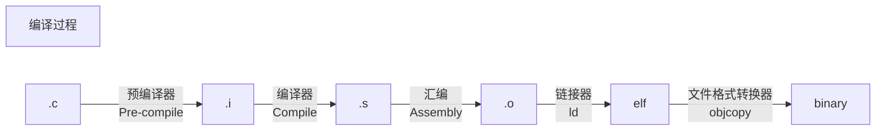

[TOC]

# gcc
GCC：全称GNU Compiler Collection，GNU编译器套件。是一款可以用来编译C、C++、Objective-C、Fortran、Java等多种 语言的编译器。

20230321，著名的 LLVM 国际开源软件社区发布 16.0.0 版本，以正式后端（official target）的级别，实现了对龙芯 LoongArch 指令集龙架构的完善支持。
至此，开源软件世界最重要的五大基础软件（BIG FIVE），包括 Linux Kernel 内核、GCC 编译器、LLVM 框架系统、Glibc 运行库、Binutils 工具集，全部已经正式支持 LoongArch 架构。


https://baike.baidu.com/item/gcc/17570

https://www.runoob.com/w3cnote/gcc-parameter-detail.html

https://zhuanlan.zhihu.com/p/404682058

https://zhuanlan.zhihu.com/p/76930507

https://www.jianshu.com/p/1bab86143f1c


### 后缀名
GCC中各源文件对应后缀名：

| 后缀名 | 文件类型 |
| :---: | :---: |
| .c | C语言源代码文件 |
| .a | 由目标文件构成的静态库文件 |
| .C .cc .cxx .cpp .c++ | C++源代码文件 |
| .h | 程序所包含的头文件 |
| .i | 已经预处理过的C源代码文件 |
| .ii | 已经预处理过的C++源代码文件 |
| .m | Objective-C源代码文件 |
| .o | 编译后的目标文件 |
| .s | 汇编语言源代码文件 |
| .S | 经过预编译的汇编语言源代码文件 |

## 编译过程


## 工具链
x86_64-linux-gnu-gcc
aarch64-linux-gnu-gcc

前面字段通常会遵循一定的规则 —— arch[-vendor][-os][-abi]
各个字段都是针对 目标平台 而言的（就是编译生成的程序最终运行的平台），各字段说明如下：
arch 目标CPU架构
目标cpu架构比如aarch64、arm、x86、riscv等，这个字段通常不会省略；
vendor 提供此编译工具链的厂商名称或是厂商特定信息
这个字段只是标识信息，没有实际意义，可以为 none 、 unknow 或是直接省略；
os 目标设备上运行的操作系统
这个字段常见的就 linux 和 none 两个， none 基本都是用于裸机程序的， linux 指编译出的程序是运行在 linux 上的，可以使用系统线程进程等函数；
abi 应用程序二进制接口（Application Binary Interface）
这个字段常见的值就比较多了，比如 abi 、 eabi 、 gun 、 gnueabi 、 gnueabihf 、 uclibc、 uclibcgnueabi 等；
eabi 指嵌入式应用程序二进制接口（（Embedded Application Binary Interface））；
gun指使用的库为 glibc ， uclibc 使用的库为 uclibc ；
hf 指默认编译参数支持硬件浮点功能；


gcc
编译器
显示gcc安装信息
gcc -v -E -x c++ -

ld
链接器
ld -Tled.lds led.o -o led.elf

readelf
elf文件工具

objdump
反汇编器
gcc -g hello.c -o hello
objdump -D -S hello > dump.txt
注意：在编译hello时没有使用-g参数，反汇编后的代码和原来C代码对应不起来。

objcopy
文件格式转换器
可以把ELF格式的文件转换成二进制文件。
因为elf格式的文件不能直接在ARM上运行（ARM只能运行二进制格式的文件）
objcopy -O binary led.elf led.bin

ar
库管理器
将多个可重定位的目标模块归档为一个函数库文件。
采用函数库文件，应用程序能够从该文件中自动装载要参考的函数模块，同时将应用程序中频繁调用的函数放入函数库文件中，易于应用程序的开发管理。ar支持ELF格式的函数库文件。


### 工具链下载

现在热门的arm架构芯片编译工具链的下载站点:
http://releases.linaro.org/components/toolchain/binaries/
https://snapshots.linaro.org/gnu-toolchain/

arm官网也有提供交叉编译工具链:
面向 Cortex-A 系列
https://developer.arm.com/tools-and-software/open-source-software/developer-tools/gnu-toolchain/gnu-a/downloads
面向 Cortex-R 和 Cortex-M 系列（主要就是单片机啦）
https://developer.arm.com/tools-and-software/open-source-software/developer-tools/gnu-toolchain/gnu-rm/downloads


## 编译选项

https://gcc.gnu.org/onlinedocs/gcc/Warning-Options.html

https://www.zhihu.com/question/443340911

https://www.cnblogs.com/JemBai/archive/2009/01/13/1374805.html#:~:text=Debug%20%E9%80%9A%E5%B8%B8%E7%A7%B0%E4%B8%BA%E8%B0%83%E8%AF%95%E7%89%88%E6%9C%AC%EF%BC%8C%E5%AE%83%E5%8C%85%E5%90%AB%E8%B0%83%E8%AF%95%E4%BF%A1%E6%81%AF%EF%BC%8C%E5%B9%B6%E4%B8%94%E4%B8%8D%E4%BD%9C%E4%BB%BB%E4%BD%95%E4%BC%98%E5%8C%96%EF%BC%8C%E4%BE%BF%E4%BA%8E%E7%A8%8B%E5%BA%8F%E5%91%98%E8%B0%83%E8%AF%95%E7%A8%8B%E5%BA%8F%E3%80%82%20Release%20%E7%A7%B0%E4%B8%BA%E5%8F%91%E5%B8%83%E7%89%88%E6%9C%AC%EF%BC%8C%E5%AE%83%E5%BE%80%E5%BE%80%E6%98%AF%E8%BF%9B%E8%A1%8C%E4%BA%86%E5%90%84%E7%A7%8D%E4%BC%98%E5%8C%96%EF%BC%8C%E4%BD%BF%E5%BE%97%E7%A8%8B%E5%BA%8F%E5%9C%A8%E4%BB%A3%E7%A0%81%E5%A4%A7%E5%B0%8F%E5%92%8C%E8%BF%90%E8%A1%8C%E9%80%9F%E5%BA%A6%E4%B8%8A%E9%83%BD%E6%98%AF%E6%9C%80%E4%BC%98%E7%9A%84%EF%BC%8C%E4%BB%A5%E4%BE%BF%E7%94%A8%E6%88%B7%E5%BE%88%E5%A5%BD%E5%9C%B0%E4%BD%BF%E7%94%A8%E3%80%82,Debug%20%E5%92%8C%20Release%20%E7%9A%84%E7%9C%9F%E6%AD%A3%E5%8C%BA%E5%88%AB%EF%BC%8C%E5%9C%A8%E4%BA%8E%E4%B8%80%E7%BB%84%E7%BC%96%E8%AF%91%E9%80%89%E9%A1%B9%E3%80%82


### C编译器选项
GCC     gcc -xxx
NDK     LOCAL_CFLAGS
CMAKE   CMAKE_C_FLAGS / add_compile_options / target_compile_options

man gcc 查看 OPTIONS


-Wall
是打开警告开关

-O
代表默认优化，可选：-O0不优化，-O1低级优化，-O2中级优化，-O3高级优化，-Os代码空间优化

-g
是生成调试信息，生成的可执行文件具有和源代码关联的可调试的信息
产生debug信息是操作系统默认格式。GDB可以使用这种格式。
有些编译器或者cmake里，需要和-O0配合使用

-ggdb
产生debug信息给GDB使用的。

-g3
-g3的3表示级别，默认级别是2，级别0没有debug信息，级别3可以调试宏。

-gstabs
此选项以stabs格式声称调试信息，但是不包括gdb调试信息。

-gstabs+
此选项以stabs格式声称调试信息，并且包含仅供gdb使用的额外调试信息。

-D
增加全局宏定义
LOCAL_CFLAGS += -DGCFP_LOG_LEVEL=2

-ffast-math
浮点优化选项 -ffast-math：极大地提高浮点运算速度

-mfloat-abi=softfp
浮点运算

-fPIC
fPIC 的全称是 Position Independent Code， 用于生成位置无关代码。

不加fpic
对于不加 -fPIC 生成的动态库，生成动态库时假定它被加载在地址 0 处。加载时它会被加载到一个地址（base），这时要进行一次重定位（relocation），把代码、数据段中所有的地址加上这个 base 的值。这样代码运行时就能使用正确的地址了。重定位会修改代码段的内容，这就造成每个使用这个 .so 文件代码段的进程在内核里都会生成这个 .so 文件代码段的 copy。每个 copy 都不一样，取决于这个 .so 文件代码段和数据段内存映射的位置。
这种方式缺点是更消耗内存。优点是加载速度比较快。

加fpic
加上 fPIC 选项生成的动态库，显然是位置无关的，这样的代码本身就能被放到线性地址空间的任意位置，无需修改就能正确执行。通常的方法是获取指令指针的值，加上一个偏移得到全局变量 / 函数的地址。

加 fPIC 选项的源文件对于它引用的函数头文件编写有很宽松的尺度。比如只需要包含个声明的函数的头文件，即使没有相应的 C 文件来实现，编译成 so 库照样可以通过。
这种方式可以实现真正意义上的多个进程共享 so 文件。多个进程引用同一个 PIC 动态库时，可以共用内存。这一个库在不同进程中的虚拟地址不同，但操作系统显然会把它们映射到同一块物理内存上。


    relocation R_X86_64_PC32 against symbol `stderr@@GLIBC_2.2.5' can not be used when making a shared object; recompile with -fPIC


-v 显示编译选项


```
ifeq ($(TARGET_MODE),debug)
$(warning TARGET_MODE=[$(TARGET_MODE)])
LOCAL_CFLAGS += -g -O0
endif

LOCAL_CFLAGS += -Wall -Wextra -Werror
LOCAL_CFLAGS += -Wshadow -Wunused -Wunused-result -Wimplicit-function-declaration -Wconversion
LOCAL_CFLAGS += -Wno-date-time
#LOCAL_CFLAGS += -Wpedantic
```


### C++编译器选项
GCC     g++ -xxx
NDK     LOCAL_CPPFLAGS
CMAKE   CMAKE_CXX_FLAGS


增加CPP宏定义
LOCAL_CPPFLAG += -DGCFP_LOG_LEVEL=2

LOCAL_CPPFLAGS += -std=c99
LOCAL_CPPFLAGS += -std=gnu99

LOCAL_CPPFLAGS += -std=c++11
LOCAL_CPPFLAGS += -std=gnu++11


## 链接选项
GCC     gcc -L
NDK     LOCAL_LDFLAGS
CMAKE   target_link_libraries / CMAKE_EXE_LINKER_FLAGS

man ld 查看 OPTIONS


LOCAL_LDFLAGS：这个编译变量传递给链接器一个一些额外的参数，比如想传递而外的库和库路径给ld，或者传递给ld linker的一些链接参数，-On，-EL{B}(大小端字节序)，那么就要加到这个上面，如：
LOCAL_LDFLAGS += -L$(LOCAL_PATH)/lib/ -lHWrecog –EB{EL} –O{n} …
或者直接加上绝对路径库的全名：
LOCAL_LDFLAGS += $(LOCAL_PATH)/lib/libHWrecog.a –EB{EL} –O{n}

LOCAL_LDFLAGS += $(LOCAL_PATH)/qsee_ca/libs/arm64-v8a/libQSEEComAPI.so
注：如果是非系统的第三方库，貌似只能用LOCAL_LDFLAGS方式，LOCAL_LDLIBS方式不行。

***LOCAL_LDFLAGS is always ignored for static libraries.***

LOCAL_LDFLAGS += -fopenmp -static-openmp
-fopenmp
OpenMp是由OpenMP Architecture Review Board牵头提出的，并已被广泛接受的，用于共享内存并行系统的多处理器程序设计的一套指导性的编译处理方案(Compiler Directive)。
OpenMP支持的编程语言包括C语言. C++和Fortran；而支持OpenMp的编译器包括Sun Compiler，GNU Compiler和Intel Compiler等。
OpenMp提供了对并行算法的高层的抽象描述，程序员通过在源代码中加入专用的pragma来指明自己的意图，由此编译器可以自动将程序进行并行化，并在必要之处加入同步互斥以及通信。
当选择忽略这些pragma，或者编译器不支持OpenMp时，程序又可退化为通常的程序(一般为串行)，代码仍然可以正常运作，只是不能利用多线程来加速程序执行。

-v 显示链接选项


### LOCAL_LDLIBS
LOCAL_LDLIBS ：链接的库不产生依赖关系，一般用于不需要重新编译的库，如库不存在，则会报错找不到。且貌似只能链接那些存在于系统目录下本模块需要连接的库。如果某一个库既有动态库又有静态库，那么在默认情况下是链接的动态库而非静态库。
如：LOCAL_LDLIBS += -lm –lz –lc -lcutils –lutils –llog …
如果你的Android.mk文件中只有这么一行，那么将会采用动态链接。
LOCAL_SHARED_LIBRARIES 会生成依赖关系，当库不存在时会去编译这个库。

lm 对应的是数学函数库 libm.so
llog 对应的是安卓日志库 liblog.so


默认情况下，对于未使用到的动态库，链接器不会将它们链接进动态库和可执行程序。
可以启用链接参数“--whole-archive”来告诉链接器，将后面库中所有符号都链接进来，参数“-no-whole-archive”则是重置，以避免后面库的所有符号被链接进来。 
--whole-archive 和 --no-whole-archive 是ld专有的命令行参数，gcc 并不认识，要通gcc传递到 ld，需要在他们前面加 -Wl，字串。

  g++ -m32 -o main main.o -L. -Wl,-Bstatic -lxxx -lyyy -Wl,-Bdynamic -Wl,--whole-archive -la -lb -lc -Wl,--no-whole-archive

https://gcc.gnu.org/onlinedocs/gcc/Link-Options.html
按照文档的介绍，-Wl 选项和 -Xlinker 选项的功能是一样的，都是 Pass option as an option to the linker.
-Wl用于告诉编译器后续的参数传给连接器(链接器的参数用,隔开不许有空格)

LOCAL_LDLIBS += -Wl,-rpath-link /system/lib64
LOCAL_LDLIBS += -Wl,-rpath=/sdcard/gcore

LOCAL_LDLIBS += -Xlinker -rpath=./

LOCAL_LDLIBS += -Xlinker --allow-shlib-undefined
如果有prebuilt的库需要依赖其他库，可以加此选项


LOCAL_LDLIBS += -w -DBIONIC_IOCTL_NO_SIGNEDNESS_OVERLOAD

指定动态库路径
LOCAL_LDLIBS := -L/path/to/library -lexample

静态链接libc.a等系统库
LOCAL_LDLIBS += -static


### symbol
GNU链接器就提供了一个好用的方法：

–wrap=symbol

函数名为“__wrap_symbol”，且称其为包装函数，“symbol”是一个函数名，
大致执行过程是这样的：当调用“symbol”函数时，如果“symbol”函数未定义的话就会调用“__wrap_symbol”函数；
“__real_symbol”也是个相关的函数，当其只声明不定义的话，我们对其的调用将调用真正的“symbol”函数；
当然，我们还要添加编译链接参数：
-Wl,–wrap,symbol


## Linaro

https://releases.linaro.org/

Linaro是ARM公司发起，其他做ARM SoC公司共同投资的一个非盈利组织。它的收入主要来自会员公司的会费，所以算是业界最为财大气粗的开源组织之一了。Linaro由一系列的开发组和项目组成，投资上由Board委员会控制，技术上由技术决策委员会控制（TSC），TSC会定期讨论需要成立什么项目，实现什么功能。然后分配到各个项目中。项目由Linaro的开发人员和成员公司的开发人员（称为Assignee）共同组成，根据项目要求，完成相应的开发，然后上传到Linaro自己维护的分支或者开源分支中（后者首选）。Linaro的开发成果，基本上开源。这就是为什么你看到比较实用的ARM解决方案都是Linaro提供的，因为它代表了ARM联盟的开源软件团队。一般来说，现在大部分软件都可以直接从主线下，他们直接就会支持ARM。但如果你要特定的新平台和新特性的支持，就可以从Linaro下。Linaro的解决方案现在主要聚焦在云解决方案，手机解决方案，边缘解决方案（现在叫雾解决方案，从原来的LNG，网络设备解决方案发展过来），IoT，AI等领域。Linaro另一个比较大的项目是96Board，主要工作是为ARM生态提供统一的开发板，让所有开发者“有ARM开发板可用”，最早提供的是海思的HiKey，现在已经成为Android AOSP项目的唯一的默认支持开发板。2018年香港的Linaro Connect上，Linaro宣布成立96Board.ai，一口气推出3块聚焦inference的AI开发板，分别来自瑞芯微，海思和Xilinx。Linaro Connect是Linaro每年两次的开发者聚会，一次在欧洲或者美洲，一次在亚洲。每次会有数百人参加，但参会费用不低（2500刀一个人），有兴趣的也可以直接看Youtube上的会议视频，那个不要钱，会有很多ARM领域的最新进展和讨论。


gcc --help


ld --help | grep allow


# LLVM

[LLD-LLVM链接器](https://zhuanlan.zhihu.com/p/339693863)

https://juejin.cn/post/7102477449421652005

https://blog.csdn.net/xhhjin/article/details/81164076

https://zhuanlan.zhihu.com/p/498529973
https://www.gudanba.com/1399.html


| 编译器 | gcc | LLVM |
| :---: | :---: | :---: | 
| C++库 | libstdc++ libsupc++ | libc++ libc++abi |
| 调试器 | gdb | lldb |


sudo apt update
安装最新稳定版clang
sudo apt install clang
安装完整的llvm工具链
sudo apt-get install clang-format clang-tidy clang-tools clang clangd libc++-dev libc++1 libc++abi-dev libc++abi1 libclang-dev libclang1 liblldb-dev libllvm-ocaml-dev libomp-dev libomp5 lld lldb llvm-dev llvm-runtime llvm python-clang


## OLLVM

https://www.jianshu.com/p/e0637f3169a3

https://blog.csdn.net/weixin_38244174/article/details/82889725

https://juejin.cn/post/7026499851370102815

https://www.cnblogs.com/theseventhson/p/14861940.html


## 宏定义差异

| Macro | Clang | Clang++ | GCC | G++ |
| :---: | :---: | :---: | :---: | :---: |
| `__clang__` | Y | Y |  |  |
| `__GNUC__` | Y | Y | Y | Y |
| `__GNUG__` |  | Y |  | Y |

Clang
`#define __unused __attribute__((__unused__))`

GCC
`#define __attribute_used__ __attribute__ ((__unused__))`


-----------------------------------------------------------------------
error: undefined reference to `dlopen'

target_link_libraries(${PROJECT_NAME} -ldl)

LOCAL_LDLIBS += -ldl

-----------------------------------------------------------------------


-----------------------------------------------------------------------
error: unknown type name ‘size_t’
error: ‘NULL’ undeclared

#include <stddef.h>

-----------------------------------------------------------------------

-----------------------------------------------------------------------
error: unknown type name ‘uint64_t’

#include <stdint.h>

-----------------------------------------------------------------------

-----------------------------------------------------------------------
error: unknown type name ‘off64_t’

LOCAL_CFLAGS += -D_LARGEFILE64_SOURCE=1

https://linux.die.net/man/7/feature_test_macros

-----------------------------------------------------------------------

-----------------------------------------------------------------------
#include sys/stat.h
在使用  lstat 函数的时候还是会报
warning: implicit declaration of function 'lstat'

另外同样的问题，即使include 了 sys/time.h
还是会报
warning: implicit declaration of function 'nanosleep'

同样，即使include 了 sys/time.h  time.h
warning: implicit declaration of function 'clock_gettime'
error: 'CLOCK_MONOTONIC' undeclared (first use in this function)

最后发现 sys/time.h sys/stat.h time.h 都include 一个共同的头文件 features.h
原来这是用来让用户配置编译环境的头文件。再看一下_GUN_SOURCE这个宏，这个宏可以让用户打开所有feature.

```C
/* If _GNU_SOURCE was defined by the user, turn on all the other features.  */
#ifdef _GNU_SOURCE
# undef  _ISOC99_SOURCE
# define _ISOC99_SOURCE 1
# undef  _POSIX_SOURCE
# define _POSIX_SOURCE 1
# undef  _POSIX_C_SOURCE
# define _POSIX_C_SOURCE 200112L
# undef  _XOPEN_SOURCE
# define _XOPEN_SOURCE 600
# undef  _XOPEN_SOURCE_EXTENDED
# define _XOPEN_SOURCE_EXTENDED 1
# undef  _LARGEFILE64_SOURCE
# define _LARGEFILE64_SOURCE 1
# undef  _BSD_SOURCE
# define _BSD_SOURCE 1
# undef  _SVID_SOURCE
# define _SVID_SOURCE 1
# undef  _ATFILE_SOURCE
# define _ATFILE_SOURCE 1
#endif
```

因此解决问题的办法很简单
只要在source file的开头 加上`#define _GNU_SOURCE`就可以了。


另外必须注意include 的先后次序
#include time.h
#include sys/time.h
顺序搞反了的话 clock_gettime CLOCK_MONOTONIC 是编译无法通过的。这是因为time.h是标准头文件，而sys/time.h 是你当前系统的头文件。

-----------------------------------------------------------------------


-----------------------------------------------------------------------
undefined reference to `__fprintf_chk'
undefined reference to `__printf_chk'

    vim /usr/include/x86_64-linux-gnu/bits/stdio2.h +86

```C
#if __USE_FORTIFY_LEVEL > 1

extern int __fprintf_chk (FILE *__restrict __stream, int __flag,
                          const char *__restrict __format, ...);
extern int __printf_chk (int __flag, const char *__restrict __format, ...);
extern int __vfprintf_chk (FILE *__restrict __stream, int __flag,
                           const char *__restrict __format, __gnuc_va_list __ap);
extern int __vprintf_chk (int __flag, const char *__restrict __format,
                          __gnuc_va_list __ap);

# ifdef __va_arg_pack
__fortify_function int
fprintf (FILE *__restrict __stream, const char *__restrict __fmt, ...)
{
  return __fprintf_chk (__stream, __USE_FORTIFY_LEVEL - 1, __fmt,
                        __va_arg_pack ());
}

__fortify_function int
printf (const char *__restrict __fmt, ...)
{
  return __printf_chk (__USE_FORTIFY_LEVEL - 1, __fmt, __va_arg_pack ());
}
# elif !defined __cplusplus
#  define printf(...) \
  __printf_chk (__USE_FORTIFY_LEVEL - 1, __VA_ARGS__)
#  define fprintf(stream, ...) \
  __fprintf_chk (stream, __USE_FORTIFY_LEVEL - 1, __VA_ARGS__)
# endif
```

    vim /usr/include/features.h  +395

```C
#if defined _FORTIFY_SOURCE && _FORTIFY_SOURCE > 0 \
    && __GNUC_PREREQ (4, 1) && defined __OPTIMIZE__ && __OPTIMIZE__ > 0
# if _FORTIFY_SOURCE > 1
#  define __USE_FORTIFY_LEVEL 2
# else
#  define __USE_FORTIFY_LEVEL 1
# endif
#else
# define __USE_FORTIFY_LEVEL 0
#endif
```

LOCAL_CFLAGS += -D_FORTIFY_SOURCE=0

glibc 2.3.4 introduced _FORTIFY_SOURCE in 2004 to catch security errors due to misuse of some C library functions. 
The initially supported functions was fprintf, gets, memcpy, memmove, mempcpy, memset, printf, snprintf, sprintf, stpcpy, strcat, strcpy, strncat, strncpy, vfprintf, vprintf, vsnprintf, vsprintf and focused on buffer overflow and dangerous printf %n uses. 
The implementation leverages inline functions and __builtin_object_size (see [PATCH] Object size checking to prevent (some) buffer overflows). 
More functions were added over time. As of 2022-11 there are 79 default version *_chk functions.

-----------------------------------------------------------------------

-----------------------------------------------------------------------
undefined reference to `__assert_fail'

    vim /usr/include/assert.h +48

```C
#ifdef  NDEBUG

# define assert(expr)           (__ASSERT_VOID_CAST (0))

/* void assert_perror (int errnum);

   If NDEBUG is defined, do nothing.  If not, and ERRNUM is not zero, print an
   error message with the error text for ERRNUM and abort.
   (This is a GNU extension.) */

# ifdef __USE_GNU
#  define assert_perror(errnum) (__ASSERT_VOID_CAST (0))
# endif

#else /* Not NDEBUG.  */

#ifndef _ASSERT_H_DECLS
#define _ASSERT_H_DECLS
__BEGIN_DECLS

/* This prints an "Assertion failed" message and aborts.  */
extern void __assert_fail (const char *__assertion, const char *__file,
                           unsigned int __line, const char *__function)
     __THROW __attribute__ ((__noreturn__));

/* Likewise, but prints the error text for ERRNUM.  */
extern void __assert_perror_fail (int __errnum, const char *__file,
                                  unsigned int __line, const char *__function)
     __THROW __attribute__ ((__noreturn__));


/* The following is not at all used here but needed for standard
   compliance.  */
extern void __assert (const char *__assertion, const char *__file, int __line)
     __THROW __attribute__ ((__noreturn__));


__END_DECLS
#endif /* Not _ASSERT_H_DECLS */

/* When possible, define assert so that it does not add extra
   parentheses around EXPR.  Otherwise, those added parentheses would
   suppress warnings we'd expect to be detected by gcc's -Wparentheses.  */
# if defined __cplusplus
#  define assert(expr)                                                  \
     (static_cast <bool> (expr)                                         \
      ? void (0)                                                        \
      : __assert_fail (#expr, __FILE__, __LINE__, __ASSERT_FUNCTION))
# elif !defined __GNUC__ || defined __STRICT_ANSI__
#  define assert(expr)                                                  \
    ((expr)                                                             \
     ? __ASSERT_VOID_CAST (0)                                           \
     : __assert_fail (#expr, __FILE__, __LINE__, __ASSERT_FUNCTION))
# else
/* The first occurrence of EXPR is not evaluated due to the sizeof,
   but will trigger any pedantic warnings masked by the __extension__
   for the second occurrence.  The ternary operator is required to
   suppress the evaluation of variable length arrays.  */
#  define assert(expr)                                                  \
  ((void) sizeof ((expr) ? 1 : 0), __extension__ ({                     \
      if (expr)                                                         \
        ; /* empty */                                                   \
      else                                                              \
        __assert_fail (#expr, __FILE__, __LINE__, __ASSERT_FUNCTION);   \
    }))
# endif

# ifdef __USE_GNU
#  define assert_perror(errnum)                                         \
  (!(errnum)                                                            \
   ? __ASSERT_VOID_CAST (0)                                             \
   : __assert_perror_fail ((errnum), __FILE__, __LINE__, __ASSERT_FUNCTION))
# endif

/* Version 2.4 and later of GCC define a magical variable `__PRETTY_FUNCTION__'
   which contains the name of the function currently being defined.
   This is broken in G++ before version 2.6.
   C9x has a similar variable called __func__, but prefer the GCC one since
   it demangles C++ function names.  */
# if defined __cplusplus ? __GNUC_PREREQ (2, 6) : __GNUC_PREREQ (2, 4)
#   define __ASSERT_FUNCTION    __extension__ __PRETTY_FUNCTION__
# else
#  if defined __STDC_VERSION__ && __STDC_VERSION__ >= 199901L
#   define __ASSERT_FUNCTION    __func__
#  else
#   define __ASSERT_FUNCTION    ((const char *) 0)
#  endif
# endif

#endif /* NDEBUG.  */
```

LOCAL_CFLAGS += -DNDEBUG

-----------------------------------------------------------------------

-----------------------------------------------------------------------
undefined reference to `__isoc99_fscanf'

    vim /usr/include/stdio.h +416

```C
#if !__GLIBC_USE (DEPRECATED_SCANF) && !defined __LDBL_COMPAT
# ifdef __REDIRECT
extern int __REDIRECT (fscanf, (FILE *__restrict __stream,
                                const char *__restrict __format, ...),
                       __isoc99_fscanf) __wur;
extern int __REDIRECT (scanf, (const char *__restrict __format, ...),
                       __isoc99_scanf) __wur;
extern int __REDIRECT_NTH (sscanf, (const char *__restrict __s,
                                    const char *__restrict __format, ...),
                           __isoc99_sscanf);
# else
extern int __isoc99_fscanf (FILE *__restrict __stream,
                            const char *__restrict __format, ...) __wur;
extern int __isoc99_scanf (const char *__restrict __format, ...) __wur;
extern int __isoc99_sscanf (const char *__restrict __s,
                            const char *__restrict __format, ...) __THROW;
#  define fscanf __isoc99_fscanf
#  define scanf __isoc99_scanf
#  define sscanf __isoc99_sscanf
# endif
#endif
```

LOCAL_CFLAGS += -D__REDIRECT            ???

-----------------------------------------------------------------------


