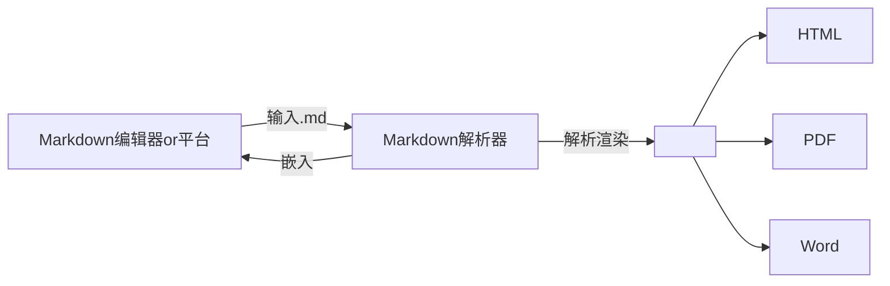
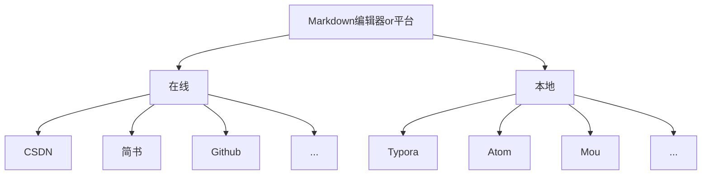
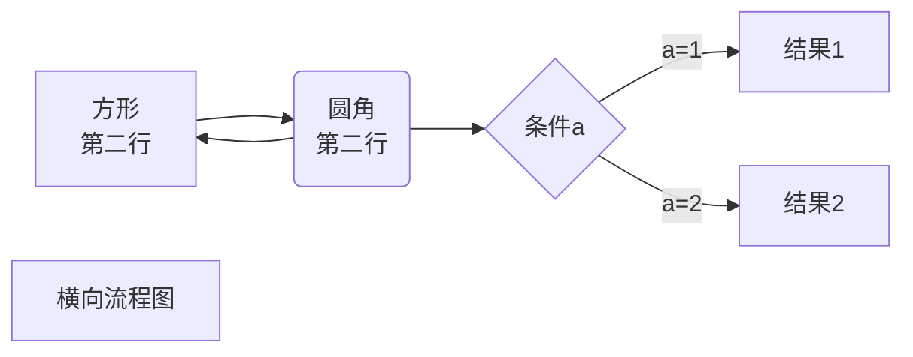
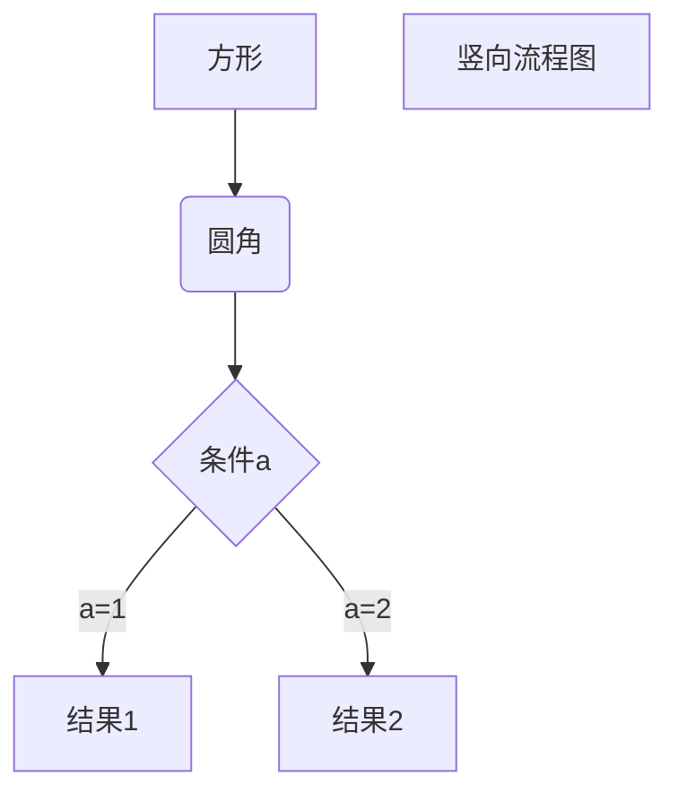
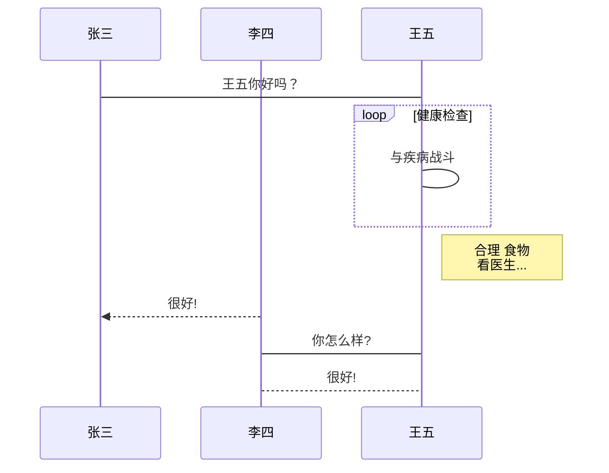
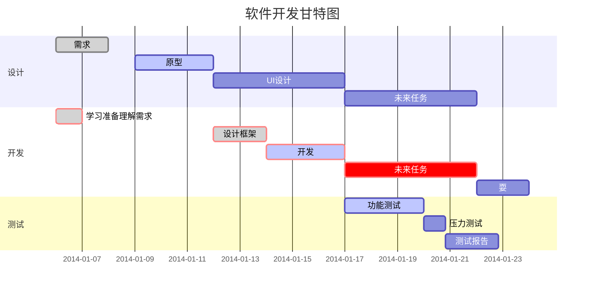
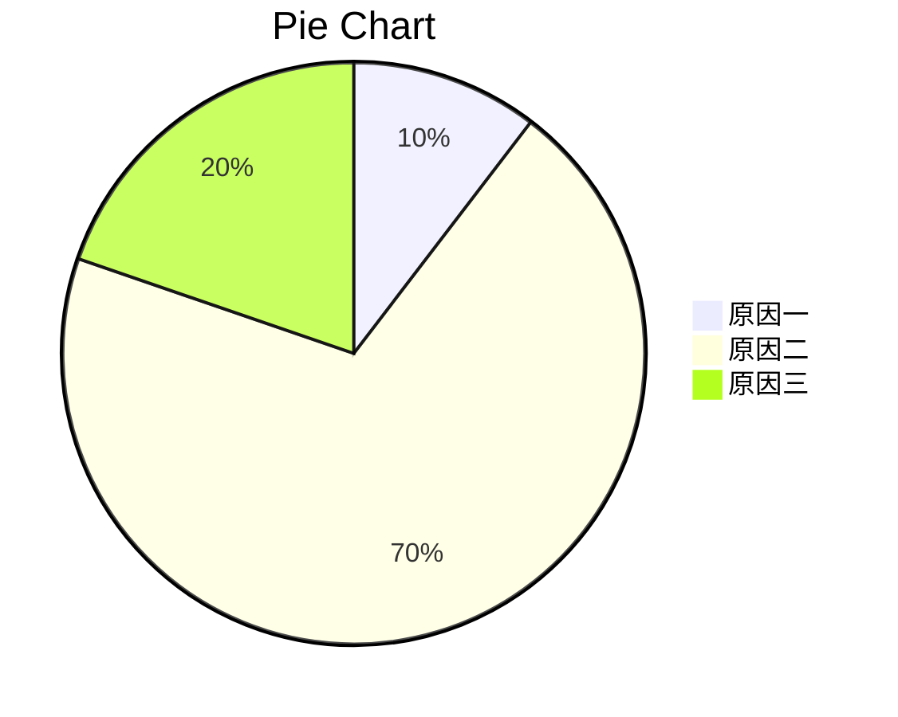

[TOC]

# Markdown教程

**Markdown是一种轻量级的「标记语言」**

Markdown是一种可以使用普通文本编辑器编写的标记语言，通过简单的标记语法，它可以使普通文本内容具有一定的格式。它允许人们使用易读易写的纯文本格式编写文档，然后转换成格式丰富的HTML页面，Markdown文件的后缀名便是“.md”

## MdEditor是一个在线编辑Markdown文档的编辑器

*MdEditor扩展了Markdown的功能（如表格、脚注、内嵌HTML等等），以使让Markdown转换成更多的格式，和更丰富的展示效果，这些功能原初的Markdown尚不具备。*

> Markdown增强版中比较有名的有Markdown Extra、MultiMarkdown、 Maruku等。这些衍生版本要么基于工具，如~~Pandoc~~，Pandao；要么基于网站，如GitHub和Wikipedia，在语法上基本兼容，但在一些语法和渲染效果上有改动。

MdEditor源于Pandao的JavaScript开源项目，开源地址[Editor.md](https://github.com/pandao/editor.md "Editor.md")，并在MIT开源协议的许可范围内进行了优化，以适应广大用户群体的需求。向优秀的markdown开源编辑器原作者Pandao致敬。

## Markdown Preview Enhanced
[MPE](https://shd101wyy.github.io/markdown-preview-enhanced/#/zh-cn/)
Markdown Preview Enhanced 是一款为 Atom 以及 Visual Studio Code 编辑器编写的超级强大的 Markdown 插件。 这款插件意在让你拥有飘逸的 Markdown 写作体验。


## 标题
### 3
#### 4
##### 5
###### 6

我展示的是一级标题
=================

我展示的是二级标题
-----------------

## 段落

> 引用：如果想要插入空白换行`即<br />标签`，在插入处先键入两个以上的空格然后回车即可

### 字体

*斜体文本*
_斜体文本_
**粗体文本**
__粗体文本__
***粗斜体文本***
___粗斜体文本___


### 删除线
如果段落上的文字要添加删除线，只需要在文字的两端加上两个波浪线 ~~ 即可。
~~删除线~~
<s>删除线（开启识别HTML标签时）</s>

### 下划线
<u>下划线</u>

首行不缩进
&#160;&#160;&#160;&#160;首行缩进

上标:X<sup>2</sup>
下标:O<sub>2</sub>

### 脚注
生成一个脚注[^footnote].
生成第二个脚注[^footnote2].
  [^footnote]: 这里是 **脚注** 的 *内容*
  [^footnote2]: 222
  
注：footnote是自定义变量

### 分隔线
在一行中用三个以上的星号、减号、底线来建立一个分隔线，行内不能有其他东西。
可以在星号或是减号中间插入空格。
***
* * * 
*******
---
_____

## 列表
### 无序列表
列表标记后面要添加一个空格，然后再填写内容：

- 语文
- 数学
- 英语

+ 语文
+ 数学
+ 英语

* 语文
* 数学
* 英语

### 有序列表
有序列表使用数字并加上 . 号来表示：

6. 机器学习
5. 模式识别
3. 人工智能

### 列表嵌套
列表嵌套只需在子列表中的选项前面添加两个或四个空格即可：

1. 第一项：
    - 第一项嵌套的第一个元素
    - 第一项嵌套的第二个元素
2. 第二项：
    - 第二项嵌套的第一个元素
    - 第二项嵌套的第二个元素

项目１
: 定义 A
: 定义 B

项目２
: 定义 C
: 定义 D

### GFM task list

- [x] GFM task list 1
- [x] GFM task list 2
- [ ] GFM task list 3
    - [ ] GFM task list 3-1
    - [ ] GFM task list 3-2
    - [ ] GFM task list 3-3
- [ ] GFM task list 4
    - [ ] GFM task list 4-1
    - [ ] GFM task list 4-2 


## 区块
>毛主席：111
>>周总理：222
>>>朱德：333

### 区块中使用列表
> 区块中使用列表
> 1. 第一项
> 2. 第二项
> + 第一项
> + 第二项
> + 第三项


### 列表中使用区块
如果要在列表项目内放进区块，那么就需要在 > 前添加四个空格的缩进。

* 第一项
    > 菜鸟教程
    > 学的不仅是技术更是梦想
* 第二项

## 代码
如果是段落上的一个函数或片段的代码可以用反引号把它包起来（`）。

c语言使用`printf()`进行格式化输出

### 代码区块

执行命令：`npm install marked`

缩进四个空格或者一个制表符（Tab 键），也做为实现类似`<pre>`预格式化文本(Preformatted Text)的功能。

    <?php
        echo "Hello world!";
    ?>


    void test() {
        return;
    }

预格式化文本：

    | First Header  | Second Header |
    | ------------- | ------------- |
    | Content Cell  | Content Cell  |
    | Content Cell  | Content Cell  |


用 ``` 包裹一段代码，并指定一种语言（也可以不指定）：

 ``` python
 @requires_authorization
 def somefunc(param1='', param2=0):
     '''A docstring'''
     if param1 > param2: # interesting
         print 'Greater'
     return (param2 - param1 + 1) or None
 class SomeClass:
     pass
 >>> message = '''interpreter
 ... prompt'''
 ```

```html
<!DOCTYPE html>
<html>
    <head>
        <mate charest="utf-8" />
        <title>Hello world!</title>
    </head>
    <body>
        <h1>Hello world!</h1>
    </body>
</html>
```

``` javascript
    var num = 1539;
    var n1 = parseInt(num%10);
    var n2 = parseInt((num%100)/10);
    var n3 = parseInt((num%1000)/100);
    var n4 = parseInt((num%10000)/1000);
    var total = n1 + n2 + n3 + n4;
    console.log(typeof( parseInt( (num%10).toFixed(0) ) ) );
    console.log("个位:" + n1);
    console.log("十位:" + n2);
    console.log("百位:" + n3);
    console.log("千位:" + n4);
    console.log("总和：" + total);
```

## 链接

普通链接: [Baidu](www.baidu.com)

[普通链接带标题](www.baidu.com "普通链接带标题")

直接链接：<https://www.runoob.com>

### 锚点
[锚点链接][anchor-id]

[anchor-id]: https://www.runoob.com/

  [pandao]: https://www.runoob.com/


### 高级链接

  [google]: http://www.google.com/

这个链接用 google 作为网址变量 [Google][google]
这个链接用 runoob 作为网址变量 [Runoob][runoob]
然后在文档的开头或结尾为变量赋值（网址）

  [runoob]: http://www.runoob.com/


## 图片

- 开头一个感叹号 !
- 接着一个方括号，里面放上图片的替代文字
- 接着一个普通括号，里面放上图片的网址，最后还可以用引号包住并加上选择性的 'title' 属性的文字。


图片加链接 (Image + Link)：

[](https://static.runoob.com/images/runoob-logo.png "RUNOOB")


- 也可以像网址那样对图片网址使用变量：

这个链接用 runoob_logo 作为网址变量 [RUNOOB][runoob_logo].
然后在文档的结尾为变量赋值（网址）

[runoob_logo]: http://static.runoob.com/images/runoob-logo.png


- Markdown 还没有办法指定图片的高度与宽度，如果你需要的话，你可以使用普通的``标签。


<br/>


## 表格
Markdown 制作表格使用 | 来分隔不同的单元格，使用 - 来分隔表头和其他行。

我们可以设置表格的对齐方式：
* -: 设置内容和标题栏居右对齐。
* :- 设置内容和标题栏居左对齐。
* :-: 设置内容和标题栏居中对齐。

|   项目        |   价格    |   数量    |
|   :--------   |   ---:    |   :---:   |
|   Computer    |   $1600   |   5       |
|   Phone       |   $12     |   12      |
|   Pipe        |   $1      |   234     |

## 高级技巧
### 支持的HTML 元素

不在 Markdown 涵盖范围之内的标签，都可以直接在文档里面用 HTML 撰写。
目前支持的 HTML 元素有：`<kbd> <b> <i> <em> <sup> <sub> <br>`等 ，如：

使用 <kbd>Ctrl</kbd>+<kbd>Alt</kbd>+<kbd>Del</kbd> 重启电脑

> 缩写即更长的单词或短语的缩写形式，前提是开启识别HTML标签时，已默认开启

The <abbr title="Hyper Text Markup Language">HTML</abbr> specification is maintained by the <abbr title="World Wide Web Consortium">W3C</abbr>.


#### 特殊符号

>&copy;
&
&uml;
&trade;
&iexcl;
&pound;

>&amp;
&lt;
&gt;
&yen;
&euro;
&reg;
&plusmn;
&para;
&sect;
&brvbar;
&macr;
&laquo;
&middot; 

>X&sup2;
Y&sup3;
&frac34;
&frac14;
&times;
&divide;
&raquo;

>18&ordm;C
&quot;
&apos;

### Emoji表情 :smiley:

> Blockquotes :star:


### GFM task lists & Emoji & fontAwesome icon emoji & editormd logo emoji :editormd-logo-5x:

- [x] :smiley: @mentions, :smiley: #refs, [links](), **formatting**, and <del>tags</del> supported :editormd-logo:;
- [x] list syntax required (any unordered or ordered list supported) :editormd-logo-3x:;
- [x] [ ] :smiley: this is a complete item :smiley:;
- [ ] []this is an incomplete item [test link](#) :fa-star: @pandao; 
- [ ] [ ]this is an incomplete item :fa-star: :fa-gear:;
    - [ ] :smiley: this is an incomplete item [test link](#) :fa-star: :fa-gear:;
    - [ ] :smiley: this is  :fa-star: :fa-gear: an incomplete item [test link](#);


### 转义
Markdown 使用了很多特殊符号来表示特定的意义，如果需要显示特定的符号则需要使用转义字符，使用反斜杠转义特殊字符：

**文本加粗** 
\*\* 正常显示星号 \*\*

Markdown 支持以下这些符号前面加上反斜杠来帮助插入普通的符号：

>\   反斜线
`   反引号
\*   星号
_   下划线
{}  花括号
[]  方括号
()  小括号
\#   井字号
\+   加号
\-   减号
.   英文句点
!   感叹号


### 公式
Markdown Preview Enhanced 使用 **KaTeX** 或者 __MathJax__ 来渲染数学表达式。

KaTeX 拥有比 MathJax 更快的性能，但是它却少了很多 MathJax 拥有的特性。你可以查看 KaTeX supported functions/symbols 来了解 KaTeX 支持那些符号和函数。

<!-- 默认下的分隔符：
$...$ 或者 \(...\) 中的数学表达式将会在行内显示。
$$...$$ 或者 \[...\] 或者 ```math 中的数学表达式将会在块内显示。 -->

$f(x) = sin(x) + 12$

$$\sum_{n=1}^{100} n$$

$$
\begin{Bmatrix}
   a & b \\
   c & d
\end{Bmatrix}
$$

$$
\begin{CD}
   A @>a>> B \\
@VbVV @AAcA \\
   C @= D
\end{CD}
$$

$$E=mc^2$$

$$\sqrt{3x-1}+(1+x)^2\$$


$$\sin(\alpha)^{\theta}=\sum_{i=0}^{n}(x^i + \cos(f))$$

多行公式：

```math
\displaystyle
\left( \sum\_{k=1}^n a\_k b\_k \right)^2
\leq
\left( \sum\_{k=1}^n a\_k^2 \right)
\left( \sum\_{k=1}^n b\_k^2 \right)
```

<!-- ```katex
\displaystyle
    \frac{1}{
        \Bigl(\sqrt{\phi \sqrt{5}}-\phi\Bigr) e^{
        \frac25 \pi}} = 1+\frac{e^{-2\pi}} {1+\frac{e^{-4\pi}} {
        1+\frac{e^{-6\pi}}
        {1+\frac{e^{-8\pi}}
         {1+\cdots} }
        }
    }
```

```latex
f(x) = \int_{-\infty}^\infty
    \hat f(\xi)\,e^{2 \pi i \xi x}
    \,d\xi
``` -->


## 思维导图和流程图

Markdown是轻量级的标记语言，绘制思维导图不是Markdown的工作而是Markdown解析器（引擎）的工作。



不同的Markdown编辑器或平台使用的Markdown解析器不尽相同，语法存在细微差异。
传送门：
[CSDN](https://blog.csdn.net/qq_36595013/article/details/80316511#%E7%A6%BB%E7%BA%BF%E5%86%99%E5%8D%9A%E5%AE%A2)
[简书](https://www.jianshu.com/p/c8259702a22e)
[Github](https://www.jianshu.com/p/40ba812dd973)
[Typora](https://www.cnblogs.com/hider/p/11614688.html)
[Atom](https://www.jianshu.com/p/f3fd881548ad)
[Mou](https://www.dazhuanlan.com/jsongscode/topics/1040362)



注意：图中的换行要用`<br/>`

### 横向流程图



### 竖向流程图
`graph TB` 或 `graph TD`



### 标准流程图
```flow
st=>start: 开始框
op=>operation: 处理框
cond=>condition: 判断框(是或否?)
sub1=>subroutine: 子流程
io=>inputoutput: 输入输出框
e=>end: 结束框

st->op->cond
cond(yes)->io->e
cond(no)->sub1(right)->op
```

### 标准流程图（横向）
```flow
st=>start: 开始框
op=>operation: 处理框
cond=>condition: 判断框(是或否?)
sub1=>subroutine: 子流程
io=>inputoutput: 输入输出框
e=>end: 结束框

st(right)->op(right)->cond
cond(yes)->io(bottom)->e
cond(no)->sub1(right)->op
```

### UML时序图
```sequence
对象A->对象B: 对象B你好吗?（请求）
Note right of 对象B: 对象B的描述
Note left of 对象A: 对象A的描述(提示)
对象B-->对象A: 我很好(响应)
对象A->对象B: 你真的好吗？
```

### UML时序图复杂
```sequence
Title: 标题：复杂使用
对象A->对象B: 对象B你好吗?（请求）
Note right of 对象B: 对象B的描述
Note left of 对象A: 对象A的描述(提示)
对象B-->对象A: 我很好(响应)
对象B->小三: 你好吗
小三-->>对象A: 对象B找我了
对象A->对象B: 你真的好吗？
Note over 小三,对象B: 我们是朋友
participant C
Note right of C: 没人陪我玩
```

### UML标准时序图


### 甘特图


### 扇形图



