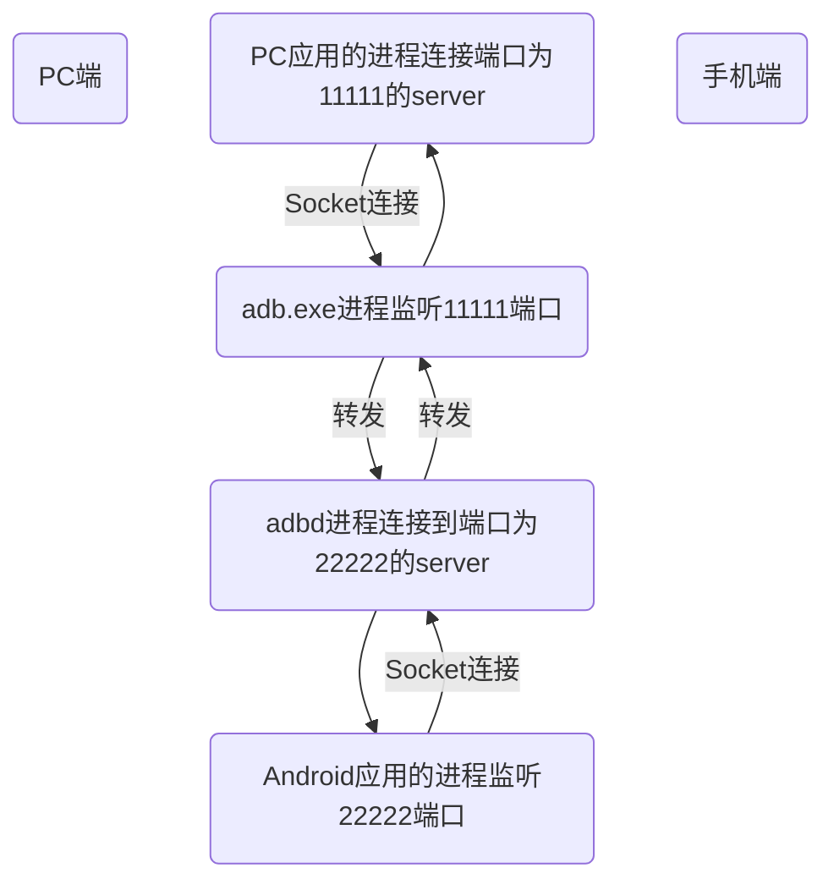

[TOC]

# ADB

[Android 调试桥 (adb)](https://developer.android.google.cn/studio/command-line/adb?hl=zh-cn)

[获取 Google USB 驱动程序](https://developer.android.google.cn/studio/run/win-usb?hl=zh-cn)


调试相关
1. adb 服务
开启服务 adb start-server
关闭服务 adb kill-server
2. 设备
列出设备及其id adb devices
使用特定设备操作 adb -s device_id
例如：adb -s 47db0de20304 shell
3. 重启
正常重启 adb reboot
重启到 bootloader (刷机模式)adb reboot bootloader
重启到 recovery (恢复模式)adb reboot recovery
4. Monkey 测试
随机测试 adb shell monkey -p your.package.name 1000
script 文件测试 adb shell monkey -f /sdcard/xxx.script
5. 查看进程
列出进程列表及其pid adb shell ps
杀死指定pid的进程 adb shell kill pid
查看指定进程信息 adb shell ps -x pid
6. 查看 service
adb shell service list

7. 查看系统当前内存使用情况
adb shell cat /proc/meminfo

查看指定包名应用内存使用情况 adb shell dumpsys meminfo package
8. Activity 调试
启动应用 adb shell am start -n your.package.name/your.package.name-activity
停止应用 adb shell am force-stop package
查看当前 Activity 名称 adb shell dumpsys activity | findstr “mFocusedActivity”
设备应用管理
（这里推荐一个Android Stuido 插件：ADB Idea ）

1. 安装apk
安装 adb install xxx.apk
覆盖安装(保留缓存和数据) adb install -r xxx.apk
2. 卸载应用
卸载 adb uninstall package
卸载时保留数据和缓存目录 adb uninstall -k package
3. 查看设备应用
查看设备所有应用包名 adb shell pm list packages
列出指定包名对应的apk路径 adb shell pm path your.package.name
清空指定包名对应的应用的数据和缓存文件 adb shell pm clear your.package.name
文件管理
1. 将电脑文件复制到设备sd卡上
adb push 电脑文件路径 /sdcard

2. 设备文件复制到电脑上
adb pull /sdcard/text.txt 电脑文件路径

3. 删除
adb shell rm /sdcard/text.txt
-f 强制删除文件不需要确认
-r 递归删除文件夹内文件
-i 删除文件前需要确认

4. 创建目录
adb shell mkdir -p /sdcard/temp/test/
指定 -p 递归创建目录

5. 创建文件
adb shell touch /sdcard/text.txt

6. 复制文件
adb shell cp /sdcard/text.txt /sdcard/test/

7. 移动文件
adb shell mv /sdcard/1.txt /sdcard/2.text
移动同一目录下文件相当于重命名文件

其他一些命令
1. 申请 toot 权限
adb shellsu

2. 查看手机上所有的包名
adb shellcd data/data ; ls

3. Linux 多个命令行一起执行可以用 “;” 或者 “&&” 进行分割
cd data/data ; ls

4. adb shell 查看文件后退出
exit 或者 Ctrl + D


sudo apt-get install android-tools-adb android-tools-fastboot


D:\Program Files\Android\Sdk\build-tools\29.0.3
aapt.exe
dexdump.exe


aapt解析包信息
D:\Program Files\Android\Sdk\build-tools\29.0.3\aapt.exe d badging ***.apk

D:\Program Files\Android\Sdk\build-tools\29.0.3\aapt.exe dump xmltree **.apk AndroidManifest.xml
也可用反编译工具
apktool d ***.apk


D:\Program Files\Android\Sdk\platform-tools
adb.exe
dmtracedump.exe
fastboot.exe
sqlite3.exe


WIFI调试
adb tcpip 5555
adb shell ip -f inet addr show wlan0
adb connect IP:5555


adb shell install -t -t packagename
adb shell unstall packagename


查看所有的安装包名
adb shell pm list packages
应用对应的apk文件在手机上的安装位置
adb shell pm list packages -f


查看安装包的路劲
adb shell pm path packagename


查看apk的应用信息、版本信息
adb shell dumpsys package com.examle.xx

列出所有service
adb shell dumpsys
adb shell dumpsys -l
adb shell service list

查看指定的service信息
adb shell dumpsys activity -h
查看Activity/Task信息
adb shell dumpsys activity
查看指定包名当前窗口显示布局结构信息，如果不在当前窗口，则报错
adb shell dumpsys activity pkg

查看处于当前栈顶的Window和Activity
adb shell dumpsys window windows | grep -E 'mCurrentFocus'
adb shell dumpsys activity | grep mFocusedActivity

adb shell dumpsys window（最后部分可以看到分辨率的信息）

打开的当前应用的component
adb shell dumpsys window w | findstr \/ | findstr name=

adb shell dumpsys meminfo > meminfo.txt
查看指定包的内存信息
adb shell dumpsys meminfo pgk -d
在进入一个界面之前查看一遍Activity和View的数量，在退出这个界面之后再查看一遍Activity和View的数量，对比进入前和进入后Activity和View数量的变化情况，
如果有差异，则说明存在内存泄露（在使用命令查看Activity和View的数量之前，记得手动触发GC）。
adb shell dumpsys meminfo packagename -d

adb shell "ps -A | grep 'com.gc.ud'"
adb shell dumpsys meminfo pid


adb shell "cat /proc/meminfo"


adb shell dumpsys package -h
adb shell dumpsys cpuinfo
adb shell dumpsys battery


adb启动apk
adb shell am start -n breakan.test/breakan.test.TestActivity


adb logcat -c
adb logcat -v time > e://logcat.txt
查看activity的log
adb logcat ActivityManager:I *:s


touch event:
getevent -l | grep -E "BTN_TOUCH|ABS_MT_TRACKING_ID|ABS_MT_SLOT|ABS_MT_POSITION"


adb shell "ps|grep aa.aaaaa.android"
adb shell "top|grep aa.aaaaa.android"


cat proc/cpuinfo
getprop | grep product
cat /system/build.prop | grep "product"

查看WiFi密码
cat /data/misc/wifi/*.conf
截图保存手机
adb shell /system/bin/screencap -p /sdcard/screenshot.png


Android 11之前
adb push .\boot.img /data/
ls -al /dev/block/by-name/boot
lrwxrwxrwx 1 root root 16 1971-10-03 10:22 /dev/block/by-name/boot -> /dev/block/sde11
dd if=/data/boot.img of=/dev/block/sde11

ls -al /dev/block/by-name/system
lrwxrwxrwx 1 root root 16 1971-07-30 21:00 /dev/block/by-name/system -> /dev/block/sda15
dd if=/dev/block/sda15 of=/sdcard/system.img

mount | grep vendor
lrwxrwxrwx 1 root root 16 1971-07-30 21:00 /dev/block/by-name/vendor -> /dev/block/sda16
dd if=/dev/block/sda16 of=/sdcard/vendor.img


vbmeta负责每个分区校验
ls -al /dev/block/by-name/vbmeta
lrwxrwxrwx 1 root root 16 1971-07-30 21:00 /dev/block/by-name/vbmeta -> /dev/block/sde16


Android 11之后动态分区烧录
adb shell
ls -al /dev/block/by-name/super
	lrwxrwxrwx 1 root root 16 1970-01-09 03:07 super -> /dev/block/sda17
dd if=/dev/block/sda17 of=/sdcard/super_bak
adb pull /sdcard/super_bak ./

adb push super_bak /sdcard/super_bak
adb shell
dd if=/sdcard/super_bak of=/dev/block/sda17


最后一定要执行以下命令确保数据被写入:sudo sync


echo "o" > /proc/sysrq-trigger
软件立即触发系统关机


adb xroot
adb disable-verity
adb reboot remount
adb remount
adb push D:\Desktop\adb_xroot\init.qcom.rc vendor/etc/init/hw/
adb reboot


1,通过adb 连接（WiFi连接或者数据线连接）Android设备

2,PC端进入命令窗口（win +R 组合键后，输入cmd）

3,adb shell 进入linux命令行

4,输入wm size ，查看分辨率

5,输入wm density 查看dpi


其他常用adb指令：
1.adb install +包名       adb安装apk (覆盖安装是使用 -r 选项)

2.adb uninstall +包名      adb卸载apk

3.adb connect +设备IP      网络连接Android设备

4.adb reboot       重启Android设备

5.adb devices      获取连接的设备列表及设备状态

6.adb get-state    获取设备的状态 (设备的状态有 3 钟，device:设备正常连接 , offline:连接出现异常，设备无响应 , unknown:没有连接设备)

7.查看运行在 Android设备上的 adb 后台进程：

执行 adb shell ps | grep adbd ，可以找到该后台进程，windows 请使用 findstr 替代 grep


8.adb shell 命令 
adb 命令是 adb 这个程序自带的一些命令，而 adb shell 则是调用的 Android 系统中的命令，这些 Android 特有的命令都放在了 Android 设备的 system/bin 目录下

8.1. adb shell  bugreport , 打印dumpsys、dumpstate、logcat的输出，也是用于分析错误

输出比较多，建议重定向到一个文件中

adb shell dumpsys > d:\bugreport.log

8.2 pm
Package Manager , 可以用获取到一些安装在 Android 设备上得应用信息

8.2.1  adb shell pm list package      列出所有的应用的包名 （-s：列出系统应用  -3：列出第三方应用 -f：列出应用包名及对应的apk名及存放位置  -i：列出应用包名及其安装来源）

8.2.2  adb shell pm path+包名     列出对应包名.apk 位置

8.2.3  adb shell pm install +apk存放路径   安装应用（目标 apk 存放于PC端，用 adb install 安装   目标 apk 存放于Android设备上，用 pm install 安装）

8.3 am

8.3.1 adb shell  am start +包名/.Activity (要启动的Activity)     启动一个 Activity （-s先停止目标应用，再启动  -w 等待应用完成启动  -a 启动默认浏览器打开一个网页例：adb shell am start -a android.intent.action.VIEW -d http://testerhome.com）


8.3.2  adb shell am monitor        监控 crash 与 ANR

8.3.3  adb shell am force-stop    后跟包名，结束应用

8.3.4  adb shell am startservice    启动一个服务

8.3.5  adb shell am broadcast       发送一个广播

8.4 input

这个命令可以向 Android 设备发送按键事件

8.4.1 adb shell input text +具体内容    发送文本内容，不能发送中文 

8.4.2 adb shell input keyevent + 按键事件   发送按键事件 例如：adb shell input keyevent KEYCODE_HOME 模拟按下Home键

8.4.3 adb shell input tap +触摸事件的位置 , 对屏幕发送一个触摸事件 例如：点击屏幕上坐标为 500 500 的位置（adb shell input tap 500 500)

8.4.4 adb shell input tap , 对屏幕发送一个触摸事件

8.4.4 adb shell input swipe   滑动事件  例如：从右往左滑动屏幕 

adb shell input swipe 800 600 100 600
8.5 screencap 

截图命令

adb shell screencap -p /sdcard/DCIM/screenTest.png
8.6 screenrecord

4.4以上系统版本新增的录制命令

adb shell screenrecord /sdcard/demo.mp4
执行命令后操作手机，ctrl + c 结束录制，录制结果保存至 sdcard/ 下

8.7 ime 

列出设备上的输入法 

adb shell ime list -s
其他
1.获取系统版本

adb shell getprop ro.build.version.release

2.获取系统api版本

adb shell getprop ro.build.version.sdk

3.获取手机相关制造商信息

adb shell getprop | grep "model\|version.sdk\|manufacture
r\|hardware\|platform\|revision\|serialno\|product.name\|brand"

3,获取手机系统信息（ CPU，厂商名称等）

adb shell "cat /system/build.prop | grep "product""

4,获取手机设备型号

adb -d shell getprop ro.product.model

5，获取手机厂商名称

adb -d shell getprop ro.product.brand

6，获取手机的序列号

有两种方式

1，adb get-serialno
2，adb shell getprop ro.serialno

7，获取手机MAC地址

adb shell cat /sys/class/net/wlan0/address

8，获取手机内存信息

adb shell cat /proc/meminfo

9，获取手机存储信息

adb shell df

10，获取手机内部存储信息

adb shell df /data

11，获取Android设备屏幕分辨率

adb shell "dumpsys window | grep mUnrestrictedScreen"

12，连接多个设备对其中一个进行操作
//以adb shell 为例
adb -s 192.168.101.37:5555 shell

13，查看运行进程

adb shell procrank

14，关闭或杀掉进程

adb shell kill 366

15，保留数据和缓存文件，重新安装，升级

adb install -r test.apk

16，卸载app但保留数据和缓存文件

adb uninstall -k cnblogs.apk

17，查看目录下的文件大小

adb shell du -sh *

18，查看正在运行的Services

adb shell dumpsys activity services [<packagename>]

19，查看正在运行的Activity

adb shell dumpsys activity [<packagename>]

20,clear 清除应用数据

adb shell pm clear com.baidu

21，cp复制文件

adb shell 进入Android Linux命令中

cp -f system/app/Music/Music.apk /sdcard/Music.apk

22，删除命令

adb shell 进入Android Linux命令中

rm  -r  /mnt/sdcard/a.mp3 

删除文件夹的时候需要加上-r参数 

cd dir 
rm *    删除dir中所有文件

23，重启进入recovery模式

adb reboot recovery

24，cat查看文件

cat  /sdcard/test.txt

25，查看指定进程PID

ps +  进程的包名

26，查看进程具体的信息

例如：1460是要查看的进程的PID
cat /proc/1460/maps    查看进程的文件结构 
cat /proc/1460/status   查看进程的状态

27，findstr 和 grep过滤搜索

1）cmd下搜索包名为com.android.launcher3的进程 
adb shell ps|findstr /i “com.android.launcher3” 

2）shell下面搜索 
先使用adb shell进去，然后使用grep命令过滤 
ps | grep “com.linux.test”


data/system/packages.list
data/system/packages.xml
data/system/package-usage.list
data/system/overlays.xml

data/system/uiderrors.txt


看手机是user版本还是userdebug或是eng版本
adb shell getprop ro.build.type


/data/tombstones里会记录所有的程序崩溃信息
怎样查看tombstones?


android 常见死机问题--log分析

1、程序异常退出 uncaused exception

2、程序强制关闭 Force Closed (简称FC)

3、程序无响应 Application No Response(简称ANR),一般主线程超过5秒么有处理就会ANR4、手动生成进入控制台输入：logcat命令即可进行输出第一部分1、分析工具介绍
a、cat /proc/meminfo 
重点关注这下面几个值：
MemTotal: 285184 kB //总计物理内存的大小
MemFree: 106360 kB //可用内存有多少
Buffers: 0 kB //磁盘缓存内存的大小
Cached: 60036 kB // freefreetotal used free shared buffers
Mem: 285184 178884 106300 0 0
Swap: 0 0 0
Total: 285184 178884 106300
在linux中有这么一种思想，内存不用白不用，因此它尽可能的cache和buffer一些数据，以方便下次使用。但实际上这些内存也是可以立刻拿来使用的。所以空闲内存=free+buffers+cached=total-used
还有几个命令可使用：
/proc/meminfo 机器的内存使用信息
/proc/pid/maps pid为进程号，显示当前进程所占用的虚拟地址。
/proc/pid/statm 进程所占用的内存
b、查看进程信息
------ CPU INFO (top -n 1 -d 1 -m 30 -t) ------能够实时显示系统中各个进程的资源占用状况，类似于 Windows 的任务管理器
c、android提供的一些操作工具
------ PROCRANK (procrank) 
------------ PROCMEM (procmem) 
------------ SHOWMAP (showmap) ------
... 就不一一列举了，有兴趣的朋友可以去看看这此工具的代码位于android的 /system/extras
d、虚拟内存的查看工具
------ VIRTUAL MEMORY STATS (/proc/vmstat) 
------------ VMALLOC INFO (/proc/vmallocinfo) ------
2、时间信息,也是我们主要分析的信息格式如下：
------ SYSTEM LOG 
(logcat -b system -v time -d *:v) ------$:logcat -b system -v time -d *:v
01-02 08:00:02.570 I/SystemServer( 957): Notification Manager
01-02 08:00:02.570 I/SystemServer( 957): Device Storage Monitor
01-02 08:00:02.580 I/SystemServer( 957): Location Manager
01-02 08:00:02.580 I/SystemServer( 957): Search Service
01-02 08:00:02.590 I/SystemServer( 957): DropBox Service
01-02 08:00:02.590 I/SystemServer( 957): Wallpaper Service
3、虚拟机信息,包括进程的,线程的跟踪信息,这是用来跟踪进程和线程具体点的好地方 。
------ VM TRACES JUST NOW (/data/anr/traces.txt.bugreport: 2011-01-15 16:49:02) 
------------ VM TRACES AT LAST ANR (/data/anr/traces.txt: 2011-01-15 16:49:02) 
------格式如下 ：----- 
pid 1516 at 1970-01-02 08:03:07 -----Cmd line: 
com.ipanel.join.appstoreDALVIK THREADS:(mutexes: tll=0 tsl=0 
tscl=0 ghl=0 hwl=0 hwll=0)"main" prio=5 tid=1 NATIVE| group="main" 
sCount=1 dsCount=0 obj=0x4001f188 self=0xd028| sysTid=1516 nice=0 
sched=3/0 cgrp=[fopen-error:2] handle=-1345017744


第二部分
‍
如何分析log信息
1、查找错误信息的关键字眼"error" "failxx" "E/" 等的错误信息将这些问题先行解决掉
2、动态库死机查看类似的“Build fingerprint:”这些关键字
I/DEBUG ( 692): *** *** *** *** *** *** *** *** *** *** *** *** *** *** *** ***
I/DEBUG ( 692): Build fingerprint: 
'generic/generic/generic:2.3.1/GRH78/eng.userdev-rd6-input.20120221.113348:eng/test-keys'
I/DEBUG ( 692): pid: 694, tid: 694 >>> /system/bin/mediaserver <<<
I/DEBUG ( 692): signal 11 (SIGSEGV), code 1 
(SEGV_MAPERR), fault addr 00000input module init -->010
对于这此信息，可以查看动态库的分析：http://blog.csdn.net/andyhuabing/article/details/7074979
3、解决java抛异常的问题解决
E/UsbObserver( 957): java.lang.NullPointerException
E/UsbObserver( 957): at com.android.server.UsbObserver.init(UsbObserver.java:131)
E/UsbObserver( 957): at com.android.server.UsbObserver.<init>(UsbObserver.java:65)
E/UsbObserver( 957): at com.android.server.ServerThread.run(SystemServer.java:419)
I/SystemServer( 957): UI Mode Manager Service
这个直接找到java代码，分析其实现即可解决
4、ANR问题搜索“ANR”关键词，快速定位到关键事件信息 。定位到关键的事件信息如下:
I/dalvikvm( 1014): Wrote stack traces to '/data/anr/traces.txt'
I/Process ( 957): Sending signal. PID: 1124 SIG: 9
E/ActivityManager( 957): ANR in com.ipanel.join.appstore
E/ActivityManager( 957): Reason: Broadcast of Intent { act=android.appwidget.action.APPWIDGET_UPDATE cmp=com.ipanel.join.appstore/.widget.SmallWidget1 (has extras) }
E/ActivityManager( 957): Load: 1.57 / 0.38 / 0.13
E/ActivityManager( 957): CPU usage from 6290ms to 0ms ago:
E/ActivityManager( 957): 70% 957/system_server: 1.1% user + 69% kernel / faults: 204 minor
E/ActivityManager( 957): 8.7% 1014/com.ipanel.join.home.jelly: 7.7% user + 0.9% kernel / faults: 899 minor
E/ActivityManager( 957): 0.3% 687/yaffs-bg-1: 0% user + 0.3% kernel
E/ActivityManager( 957): 0.3% 688/yaffs-bg-1: 0% user + 0.3% kernel
E/ActivityManager( 957): 0.3% 935/irkeyservice: 0% user + 0.3% kernel
E/ActivityManager( 957): 0% 890/galcore daemon : 0% user + 0% kernel
E/ActivityManager( 957): 0.1% 1076/com.ipanel.join.browser: 0.1% user + 0% kernel
E/ActivityManager( 957): 0.1% 1124/com.ipanel.join.appstore: 0.1% user + 0% kernel
E/ActivityManager( 957): 75% TOTAL: 4.7% user + 70% kernel
E/ActivityManager( 957): CPU usage from 622ms to 1169ms later:
E/ActivityManager( 957): 71% 957/system_server: 0% user + 71% kernel / faults: 2 minor
E/ActivityManager( 957): 67% 965/SurfaceFlinger: 0%user + 67% kernel
E/ActivityManager( 957): 1.9% 973/ActivityManager: 1.9% user + 0% kernel
E/ActivityManager( 957): 1.9% 991/CursorMove: 0% user + 1.9% kernel
E/ActivityManager( 957): 7.6% 1014/com.ipanel.join.home.jelly: 7.6% user + 0% kernel / faults: 31 minor
E/ActivityManager( 957): 5.7% 1119/Thread-13: 5.7% user + 0% kernel
E/ActivityManager( 957): 1.9% 1123/Thread-13: 1.9% user + 0% kernel
E/ActivityManager( 957): 76% TOTAL: 1.8% user + 72% kernel + 1.8% softirq指定哪个java包出问题
E/ActivityManager( 957): ANR in com.ipanel.join.appstore
进程号为957发生了如下错误：
com.ipanel.join.appstore 包下面 Broadcast问题
ANR原因：
E/ActivityManager( 957): Reason: Broadcast of Intent { act=android.appwidget.action.APPWIDGET_UPDATE cmp=com.ipanel.join.appstore/.widget.SmallWidget1 (has extras) }
这是ANR的堆栈调用文件I/dalvikvm( 1014): Wrote stack traces to '/data/anr/traces.txt'
通过上面的log信息分析，应该是接收一个广播消息时超时了我们再分析虚拟机信息 ，打开/data/anr/traces.txt,可有通过adb pull 
/data/anr/traces.txt .这里每一段都是一个线程 ，当然我们还是看线程号为1的主线程了。通过分析发现关键问题是这样：搜索“DALVIK THREADS”关键词，快速定位到本应用程序的虚拟机信息日志
----- pid 1516 at 1970-01-02 08:03:07 
-----Cmd line: com.ipanel.join.appstoreDALVIK THREADS:(mutexes: tll=0 tsl=0 tscl=0 ghl=0 hwl=0 hwll=0)"main" prio=5 tid=1 NATIVE| group="main" sCount=1 dsCount=0 obj=0x4001f188 self=0xd028| sysTid=1516 nice=0 sched=3/0 cgrp=[fopen-error:2] handle=-1345017744
at org.apache.harmony.luni.platform.OSNetworkSystem.connect(Native Method)
at dalvik.system.BlockGuard$WrappedNetworkSystem.connect(BlockGuard.java:357)
at org.apache.harmony.luni.net.PlainSocketImpl.connect(PlainSocketImpl.java:204)
at org.apache.harmony.luni.net.PlainSocketImpl.connect(PlainSocketImpl.java:437)
at java.net.Socket.connect(Socket.java:983)
at org.apache.harmony.luni.internal.net.www.protocol.http.HttpConnection.<init>(HttpConnection.java:74)
at org.apache.harmony.luni.internal.net.www.protocol.http.HttpConnection.<init>(HttpConnection.java:48)
at org.apache.harmony.luni.internal.net.www.protocol.http.HttpConnection$Address.connect(HttpConnection.java:298)
at org.apache.harmony.luni.internal.net.www.protocol.http.HttpConnectionPool.get(HttpConnectionPool.java:89)
at org.apache.harmony.luni.internal.net.www.protocol.http.HttpURLConnectionImpl.getHttpConnection(HttpURLConnectionImpl.java:285)
at org.apache.harmony.luni.internal.net.www.protocol.http.HttpURLConnectionImpl.makeConnection(HttpURLConnectionImpl.java:267)
at org.apache.harmony.luni.internal.net.www.protocol.http.HttpURLConnectionImpl.retrieveResponse(HttpURLConnectionImpl.java:1018)
at org.apache.harmony.luni.internal.net.www.protocol.http.HttpURLConnectionImpl.getResponseCode(HttpURLConnectionImpl.java:726)
at com.ipanel.join.appstore.http.DefaultHttpRequest.doGet(DefaultHttpRequest.java:35)
at com.ipanel.join.appstore.widget.AbsSmallWidget.requestApps(AbsSmallWidget.java:117)
at com.ipanel.join.appstore.widget.AbsSmallWidget.getRemoteViews(AbsSmallWidget.java:56)
其实从这句话：at org.apache.harmony.luni.platform.OSNetworkSystem.connect(Native Method)基本上确认是 socket ->connect 
连接超时了，导致主线程5s内没有响应从而产生ANR错误。默认的connect连接timeout时间是75s其实解决办法就是利用非阻塞方式进行连接即可。从CPU占用率上也可以看出是在kernel中执行堵塞住了
E/ActivityManager( 957): 75% TOTAL: 4.7% user + 70% kernel
5、执行DexOpt错误
W/dalvikvm( 1803): DexOpt: --- END 'SettingsProvider.apk' --- status=0x000a, process failedE/dalvikvm( 1803): Unable to extract+optimize DEX from '/system/app/SettingsProvider.apk'
E/SystemServer( 1803): Failure starting Input Manager Service
E/SystemServer( 1803): java.lang.RuntimeException: Unable to get provider com.android.providers.settings.SettingsProvider: java.lang.ClassNotFoundException: com.android.providers.settings.SettingsProvider in loader dalvik.system.PathClassLoader[/system/app/SettingsProvider.apk]
E/SystemServer( 1803): at android.app.ActivityThread.installProvider(ActivityThread.java:3557)
E/SystemServer( 1803): at android.app.ActivityThread.getProvider(ActivityThread.java:3356)
从上面的打印看，是在解压或优化extract+optimize DEX的apk文件时出错了
1、没有出现magic number错误，这个原因与原子操作无关(这是一快速的加锁和解锁的轻量级操作函数)
2、执行dexopt出错查明是服务器硬盘没空间了，导致引导文件系统的时候没有空间进行解压而失败6、系统启动后默认其妙或随机死机情况出现这种错误：
12-01 08:11:56.027: WARN/SharedBufferStack(312): waitForCondition(LockCondition) timed out (identity=19, status=0). CPU may be pegged. trying again.
12-01 08:11:57.315: WARN/SharedBufferStack(312): waitForCondition(LockCondition) timed out (identity=19, status=0). CPU may be pegged. trying again.
12-01 08:11:59.318: WARN/SharedBufferStack(312): waitForCondition(LockCondition) timed out (identity=19, status=0). CPU may be pegged. trying again.
12-01 08:12:03.332: WARN/SharedBufferStack(312): waitForCondition(LockCondition) timed out (identity=19, status=0). CPU may be pegged. trying again.
12-01 08:12:05.329: WARN/SharedBufferStack(312): waitForCondition(LockCondition) timed out (identity=19, status=0). CPU may be pegged. trying again.
12-01 08:12:07.216: WARN/KeyCharacterMap(312): No keyboard for id 0
12-01 08:12:07.216: WARN/KeyCharacterMap(312): Using default keymap: /system/usr/keychars/qwerty.kcm.bin

查看内存: cat /proc/meminfo 
发现空闲内存只剩下几M空间了。请加大android系统的内存即可解决问题

还有一种情况是实现gralloc模块时有死锁的情况，请查明即可。


内存节点
cat /proc/buddyinfo
整理内存碎片
echo 1 > /proc/sys/vm/compact_memory

ni	线程优先级
SCH	线程调度策略	(0=other, 1=fifo, 2=rr, 3=batch, 4=iso, 5=idle)
PD2020:/ #ps -eo pid,tid,cmd,ni,SCH | grep com.gc.ud
12748 12748 com.gc.ud       -10   0
PD2020:/ # ps -eo pid,tid,cmd,ni,SCH | grep 12748
12748 12748 com.gc.ud       -10   0
12748 12754 Jit thread pool   0   0
12748 12759 Signal Catcher    0   0
12748 12760 HeapTaskDaemon    4   0
12748 12761 ReferenceQueueD   4   0
12748 12762 FinalizerDaemon   4   0
12748 12763 FinalizerWatchd   4   0
12748 12764 Binder:12748_1    0   0
12748 12765 Binder:12748_2    0   0
12748 12768 Profile Saver     9   0
12748 12770 AsyncTask #1     10   0
12748 12775 queued-work-loo  -2   0
12748 12776 Thread-2        -10   2
12748 12778 HwBinder:12748_ -10   0
12748 12780 HWC release     -10   0
12748 12781 GPU completion  -10   0


cpu:
cat /proc/cpuinfo

cpu提频:
PD1945:/ # ls /sys/devices/system/cpu/cpufreq/
policy0 policy4

PD1945:/ # cat /sys/devices/system/cpu/cpufreq/policy4/scaling_available_frequencies
300000 652800 902400 1056000 1401600 1536000 1804800 2016000

PD1945:/ # cat /sys/devices/system/cpu/cpufreq/policy4/scaling_available_governors
conservative ondemand userspace powersave performance schedutil

PD1945:/sys/devices/system/cpu # cat cpu7/cpufreq/scaling_max_freq
2016000
PD1945:/sys/devices/system/cpu # cat cpu6/cpufreq/cpuinfo_max_freq
2016000
PD1945:/sys/devices/system/cpu # cat cpu6/cpufreq/cpuinfo_max_freq
2016000
PD1945:/sys/devices/system/cpu # cat cpu5/cpufreq/cpuinfo_max_freq
2016000
PD1945:/sys/devices/system/cpu # cat cpu4/cpufreq/cpuinfo_max_freq
2016000
PD1945:/sys/devices/system/cpu # cat cpu3/cpufreq/cpuinfo_max_freq
1804800
PD1945:/sys/devices/system/cpu # cat cpu2/cpufreq/cpuinfo_max_freq
1804800
PD1945:/sys/devices/system/cpu # cat cpu1/cpufreq/cpuinfo_max_freq
1804800
PD1945:/sys/devices/system/cpu # cat cpu0/cpufreq/cpuinfo_max_freq
1804800

Y9S:
policy4 控制 大频cpu7 cpu6 cpu5 cpu4
policy0 控制 小频cpu3 cpu2 cpu1 cpu0
S7:
policy0 控制 小频cpu5 cpu4 cpu3 cpu2 cpu1 cpu0
policy6 控制 大频cpu6
policy7 控制 大频cpu7

PD1945:/sys/devices/system/cpu #echo performance > /sys/devices/system/cpu/cpufreq/policy4/scaling_governor
PD1945:/sys/devices/system/cpu # cat /sys/devices/system/cpu/cpu7/cpufreq/scaling_governor
performance
PD1945:/sys/devices/system/cpu # cat /sys/devices/system/cpu/cpu6/cpufreq/scaling_governor
performance
PD1945:/sys/devices/system/cpu # cat /sys/devices/system/cpu/cpu5/cpufreq/scaling_governor
performance
PD1945:/sys/devices/system/cpu # cat /sys/devices/system/cpu/cpu4/cpufreq/scaling_governor
performance
PD1945:/sys/devices/system/cpu # cat /sys/devices/system/cpu/cpu3/cpufreq/scaling_governor
schedutil
PD1945:/sys/devices/system/cpu # cat /sys/devices/system/cpu/cpu2/cpufreq/scaling_governor
schedutil
PD1945:/sys/devices/system/cpu # cat /sys/devices/system/cpu/cpu1/cpufreq/scaling_governor
schedutil
PD1945:/sys/devices/system/cpu # cat /sys/devices/system/cpu/cpu0/cpufreq/scaling_governor
schedutil

echo performance > /sys/devices/system/cpu/cpu7/cpufreq/scaling_governor


修改build.prop信息两种方法
1.需查看源码 build\tools\buildinfo.sh
2.把/system/build.prop文件pull出来，编辑，再push到手机，但需chmod 644
JB 版本后，init 中增强了对image 中相关文件的安全性审查，即凡是init 开机需要读取的文件，包括如default.prop, build.prop, 各种kernel modules ko 文件，init.rc, init.xxx.rc, ueventd.rc 等文件。 
要求这些文件访问权限中group & other 用户权限不能可写。(参考代码system/core/init/util.c read_file 函数)。如果发现group & other 可写，即直接忽略退出，打印LOG:  skipping insecure file

adb push 时默认的访问权限是666, 即group & other 都可写，从而push 的ko 等文件都无法使用。
解决方法就是在push 进去后，务必adb shell chmod 将文件权限改成644， 去除这些文件的group & other 写权限


build.prop文件信息详情
```
# begin build properties （开始设置系统性能）
# autogenerated by buildinfo.sh （通过设置形成系统信息）
ro.build.id=GRI40 (版本ID)
ro.build.display.id=GRJ22 （版本号）
ro.build.version.incremental=eng.buildbot.20110619.060228 （版本增量）
ro.build.version.sdk=10 （sdk版本）
ro.build.version.codename=REL （版本代号）
ro.build.version.release=2.3.4 （Android 2.3.4系統无需修改，也可改为3.0装装B）
ro.build.date=Sun Jun 19 06:02:58 UTC 2011 （制作者制作的时间，可修改2011年X月X日 某某某制作）
ro.build.date.utc=0
ro.build.type=user
ro.build.user=buildbot
ro.build.host=bb1
ro.build.tags=test-keys
ro.product.model=HTC Wildfire （HTC内部手机代号也就是手机名，改为你想改的名字）
ro.product.brand=htc_wwe （手机品牌，改为中国山寨机）
ro.product.name=htc_buzz （手机正式名称，改为你想改的名字）
ro.product.device=buzz （采用的设备，改为China G8）
ro.product.board=buzz （采用的处理器，改为China 800.8Ghz）
ro.product.cpu.abi=armeabi-v6j （cpu的版本）
ro.product.cpu.abi2=armeabi （cpu的品牌）
ro.product.manufacturer=HTC （手机制造商，改为中国智造）
# # # # # # # # # # # # # # 上面是我扯蛋的，别乱改 # # # # # # # # # # # # # #
ro.product.locale.language=en （手机默认语言，把en改为zh）
ro.product.locale.region=US （地区语言，美国毛多呀美国，干掉US改为CN）
ro.wifi.channels= （WIFI连接的渠道）
ro.board.platform=msm7k （主板平台）
# ro.build.product is obsolete; use ro.product.device （旧代码ro.build.product，使用代码ro.product.device）
ro.build.product=buzz （建立产品）
# Do not try to parse ro.build.description or .fingerprint （不要试图修改description和fingerprint）
ro.build.description=passion-user 2.3.3 GRI40 102588 release-keys （用户的KEY）
ro.build.fingerprint=google/passion/passion:2.3.3/GRI40/102588:user/release-keys （机身码的啥玩意）
# end build properties （性能代码完毕）
#
# system.prop for buzz （系统技术支持由BUZZ提供）
#
# Density in DPI of the LCD of this board. This is used to scale the UI （高密度的液晶的DPI板。这是用来大规模UI的）
# appropriately. If this property is not defined, the default value is 160 dpi. （appropriately.如果这个属性没有定义,缺省值是160 dpi的分辨率）
ro.sf.lcd_density=120 （显示屏分辨率，数值越大分辨率越底）
# View configuration for QVGA. （屏幕的设置）
view.fading_edge_length=8
view.touch_slop=15 （触摸屏灵敏度，数值越大越灵敏）
view.minimum_fling_velocity=25 （滑动速度）
view.scroll_friction=0.008 （滑动误差）
# RIL specific configuration. （特定设置）
rild.libpath=/system/lib/libhtc_ril.so
ro.ril.ecc.HTC-WWE=999
ro.ril.ecc.HTC-ELL=92,93,94
ro.ril.enable.a52.HTC-ITA=1
ro.ril.enable.a53.HTC-ITA=1
ro.ril.enable.a52=0
ro.ril.enable.a53=1
ro.ril.vmail.23415=1571,BT
ro.ril.hsdpa.category=8 （hsdpa全称High Speed Downlink Packet Access中文意思：高速下行分组接入,设置的数越大传输越快）
ro.ril.htcmaskw1.bitmask=4294967295
ro.ril.htcmaskw1=14449
ro.ril.def.agps.mode=2 （打开AGPS服务支持，可改为ro.ril.def.agps.mode=0 改后能省电但GPS定位速度会变慢）
ro.ril.gprsclass=12 （GPRS设置）
# For HSDPA low throughput （HSDPA低输量）
ro.ril.disable.power.collapse=1 （关闭电源）
# Modify MMS APN retry timer from 5s to 2s. （修改短信的APN设置5秒为2秒）
ro.gsm.2nd_data_retry_config=max_retries=3, 2000, 2000, 2000
# Time between scans in seconds. Keep it high to minimize battery drain.（扫描在几秒之内，可降低用电量）
# This only affects the case in which there are remembered access points, （这个修改仅能影响此文件）
# but none are in range.（但是没有一项是在范围内的）
wifi.interface=eth0 （WIFI界面）
wifi.supplicant_scan_interval=45 （WIFI扫描间隔时间，这里设置是45秒。把这个时间设置长点能省电）
# Mobile data interfaces （移动数据的接口）
mobiledata.interfaces=rmnet0,rmnet1,rmnet2
# Allow or deny tethering. （允许和拒绝绑定）
ro.tether.denied=false
# Default network type. （默认的网络类型）
# 0 => WCDMA Preferred. （0=WCDMA优先）
ro.telephony.default_network=0
# Enable Google-specific location features, （谷歌特定地点的设置）
# like NetworkLocationProvider and LocationCollector.（如网络服务器提供商和服务器位置）
ro.com.google.locationfeatures=1
# The OpenGL ES API level that is natively supported by this device. （开放式绘图介面）
# This is a 16.16 fixed point number. （界面有16个点，16个不动点数量）
ro.opengles.version=65536 （开放式绘图介面参数）
# Disable fs check on boot by default. （开机时默认禁用FS检查）
sys.checkfs.fat=false
# Performance settings. （性能设置）
dalvik.vm.execution-mode=int:jit
dalvik.vm.heapsize=24m （虚拟内存大小，可设置为16m或24m或32m或48m）
persist.sys.use_dithering=1
persist.sys.purgeable_assets=1
# Increase SKIA decode memory capability for progressive jpg file.
ro.media.dec.jpeg.memcap=20000000
#
# ADDITIONAL_BUILD_PROPERTIES （其他性能设置）
#
keyguard.no_require_sim=true （手机卡保护设置）
ro.rommanager.developerid=cyanogenmodnightly （固件管理器开发者是CM大神）
ro.url.legal=http://www.
```


adb shell "tar cvf sdcard/image/normal.zip sdcard/image/normal"
文件太大就用命令压缩


adb shell "mount -o rw,remount /"
adb shell "rm -rf /mnt/scratch/overlay/vendor/upper/gcore/*"
如果用"rm -rf /vendor/gcore/*"，当vendor分区空间满了，这时如果vendor也没mount(挂载)，就会删除失败，因为空间满了挂载不了，当然就无法执行删除


logcat | grep -E "FingerprintCore|FingerprintManager|FingerprintService|Keyguard|PowerManagerService"


查看内存使用情况（检查内存泄漏）:

Android层:
adb shell dumpsys meminfo pid


Kernel层:		不是实时更新的
cd proc/pid
cat status
VmPeak 虚拟内存峰值
VmHWM 实际物理内存峰值
VmRSS 实际物理内存
VmExe 代码段大小
VmLib 引用库大小

PD2020:/proc/15178 # cat status
Name:   com.gc.ud
Umask:  0077
State:  S (sleeping)
Tgid:   15178
Ngid:   0
Pid:    15178
PPid:   666
TracerPid:      0
Uid:    10262   10262   10262   10262
Gid:    10262   10262   10262   10262
FDSize: 128
Groups: 3003 9997 20262 50262 99909997
VmPeak:  5862924 kB
VmSize:  5827284 kB
VmLck:         0 kB
VmPin:         0 kB
VmHWM:    207596 kB
VmRSS:    201216 kB
RssAnon:           72788 kB
RssFile:          126768 kB
RssShmem:           1660 kB
VmData:  1443740 kB
VmStk:      8192 kB
VmExe:        28 kB
VmLib:    159120 kB
VmPTE:      1548 kB
VmSwap:     5372 kB
CoreDumping:    0
Threads:        27
SigQ:   0/28604
SigPnd: 0000000000000000
ShdPnd: 0000000000000000
SigBlk: 0000000080001204
SigIgn: 0000000000000001
SigCgt: 0000000e400084f8
CapInh: 0000000000000000
CapPrm: 0000000000000000
CapEff: 0000000000000000
CapBnd: 0000000000000000
CapAmb: 0000000000000000
NoNewPrivs:     0
Seccomp:        0
Speculation_Store_Bypass:       thread vulnerable
Cpus_allowed:   0f
Cpus_allowed_list:      0-3
Mems_allowed:   1
Mems_allowed_list:      0
voluntary_ctxt_switches:        6870
nonvoluntary_ctxt_switches:     1514


软链文件
ln -s 文件名 别名
 

软链文件夹
ln -s -F 文件夹/ 别名


cat /proc/cmdline


cat /proc/device-tree/src


uname -a


逆向调试安卓时报如下错误，但是以前是可以调试的
Unable to open debugger port (localhost:8700): java.io.IOException "handshake failed - connection prematurally closed"
原文意思：意思打开dubug端口失败：握手失败，连接过早关闭

查询资料后解决过程如下：

检查adb forward tcp:xxxx端口 jdwp:yyyy 的端口号和进程号否正确

注意jdwp协议下yyyy是安卓运行的进程号，不是端口号。

adb shell ps|grep yyyy 看进程号是否存在。

然后发现进程号不存在，原来是把进程号填成端口号了，修改为正确的进程号问题解决。

刚开始以为是adb问题，重启了电脑还是不行；后来查阅资料说安卓jdwp进程没起来，但是发现jdwp进程和应用进程本机是同一个可能安卓版本不一样；字面理解也不能知道是什么原因有时也误导人；其实就是应用的进程号填得不对，或者安卓进程没起来导致这个问题。

应用进程号在android devices monitor，看到是online那列下面对应的值。


Android 安装APP 失败 INSTALL_FAILED_TEST_ONLY
adb shell setprop persist.version.confidential false

adb remount无法成功怎么办：
adb disable-verity
adb reboot
abb remount


## 安卓手机多控系统
[Total Control](http://www.sigma-rt.com/tc/)


1. 通过adb devices命令获取所有online设备的serial number。

C:\Users\Administrator>adb devices

List of devices attached
emulator-5554   device
SH0A6PL00243    device
上面表示，当前有两个设备online，第一个emulator-5554是模拟器，后一个是真机会SH0A6PL00243。


2. 通过adb -s <serial number> cmd向设备发送adb命令。

比如：运行命令shell。

C:\Users\Administrator>adb -s SH0A6PL00243 shell
#
比如：down一个应用的数据库到本地f:\test目录下面。

C:\Users\Administrator>adb -s SH0A6PL00243 pull data/data/com.android.tencent/databases/AgendaDetails.db f:\test
555 KB/s (5120 bytes in 0.009s)

C:\Users\Administrator>
运行其它命令和运行pull命令一样的，只是在adb和cmd之间需要额外添加-s <serial number>即可。


https://blog.csdn.net/omnispace/article/details/80018705


## adb forward

adb forward是市面上流行的xx手机助手的底层关键技术。注意，当手机端在反复切换USB连接模式（充电，传输文件等模式），会导致adb断开，进而直接导致上层的Socket连接失败。每次USB连接模式改变后，需要重新使用adb forward命令，同时要保证手机处于开发者模式，且已打开debug调试模式。


adb forward在drozer上的使用，以及如何利用adb forward开发一个PC端和手机端通信的工具。

adb forward的功能是建立一个转发，adb forward tcp:11111 tcp:22222的意思是，将PC端的11111端口收到的数据，转发给到手机中22222端口。但是光执行这个命令还不能转发数据，还需要完成两个步骤才能传数据。这两个步骤是：

（a）在手机端，建立一个端口为22222的server，并打开server到监听状态。
（b）在PC端，建立一个socket client端，连接到端口为11111的server上。
这两个步骤有先后顺序，步骤（a）要先执行。
adb forward tcp:11111 tcp:22222 可以在步骤(a)之前执行。


配好adb的环境，连上手机，执行adb forward tcp:11111 tcp:22222，如果执行成功的话，没有任何输出，如下：

    $ adb forward tcp:11111 tcp:22222

    $ adb forward --list
    4391b53a tcp:11111 tcp:22222

    $ adb forward --remove tcp:11111

执行adb forward tcp:11111 tcp:22222之后，通过netstat -a 可以看到下面的信息：

  TCP    127.0.0.1:11111        LAPTOP-B0112F9S:0      LISTENING

在PC端，adb forward创建了一个监听本机11111端口的server。通过adb 转发的数据，需要先发到11111端口。
PC端的应用通过socket连接到11111端口，以准备发送数据。但是连接到11111端口之前，还需要在手机端启动端口为22222的server。
在PC端的应用开始连接之前，手机端要启动端口为22222的server（socket server）。
手机中adb的daemon进程将连接到22222端口，这样PC端应用就可以连接PC端的11111端口了，连接上之后就可以从PC端的应用发送数据给手机端的应用，手机端的应用也可以发送数据给PC端的应用。

PC端的应用与手机端应用通信建立的过程：
（1）执行adb forward tcp:11111 tcp:22222
（2）启动手机端应用，建立端口为22222的server，并处于监听状态（LISTENING）
（3）启动PC端应用，连接端口为11111的server（adb创建的）
之后，就可以传输数据了。

PC端的应用与手机端应用之间传输数据的过程：
（1）PC端应用将数据发送给端口为11111的server（adb创建的）
（2）adb将数据转发给手机端adbd进程（通过USB传输）
（3）adbd进程将数据发送给端口为22222的server（手机端应用创建的）
传递是双向的，第（1）和第（3）步是通过socket实现的，所以通过socket的读和写就完成了PC端应用和手机端应用的数据传递。





## FAQ

-----------------------------------------------------------------------
>adb: error: 143-byte write failed: Invalid argument

USB权限问题，找IT部门(域管理)打开

-----------------------------------------------------------------------

-----------------------------------------------------------------------
WSL中无法连接adb的问题
Linux 和 windows 中的 adb 版本不匹配导致的，Linux版本的adb 不太好选择版本

    $ vim /etc/profile

    export PATH=$PATH:/mnt/d/Android/Sdk/platform-tools/
    alias adb='/mnt/d/Android/Sdk/platform-tools/adb.exe'
    alias fastboot='/mnt/d/Android/Sdk/platform-tools/fastboot.exe'

    source /etc/profile


-----------------------------------------------------------------------

-----------------------------------------------------------------------
添加设备ID至电脑文件中adb_usb.ini
adb_usb.ini文件位置：Win（C:\Users\Administrator\.android\）、Mac（/Users/user/.android/）、linux（/root/.android/）
Win获取（USB连接设备以后查看控制面板->系统->设备管理器->Android Phone->设备名称->详细信息->硬件ID->VID）

Mac获取（USB连接设备后命令行输入 system_profiler SPUSBDataType），Vendor ID 就为VID

    -----------------  
     Spreadtrum phone:  
      
                  Product ID: 0x5d04  
                  Vendor ID: 0x4444  
                  ...  
    　　　　　　　Serial Number: T619  
    　　　　　　　...  
    -----------------  

添加VID至adb_usb.ini文件末尾
[root@localhost .android]# cat adb_usb.ini 

    # ANDROID 3RD PARTY USB VENDOR ID LIST -- DO NOT EDIT.
    # USE 'android update adb' TO GENERATE.
    # 1 USB VENDOR ID PER LINE.
    <span style="color:#FF0000;">0x4444</span>

重启adb，重新连接后弹出授权提示（如果无效，可以采用重新插拔USB、重启手机或者重启电脑）

-----------------------------------------------------------------------


