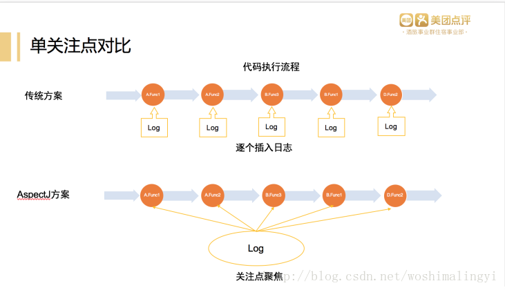
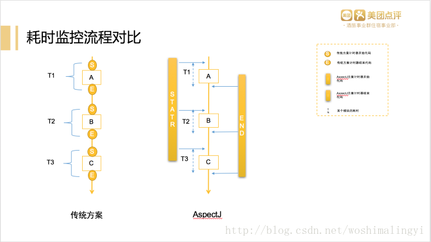
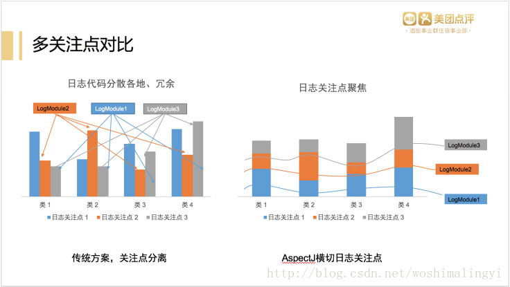
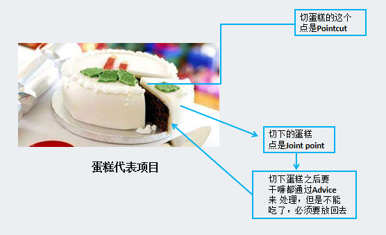
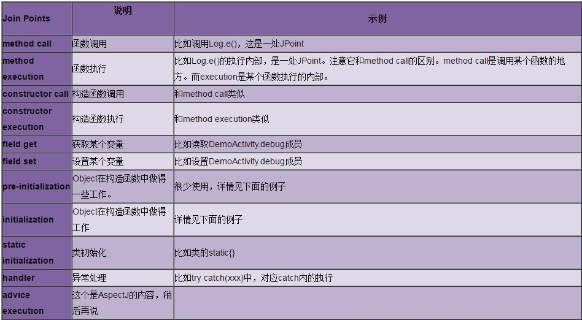
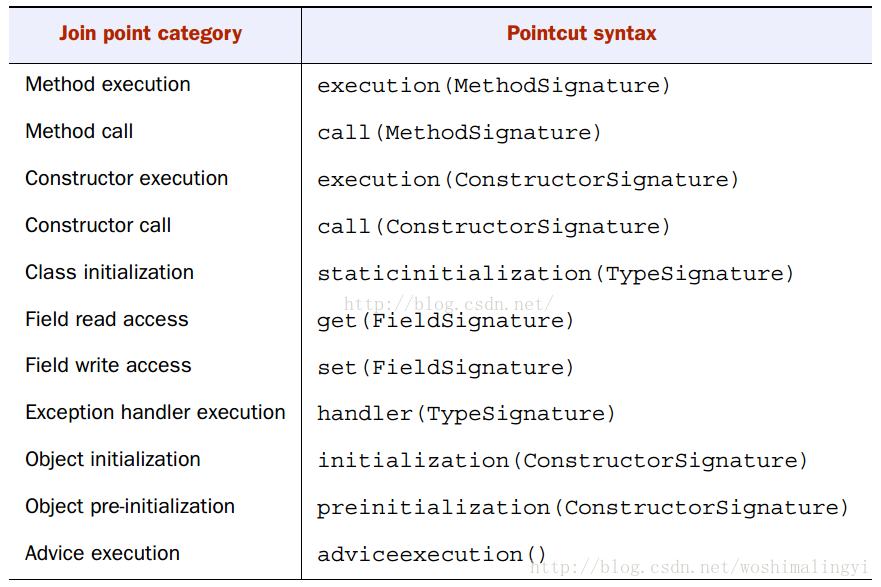
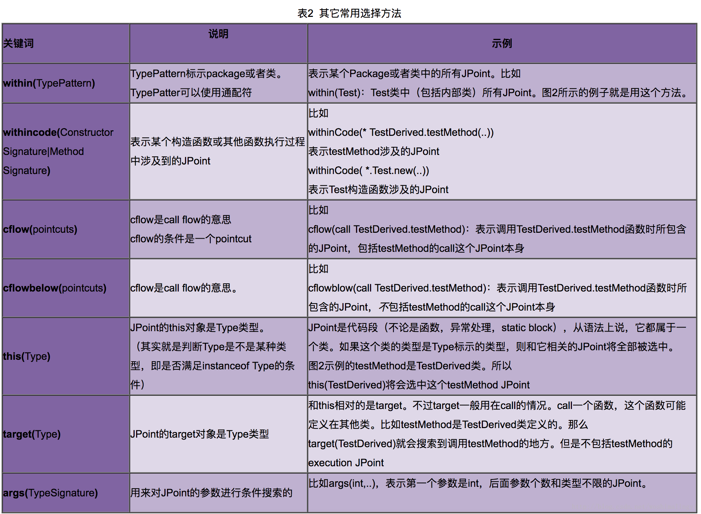
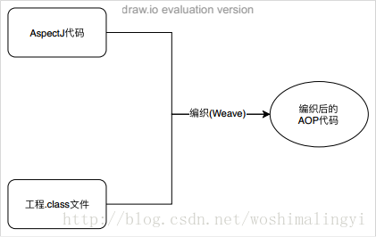
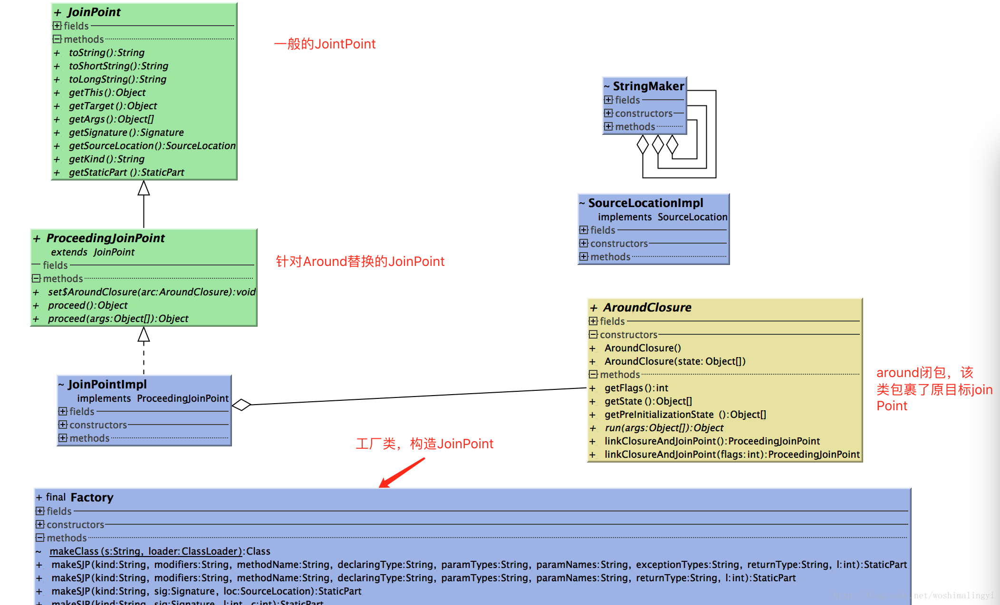

[TOC]

# AOP
AOP是OOP的延续，是软件开发中的一个热点，也是Spring框架中的一个重要内容，是函数式编程的一种衍生范型。
它是通过预编译方式和运行期间动态代理来实现程序功能的统一维护的一种技术。

## 应用场景
权限校验、日志上传、行为统计、性能监测、安全控制、务处理、异常处理等。

## 主要目标
利用AOP可以对业务逻辑的各个部分进行隔离，从而使得业务逻辑各部分之间的耦合度降低，提高程序的可重用性，同时提高了开发的效率。

## 适用对象
比较大型的项目，而且迭代较快，使用OOP太消耗内力。
有日志、性能、安全、异常处理等横切关注点需求。

## AOP与OOP的关系
OOP（面向对象编程）Object Oriented Programming
针对业务处理过程的实体及其属性和行为进行抽象封装，以获得更加清晰高效的逻辑单元划分。
但是也有它的缺点，最明显的就是关注点聚焦时，面向对象无法简单的解决这个问题，一个关注点是面向所有而不是单一的类，不受类的边界的约束，因此OOP无法将关注点聚焦来解决，只能分散到各个类中。

AOP（面向切面编程）Aspect Oriented Programming
则是针对业务处理过程中的切面进行提取，它所面对的是处理过程中的某个步骤或阶段，以获得逻辑过程中各部分之间低耦合性的隔离效果。这两种设计思想在目标上有着本质的差异。

AOP并不是与OOP对立的，而是为了弥补OOP的不足。OOP解决了竖向的问题，AOP则解决横向的问题。因为有了AOP我们的调试和监控就变得简单清晰。

1. 对比一——单一横切关注点



2. 对比二——多横切关注点


3. 结论：
| 对比项 | OOP | AOP |
| :---: | :---: | :---: |
| 日志增加 | 很大程度上依赖于工作者的细心程度和工作状态，容易出错 | AOP能够将同一个关注点聚焦在一个方法中解决！ |
| 日志修改 | 日志打印代码分散，对于修改和调试不友好 | AOP能够实现一处修改，处处生效！ |


# Android中使用@AspectJ
AspectJ是一个面向切面的框架，它扩展了Java语言。AspectJ定义了AOP语法，它有一个专门的编译器 AJC 用来生成遵守Java字节编码规范的Class文件。

在程序编译过程中通过编译器将字节码文件中织入我们自己定义的切面代码。
注意：不管使用哪种方式接入AspectJ，都需要使用AspectJ提供的代码。

AspectJ 意思就是Java的Aspect，Java的AOP。它其实不是一个新的语言，它的核心是 ajc（编译器）和 weaver（织入）。

## ajc编译器
基于Java编译器之上的，它是用来编译.aj文件，aspectj在Java编译器的基础上增加了一些它自己的关键字和方法。因此，ajc也可以编译Java代码。

## weaver织入器
为了在java编译器上使用AspectJ而不依赖于Ajc编译器，aspectJ 5出现了@AspectJ，使用注释的方式编写AspectJ代码，可以在任何Java编译器上使用。

由于AndroidStudio默认是没有ajc编译器的，所以在Android中使用@AspectJ来编写（包括SpringAOP也是如此）。它在代码的编译期间扫描目标程序，根据切点（PointCut）匹配,将开发者编写的Aspect程序编织（Weave）到目标程序的.class文件中，对目标程序作了重构（重构单位是JoinPoint），目的就是建立目标程序与Aspect程序的连接（获得执行的对象、方法、参数等上下文信息），从而达到AOP的目的。

## AspectJ 的使用
1. 
```
//项目Build.gradle加入

//aspectjtools插件
classpath 'com.hujiang.aspectjx:gradle-android-plugin-aspectjx:2.0.8'


//moudle的Build.gradle加入

apply plugin: 'com.hujiang.android-aspectjx'

implementation 'org.aspectj:aspectjrt:1.8.+'
```

2. 
要引入AspectJ到Android工程中，最重要的就是两个包：

```
//在buildscript中添加该编织器，gradle构建时就会对class文件进行编织
classpath 'org.aspectj:aspectjweaver:1.8.9'
//在dependencies中添加该依赖，提供@AspectJ语法
compile 'org.aspectj:aspectjrt:1.8.9'
```

此外还有一个工具包，用于Gradle构建时进行打日志等操作：

```
//在buildscript中添加该工具包，在构建工程的时候执行一些任务：打日志等
classpath 'org.aspectj:aspectjtools:1.8.9'

import com.android.build.gradle.LibraryPlugin
import org.aspectj.bridge.IMessage
import org.aspectj.bridge.MessageHandler
import org.aspectj.tools.ajc.Main

//打印gradle日志
android.libraryVariants.all {
    variant >
    LibraryPlugin plugin = project.plugins.getPlugin(LibraryPlugin)
    JavaCompile javaCompile = variant.javaCompile
    javaCompile.doLast {
    String[] args = ["showWeaveInfo",
        "1.5",
        "inpath", javaCompile.destinationDir.toString(),
        "aspectpath", javaCompile.classpath.asPath,
        "d", javaCompile.destinationDir.toString(),
        "classpath", javaCompile.classpath.asPath,
        "bootclasspath", 
        project.android.bootClasspath.join(
        File.pathSeparator)]
    MessageHandler handler = new MessageHandler(true);
    new Main().run(args, handler)
    def log = project.logger
    for (IMessage message : handler.getMessages(null, true)) {
        switch (message.getKind()) {
            case IMessage.ABORT:
            case IMessage.ERROR:
            case IMessage.FAIL:
                log.error message.message, message.thrown
                break;
            case IMessage.WARNING:
            case IMessage.INFO:
                log.info message.message, message.thrown
                break;
            case IMessage.DEBUG:
                log.debug message.message, message.thrown
                break;
        }
    }
    }
}
```

3. 美团RoboAspectJ
```
buildscript {
    repositories {
        mavenLocal()
    }
    dependencies {
        classpath 'com.meituan.gradle:roboaspectj:0.9.2'
        classpath 'jaop.gradle.plugin:gradleplugin:1.0.2'
    }
    // Exclude the version that the android plugin depends on.
    configurations.classpath.exclude group: 'com.android.tools.external.lombok'
}

配置参数
// AspectJ
aspectj {
    disableWhenDebug true
    javartNeeded true
    // 排除不需要AOP扫描的包
    exclude group: 'xxxx', module: 'xxxx'
    compileOptions {
        defaultJavaVersion = JavaVersion.VERSION_1_7
    }
}
```

## AspectJ 框架三大核心概念



### 切点 PointCut
告诉AspectJ你要在原有的业务逻辑的某一块织入自己的代码，织入的那个点就叫切入点。

切入点的声明决定需要切割的JoinPoint的集合，就结果上来说，它是JoinPoint的一个实际子集合。
pointcut可以控制你把哪些advice应用于jointpoint上去，通常通过正则表达式来进行匹配应用，决定了那个jointpoint会获得通知。分为call、execution、target、this、within等关键字。

AspectJ 类的切入点不能重叠，某一个会无法生效。


### 连接点 JoinPoint
连接点是切面插入应用程序的地方，该点能被方法调用，而且也会被抛出意外。连接点是应用程序提供给切面插入的地方，可以添加新的方法。比如：我们的切点可以认为是findInfo(String)方法。
AspectJ将面向对象的程序执行流程看成是JoinPoint的执行链，每一个JoinPoint是一个单独的闭包，在执行的时候将上下文环境赋予闭包执行方法体逻辑。
下面列表上的是被AspectJ认为是joinpoint的：


#### 直接针对JoinPoint的选择
pointcuts中最常用的选择条件和Joinpoint的类型密切相关，比如：


#### 间接针对 JoinPoint 的选择
除了根据前面提到的Signature信息来匹配 JoinPoint 外，AspectJ还提供其他一些选择方法来选择 JoinPoint 。比如某个类中的所有 JoinPoint ，每一个函数执行流程中所包含的 JoinPoint 。
特别强调，不论什么选择方法，最终都是为了找到目标的 JoinPoint 。
下表列出了一些常用的非 JoinPoint 选择方法：


#### 匹配规则
##### 类型匹配语法
首先让我们来了解下AspectJ类型匹配的通配符：
*：匹配任何数量字符；
..：匹配任何数量字符的重复，如在类型模式中匹配任何数量子包；而在方法参数模式中匹配任何数量参数。
+：匹配指定类型的子类型；仅能作为后缀放在类型模式后边。
AspectJ使用 且（&&）、或（||）、非（！）来组合切入点表达式。

##### 匹配模式
call(<注解？> <修饰符?> <返回值类型> <类型声明?>.<方法名>(参数列表) <异常列表>？)

精确匹配
```
//表示匹配 com.davidkuper.MainActivity类中所有被@Describe注解的public void方法。
@Pointcut("call(@Describe public void com.davidkuper.MainActivity.init(Context))")
public void pointCut(){}
```

单一模糊匹配
```
//表示匹配 com.davidkuper.MainActivity类中所有被@Describe注解的public void方法。
@Pointcut("call(@Describe public void com.davidkuper.MainActivity.*(..)) ")
public void pointCut(){}
//表示匹配调用Toast及其子类调用的show方法，不论返回类型以及参数列表，并且该子类在以com.meituan或者com.sankuai开头的包名内
@Pointcut("call(* android.widget.Toast+.show(..)) && (within(com.meituan..*)|| within(com.sankuai..*))")
public void toastShow() {
}
```

组合模糊匹配
```
//表示匹配任意Activity或者其子类的onStart方法执行，不论返回类型以及参数列表，且该类在com.meituan.hotel.roadmap包名内
@Pointcut("execution(* *..Activity+.onStart(..))&& within(com.meituan.hotel.roadmap.*)")
public void onStart(){}
```

##### 获取参数
```
//通过声明参数语法arg()显示获取参数
@Around(value = "execution(* BitmapFacade.picasso.init(java.lang.String,java.lang.String)) && args(arg1,arg2)"
public Object aroundArgs(String arg1,String arg2,ProceedingJoinPoint joinPoint){
    System.out.println("aspects arg = " + arg1.toString()+" " + arg2);
    Object resutObject = null;
    try {
        resutObject = joinPoint.proceed(new Object[]{arg1,arg2});
    } catch (Throwable e) {
        e.printStackTrace();
    }
    return resutObject;
}

//通过joinPoint.getArg()获取参数列表
@Around("execution(static * tBitmapFacade.picasso.init(..)) && !within(aspectj.*) ")
public void pointCutAround(ProceedingJoinPoint joinPoint){
    Object resutObject = null;
    try {
        //获取参数列表
        Object[] args = joinPoint.getArgs();
        resutObject = joinPoint.proceed(args);
    } catch (Throwable e) {
        e.printStackTrace();
    }
    return resutObject;
};
```

##### 异常匹配
```
/**
* 截获Exception及其子类报出的异常。
* @param e 异常参数
*/
@Pointcut("handler(java.lang.Exception+)&&args(e)")
public void handle(Exception e) {}
```

### 通知 Advice 
你要在某个切入点织入的具体的代码的业务逻辑块。典型的 Advice 类型有 before、after 和 around，
分别表示在目标方法执行之前、执行后和完全替代目标方法执行的代码。 
除了在方法中注入代码，也可能会对代码做其他修改，比如在一个class中增加字段或者接口。

advice是我们切面功能的实现，它是切点的真正执行的地方。比如像写日志到一个文件中，会在pointcut匹配到的连接点中插入advice（包括：before、after、around等）代码到应用程序中。

#### @Before、@After

Before和After的插入其实就是在匹配到的JoinPoint调用的前后插入我们编写的Before\After的 Advice 方法，以此来达到在目标JoinPoint执行之前先进入 Advice 方法，执行之后进入 Advice 方法。

```
//所有实例方法调用截获
private static final String INSTANCE_METHOD_CALL =
"call(!static * com.meituan.hotel.roadmap..*.*(..))&&target(Object)";
@Pointcut(INSTANCE_METHOD_CALL)
public void instanceMethodCall() {
}
//实例方法调用前后Advice
@Before("instanceMethodCall()")
public void beforInstanceCall(JoinPoint joinPoint) {
    printLog(joinPoint, "before instance call");
}
@After("instanceMethodCall()")
public void afterInstanceCall(JoinPoint joinPoint) {
    printLog(joinPoint, "after instance call");
}
```

#### @Around

总体来说，使用了代理+闭包的方式进行替换，将原方法体放置到新的函数中替换，通过一个单独的闭包拆分来执行，相当于对目标JoinPoint进行了一个代理。

```
//横切项目中所有Activity的子类，以Layout命名、以及它的子类的所有方法的执行
private static final String POINTCUT_METHOD =
"(execution(* android.app.Activity+.*(..)) ||execution(* *..Layout+.*(..)))&& within(com.meituan.hotel.roadmap.*)";
@Pointcut(POINTCUT_METHOD)
public void methodAnnotated() {
}
@Around("methodAnnotated()")
public Object weaveJoinPoint(ProceedingJoinPoint joinPoint)throws Throwable{
    //调用原方法的执行。
    Object result = joinPoint.proceed();
    return result;
}
```

#### @AfterThrowing
```
/**
* 在异常抛出后，该操作优先于下一个切点的@Before()
* @param joinPoint
* @param e 异常参数
*/
@AfterThrowing(pointcut = "afterThrow()",throwing = "e")
public void afterThrowing(JoinPoint joinPoint,Exception e){
    Log.e(TAG,joinPoint.getTarget().getClass().getSimpleName() + " afterThrowing() :" + e.toString());
}
```

### 执行原理
AspectJ是通过对目标工程的.class文件进行代码注入的方式将通知( Advice )插入到目标代码中。
第一步：根据pointCut切点规则匹配的joinPoint；
第二步：将 Advice 插入到目标JoinPoint中。
这样在程序运行时被重构的连接点将会回调 Advice 方法，就实现了AspectJ代码与目标代码之间的连接。


JoinPoint类包UML：



### 代码分析
下面的Example作为目标源码，我们对它的printLog()方法进行替换、对getValue()方法调用前后插入 Advice 方法。
```
public class Example {
    String value = "value";
    public void printLog() {
        String str = getValue();
    }
    public String getValue() {
        return value;
    }
}
```

切面代码:
```
@Aspect
public class LogAspect{
//所有实例方法调用截获
private static final String INSTANCE_METHOD_CALL = "call(!static * com.meituan.hotel.roadmap..*.*(..))&&target(Object)"
@Pointcut(INSTANCE_METHOD_CALL)
public void instanceMethodCall() {
}
//实例方法调用前后Advice
@Before("instanceMethodCall()")
public void beforInstanceCall(JoinPoint joinPoint) {
    printLog(joinPoint, "before instance call");
}
@After("instanceMethodCall()")
public void afterInstanceCall(JoinPoint joinPoint) {
    printLog(joinPoint, "after instance call");
}
//所有实例方法执行截获

private static final String INSTANCE_METHOD_EXECUTING = "execution(!static * com.meituan.hotel.roadmap..*.*(..))&&target(Object)"
@Pointcut(INSTANCE_METHOD_EXECUTING)
public void instanceMethodExecuting() {
}
//实例方法执行Advice
@Around("instanceMethodExecuting()")
public Object InstanceMethodExecutingAround(ProceedingJoinPoint joinPoint){
    Log.e(getClass().getSimpleName(),
    "InstanceMethodExecuting()");
    Object result = printLog(joinPoint, "instance 
    executing");
    return result;
}
```

#### 反编译后的结果
网上给的反编译过程都是apktool——>dex2jar——>jdgui，这个我用hotel_road_map的debug包试过，反编译出来的jar包里面只有几个系统类，不知道什么原因,其他的包又可以正常反编译。
推荐一个反编译工具：jadx（可以直接反编译apk）。
```
public class Example {
    private static final StaticPart ajc$tjp_0 = null;
    private static final StaticPart ajc$tjp_1 = null;
    private static final StaticPart ajc$tjp_2 = null;
    String TAG = "Example";
    String value = "value";
    static {
    ajc$preClinit();
}
//初始化连接点静态部分：方法名、参数列表、返回值、包路径等等。
private static void ajc$preClinit() {
    Factory factory = new Factory("Example.java", Example.class);
    ajc$tjp_0 = factory.makeSJP(JoinPoint.METHOD_CALL, factory.makeMethodSig("1", "getValue", "com.meituan.hotel.roadmap.Ex");
    ajc$tjp_1 = factory.makeSJP(JoinPoint.METHOD_EXECUTION, factory.makeMethodSig("1", "printLog", "com.meituan.hotel.roadm");
    ajc$tjp_2 = factory.makeSJP(JoinPoint.METHOD_EXECUTION, factory.makeMethodSig("1", "getValue", "com.meituan.hotel.roadm");
}
//原方法的闭包，在Aspect切面中joinPoint.proceed()会调用该闭包
public class AjcClosure1 extends AroundClosure {
    public AjcClosure1(Object[] objArr) {
    super(objArr);
}
public Object run(Object[] objArr) {
    Object[] objArr2 = this.state;
    Example.printLog_aroundBody0((Example) objArr2[0], (JoinPoint) objArr2[1]);
    return null;
}
//原方法真正的方法体,在闭包中被调用
 static final void printLog_aroundBody0(Example ajc$this, JoinPoint joinPoint) {
    JoinPoint makeJP = Factory.makeJP(ajc$tjp_0, ajc$this, ajc$this);
    try {
        //@Before的 Advice 被插入了目标代码调用之前
        LogAspect.aspectOf().beforInstanceCall(makeJP);
        String str = ajc$this.getValue();
    } finally {
        //@After的 Advice 被插入到目标代码调用之后,通过Finally强制执行After逻辑，每一个Before
        LogAspect.aspectOf().afterInstanceCall(makeJP);
    }
 }
//原来的printLog()方法被AspectJ给替换了，替换成为链接AspectJ和源代码的桥梁，真正的方法体被放在了新的方法中。
public void printLog() {
    //连接点构造
    JoinPoint makeJP = Factory.makeJP(ajc$tjp_1, this, this);
    //将连接点与原方法的闭包连接，这样就可以在AspectJ的JoinPoint中通过joinPoint.proceed()调用闭包执行原方法。
    LogAspect.aspectOf().InstanceMethodExecutingAround(new AjcClosure1(new Object[]{this, makeJP}).linkClosureAndJoinPoint());
}
public String getValue() {
    JoinPoint makeJP = Factory.makeJP(ajc$tjp_2, this, this);
    return (String)LogAspect
    .InstanceMethodExecutingAround(new AjcClosure3(new Object[]{this, makeJP})
    .linkClosureAndJoinPoint());
}
```

#### Before、After(AfterThrowing)插入分析
Before\After的插入调用比较简单，通过PointCut定位匹配到JoinPoint之后，将我们编写的Before\After的切面方法直接插入到目标JoinPoint前后即可。这样就可以改变原有的代码调用轨迹，在目标方法调用前后增加我们自己的AOP方法。
```
//原方法真正的方法体,在闭包中被调用
static final void printLog_aroundBody0(Example ajc$this, JoinPoint joinPoint) {
    JoinPoint makeJP = Factory.makeJP(ajc$tjp_0, ajc$this, ajc$this);
    try {
        //@Before的 Advice 被插入了目标代码调用之前
        LogAspect.aspectOf().beforInstanceCall(makeJP);
        String str = ajc$this.getValue();
    } finally {
        //@After的 Advice 被插入到目标代码调用之后,通过Finally强制执行After逻辑，每一个Before
        LogAspect.aspectOf().afterInstanceCall(makeJP);
    }
}
```

#### Around替换代码分析
JoinPoint为printLog()方法，是被Around替换的，反编译后的部分代码如下：
首先，在静态初始化的时候，通过Factory会为每一个 JoinPoint 先构造出静态部分信息StaticPart。
```
//初始化连接点静态部分：方法名、参数列表、返回值、包路径等等。
private static void ajc$preClinit() {
    Factory factory = new Factory("Example.java", Example.class);
    ajc$tjp_0 = factory.makeSJP(JoinPoint.METHOD_CALL, factory.makeMethodSig("1", "getValue", "com.meituan.hotel.roadmap.Exa"));
    ajc$tjp_1 = factory.makeSJP(JoinPoint.METHOD_EXECUTION, factory.makeMethodSig("1", "printLog", "com.meituan.hotel.roadma"));
    ajc$tjp_2 = factory.makeSJP(JoinPoint.METHOD_EXECUTION, factory.makeMethodSig("1", "getValue", "com.meituan.hotel.roadma"));
}
public JoinPoint.StaticPart makeSJP(String kind, String modifiers, String methodName, String declaringType, String paramTypes) {
    //构造方法签名实例，其中存储着方法的静态信息
    Signature sig = this.makeMethodSig(modifiers, methodName, declaringType, paramTypes, paramNames, "", returnType);
    return new JoinPointImpl.StaticPartImpl(count++, kind, sig, makeSourceLoc(l, 1));
}
```

其次，将printLog方法体替换，以XXX_aroundBodyN(args)命名，原方法体被替换如下：
```
//原来的printLog()方法被AspectJ给替换了，替换成为链接AspectJ和源代码的桥梁，真正的方法体被放在了新的方法中。
public void printLog() {
    //连接点构造
    JoinPoint makeJP = Factory.makeJP(ajc$tjp_1, this, this);
    //将连接点与原方法的闭包连接，这样就可以在AspectJ的JoinPoint中通过joinPoint.proceed()调用闭包执行原方法。
    LogAspect.aspectOf().InstanceMethodExecutingAround(new AjcClosure1(new Object[]{this, makeJP}).linkClosureAndJoinPoint());
}
```

AroundClosure闭包，将运行时对象和当前连接点JP对象传入其中，调用linkClosureAndJoinPoint()进行两端的绑定，这样在Around中就可以通过ProceedingJoinPoint.proceed()调用AroundClosure，进而调用目标方法。
```
public abstract class AroundClosure {
    protected Object[] state;
    protected Object[] preInitializationState;
    public AroundClosure() {
    }
    public AroundClosure(Object[] state) {
        this.state = state;
    }

    public ProceedingJoinPoint linkClosureAndJoinPoint() {
        //获取执行链接点，默认数组最后一个是连接点
        ProceedingJoinPoint jp = 
        (ProceedingJoinPoint)state[state.length1];
        //设置执行时闭包
        jp.set$AroundClosure(this);
        return jp;
    }
}
```

JoinPointImpl，包括一个JoinPoint的静态部分和实例部分:
```
class JoinPointImpl implements ProceedingJoinPoint {
    //JP静态部分
    static class StaticPartImpl implements    
    JoinPoint.StaticPart {
        String kind;
        Signature signature;
        SourceLocation sourceLocation;
        private int id;
        //省略
    }
    Object _this;
    Object target;
    Object[] args;
    org.aspectj.lang.JoinPoint.StaticPart staticPart;
    //省略....
    // To proceed we need a closure to proceed on
    private AroundClosure arc;
    public void set$AroundClosure(AroundClosure arc) {
        this.arc = arc;
    }
    //通过proceed()调用闭包arc的run方法，并且传入JP的执行状态：参数列表等。进而调用原方法体执行
    public Object proceed() throws Throwable {
        //when called from a before advice, but be a noop
        if (arc == null)
        return null;
        else
        return arc.run(arc.getState());
    }
    //省略....
}
```


## AspectJ 打造埋点上传功能


### 为什么要埋点？
埋点上传是为了统计分析的需要，对用户行为的每一个事件进行埋点布置，并对这些数据结果进行分析，进一步优化产品或指导运营。


对于移动端的App来说， 分析的数据大致上都可以分为俩种， 一种是在线数据，一种是离线数据。

在线数据
即App后端服务所产生的日志数据，例如服务接口的性能数据， 服务接口的调用及其参数等， 
通过服务端的日志数据， 我们不但可以统计服务接口的性能指标，还可以针对具体的业务逻辑，做相关的分析，
一些常见的App分析指标如新增，活跃，累计，留存等，也都可以通过服务日志来统计出来。

离线数据
即是App客户端本身产生的数据， 这种情况一般是发生在客户端不调用底层服务的情况下，需要了解用户在客户端的行为，就需要用到离线数据。 
离线日志一般记录用户在客户端的具体行为，如用户在客户端的拖动，上下滚动，翻页等不涉及到后端服务的操作，以及App本身的崩溃行为产生的数据， 都可以被记录， 一般的，记录的内容包括事件类型，控件编号，控件属性及相关参数，事件时间等。


### 埋点上传的三种方式？
1. 传统埋点

开发者直接在客户端埋点。

优点： 开发者可以随意的在任何地方添加埋点。
缺点： 成本高，每次埋点的增删改都需要发版，很难控制。


2. 可视化埋点

首先埋点服务平台与埋点客户机做关联， 包括客户机包含的埋点模块扫描当前整个客户端页面的控件，形成控件树，并将当前页面截图，发送给埋点服务端平台。然后服务器通过发送页面位置来进行控件埋点。

优点： 开发者可以精准的添加埋点。
缺点： 埋点成本高，而且只要界面发生改变就容易失去精准度。


3. 无埋点

所谓的无埋点，其实也就是全埋点，  实现原理也很简单， 客户端添加扫描代码， 为每个扫描到的控件添加监听事件。 当事件被触发后，记录日志。

优点： 开发者开发成本低，维护容易。
缺点：有时候要获取到想要的数据，可能要使用一些特殊的手段。


