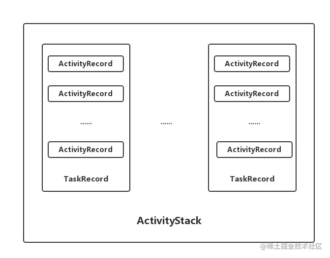

[TOC]

# AMS

## AMS是一个java对象
从java角度来看，AMS就是一个java对象，实现了Ibinder接口，所以它是一个用于进程之间通信的接口，这个对象初始化是在systemServer.java 的run()方法里面
```Java
public Lifecycle(Context context) { 
    super(context);
    mService = new ActivityManagerService(context); 
}
```


## AMS是一个服务

ActivityManagerService从名字就可以看出，它是一个服务，用来管理Activity，而且是一个系统服务，就是包管理服务，电池管理服务，震动管理服务等。
ActivityManagerService是Android系统中一个特别重要的系统服务，也是我们上层APP打交道最多的系统服务之一。ActivityManagerService（以下简称AMS） 主要负责四大组件的启动、切换、调度以及应用进程的管理和调度工作。所有的APP应用都需要与AMS打交道
Activity Manager的组成主要分为以下几个部分：

服务代理：由ActivityManagerProxy实现，用于与Server端提供的系统服务进行进程间通信
服务中枢：ActivityManagerNative继承自Binder并实现IActivityManager，它提供了服务接口和Binder接口的相互转化功能，并在内部存储服务代理对像，并提供了getDefault方法返回服务代理
Client：由ActivityManager封装一部分服务接口供Client调用。ActivityManager内部通过调用ActivityManagerNative的getDefault方法，可以得到一个ActivityManagerProxy对像的引用，进而通过该代理对像调用远程服务的方法
Server:由ActivityManagerService实现，提供Server端的系统服务


## AMS是一个Binder

AMS实现了Ibinder接口，所以它是一个Binder，这意味着他不但可以用于进程间通信，还是一个线程，因为一个Binder就是一个线程。
如果我们启动一个hello World安卓应用程序，里面不另外启动其他线程，这个里面最少要启动4个线程

main线程，只是程序的主线程，也是日常用到的最多的线程，也叫UI线程，因为android的组件是非线程安全的，所以只允许UI/MAIN线程来操作。

GC线程，java有垃圾回收机制，每个java程序都有一个专门负责垃圾回收的线程，

Binder1 就是我们的ApplicationThread，这个类实现了Ibinder接口，用于进程之间通信，具体来说，就是我们程序和AMS通信的工具

Binder2 就是我们的ViewRoot.W对象，他也是实现了IBinder接口，就是用于我们的应用程序和wms通信的工具。
```Java
public class ActivityManagerService extends IActivityManager.Stub implements Watchdog.Monitor, BatteryStatsImpl.BatteryCallback {}
```


## ActivityManagerService 的启动过程
AMS是在SystemServer中被添加的， 所以先到SystemServer中查看初始化
```Java
public static void main(String[] args) {
    new SystemServer().run(); 
}

private void run() {
    try {
        ...
            createSystemContext(); 
        // Create the system service manager.
        mSystemServiceManager = new SystemServiceManager(mSystemContext);
        mSystemServiceManager.setStartInfo(mRuntimeRestart,mRuntimeStartElapsedTime,mRuntimeStartUptime);
        LocalServices.addService(SystemServiceManager.class, mSystemServiceManager); 
        // Prepare the thread pool for init tasks that can be parallelized
        SystemServerInitThreadPool.get(); 
    } 
    finally {
        traceEnd();// InitBeforeStartServices 
    }// Start services. 
    try {
        traceBeginAndSlog("StartServices");
        startBootstrapServices();
        startCoreServices();
        startOtherServices();
        SystemServerInitThreadPool.shutdown();
    } catch (Throwable ex) { 
        throw ex; 
    } finally {
        traceEnd(); 
    }
    ... 
    // Loop forever. 
    Looper.loop(); 
    throw new RuntimeException("Main thread loop unexpectedly exited"); 
}
```
在SystemServer中，在startBootstrapServices()中去启动了AMS
```Java
private void startBootstrapServices() {
    ...
    // Activity manager runs the show. 
    traceBeginAndSlog("StartActivityManager"); 
    //启动了AMS
    mActivityManagerService = mSystemServiceManager.startService( ActivityManagerService.Lifecycle.class).getService();
    mActivityManagerService.setSystemServiceManager(mSystemServiceManager);
    mActivityManagerService.setInstaller(installer); traceEnd(); 
    ... 
    // Now that the power manager has been started, let the activity manager
    // initialize power management features. 
    traceBeginAndSlog("InitPowerManagement"); 
    mActivityManagerService.initPowerManagement(); 
    traceEnd(); 
    // Set up the Application instance for the system process and get started. 
    traceBeginAndSlog("SetSystemProcess");
    mActivityManagerService.setSystemProcess();
    traceEnd(); 
}
```

AMS是通过SystemServiceManager.startService去启动的，参数是ActivityManagerService.Lifecycle.class， 首先看看startService方法
```Java
public <T extends SystemService> T startService(Class<T> serviceClass) {
    try {
        final String name = serviceClass.getName();
        Slog.i(TAG, "Starting " + name);
        Trace.traceBegin(Trace.TRACE_TAG_SYSTEM_SERVER, "StartService " + name);

        // Create the service.
        if (!SystemService.class.isAssignableFrom(serviceClass)) {
            throw new RuntimeException("Failed to create " + name
                    + ": service must extend " + SystemService.class.getName());
        }
        final T service;
        try {
            Constructor<T> constructor = serviceClass.getConstructor(Context.class);
            service = constructor.newInstance(mContext);
        } catch (InstantiationException ex) {
            throw new RuntimeException("Failed to create service " + name
                    + ": service could not be instantiated", ex);
        } catch (IllegalAccessException ex) {
            throw new RuntimeException("Failed to create service " + name
                    + ": service must have a public constructor with a Context argument", ex);
        } catch (NoSuchMethodException ex) {
            throw new RuntimeException("Failed to create service " + name
                    + ": service must have a public constructor with a Context argument", ex);
        } catch (InvocationTargetException ex) {
            throw new RuntimeException("Failed to create service " + name
                    + ": service constructor threw an exception", ex);
        }

        startService(service);
        return service;
    } finally {
        Trace.traceEnd(Trace.TRACE_TAG_SYSTEM_SERVER);
    }
}

public void startService(@NonNull final SystemService service) {
    // Register it.
    mServices.add(service);
    // Start it.
    long time = SystemClock.elapsedRealtime();
    try {
        service.onStart();
    } catch (RuntimeException ex) {
        throw new RuntimeException("Failed to start service " + service.getClass().getName()
                + ": onStart threw an exception", ex);
    }
    warnIfTooLong(SystemClock.elapsedRealtime() - time, service, "onStart");
}
```

startService方法很简单，是通过传进来的class然后反射创建对应的service服务。所以此处创建的是Lifecycle的实例， 然后通过startService启动了AMS服务
那我们再去看看ActivityManagerService.Lifecycle这个类的构造方法
```Java
public static final class Lifecycle extends SystemService {
    private final ActivityManagerService mService;
    private static ActivityTaskManagerService sAtm;

    public Lifecycle(Context context) {
        super(context);
        mService = new ActivityManagerService(context, sAtm);
    }

    public static ActivityManagerService startService(
            SystemServiceManager ssm, ActivityTaskManagerService atm) {
        sAtm = atm;
        return ssm.startService(ActivityManagerService.Lifecycle.class).getService();
    }

    @Override
    public void onStart() {
        mService.start();
    }

    @Override
    public void onBootPhase(int phase) {
        mService.mBootPhase = phase;
        if (phase == PHASE_SYSTEM_SERVICES_READY) {
            mService.mBatteryStatsService.systemServicesReady();
            mService.mServices.systemServicesReady();
        } else if (phase == PHASE_ACTIVITY_MANAGER_READY) {
            mService.startBroadcastObservers();
        } else if (phase == PHASE_THIRD_PARTY_APPS_CAN_START) {
            mService.mPackageWatchdog.onPackagesReady();
        }
    }

    @Override
    public void onUserStopped(@NonNull TargetUser user) {
        mService.mBatteryStatsService.onCleanupUser(user.getUserIdentifier());
    }

    public ActivityManagerService getService() {
        return mService;
    }
}
```

再来看看AMS初始化做了什么
```Java
    public ActivityManagerService(Injector injector, ServiceThread handlerThread) {
        final boolean hasHandlerThread = handlerThread != null;
        mInjector = injector;
        mContext = mInjector.getContext();
        mUiContext = null;
        mAppErrors = null;
        mPackageWatchdog = null;
        mAppOpsService = mInjector.getAppOpsService(null /* file */, null /* handler */);
        mBatteryStatsService = null;
        mHandler = hasHandlerThread ? new MainHandler(handlerThread.getLooper()) : null;
        mHandlerThread = handlerThread;//创建Handler线程，用来处理handler消息
        //管理AMS的一些常量，厂商定制系统就可能修改此处
        mConstants = hasHandlerThread
                ? new ActivityManagerConstants(mContext, this, mHandler) : null;
        final ActiveUids activeUids = new ActiveUids(this, false /* postChangesToAtm */);
        mPlatformCompat = null;
        mProcessList = injector.getProcessList(this);
        mProcessList.init(this, activeUids, mPlatformCompat);
        mAppProfiler = new AppProfiler(this, BackgroundThread.getHandler().getLooper(), null);
        mPhantomProcessList = new PhantomProcessList(this);
        mOomAdjuster = hasHandlerThread
                ? new OomAdjuster(this, mProcessList, activeUids, handlerThread) : null;

        mIntentFirewall = hasHandlerThread
                ? new IntentFirewall(new IntentFirewallInterface(), mHandler) : null;
        mProcessStats = null;
        mCpHelper = new ContentProviderHelper(this, false);
        // For the usage of {@link ActiveServices#cleanUpServices} that may be invoked from
        // {@link ActivityTaskSupervisor#cleanUpRemovedTaskLocked}.
        mServices = hasHandlerThread ? new ActiveServices(this) : null;
        mSystemThread = null;
        mUiHandler = injector.getUiHandler(null /* service */);//处理ui相关msg的Handler
        mUidObserverController = new UidObserverController(mUiHandler);
        mUserController = hasHandlerThread ? new UserController(this) : null;
        mPendingIntentController = hasHandlerThread
                ? new PendingIntentController(handlerThread.getLooper(), mUserController,
                        mConstants) : null;
        mProcStartHandlerThread = null;
        mProcStartHandler = null;
        mHiddenApiBlacklist = null;
        mFactoryTest = FACTORY_TEST_OFF;
        mUgmInternal = LocalServices.getService(UriGrantsManagerInternal.class);
        mInternal = new LocalService();
        mPendingStartActivityUids = new PendingStartActivityUids(mContext);
        mUseFifoUiScheduling = false;
        mEnableOffloadQueue = false;
        //初始化管理前台、后台广播的队列， 系统会优先遍历发送前台广播
        mFgBroadcastQueue = mBgBroadcastQueue = mOffloadBroadcastQueue = null;
    }

private void start() {
    removeAllProcessGroups();

    mBatteryStatsService.publish();
    mAppOpsService.publish();
    Slog.d("AppOps", "AppOpsService published");
    LocalServices.addService(ActivityManagerInternal.class, mInternal);
    LocalManagerRegistry.addManager(ActivityManagerLocal.class,
            (ActivityManagerLocal) mInternal);
    mActivityTaskManager.onActivityManagerInternalAdded();
    mPendingIntentController.onActivityManagerInternalAdded();
    mAppProfiler.onActivityManagerInternalAdded();
}
```

然后来看看 setSystemProcess 干了什么事情
```Java
public void setSystemProcess() {
    try {
        ServiceManager.addService(Context.ACTIVITY_SERVICE, this, /* allowIsolated= */ true,
                DUMP_FLAG_PRIORITY_CRITICAL | DUMP_FLAG_PRIORITY_NORMAL | DUMP_FLAG_PROTO);
        ServiceManager.addService(ProcessStats.SERVICE_NAME, mProcessStats);
        ServiceManager.addService("meminfo", new MemBinder(this), /* allowIsolated= */ false,
                DUMP_FLAG_PRIORITY_HIGH);
        ServiceManager.addService("gfxinfo", new GraphicsBinder(this));
        ServiceManager.addService("dbinfo", new DbBinder(this));
        mAppProfiler.setCpuInfoService();
        ServiceManager.addService("permission", new PermissionController(this));
        ServiceManager.addService("processinfo", new ProcessInfoService(this));
        ServiceManager.addService("cacheinfo", new CacheBinder(this));

        ApplicationInfo info = mContext.getPackageManager().getApplicationInfo(
                "android", STOCK_PM_FLAGS | MATCH_SYSTEM_ONLY);
        mSystemThread.installSystemApplicationInfo(info, getClass().getClassLoader());

        synchronized (this) {
            ProcessRecord app = mProcessList.newProcessRecordLocked(info, info.processName,
                    false,
                    0,
                    new HostingRecord("system"));
            app.setPersistent(true);
            app.setPid(MY_PID);
            app.mState.setMaxAdj(ProcessList.SYSTEM_ADJ);
            app.makeActive(mSystemThread.getApplicationThread(), mProcessStats);
            addPidLocked(app);
            updateLruProcessLocked(app, false, null);
            updateOomAdjLocked(OomAdjuster.OOM_ADJ_REASON_NONE);
        }
    } catch (PackageManager.NameNotFoundException e) {
        throw new RuntimeException(
                "Unable to find android system package", e);
    }

    // Start watching app ops after we and the package manager are up and running.
    mAppOpsService.startWatchingMode(AppOpsManager.OP_RUN_IN_BACKGROUND, null,
            new IAppOpsCallback.Stub() {
                @Override public void opChanged(int op, int uid, String packageName) {
                    if (op == AppOpsManager.OP_RUN_IN_BACKGROUND && packageName != null) {
                        if (getAppOpsManager().checkOpNoThrow(op, uid, packageName)
                                != AppOpsManager.MODE_ALLOWED) {
                            runInBackgroundDisabled(uid);
                        }
                    }
                }
            });

    final int[] cameraOp = {AppOpsManager.OP_CAMERA};
    mAppOpsService.startWatchingActive(cameraOp, new IAppOpsActiveCallback.Stub() {
        @Override
        public void opActiveChanged(int op, int uid, String packageName, String attributionTag,
                boolean active, @AttributionFlags int attributionFlags,
                int attributionChainId) {
            cameraActiveChanged(uid, active);
        }
    });
}
```


1. 注册服务。首先将ActivityManagerService注册到ServiceManager中，其次将几个与系统性能调试相关的服务注册到ServiceManager。

2. 查询并处理ApplicationInfo。首先调用PackageManagerService的接口，查询包名为android的应用程序的ApplicationInfo信息，对应于framework-res.apk。然后以该信息为参数调用ActivityThread上的installSystemApplicationInfo方法。

3. 创建并处理ProcessRecord。调用ActivityManagerService上的newProcessRecordLocked，创建一个ProcessRecord类型的对象，并保存该对象的信息


## 与Activity管理有关的数据结构
### ActivityRecord
源码中的注释介绍：An entry in the history stack, representing an activity.
翻译：历史栈中的一个条目，代表一个activity。

```Java
/**
 * An entry in the history stack, representing an activity. 
 */ 
final class ActivityRecord extends ConfigurationContainer implements AppWindowContainerListener {
    final ActivityManagerService service; // owner 
    final IApplicationToken.Stub appToken; // window manager token 
    AppWindowContainerController mWindowContainerController; 
    final ActivityInfo info; // all about me 
    final ApplicationInfo appInfo; // information about activity's app 
    //省略其他成员变量
    //ActivityRecord所在的TaskRecord
    private TaskRecord task; // the task this is in. 
    //构造方法，需要传递大量信息 
    ActivityRecord(ActivityManagerService _service, ProcessRecord _caller, int _launchedFromPid, int _launchedFromUid, String _launchedFromPackage, Intent _intent, String _resolvedType, ActivityInfo aInfo, Configuration _configuration, com.android.server.am.ActivityRecord _resultTo, String _resultWho, int _reqCode, boolean _componentSpecified, boolean _rootVoiceInteraction, ActivityStackSupervisor supervisor, ActivityOptions options, com.android.server.am.ActivityRecord sourceRecord) {}
}
```
ActivityRecord中存在着大量的成员变量，包含了一个Activity的所有信息。ActivityRecord中的成员变量task表示其所在的TaskRecord，由此可以看出：ActivityRecord与TaskRecord建立了联系

\frameworks\base\services\core\java\com\android\server\am\ActivityStarter.java
```Java
private int startActivity(IApplicationThread caller, Intent intent, Intent ephemeralIntent, String resolvedType, ActivityInfo aInfo, ResolveInfo rInfo, IVoiceInteractionSession voiceSession, IVoiceInteractor voiceInteractor, IBinder resultTo, String resultWho, int requestCode, int callingPid, int callingUid, String callingPackage, int realCallingPid, int realCallingUid, int startFlags, SafeActivityOptions options, boolean ignoreTargetSecurity, boolean componentSpecified, ActivityRecord[] outActivity, TaskRecord inTask, boolean allowPendingRemoteAnimationRegistryLookup) {
    ActivityRecord r = new ActivityRecord(mService, callerApp, callingPid, callingUid, callingPackage, intent, resolvedType, aInfo, mService.getGlobalConfiguration(), resultRecord, resultWho, requestCode, componentSpecified, voiceSession != null, mSupervisor, checkedOptions, sourceRecord);
}
```

### TaskRecord
TaskRecord，内部维护一个 ArrayList 用来保存ActivityRecord。

\frameworks\base\services\core\java\com\android\server\am\TaskRecord.java
```Java
class TaskRecord extends ConfigurationContainer implements TaskWindowContainerListener {
    final int taskId; //任务ID
    final ArrayList<ActivityRecord> mActivities; //使用一个ArrayList来保存所有的 ActivityRecord
    private ActivityStack mStack; //TaskRecord所在的ActivityStack */
    TaskRecord(ActivityManagerService service, int _taskId, Intent _intent, Intent _affinityIntent, String _affinity, String _rootAffinity, ComponentName _realActivity, ComponentName _origActivity, boolean _rootWasReset, boolean _autoRemoveRecents, boolean _askedCompatMode, int _userId, int _effectiveUid, String _lastDescription, ArrayList<ActivityRecord> activities, long lastTimeMoved, boolean neverRelinquishIdentity,TaskDescription _lastTaskDescription, int taskAffiliation, int prevTaskId, int nextTaskId, int taskAffiliationColor, int callingUid, String callingPackage, int resizeMode, boolean supportsPictureInPicture, boolean _realActivitySuspended, boolean userSetupComplete, int minWidth, int minHeight) { } 
    //添加Activity到顶部 
    void addActivityToTop(com.android.server.am.ActivityRecord r) { 
        addActivityAtIndex(mActivities.size(), r); 
    }
    //添加Activity到指定的索引位置 
    void addActivityAtIndex(int index, ActivityRecord r) {
        //... 
        r.setTask(this);//为ActivityRecord设置TaskRecord，就是这里建立的联系 
        //... 
        index = Math.min(size, index); 
        mActivities.add(index, r);//添加到mActivities 
        //...
    } 
}
```

可以看到ActivityStack使用了一个ArrayList来保存TaskRecord。另外，ActivityStack中还持有ActivityStackSupervisor对象，这个是用来管理ActivityStacks的。
ActivityStack是由ActivityStackSupervisor来创建的，实际ActivityStackSupervisor就是用来管理ActivityStack的
ActivityStackSupervisor
ActivityStackSupervisor，顾名思义，就是用来管理ActivityStack的

frameworks/base/services/core/java/com/android/server/am/ActivityStackSupervisor.java
```Java
public class ActivityStackSupervisor extends ConfigurationContainer implements DisplayListener { 
    ActivityStack mHomeStack;//管理的是Launcher相关的任务 
    ActivityStack mFocusedStack;//管理非Launcher相关的任务 
    //创建ActivityStack 
    ActivityStack createStack(int stackId, ActivityStackSupervisor.ActivityDisplay display, boolean onTop) {
        switch (stackId) { 
            case PINNED_STACK_ID: //PinnedActivityStack是ActivityStack的子类 
                return new PinnedActivityStack(display, stackId, this, mRecentTasks, onTop); 
            default: 
                //创建一个ActivityStack
                return new ActivityStack(display, stackId, this, mRecentTasks, onTop);
        }
    }
}
```

ActivityStackSupervisor内部有两个不同的ActivityStack对象：mHomeStack、mFocusedStack，用来
管理不同的任务。
ActivityStackSupervisor内部包含了创建ActivityStack对象的方法。
AMS初始化时会创建一个ActivityStackSupervisor对象


## AMS 面试题

### 简述ActivityManagerService的作用，什么时候初始化？
ActivityManagerService 主要负责系统中四大组件的启动、切换、调度及应用进程的管理和调度等工作，其职责与操作系统中的进程管理和调度模块类似。
ActivityManagerService进行初始化的时机很明确，就是在SystemServer进程开启的时候，就会初始化ActivityManagerService， 可以在SystemServer类中找到相关的启动代码。


### 简述ActivityThread和ApplicationThread，以及关系和区别
ActivityThread
ActivityThread在Android中代表Android的主线程，但是并不是一个Thread类。ActivityThread类是Android 进程的初始类，它的main函数是这个App进程的入口。当创建完新进程之后，main函数被加载，然后执行一个loop的循环使当前线程进入消息循环。
ApplicationThread
ApplicationThread是ActivityThread的内部类， 是一个Binder对象。在此处它是作为IApplicationThread对象的server端等待client端的请求然后进行处理，最大的client就是AMS。
首先，我们看一下Activity的启动逻辑过程：Applicationthread的ScheduleActivity通过一个叫H的Handler发送了一个启动Activity信息。handleLaunchActivity接收了这个消息，然后做处理，处理的逻辑是让PreformLaunchActivity处理，并最终执行Activity的启动。


### Instrumentation是什么，和ActivityThread是什么关系
Instrumentation 是Android系统中一系列控制方法的集合(hook),这些方法可以在正常的生命周期之外控制Android控件的运行，也可以控制Andoroid如何加载应用程序。
1. AMS与ActivityThread之间诸如Activity的创建、暂停等的交互工作都是由Instrumentation操作的。
2. 并且每个Activity都持有一个Instrumentation对象的一个引用， 整个进程中是只有一个Instrumentation。
3. mInstrumentation的初始化在ActivityThread::handleBindApplication函数。
4. 当startActivity 或者 startActivityForResult()调用之后，实际上还是调用了mInstrumentation.execStartActivity()。
5. 可以用来独立地控制某个组件的生命周期。
6. mInstrumentation 调用用 AMS , AMS 通过 socket 通信告知 Zygote 进程 fork 子进程。

它们之间的关系如下：
AMS是大BOSS资本，负责指挥和调度的，ActivityThread是企业老板，虽然说企业的事自己说了算，但是需要听从AMS的指挥，而Instrumentation则是CTO，负责项目的大事小事，但是一般不抛头露面，听老板ActivityThread的安排。


### ActivityManagerService和zygote进程通信是如何实现的
应用启动时，Launcher进程请求AMS，AMS发送创建应用进程请求，Zygote进程接受请求并fork应用进程。而AMS发送创建应用进程请求调用的是 ZygoteState.connect() 方法，ZygoteState 是 ZygoteProcess 的内部类。
```Java
public static ZygoteState connect(LocalSocketAddress address) throws IOException {
          DataInputStream zygoteInputStream = null;
          BufferedWriter zygoteWriter = null;
          final LocalSocket zygoteSocket = new LocalSocket();
           try {
              zygoteSocket.connect(address);
               zygoteInputStream = new DataInputStream(zygoteSocket.getInputStream());
               zygoteWriter = new BufferedWriter(new OutputStreamWriter(
                      zygoteSocket.getOutputStream()), 256);
          } catch (IOException ex) {
              try {
                  zygoteSocket.close();
              } catch (IOException ignore) {
              }
               throw ex;
          }
           return new ZygoteState(zygoteSocket, zygoteInputStream, zygoteWriter,
                  Arrays.asList(abiListString.split(",")));
      }
```

Zygote 处理客户端请求：Zygote 服务端接收到参数之后调用 ZygoteConnection.processOneCommand() 处理参数，并 fork 进程。
最后通过 findStaticMain() 找到 ActivityThread 类的 main() 方法并执行，子进程就这样启动了。


### ActivityRecord、TaskRecord和ActivityStack
Android AMS主要石负责系统中四大组件的启动、切换、调度及应用进程的管理和调度等工作，其职责与操作系统中的进程管理和调度模块相类似。
在7.0及之前，AMS通过代理模式来完成Binder通信，而在8.0之后，AMS通过AIDL完成Binder通信。而在通过AIDL完成Binder通信时，会涉及ActivityRecord、TaskRecord和ActivityStack三个对象。
下面我们看几个概念：
ActivityRecord
Activity管理的最小单位，它对应着一个用户界面。ActivityRecord是应用层Activity组件在AMS中的代表，每一个在应用中启动的Activity，在AMS中都有一个ActivityRecord实例来与之对应，这个ActivityRecord伴随着Activity的启动而创建，也伴随着Activity的终止而销毁。
TaskRecord
TaskRecord即任务栈， 每一个TaskRecord都可能存在一个或多个ActivityRecord，栈顶的ActivityRecord表示当前可见的界面。一个App是可能有多个TaskRecord存在。
一般情况下，启动App的第一个activity时，AMS为其创建一个TaskRecord任务栈。特殊情况，启动singleTask的Activity，而且为该Activity指定了和包名不同的taskAffinity， 也会为该activity创建一个新的TaskRecord。
ActivityStack
ActivityStack,ActivityStack是系统中用于管理TaskRecord的,内部维护了一个ArrayList。ActivityStackSupervisor内部有两个不同的ActivityStack对象：mHomeStack、mFocusedStack，用来管理不同的任务。我们启动的App对应的TaskRecord由非Launcher ActivityStack管理，它是在系统启动第一个app时创建的。




### ActivityManager、ActivityManagerService、ActivityManagerNative的关系
ActivityManager
ActivityManager服务是对Activity管理、运行时功能管理和运行时数据结构的封装，进程(Process)、应用程序、服务(Service)、任务(Task)信息等。
ActivityManagerService
是与系统所有正在运行着的Acitivity进行交互，对系统所有运行中的Activity相关信息（Task，Memory，Service，App）进行管理和维护。
ActivityManagerService/ActivityManagerProxy
ActivityManagerNative是个抽象类，真正发挥作用的是它的子类ActivityManagerService。ActivityManagerProxy代理类是ActivityManagerNative的内部类；ActivityManager持有的是这个ActivityManagerPorxy代理对象，这样，只需要操作这个代理对象就能操作其业务实现的方法。那么真正实现其也业务的则是在ActivityManagerService中。
不过，ActivityManagerNative在API 26 已经过时了，现在对Activity的管理都使用的是ActivityManager。


