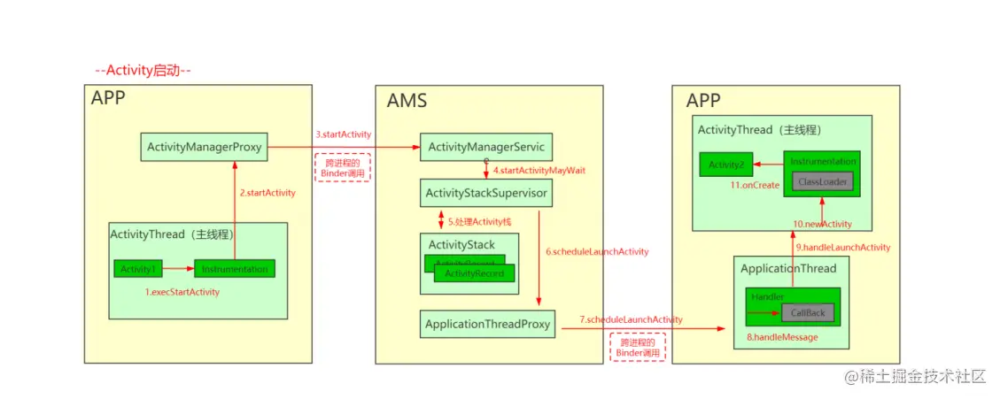
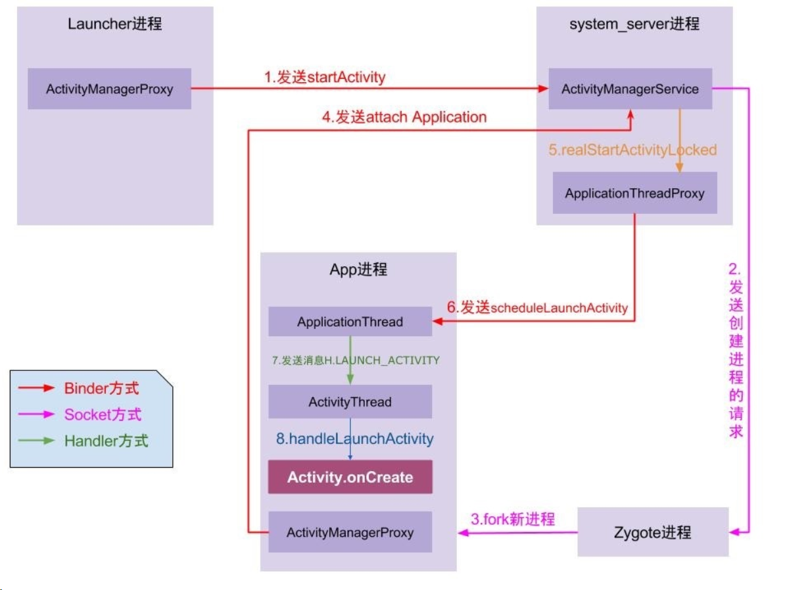
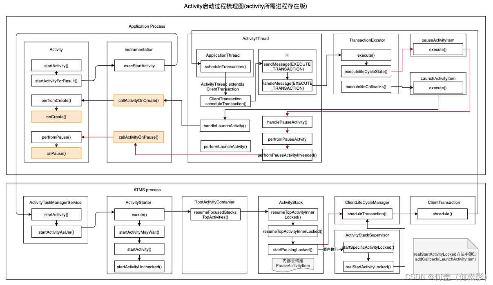
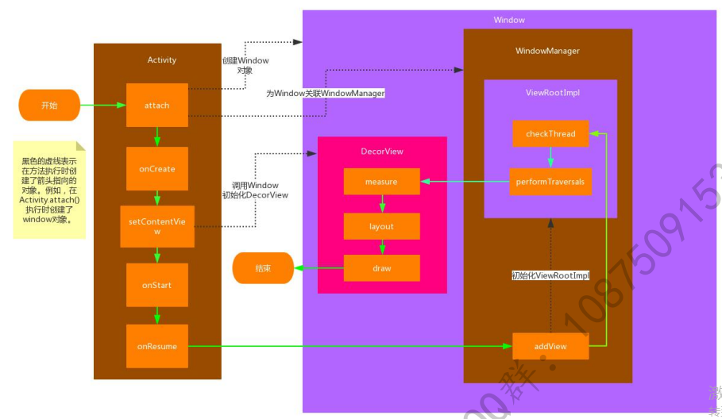
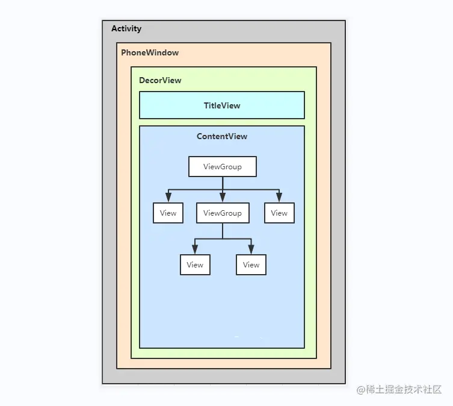

[TOC]

# Activity

界面表达    Layout
界面绘制
界面跳转    WindowManagerService
界面缓存    WindowManagerGlobal
界面管理

界面跳转 和 Activity 跳转 是分开的。

## 应用启动流程

### Android 9
https://juejin.cn/post/7061882105600409637

1. Launcher进程请求AMS
点击图标发生在 Launcher 应用的进程,实际上执行的是 Launcher 的 onClick 方法，在 onClick 里面会执行到Activity 的 startActivity 方法。 startActivity 会调用 mInstrumentation.execStartActivity(); execStartActivity 通过 ActivityManager 的 getService 方法来得到 AMS 的代理对象( Launcher 进程作为客户端与服务端 AMS 不在同一个进程, ActivityManager.getService 返回的是 IActivityManager.Stub 的代理对象,此时如果要实现客户端与服务端进程间的通信， 需要 AMS 继承 IActivityManager.Stub 类并实现相应的方法,这样Launcher进程作为客户端就拥有了服务端AMS的代理对象，然后就可以调用AMS的方法来实现具体功能了)

2. AMS发送创建应用进程请求，Zygote进程接受请求并fork应用进程
AMS 通过 socket 通信告知 Zygote 进程 fork 子进程。应用进程启动 ActivityThread ,执行 ActivityThread 的 main 方法。main 方法中创建 ApplicationThread ， Looper ， Handler 对象，并开启主线程消息循环 Looper.loop()

3. App进程通过Binder向AMS(sytem_server)发起 attachApplication 请求,AMS绑定ApplicationThread
在 ActivityThread 的 main 中,通过 ActivityThread.attach(false, startSeq) ,将 AMS 绑定ApplicationThread 对象,这样 AMS 就可以通过这个代理对象 来控制应用进程。

4. AMS发送启动Activity的请求
system_server 进程在收到请求后，进行一系列准备工作后，再通过 binder 向App进程发送scheduleLaunchActivity 请求； AMS 将启动 Activity 的请求发送给 ActivityThread 的 Handler 。

5. ActivityThread的Handler处理启动Activity的请求
App 进程的 binder 线程（ ApplicationThread ）在收到请求后，通过 handler 向主线程发送 LAUNCH_ACTIVITY消息； 主线程在收到 Message 后，通过发射机制创建目标 Activity ，并回调 Activity.onCreate() 等方法。 到此， App 便正式启动，开始进入 Activity 生命周期，执行完 onCreate/onStart/onResume 方法， UI 渲染结束后便可以看到 App 的主界面。

### Android 10

https://cloud.tencent.com/developer/article/2211299

https://blog.csdn.net/qq_18420641/article/details/126816567

https://blog.csdn.net/qq_18420641/article/details/126749948?csdn_share_tail=%7B%22type%22%3A%22blog%22%2C%22rType%22%3A%22article%22%2C%22rId%22%3A%22126749948%22%2C%22source%22%3A%22qq_18420641%22%7D

Activity # startActivity
Activity # startActivityForResult
Instrumentation # execStartActivity // 在Android10之前，是交给AMS进行处理，随后交给ATMS处理，而Android10之后，直接交给ATMS进行处理
ActivityTaskManagerService # startActivity
ActivityTaskManagerService # startActivityAsUser
ActivityStarter # execute
ActivityStarter # startActivityMayWait
ActivityStarter # startActivity
ActivityStarter # startActivityUnchecked
ActivityStack # startActivityLocked
ActivityStack # ensureActivitiesVisibleLocked
ActivityRecord # makeClientVisible
ActivityRecord # makeActiveIfNeeded
ActivityStack # resumeTopActivityUncheckedLocked
ActivityStack # resumeTopActivityInnerLocked
ActivityStackSupervisor # startSpecificActivityLocked
ActivityStackSupervisor # realStartActivityLocked
ClientLifecycleManager # scheduleTransaction 在这里会去获取ActivityTaskManagerService的LifecycleManager对象，去执行事务
ClientTransaction # schedule()
IApplicationThread(ApplicationThread为该aidl接口的实现类) # scheduleTransaction
ActivityThread(ClientTransactionHandler为ActivityThread的父类，交由其父类处理) # scheduleTransaction
ClientTransactionHandler # scheduleTransaction 该方法会发送一个Message ActivityThread.H.EXECUTE_TRANSACTION
ActivityThread # handleMessage 接着交由TransactionExecutor进行处理
TransactionExecutor # execute() 交由TransactionExecutor处理事务
TransactionExecutor # executeCallbacks 向注册的监听回调对应的状态
ClientTransactionItem # execute 在这里是LaunchActivityItem的类型，因为在ActivityStackSupervisor进行封装Transaction的时候，封装的是LaunchActivityItem类型的事务对象，所以这里从事务对象中获取时，也是执行LaunchActivityItem的execute方法
ClientTransactionHandler(ActivityThread) # handleLaunchActivity
ActivityThread # performLaunchActivity 这里就是启动Activity的核心位置
Instrumentation # callActivityOnCreate
Activity # performCreate
Activity # onCreate
Android10的启动Activity的代码就到这里，接着就会回调到开始启动Activity的onCreate()方法

### Android 12 

Activity # startActivity
Activity # startActivityForResult
Instrumentation # execStartActivity
ActivityTaskManagerService # startActivity
ActivityTaskManagerService # startActivityAsUser
ActivityStarter # execute
ActivityStarter # executeRequest
ActivityStarter # startActivityUnchecked 在这里进行一些检查
ActivityStarter # startActivityInner 在startActivityInner()的时候，基本上已经检查完毕了，会先去进行状态的初始化，也就是从AcitivityRecord当中将对应的参数存储到本地使用等。
Task # startActivityLocked 在这里开始，启动Activity的任务就交给了Task处理，不再交给ActivityStack进行处理了
Task # ensureActivitiesVisible
Task # forAllLeafTasks(task -> task.mEnsureActivitiesVisibleHelper.process) 在Android12上，采用的大量的Consumer的方式进行事件的处理
EnsureActivitiesVisibleHelper # process
EnsureActivitiesVisibleHelper # setActivityVisibilityState
ActivityRecord # makeActiveIfNeeded
Task # resumeTopActivityUncheckedLocked 通过ActivityRecord getRootTask来进行后续处理
Task # resumeTopActivityInnerLocked
ActivityTaskSupervisor # startSpecificActivity
ActivityTaskSupervisor # realStartActivityLocked 在这里会进行Transaction的封装，封装了LaunchActivityItem类型的Transaction
ClientLifecycleManager # scheduleTransaction
ClientTransaction # schedule()
IApplicationThread(ApplicationThread为该aidl接口的实现类) # scheduleTransaction
ActivityThread(ClientTransactionHandler为ActivityThread的父类，交由其父类处理) # scheduleTransaction
ClientTransactionHandler # scheduleTransaction 该方法会发送一个Message ActivityThread.H.EXECUTE_TRANSACTION
ActivityThread # handleMessage 接着交由TransactionExecutor进行处理
TransactionExecutor # execute() 交由TransactionExecutor处理事务
TransactionExecutor # executeCallbacks 向注册的监听回调对应的状态
LaunchActivityItem # execute
ClientTransactionHandler(ActivityThread) # handleLaunchActivity
ActivityThread # performLaunchActivity
Instrumentation # callActivityOnCreate
Activity # performCreate
Activity # onCreate

简单小结一下：
这里是对startActivity的流程进行了简单数理，其实大体上的差异变化没有太大，唯一有变化的就是在Android10上，很多事务Transaction的封装都是通过 ActivityStack 和 ActivityStackSupervisior 来进行处理的。而Android12 是交给了Task和 ActivityTaskSupervisor 来进行处理，并且移除了 ActivityStack 和 ActivityStackSupervisor 这两个类。

## ActivityThread

## Window模块

## 编舞者模块

## 主线程和UI线程

https://zhuanlan.zhihu.com/p/142674015

https://juejin.cn/post/7089760048330752031

## Activity 面试题

### Activity 的 onResume() 方法被执行完就马上能看到界面吗？
onResume() 方法被执行完之后，第一个 VSYNC 信号才能看到界面。

