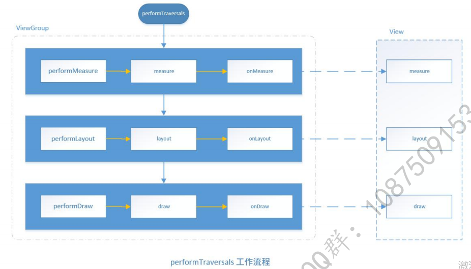

[TOC]

# 编舞者模块

Choreographer

https://cloud.tencent.com/developer/beta/article/1634784


## ViewRootImpl

requestLayout() --> scheduleTraversals() 注册 TraversalRunnable 回调。
当通过 JNI 接收到下一次 VSYNC 信号时，会回调 TraversalRunnable 线程。

真正开始绘制
doTraversal() --> performTraversals() -->
performLayout() 遍历 DecorView 中所有 Layout 并执行 onLayout() 方法。



AOSP/android10/frameworks/base/core/java/android/view/ViewRootImpl.java
```Java
/**
 * The top of a view hierarchy, implementing the needed protocol between View
 * and the WindowManager.  This is for the most part an internal implementation
 * detail of {@link WindowManagerGlobal}.
 */
@SuppressWarnings({"EmptyCatchBlock", "PointlessBooleanExpression"})
public final class ViewRootImpl implements ViewParent,
        View.AttachInfo.Callbacks, ThreadedRenderer.DrawCallbacks {

    // These can be accessed by any thread, must be protected with a lock.
    // Surface can never be reassigned or cleared (use Surface.clear()).
    @UnsupportedAppUsage
    public final Surface mSurface = new Surface();
    private final SurfaceControl mSurfaceControl = new SurfaceControl();
    private SurfaceControl mBlastSurfaceControl = new SurfaceControl();

    private BLASTBufferQueue mBlastBufferQueue;

    final IWindowSession mWindowSession;

    public ViewRootImpl(Context context, Display display) {
        this(context, display, WindowManagerGlobal.getWindowSession(),
                false /* useSfChoreographer */);
    }

    public ViewRootImpl(Context context, Display display, IWindowSession session) {
        this(context, display, session, false /* useSfChoreographer */);
    }

    public ViewRootImpl(Context context, Display display, IWindowSession session,
            boolean useSfChoreographer) {
        mContext = context;
        mWindowSession = session;
    }

    /**
     * We have one child
     */
    public void setView(View view, WindowManager.LayoutParams attrs, View panelParentView,
            int userId) {
        synchronized (this) {
            if (mView == null) {
                mView = view;

                // Schedule the first layout -before- adding to the window
                // manager, to make sure we do the relayout before receiving
                // any other events from the system.
                requestLayout();

                try{
                    res = mWindowSession.addToDisplayAsUser(mWindow, mSeq, mWindowAttributes,
                        getHostVisibility(), mDisplay.getDisplayId(), userId, mTmpFrame,
                        mAttachInfo.mContentInsets, mAttachInfo.mStableInsets,
                        mAttachInfo.mDisplayCutout, inputChannel,
                        mTempInsets, mTempControls);
                }
            }
        }
    }

    @Override
    public void requestLayout() {
        if (!mHandlingLayoutInLayoutRequest) {
            checkThread();
            mLayoutRequested = true;
            scheduleTraversals();
        }
    }

    void scheduleTraversals() {
        if (!mTraversalScheduled) {
            mTraversalScheduled = true;
            mTraversalBarrier = mHandler.getLooper().getQueue().postSyncBarrier();
            mChoreographer.postCallback(
                    Choreographer.CALLBACK_TRAVERSAL, mTraversalRunnable, null);
            notifyRendererOfFramePending();
            pokeDrawLockIfNeeded();
        }
    }

    void unscheduleTraversals() {
        if (mTraversalScheduled) {
            mTraversalScheduled = false;
            mHandler.getLooper().getQueue().removeSyncBarrier(mTraversalBarrier);
            mChoreographer.removeCallbacks(
                    Choreographer.CALLBACK_TRAVERSAL, mTraversalRunnable, null);
        }
    }

    void doTraversal() {
        if (mTraversalScheduled) {
            mTraversalScheduled = false;
            mHandler.getLooper().getQueue().removeSyncBarrier(mTraversalBarrier);

            if (mProfile) {
                Debug.startMethodTracing("ViewAncestor");
            }

            performTraversals();

            if (mProfile) {
                Debug.stopMethodTracing();
                mProfile = false;
            }
        }
    }

    private void performTraversals() {
        // Ask host how big it wants to be
        performMeasure(childWidthMeasureSpec, childHeightMeasureSpec);

        performLayout(lp, mWidth, mHeight);

        performDraw();

    }

    private void performMeasure(int childWidthMeasureSpec, int childHeightMeasureSpec) {
        if (mView == null) {
            return;
        }
        mView.measure(childWidthMeasureSpec, childHeightMeasureSpec);
    }

    private void performLayout(WindowManager.LayoutParams lp, int desiredWindowWidth,
            int desiredWindowHeight) {
        final View host = mView;
        if (host == null) {
            return;
        }

        host.layout(0, 0, host.getMeasuredWidth(), host.getMeasuredHeight());
    }

    private void performDraw() {
        boolean canUseAsync = draw(fullRedrawNeeded);
    }
    
    private boolean draw(boolean fullRedrawNeeded) {
        if (!drawSoftware(surface, mAttachInfo, xOffset, yOffset,
                scalingRequired, dirty, surfaceInsets)) {
            return false;
        }
    }

    /**
     * @return true if drawing was successful, false if an error occurred
     */
    private boolean drawSoftware(Surface surface, AttachInfo attachInfo, int xoff, int yoff,
            boolean scalingRequired, Rect dirty, Rect surfaceInsets) {

        // Draw with software renderer.
        final Canvas canvas;

        canvas = mSurface.lockCanvas(dirty);

        canvas.setDensity(mDensity);
        canvas.drawColor(0, PorterDuff.Mode.CLEAR);
        canvas.translate(-xoff, -yoff);
        canvas.setScreenDensity(scalingRequired ? mNoncompatDensity : 0);

        mView.draw(canvas);
    }
    

    final class TraversalRunnable implements Runnable {
        @Override
        public void run() {
            doTraversal();
        }
    }
    final TraversalRunnable mTraversalRunnable = new TraversalRunnable();
}
```


一个App 对应一个 Surface


