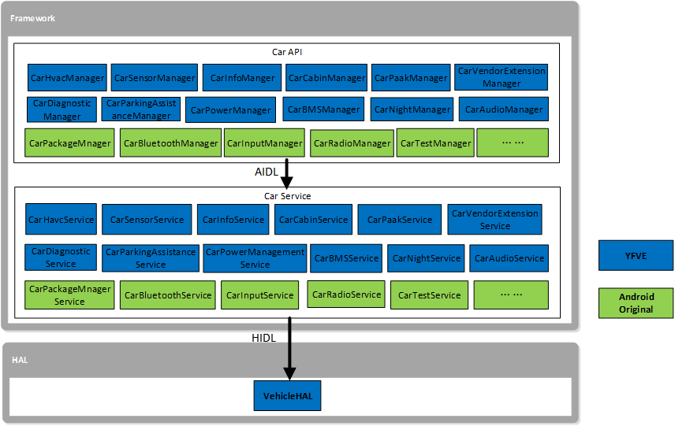
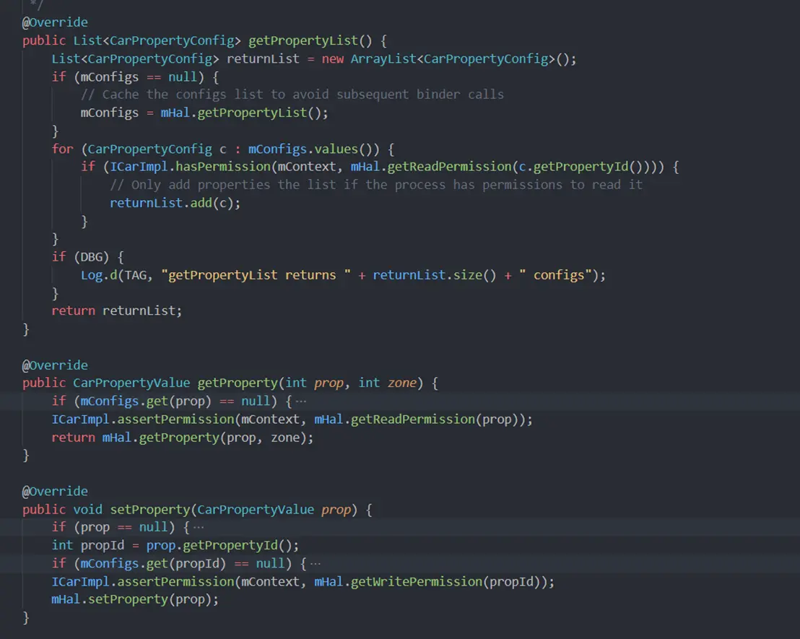

[TOC]

# Android Automotive平台

Android Automotive是通过Android的通用框架，语言和API来实现的一个全栈，开源，高度可定制的平台。

## 1. Android Automotive与整个Android生态系统的关系

- Android Automotive是Android的一部分。 Android Automotive不是Android的分支或并行开发，它与手机，平板电脑等安卓设备上的Android具有相同的代码库，并且位于相同的存储库中。它基于经过10多年开发的强大平台和功能集，可利用现有的安全模型，兼容性程序，开发人员工具和基础架构，同时继续具有高度可定制性和可移植性，完全免费和开源的特点。
- Android Automotive扩展了Android 。在将Android打造为功能齐全的信息娱乐平台的过程中，我们添加了对汽车特定要求，功能和技术的支持。就像今天用于移动设备的Android一样，Android Automotive将是一个完整的汽车信息娱乐平台。


## 2. Android Automotive架构


 





Automotive

Android Automative是在原先Android的系统架构上增加了一些与车相关的（图中虚线框中绿色背景的）模块。

- Car App ：包括OEM和第三方开发的App
- Car API ：提供给汽车App特有的接口
- Car Service ：系统中与车相关的服务，主要是基于CarProperty实现Vechile相关的一些策略
- Vehicle Network Service ：汽车的网络服务
- Vehicle HAL ：汽车的硬件抽象层描述，定义 OEM 可以实现的车辆属性的接口

# Android CarAPI


CarAPI

· annotation：包含了两个注解。
 · app
 · menu：车辆应用菜单相关API。
 · cluster：仪表盘相关API。
 · render：渲染相关API。
 · content
 · pm：应用包相关API。
 · diagnostic：包含与汽车诊断相关的API。
 · hardware：车辆硬件相关API。
 · cabin：座舱相关API。
 · hvac：通风空调相关API。
 · property：属性相关API(实现定制的property)。
 · radio：收音机相关API。
 · input：输入相关API。
 · media：多媒体相关API。
 · navigation：导航相关API。
 · settings：设置相关API。
 · vms：汽车监测相关API

这些api集合中，我们可以通过CarpropertyManager去实现定制的property功能，简要类图：


## 1.CarpropertyManager内部方法

- 通过registerListener注册自定义的propertyId以及property变更通知的callback


- 解注册CarpropertyEventListener

  

- 获取所有property, 返回一个元素类型是CarpropertyConfig的list

  

- 获取property状态

  

- 获取property value

  

- 设置property value

  

## 2.CarpropertyManager与service层交互的AIDL接口


需要注意的是ICarProperty是同步接口，ICarPropertyEventListener是异步接口。

onEvent传上来的是参数是CarPropertyEvent的list，CarPropertyEvent中包含event type与CarPropertyValue;
 eventType包含PROPERTY_EVENT_PROPERTY_CHANGE与PROPERTY_EVENT_ERROR，分别对应listener中的onPropertyChanged和PROPERTY_EVENT_ERROR， CarPropertyValue则包含具体的propId、propValue等具体属性信息。

# Android CarService


```undefined
代码目录： packages/services/Car/service
```

- CarService并非一个服务，而是一系列的服务。这些服务都在ICarImpl.java构造函数中列了出来

  

## 1.CarService相关服务启动流程

- SystemServer.java 启动CarServiceHelperService服务（frameworks/base/services/java/com/android/server/SystemServer.java）

  

- CarServiceHelperService.java ，绑定carservice服务 (frameworks/opt/car/services/src/com/android/internal/car/CarServiceHelperService.java)

  

- CarService.java ，创建ICarImpl实例，并调用init方法. (packages/services/Car/service/src/com/android/car/CarService.java)

  

- ICarImpl.java 构造函数中启动服务, 调用对应服务得init方法. (/packages/services/Car/service/src/com/android/car/ICarImpl.java)

  

## 2.CarPropertyService

- 实现了ICarProperty， CarServiceBase,  PropertyHalService.PropertyHalListener 接口中的方法


- registerListener调用PropertyHalService的subscribeProperty方法，同时会将最新值同步上层。

  

- getPropertyList 、setProperty 、getProperty 主要检查了读写权限。




