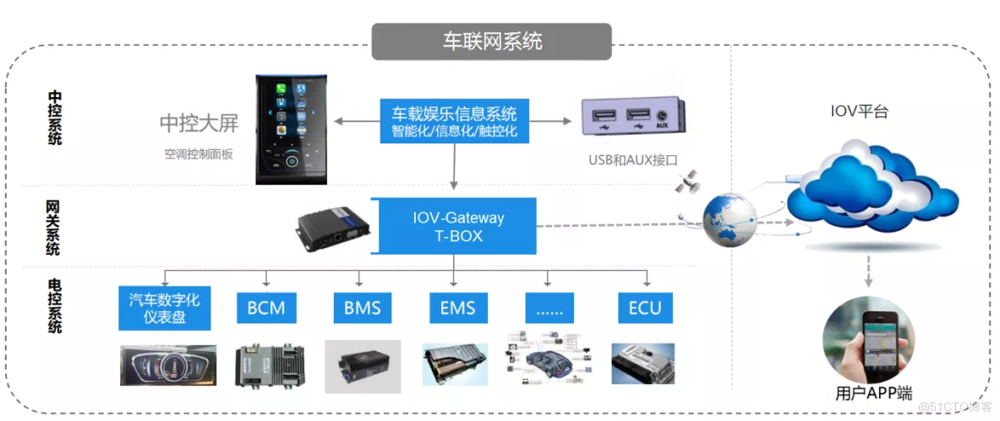
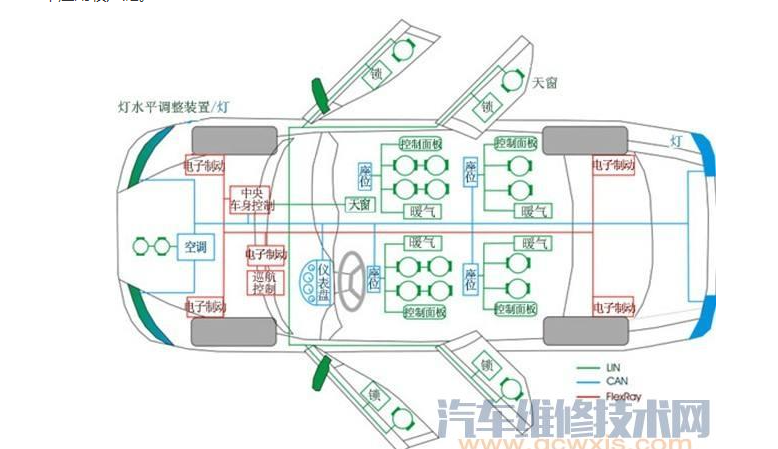
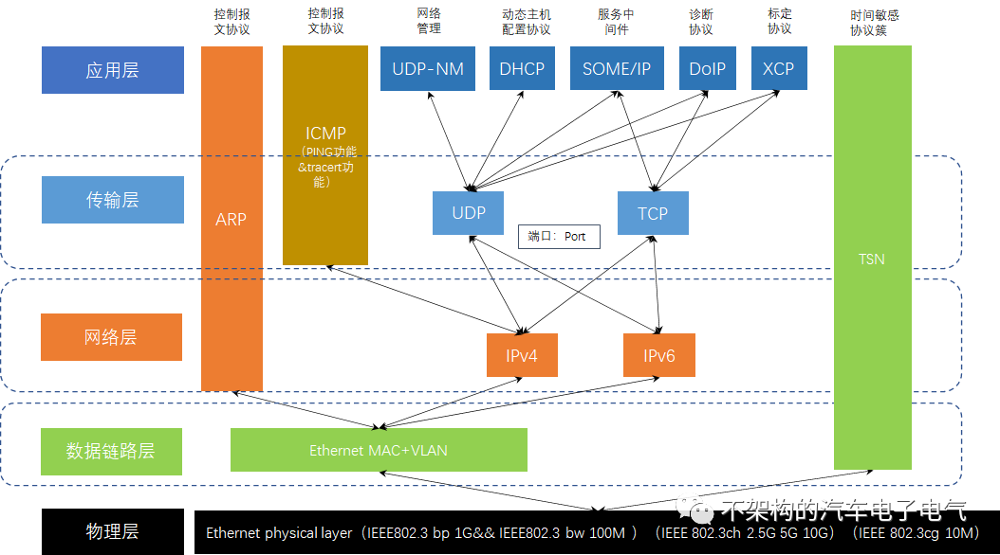
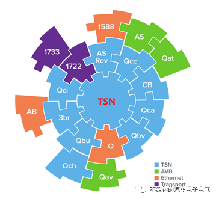
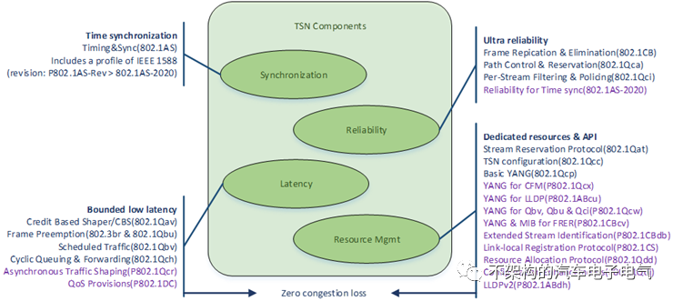
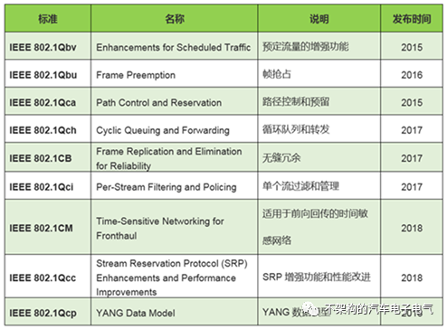
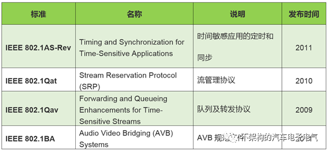
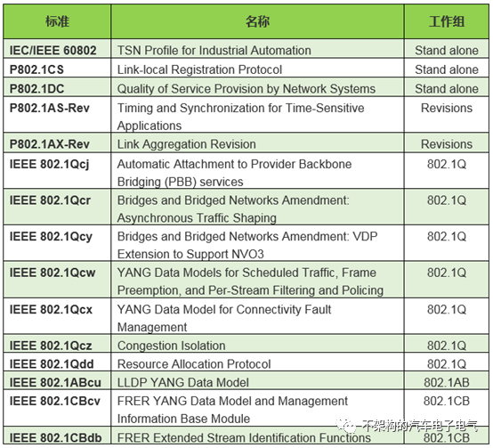
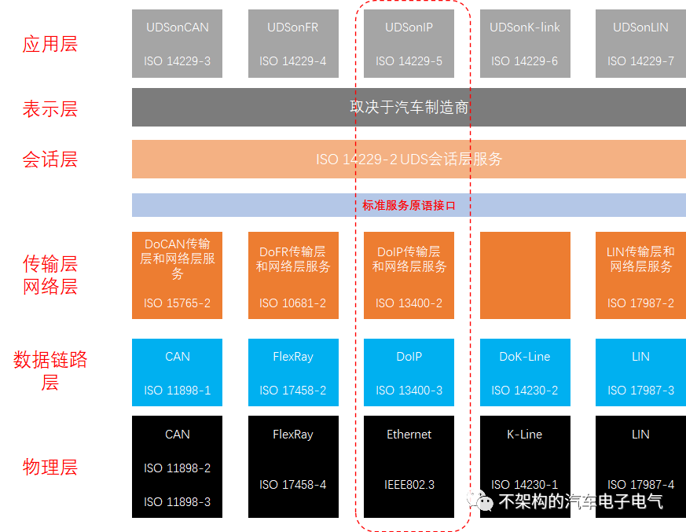

[TOC]

# 车载通讯系统——车载以太网的协议簇泛读

车内的环境和应用场景对于etherent提出了新的需求，也就意味着原来TX协议蔟下的部分协议并不一定适用于实际的车载场景，因此也就需要进行增删改。

车载以太网协议——**物理层**

物理层的内容我们在前边的内容中提过了很多，这也是车载以太网和常规以太网的重要的区别点：PHY芯片的不同。

Automotive ethernet的现阶段的物理层协议主要是100Mbase-T1的IEEE802.3bw；1000Mbase-T1的IEEE802.3bp；IEEE802.3ch对应的2.5G 5G10G。【备注：现阶段的10M车载以太网还没有开始推进使用对应的物理层协议IEEE 802.3cg】

因此对于物理层的内容大家可以通过以上四份IEEE文件来学习，一般情况下了解基本的组成结构以及link-up的过程、config的流程即可，剩下的交给专业的EE硬件工程师来完成吧。

物理层主要作用：

1）定义硬件接口；

2）定义信号与编码；

3）定义数据与信号之间的转换收发；

4）定义link模式确认master/slave；

车载以太网协议——**数据链路层**

数据链路层的协议对应的内容就多起来了，主要是分成三个大部分：

1、Etherent MAC，对于介质访问控制协议的了解大家可以参考常规以太网的协议标准来学习；

- 数据发送，MAC协议会判断当前是否适合发送数据，若能，它会在将要发送的数据上附加一些控制信息，最终使数据以规定的格式到达物理层；
- 数据接收，它会判断数据是否有错误，如果没有错误的话，它会去掉附加的控制信息发送至LCC（逻辑链路控制）子层；
- SMI接口包括MDIO（控制和管理PHY以获取PHY的状态）和MDC（为MDIO提供时钟）；
- MDC由MAC提供，MDIO是一根双向的数据线。用来传送MAC层的控制信息和物理层的状态信息；
- MDIO数据与MDC时钟同步，在MDC上升沿有效；

2、VLAN协议，局域网协议保持跟常规以太网的完全一致，因此这部分大家也可以参考常规以太网的内容来学习；

VLAN将一个物理的LAN在逻辑上划分成多个广播域的通信技术。VLAN内的主机间可以直接通信，而VLAN间不能直接通信，从而将广播报文限制在一个VLAN内；

当Node数目较多时会导致冲突严重、广播泛滥、性能显著下降甚至造成网络不可用等问题，通过VLAN可以解决冲突严重的问题，隔离广播报文和提升网络质量；

用VLAN可以划分不同的用户到不同的工作组，同一工作组的用户也不必局限于某一固定的物理范围，网络构建和维护更方便灵活。

3、AVB&&TSN协议，更应该称之为协议簇，正常的AVB协议发展成为今天的TSN协议，这部分内容是车载以太网相对比较独特的部分，TSN协议族包含了定时与**同步、延时、可靠性、资源管理**这四个类别的子协议。

TSN协议相对而言包含了众多的协议内容，但是TSN协议是在二层以上，建立在数据链路层的上的协议簇：

**Published TSN Standards**

**
**

**Referred to AVB standards**

**
**

**Ongoing TSN Projects**

**
**

车载以太网协议——**网络层**

车载以太网的网络层支持的协议应该有很多，但是我们实际的使用中主要是两个：ARP协议和IP协议。

ARP协议：控制报文协议，也称地址解析协议，是根据IP地址获取物理地址的一个TCP/IP协议。它可以解决同一个局域网内主机或路由器的IP地址和MAC地址的映射问题。

IP协议：主要是包含了IPv4和IPv6两个版本，工作中IPv4最为主要和常用。IP主要包含三方面内容：IP编址方案、分组封装格式及分组转发规则。

对于CIDR（无类域间路由），无类域间路由（Classless Inter-Domain Routing，CIDR）它不区分A 类、B 类、C 类地址，而是使用CIDR 前缀的值指定地址中作为网络ID 的位数。这个前缀可以位于地址空间的任何位置，让管理者能够以更灵活的方式定义子网，以简便的形式指定地址中网络ID 部分和主机ID 部分。

基本上网络层的协议保持了一致性，只是在一定程度上禁用了部分功能，但是主体上车载和非车载协议内容保持了完全的一致性。IP协议最为重要，应用层的大部分协议是基于IP协议来作为基础的。

**
**

车载以太网协议——**传输层**

**
**传输层的情况基本上是类似网络层，保持了车载和非车载的一致性，主要是支持ICMP、UDP、TCP。

ICMP保持了我们最基础的测试命令的使用场景：PING和tracert功能，本身相对使用情况比较单一，大家可以熟悉一下逻辑即可；

UDP和TCP协议两者的区别和使用场景有很多的文章展示这部分内容，后期有时间可以好好的总结一下相关的内容；

传输层的主要是UDP和TCP两种传输协议，大家对于这部分内容可以查阅协议，内容较多，在此就不展开描述了。

车载以太网协议——**应用层**

应用层的协议多数是依托网络层的IP协议，传输层的TCP/UDP协议来展开的，车载以太网的应用层协议主要是：UDPNM（网络管理协议）、DHCP（动态主机配置协议）、SOME/IP（服务中间件）、DoIP（诊断协议）以及XCP（标定协议）等。

**DoIP**：基于以太网的诊断传输协议，能够将UDS进行封装并基于IP网络进行传输；应用于车辆检查和维修、车辆或ECU软件的重编程、车辆或ECU的下线检查和维修等，其主要工作原理类似于Diagnostic over CAN（或称为DoCAN）。

备注：现阶段的OBD的诊断接口是使用的常规以太网TX协议来完成，后期可以完全实现车载系统，并需要诊断设备的支持。

**XCP**全称UniversalCalibration Protocol，是由ASAM (Association for Standardization ofAutomation and Measuring Systems,简称ASAM)组织在2003年提出的可在不同的通信总线上进行标定的新型标定协议，这里的X代表不同的传输层上传输(CAN、Ethernet、FlexRay、SCI、SPI、USB)。XCPon Ethernet能够基于以太网进行车载控制器的标定，主要用于标定、测量、少量的编程和刷新（大部分刷新会利用诊断协议）、ECU旁路功能等。基于以太网的XCP既可以使用TCP也可以使用UDP。

**
**

那么XCP主要的用处以下总结为四点：

a.标定

b.测量（反馈一些变量的值供上位机或测试系统查看，如转速等）

c.编程和刷新（例如更新一部分地址的数据值，甚至重编程等，这部分用的较少一般用UDS）

d.对ECU功能进行旁路，简单来说就是模拟ECU的数据

**
**

**UDPNM**：是AUTOSAR组织制定的基于汽车以太网的网络管理协议，能够有效的实现车载以太网节点的协同睡眠和唤醒，其主要工作原理类似于AUTOSAR的CANNM。正常情况下：应用层的UDPNM+物理层TC10完成整个汽车以太网系统的休眠唤醒设计。

**
**

**SOME/IP**协议作为和DDS同类的中间件协议，也成为SOA架构下重要协议类型

特点：

基于服务的通信方式；

占用空间小；

与autosar兼容；

可伸缩性（大小平台都可以使用）；

兼容性——可用于车内各种操作系统（Autosar 、OSEK、QNX以及Linux）

*A*

BOUT Ethernet

汽车以太网协议

由OPEN联盟倡议的BroadR-Reach标准得到了大多数的业界支持，IEEE根据BroadR-Reach标准发布了“更通用的标准”。
这些标准包括100Base-T1和1000Base-T1及刚发布的10Base-T1S。

BroadR-Reach技术是一种汽车专用的以太网标准，车载以太网与传统以太网最大的不同就是PHY的不同，专用汽车的PHY（收发器芯片）实现了在一对非屏蔽双绞线（UTP）上能够进行双向传输，提供100Mbit/s 及更高的宽带性能，并进行了优化处理以满足车载EMC要求。
与此同时，保留了标准的IEEE MAC接口，用于支持AVB、TCP/IP、DoIP等多种协议或应用形式。

## CAN 物理层协议

ODB诊断工具，监听和发送信号

2根线

差分信号 = 高电平 - 低电平

差分信号 < 0.5V      1       隐型
抗干扰
差分信号 > 0.9V      0       显型        重要

CAN总线空闲状态
11111111111

报文：

| 报文各段 | size(bit) | 值 | 作用 |
| :---: | :---: | :---: | :---: |
| 帧起始  | 1 | 0 | |
| 仲裁段 | 11 |  | ID 优先级 |
| 数据帧/远程帧 | 1 | 0/1 | |
| 标准格式/扩展格式 | 1 | 0/1 | |
| 保留位 | 1 | 0 | |
| DCL | | | 用户定义的数据size |
| 用户定义的数据 | | | |
| 校验位CRC | 15 | | |
| ACK | 1 | 0/1 | 发送/应答 |
| 隐型位 | 1 | 1 | |
| 帧结束 | 7 | 11111111 | |

CAN最大速率1M/s
CAN是串口通信

串口通信    可靠
USB通信     中控，数据高速传输

