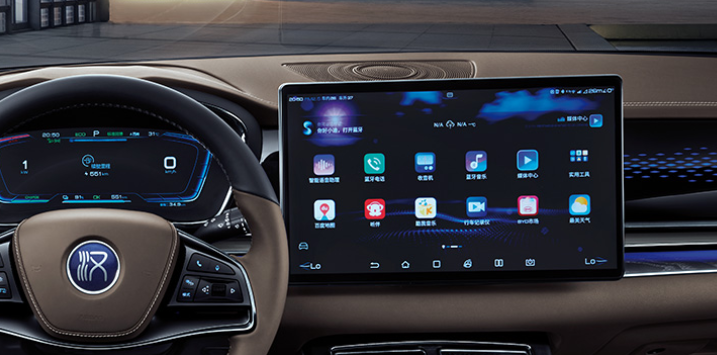
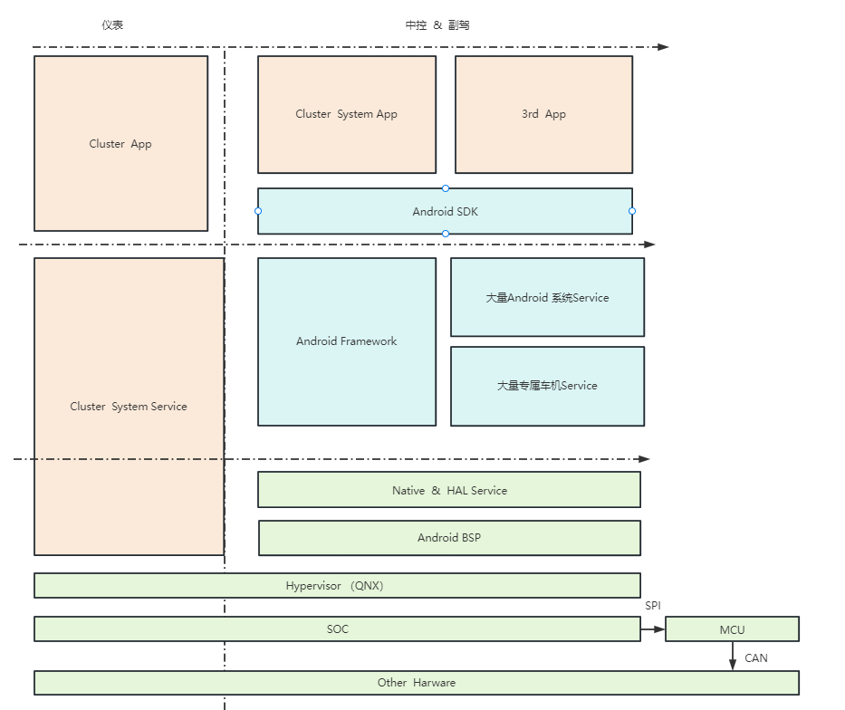
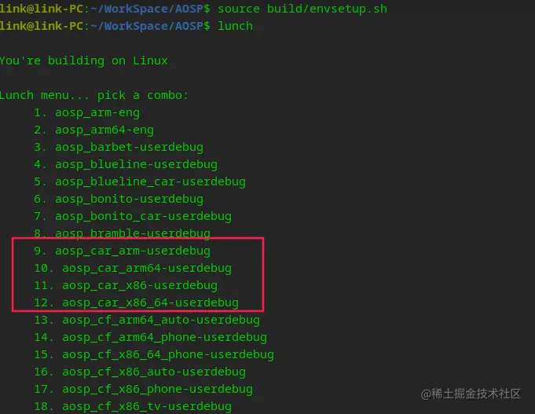
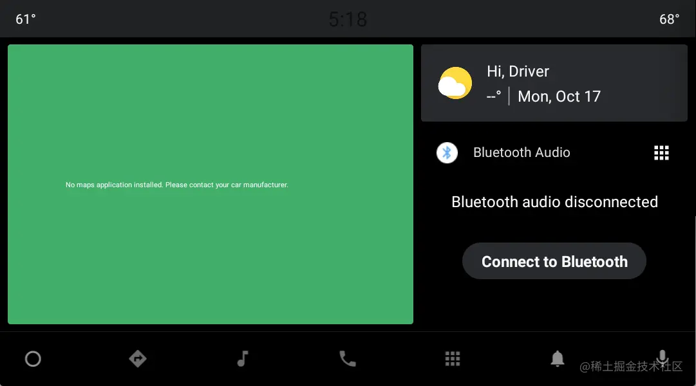
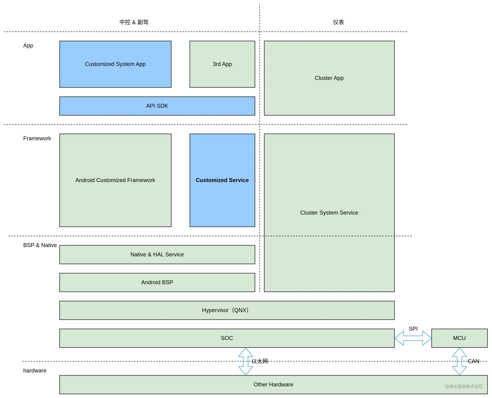

> 根据中汽协数据显示，2022年8月中国汽车出口量达30.8万辆，同比增长65%，这也是历史上首次超过30万辆。从今年前八个月整体情况来看，我国汽车出口量已经超越德国，仅次于日本汽车出口量。其中，新能源汽车1-8月出口量同比增长超九成，贡献了重要的增量。

众所周知，今年互联网行业发展的并不愉快，导致互联网行业就业形势不太理想，“开猿节流”的事情时有发生，于是不少Android开发萌生了转行做车载的想法，

 

## 车载操作系统

汽车操作系统是从传统汽车电子不断演变而来的，传统汽车电子产品可分为两类：

一类是汽车电子控制装置，通过直接向执行机构（如电子阀门、继电器开关、执行马达）发送指令，以控 制车辆关键部件（如发动机、变速箱、动力电池）协同工作，这类系统一般统称为电子控制单元（ECU）；

另一类是车载电子设备，如仪表、娱乐音响、导航系统、HUD等，这类系统不直接参与汽车行驶的控制 决策，不会对车辆行驶性能和安全产生影响，通常统称为车载信息娱乐系统（IVI）。这也是Android程序员主要负责的领域。

### 主流车载操作系统架构

当前国内主流车载操作系统的架构如上所示，左侧是汽车的中控、副驾屏幕，操作系统一般是Android，右侧是汽车的仪表屏幕，一般是QNX系统。

> 车载系统中还有一些Security、SOA、AutoSAR相关的模块，这些模块作为Android工程师属于知道了也插不上手，画出来也看不懂的东西，就全部省略了。

先来解释几个Android程序员可能不太熟悉的模块：

#### 以太网

以太网（Ethernet），是一种计算机局域网技术，也是互联网从业者，天天打交道的东西。在汽车座舱中IVI硬件与其他硬件间通信有时需要借助以太网来实现，例如：MQTT、HTTP等。

#### CAN

控制器局域网 (Controller Area Network，简称**CAN**或者**CAN bus**) 是一种功能丰富的车用总线标准。被设计用于在不需要主机（Host）的情况下，允许网络上的单片机和仪器相互通信。 它基于消息传递协议，设计之初在车辆上采用复用通信线缆，以降低铜线使用量，后来也被其他行业所使用。

CAN 是车载领域很重要的一种通信总线，我们在中控屏上可以随时查看、设置车门、发动机、后备箱这些模块，其实就是借助CAN bus实现的，即使是Android程序员也经常要和它打交道，以后会详细讲讲这个东西。

#### MCU

微控制器单元，它负责着汽车很大一部分的功能，例如通过车载控制器对各项数据进行分析处理，以做出最优决策；负责对车辆的信息娱乐交互和运动控制等等。

总的来说，MCU可以应用于车辆的通讯、能源、存储、感知以及计算，对汽车行业有着重要的作用。

#### SOC

SoC的定义多种多样，由于其内涵丰富、应用范围广，很难给出准确定义。一般说来， SoC称为系统级芯片，也有称片上系统（System on Chip），意指它是一个产品，是一个有专用目标的集成电路，其中包含完整系统并有嵌入软件的全部内容。

车载Soc和常见的手机Soc非常类似，内部集成了CPU和GPU。目前最主流的车载Soc是高通的8155，它就是高通在手机Soc骁龙855的基础上发展而来的。

#### QNX

QNX是商业类Unix实时操作系统，主要针对嵌入式系统市场。QNX采取微核心架构，操作系统中的多数功能是以许多小型的task来执行，它们被称为server。这样的架构使得用户和开发者可以关闭不需要的功能，而不需要改变操作系统本身。

QNX的应用十分广泛，被广泛应用于汽车、轨道交通、航空航天等对安全性、实时性要求较高的领域，在汽车领域的市场占有率极高。

> 该产品开发于20世纪80年代初，后来改名为QNX软件系统公司，公司已被黑莓公司并购。

#### Hypervisor

一种运行在基础物理服务器和操作系统之间的中间软件层，可允许多个操作系统和应用共享硬件。也可叫做VMM（ virtual machine monitor ），即虚拟机监视器。

目前国内主流的汽车座舱，都是在一个SOC上同时运行着两个不同特性的操作系统。对娱乐、应用生态有需求的中控、副驾一般由Android系统控制，而对稳定性、安全性要求较高的仪表盘，则由QNX系统直接控制，Android可以看做是一个运行在QNX上的虚拟系统，其底层技术原理就是Hypervisor。

------

**其实以上说得这些都是从Android工程师角度看到的车载操作系统，实际上这只是车载操作系统的冰山一角，最底层的Other Hardware更能代表智能汽车操作系统的核心，它包含高级驾驶辅助系统、泊车辅助系统、自动驾驶系统、TCU、4G/5G网关、中央控制器等等。这些复杂的硬件与软件共同组成了一个智能汽车操作系统。**

现代汽车的操作系统是如此的复杂，一些汽车的TCU、中央控制器甚至还额外运行着一套操作系统（例如linux），所以现在还没有哪一个汽车/主机厂商能够独立完成整套系统的开发，基本都需要依赖大量的第三方软、硬件供应商（笔者之前就是就职于一家汽车软件供应商，不过现在已经处于提桶状态了）。

好在作为Android程序员我们只需要关心Android系统的那部分。

## 车载 Android 系统

车载Android系统，又称Android Automotive，是对原始Android系统的一个功能扩充版本，在编译AOSP源码时可以看到相应的编译选项。

Android Automotive 编译后的原始界面如下所示，相信有过车载开发经验的同学对这个界面一定不陌生，我们正是在这个界面上把车载Android系统一点点搭建起来的。

### Android Automotive

Android Automotive 是一个基于 Android 平台扩展后，适用于现代汽车的智能操作系统，可以直接运行为Android系统开发的应用。Android Automotive并非Android的分支或并行开发版本。它与手机和平板电脑等设备上搭载的Android使用相同的代码库，位于同一个存储区中。

Android Automotive与Android最大的区别在于，Android Automotive增加了对汽车特定要求、功能和技术的支持。

> Google的官方文档：[source.android.google.cn/docs/device…](https://link.juejin.cn?target=https%3A%2F%2Fsource.android.google.cn%2Fdocs%2Fdevices%2Fautomotive)

### Android Auto

除了Android Automotive，Google还推出了一个Android Auto。两者的命名方式可能有点让人迷惑不解。下面介绍了它们之间的区别：

- **Android Auto** 是一个基于用户手机运行的平台，可通过 USB 连接将 Android Auto 用户体验投射到兼容的车载信息娱乐系统。Android Auto本质上就是一个运行在Android系统上的车载应用，与苹果的CarPlay，百度的CarLife类似。

- **Android Automotive** 是一个可定制程度非常高的开源Android平台，它是一个完整的操作系统。

需要说明的是，使用Android Auto需要用户的手机支持Google服务框架，所以一般只在国内销售的汽车基本都不支持Android Auto，一些沿用了国外车机系统的合资车型可能会支持Android Auto。

## 车载 Android 应用

### 常见的车载应用

#### SystemUI

系统的UI。`SystemUI`是一个标准的android应用程序，它提供了系统UI的统一管理方案。 常见的状态栏、导航栏、消息中心、音量调节弹窗、蓝牙连接弹窗等一系列后台弹窗都是由SystemUI模块负责管理。

开发难度：`SystemUI`作为Android系统启动的第一个带有UI的应用程序，对启动性能和稳定性都有很高的要求。`SystemUI`需要管理的模块非常多，导致开发任务比较繁重，有的车载项目会要求`SystemUI`兼容原有的应用层API，那么开发难度还会上升。开发人员需要对Android原生的`SystemUI`源码有一定的了解。

#### Launcher

Android系统的桌面。

开发难度：Launcher是与用户交互最多的应用程序之一，同样对启动性能和稳定性都有很高的要求。Launcher开发难度主要集中在与3D车模的互动（如果有3D模型），可能需要支持Widget的显示（WidgetHost），各种应用的拖动和编辑等。开发人员最好对Android原生的Launcher源码有一定的了解。

#### Settings

系统设置，是车载Android系统中非常重要的一个系统级应用，是整个车载IVI系统的控制中心，整车的音效、无线通信、状态信息、安全信息等等都是需要通过系统设置来查看和控制。

开发难度：系统设置主要难度都集中在对Android Framework层API的理解上，例如蓝牙、Wi-Fi设置就需要开发人员对系统级API有一定的了解，这些内容往往都需要阅读Android原生应用的源码才能了解，所以系统设置也是一个开发难度比较大的车载应用。

#### CarService

车载Android系统的核心服务之一，所有应用都需要通过CarService来查询、控制整车的状态。例如：车辆的速度、档位、点火状态等等。

#### VehicleSettings

车辆设置，更常用的叫法是『车控车设』。负责管理整个车辆内外设置项的应用，主要与CarService进行数据交互。可设置项非常多。驾驶模式、方向盘助力、后视镜折叠、氛围灯、座舱监测、无线充电等等。

开发难度：主要难度集中在复杂多变的UI，有的主机厂商会在HMI中引入3D化的交互模型，就还需要考虑与3D模型间的通信，同时还需要熟练运用CAN工具来模拟汽车的CAN信号用于调试和开发。

#### HVAC

空调。负责管理整个车辆空调的应用，主要与CarService进行数据交互。

开发难度：和『车控车设』类似。

#### Map

地图，车载系统的核心功能之一，负责导航和语音提示等功能。不同的主机厂商有不同的开发方式。不外乎有三种：

1）选择使用百度、高德的地图SDK自行开发导航应用；

2）将导航模块外包给百度、高德，由地图供应商进行定制化开发；

3）直接集成地图供应商已有的车载版本的应用；

开发难度：主要集中在对地图SDK的运用和理解上，而且地图应用属于对性能要求较高的模块。

#### Multi-Media

多媒体应用。一般包含图片浏览、在线音视频播放器、USB音视频播放器、收音机等。

------

**车载的应用远不止以上说得这些，根据不同的需求，还有非常多的Service需要做定制化开发，这里只列举了最常见的应用类型。**

汽车上还会有一些第三方的应用，常见的有QQ音乐、微信、QQ、抖音、讯飞输入法等等，这些应用主机厂商不会获得源码，一般只会拿到一个apk，直接集成到Android系统中即可。

### 车载应用与移动应用的区别

夸张一点说，移动端的应用开发和车载应用开发，完全就不是一个技术思路。总结一下大致有以下几个区别：

**1）应用级别不同**

多数车载应用属于**系统级应用**，可以调用Android SDK内部隐藏的API，也不需要动态地向用户申请权限。移动应用是**普通应用**，系统对其限制很多，需要遵守Android应用的开发规范。

由于车载应用是系统级应用，所以移动端很多常用的技术比如热修复、插件化基本都不会采用，但是相对的进程保活、开机自启就变得非常简单了。

**2）迭代方式不同**

移动应用只要用户的手机接入了WiFi就可以进行在线升级，所以移动应用多采用小步快跑的形式，进行快速迭代。

车载系统级应用的更新只能以整车OTA的形式进行，而OTA可能会消耗宝贵的车机流量，所以车载应用在SOP（量产）前，就必须完成全部需求的开发，而且不能出现严重的bug。在正式交付用户前，车厂内部或4S店还会进行几次OTA升级用做最后的bug修复。（如果在交付用户后还有严重的bug或需求未完成，那么大概率项目经理、程序员都要祭天了)

**3）技术路线不同**

正是因为车载应用对稳定性的要求极高，所以车载应用在开发时，对待新型技术会非常的慎重，比如，目前只有少数主机厂商在使用Kotlin开发车载应用，毕竟Android Framework都还没有改成Kotlin，大部分厂商对Kotlin的积极性不高。而且车载应用也不允许随意使用开源框架，如果必须使用，务必注意框架的开源协议，以免给汽车厂商带来不必要的麻烦。

**4）运行环境不同**

车载应用的运行环境是经过高度定制化的Android系统，定制化也就意味着bug。移动端的应用出现bug时，我们的第一反应是应用的代码有缺陷。车载应用发现bug也要考虑到是不是系统本身出现了bug，这是一件非常有挑战性的事，应用开发与系统开发相互扯皮、泼脏水也属于家常便饭。

### 车载应用需要掌握的技能

除了一般Android开发需要学习的基础内容外，一名优秀的车载应用工程师还需要掌握以下的技能

**1）MVVM架构**

虽然如今一些移动端应用已经开始尝试MVI架构，但是就像前面说得，车载应用对待新技术都会持观望态度，目前主流的车载应用还是采用基于Jetpack组件的MVVM架构。

**2）构建系统级应用**

由于多数车载应用都属于系统级应用，所以必须了解如何构建一个系统级应用，这方面的内容可以看我之前写得[Android车载应用开发与分析（11）- 车载Android应用开发入门指南](https://juejin.cn/post/7094058821600935950)，虽然写得比较乱凑活看吧。

还有一本比较老的书《Android深度探索：系统应用源代码分析与ROM定制》也可以看一看。

**3）性能优化**

应用的性能优化是个亘古不变的话题，掌握应用的各种性能优化方式，也是一个Android程序员必备的生存手段，汽车座舱的SOC性能比旗舰手机要差不少，如果优化好车载应用将是一个非常有挑战性的任务。

**4）IPC通信**

Android中最常用的跨进程通信手段是Binder，因为有大量的Service需要与应用进行交互，所以基于Binder的AIDL在车载应用开发中使用得非常广泛，学会使用AIDL也同样属于必备技能之一。

**5）CAN仿真测试工具**

CAN仿真测试工具包含了软件和硬件，在车载应用开发时我们需要借助这些工具来模拟发送CAN性能给到IVI来调试我们的应用，在实车调试阶段，也需要借助这些工具来捕获车辆的CAN信号来分析一些bug。常用的有CAN alyzer、CANoe、TS-Master等等，这些工具价格都极其昂贵，独自购买不现实，在车载应用开发务必把握学习和使用的机会。

**6）系统应用源码**

这一项是我认为最重要的，不少车载应用层项目都是反复定制各种SystemUI、Launcher、Settings等等，读懂Android系统应用源码对我们定制化开发这些应用有非常大的好处。

------

以上是一些我认为车载应用开发时需要掌握的技能，其他的一些诸如：adb调试指令、Linux操作系统的运用、AOSP源码编译也都需要额外学习，根据不同的需求，JNI、NDK等技术也有可能会用上。

## 车载应用开发者的未来

这篇文章的开头提到了一则新闻，中国今年的汽车出口量已经超越德国仅次于日本，这似乎是一个振奋人心的消息。汽车工业的高速发展，对我们这些车载程序员当然属于利好，但是最近的一则消息又让我改变了看法。

> 9月29日，零跑汽车正式赴港上市。成为众人意料之外继“蔚小理”后的又一新秀。但是零跑汽车的成绩似乎并没有得到资本市场的认可，在其上市首日，股价便遭遇大跌。根据数据显示，9月29日当日收盘，零跑汽车的股价为31.9港元/股票，相较发行价暴跌33.54%。而随后的半个月以来，零跑汽车的股价更是下跌56%，市值蒸发343亿港元。

一边是汽车出口量大增，另一边是新势力造车第二梯队的**零跑**上市即破发，并且两个交易日股价即腰斩，虽然有叠加疫情的影响，但这也说明了资本市场对造车企业的热情正在显著减弱，如果投资人赚不到丰厚的回报，那么以后的车企日后想要再从市场融资，恐怕不会是一件轻松的事。

以上说得都是大环境，但是作为技术人本职工作还是磨炼自己的技术为主。

回过头我们还要再看一下这张架构图，图中标蓝的部分是应用开发可以发挥的地方。不知道你有没有发现，应用实际上在车载操作系统中占据的比例很小，而且技术门槛也不高，这基本决定了在车载这个领域，单纯的Android应用开发前景并不广阔。

但是庞大的车载系统让应用开发者有了继续深入研究与实践的可能，那么是卷`Framework`还是`Native`或是`HAL`就需要你自己决定了！

