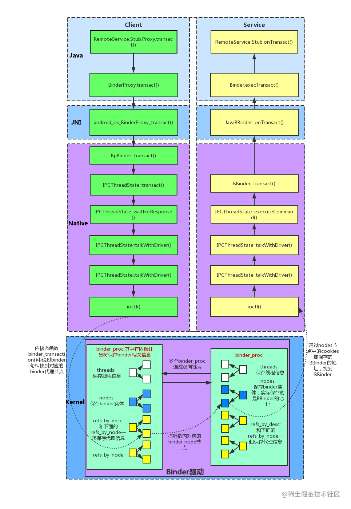
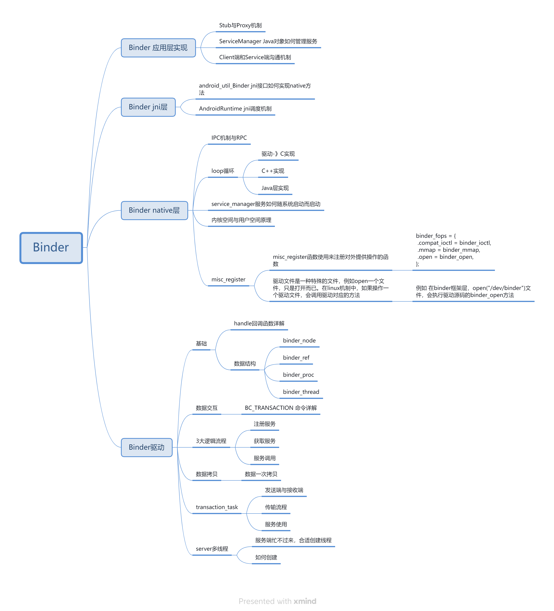
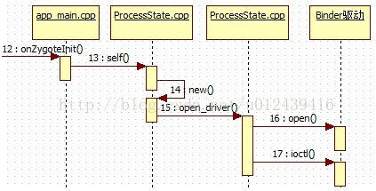
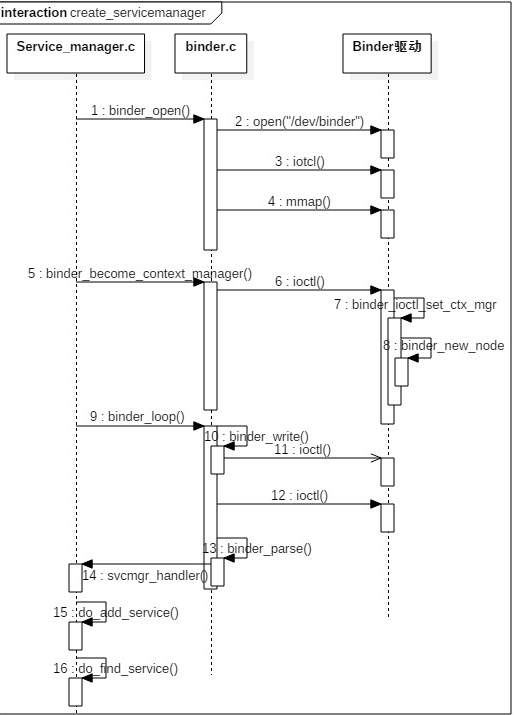

[TOC]

# Binder


https://juejin.cn/post/6963964448977453087





发送数据:通过copyfrom_user将数据拷贝到 binder驱动中，binder驱动存在于内核空间
获取数据:会提前打开 binder 驱动，并通进过alloc_page分配一页物理页面(4K)，而物理页指向的就是物理内存，又与 service端和内核空间存在 mmap 映射关系，所以service端可以直接访问到物理内存中的数据，也就不需要再次进行拷贝了


这里用户空间 mmap(1M-8K)的空间，为什么要减去8K，而不是直接用1M?
Android的 gitcommit 记录:
Modify the binder to request 1M-2 pages instead of1M.The backing store in the kernel requires a guard pageso 1M
allocations fragment memory very badly.Subtracting a couple of pages so that they fit in a power of two allows the kernel to make more efficient use of itsvirtual address space.
大致的意思是:kernel的“backingstore”需要一个保护页，这使得1M用来分配碎片内存时变得很差，所以这里减去两页来提高效率，因为减去一页就变成了奇数。

系统定义:BINDER VMSIZE((1*1024*1024)-
sysconf(SC PAGE SIZE)*2)=(1M-sysconf(SC PAGE SIZE)*2)
这里的8K，其实就是两个PAGE的SIZE，物理内存的划分是按 PAGE(页)来划分的，一般情况下，一个Page的大小为4K。
内核会增加一个 guard page，再加上内核本身的guardpage，正好是两个page的大小，减去后，就是用户空间可用的大小。


https://blog.csdn.net/Double2hao/article/details/112131416

https://blog.csdn.net/qq_27672101/article/details/108186072

https://blog4jimmy.com/2018/01/350.html

https://www.jianshu.com/p/15c6167cc666

https://blog.csdn.net/u010128475/article/details/125699297


## Binder源码分析




1. Java层源码

ManiuService.java
```Java
public class ManiuService extends Service {
    @Nullable
    @Override
    public IBinder onBind(Intent intent) {
        return new ManiuInterface.Stub() {
            @Override
            public String request(String data) throws RemoteException {
                return null;
            }

            @Override
            public String request1(String data) throws RemoteException {
                return null;
            }

            @Override
            public String request2(String data) throws RemoteException {
                return null;
            }
        };
    }
}
```

SecondActivity.java
```Java
public class SecondActivity extends AppCompatActivity {

    @Override
    protected void onCreate(Bundle savedInstanceState) {
        super.onCreate(savedInstanceState);
        setContentView(R.layout.activity_main);
        bindService(new Intent(), new ServiceConnection() {
            @Override
            public void onServiceConnected(ComponentName componentName, IBinder iBinder) {
                ManiuInterface maniuInterface = ManiuInterface.Stub.asInterface(iBinder);
                try {
                    maniuInterface.request("david");
                    maniuInterface.request1("david");
                    maniuInterface.request2("david");
                } catch (RemoteException e) {
                    e.printStackTrace();
                }
            }

            @Override
            public void onServiceDisconnected(ComponentName componentName) {

            }
        }, Context.BIND_AUTO_CREATE);
    }
}
```

ManiuInterface.aidl
```Java
interface ManiuInterface {
    String request(String data);
    String request1(String data);
    String request2(String data);
}
```

Sdk/build-tools/29.0.0/aidl.exe
ManiuInterface.aidl --> ManiuInterface.java
class Proxy 发送数据 transact()方法
全类名 + 发送的数据 + 方法索引

class Stub 接收数据 onTransact()方法
Proxy是Stub的内部类

```Java
/*
 * This file is auto-generated.  DO NOT MODIFY.
 */
package com.maniu.aidlprocess;
// Declare any non-default types here with import statements

public interface ManiuInterface extends android.os.IInterface
{
    /** Default implementation for ManiuInterface. */
    public static class Default implements com.maniu.aidlprocess.ManiuInterface
    {
        @Override public java.lang.String request(java.lang.String data) throws android.os.RemoteException
        {
            return null;
        }
        @Override public java.lang.String request1(java.lang.String data) throws android.os.RemoteException
        {
            return null;
        }
        @Override public java.lang.String request2(java.lang.String data) throws android.os.RemoteException
        {
            return null;
        }
        @Override
        public android.os.IBinder asBinder() {
            return null;
        }
    }
    /** Local-side IPC implementation stub class. */
    public static abstract class Stub extends android.os.Binder implements com.maniu.aidlprocess.ManiuInterface
    {
    private static final java.lang.String DESCRIPTOR = "com.maniu.aidlprocess.ManiuInterface";
    /** Construct the stub at attach it to the interface. */
    public Stub()
    {
        this.attachInterface(this, DESCRIPTOR);
    }
    /**
        * Cast an IBinder object into an com.maniu.aidlprocess.ManiuInterface interface,
        * generating a proxy if needed.
        */
    public static com.maniu.aidlprocess.ManiuInterface asInterface(android.os.IBinder obj)
    {
        if ((obj==null)) {
            return null;
        }
        android.os.IInterface iin = obj.queryLocalInterface(DESCRIPTOR);
        if (((iin!=null)&&(iin instanceof com.maniu.aidlprocess.ManiuInterface))) {
            //进程内通信
            return ((com.maniu.aidlprocess.ManiuInterface)iin);
        }
        //进程间通信
        return new com.maniu.aidlprocess.ManiuInterface.Stub.Proxy(obj);
    }
    @Override public android.os.IBinder asBinder()
    {
        return this;
    }
    @Override public boolean onTransact(int code, android.os.Parcel data, android.os.Parcel reply, int flags) throws android.os.RemoteException
    {
        java.lang.String descriptor = DESCRIPTOR;
        //code 方法索引
        switch (code)
        {
        case INTERFACE_TRANSACTION:
        {
            reply.writeString(descriptor);
            return true;
        }
        case TRANSACTION_request:
        {
            data.enforceInterface(descriptor);
            java.lang.String _arg0;
            _arg0 = data.readString();
            java.lang.String _result = this.request(_arg0);
            reply.writeNoException();
            reply.writeString(_result);
            return true;
        }
        case TRANSACTION_request1:
        {
            data.enforceInterface(descriptor);
            java.lang.String _arg0;
            _arg0 = data.readString();
            java.lang.String _result = this.request1(_arg0);
            reply.writeNoException();
            reply.writeString(_result);
            return true;
        }
        case TRANSACTION_request2:
        {
            data.enforceInterface(descriptor);
            java.lang.String _arg0;
            _arg0 = data.readString();
            java.lang.String _result = this.request2(_arg0);
            reply.writeNoException();
            reply.writeString(_result);
            return true;
        }
        default:
        {
            return super.onTransact(code, data, reply, flags);
        }
        }
    }
    private static class Proxy implements com.maniu.aidlprocess.ManiuInterface
    {
        private android.os.IBinder mRemote;
        Proxy(android.os.IBinder remote)
        {
            mRemote = remote;
        }
        @Override public android.os.IBinder asBinder()
        {
            return mRemote;
        }
        public java.lang.String getInterfaceDescriptor()
        {
            return DESCRIPTOR;
        }
        @Override public java.lang.String request(java.lang.String data) throws android.os.RemoteException
        {
            //_data 发送容器，序列化的集合
            android.os.Parcel _data = android.os.Parcel.obtain();
            //_reply 接收容器，序列化的集合
            android.os.Parcel _reply = android.os.Parcel.obtain();
            java.lang.String _result;
            try {
                //DESCRIPTOR Token，描述符，全类名（包名+类名）
                _data.writeInterfaceToken(DESCRIPTOR);
                //data 发送的数据
                _data.writeString(data);
                //Stub.TRANSACTION_request AIDL约定一个方法索引（基础码+偏移码），解决重载问题
                boolean _status = mRemote.transact(Stub.TRANSACTION_request, _data, _reply, 0);
                if (!_status && getDefaultImpl() != null) {
                    return getDefaultImpl().request(data);
                }
                _reply.readException();
                _result = _reply.readString();
            }
            finally {
                _reply.recycle();
                _data.recycle();
            }
            return _result;
        }
        @Override public java.lang.String request1(java.lang.String data) throws android.os.RemoteException
        {
            android.os.Parcel _data = android.os.Parcel.obtain();
            android.os.Parcel _reply = android.os.Parcel.obtain();
            java.lang.String _result;
            try {
                _data.writeInterfaceToken(DESCRIPTOR);
                _data.writeString(data);
                boolean _status = mRemote.transact(Stub.TRANSACTION_request1, _data, _reply, 0);
                if (!_status && getDefaultImpl() != null) {
                    return getDefaultImpl().request1(data);
                }
                _reply.readException();
                _result = _reply.readString();
            } finally {
                _reply.recycle();
                _data.recycle();
            }
            return _result;
        }
        @Override public java.lang.String request2(java.lang.String data) throws android.os.RemoteException
        {
            android.os.Parcel _data = android.os.Parcel.obtain();
            android.os.Parcel _reply = android.os.Parcel.obtain();
            java.lang.String _result;
            try {
                _data.writeInterfaceToken(DESCRIPTOR);
                _data.writeString(data);
                boolean _status = mRemote.transact(Stub.TRANSACTION_request2, _data, _reply, 0);
                if (!_status && getDefaultImpl() != null) {
                return getDefaultImpl().request2(data);
                }
                _reply.readException();
                _result = _reply.readString();
            }
            finally {
                _reply.recycle();
                _data.recycle();
            }
            return _result;
        }
        public static com.maniu.aidlprocess.ManiuInterface sDefaultImpl;
    }
    static final int TRANSACTION_request = (android.os.IBinder.FIRST_CALL_TRANSACTION + 0);
    static final int TRANSACTION_request1 = (android.os.IBinder.FIRST_CALL_TRANSACTION + 1);
    static final int TRANSACTION_request2 = (android.os.IBinder.FIRST_CALL_TRANSACTION + 2);
    public static boolean setDefaultImpl(com.maniu.aidlprocess.ManiuInterface impl) {
        // Only one user of this interface can use this function
        // at a time. This is a heuristic to detect if two different
        // users in the same process use this function.
        if (Stub.Proxy.sDefaultImpl != null) {
            throw new IllegalStateException("setDefaultImpl() called twice");
        }
        if (impl != null) {
            Stub.Proxy.sDefaultImpl = impl;
            return true;
        }
        return false;
    }
    public static com.maniu.aidlprocess.ManiuInterface getDefaultImpl() {
        return Stub.Proxy.sDefaultImpl;
    }
    }
    public java.lang.String request(java.lang.String data) throws android.os.RemoteException;
    public java.lang.String request1(java.lang.String data) throws android.os.RemoteException;
    public java.lang.String request2(java.lang.String data) throws android.os.RemoteException;
}
```

Sdk/sources/android-29/android/os/Binder.java
AOSP/android10/frameworks/base/core/java/android/os/Binder.java


2. Jni源码

2. Native源码
AOSP/android10/frameworks/native/libs/binder/Binder.cpp
AOSP/android10/frameworks/native/libs/binder/BpBinder.cpp

3. 服务注册源码

4. 服务查找源码

5. 服务调用源码


6. Binder驱动层源码






