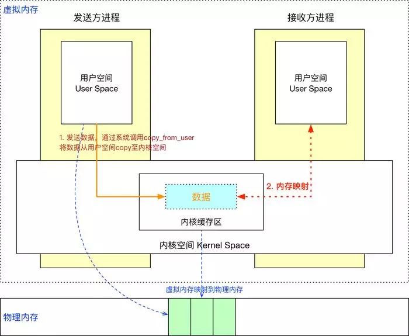
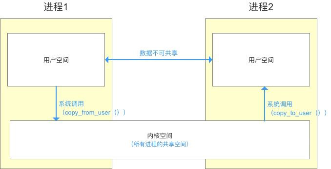
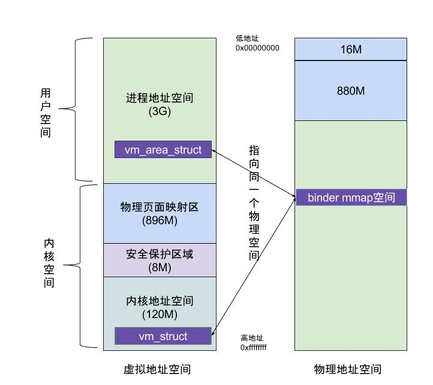

[TOC]

## Binder 面试题

### 谈谈你对 binder 的理解？

🤔️：binder 是 Android 中主要的跨进程通信方式，比Linux 原有的通信方式 Socket 、管道传输速度更快，比共享内存更安全可控。
binder 驱动和 service manager 分别相当于网络协议中的路由器和 DNS，并基于 mmap 实现了 IPC 传输数据时只需一次拷贝。

binder 包括 BinderProxy、BpBinder 等各种 Binder 实体，以及对 binder 驱动操作的 ProcessState、IPCThreadState 封装，再加上 binder 驱动内部的结构体、命令处理，整体贯穿 Java、Native 层，涉及用户态、内核态，往上可以说到 Service、AIDL 等，往下可以说到 mmap、binder 驱动设备，是相当庞大、繁琐的一个机制。

### Binder如何做到一次拷贝

Client 与 Server 处于不同进程有着不同的虚拟地址规则，所以无法直接通信。而一个页框可以映射给多个页，那么就可以将一块物理内存分别与 Client 和 Server 的虚拟内存块进行映射。

如图， Client 就只需 copy_from_user 进行一次数据拷贝，Server 进程就能读取到数据了。另外映射的虚拟内存块大小将近 1M (1M-8K)，所以 IPC 通信传输的数据量也被限制为此值。

#### Linux原有通信
进程间，
用户空间的数据不可共享，所以用户空间相当于私有空间
内核空间的数据可共享，所以内核空间 相当于公共空间
进程间如果需要做到通信，需要通过共享空间对数据转换。转换过程需要调用系统的api，这个过程称为**系统调用**

> Linux 已有的进程通信，发送端和接收端可以是任意对象。出现在任意类中。但是必须牺牲多拷贝一次
>
> Android的Binder通信，接受端不能是任意对象，只能是Service，，在通信前会注册在ServiceManager中。这也节约了一次拷贝，牺牲了开发者的体验

​Binder机制中 在内存与文件中设计了一层映射关系。**内核空间的内存是虚拟的**。**文件IO是实的**。 映射指的是内存与文件的映射，映射是通过mmap函数，

​而mmap函数 需要依赖一个文件，这个文件叫做“binder”。
对！ 他没有后缀名，他就是一个文件。但是人们习惯性的把它称为**binder驱动**。

### 简单讲讲mmap原理

### 内存中的一页是什么，你怎么理解的

🤔️：页框是指一块实际的物理内存，页是指程序的一块内存数据单元。内存数据一定是存储在实际的物理内存上，即页必然对应于一个页框，页数据实际是存储在页框上的。

页框和页一样大，都是内核对内存的分块单位。一个页框可以映射给多个页，也就是说一块实际的物理存储空间可以映射给多个进程的多个虚拟内存空间，这也是 mmap 机制依赖的基础规则。

### Binder传输数据的大小限制是多少

### AIDL生成java类的细节

### Android APP有多少Binder线程，是固定的么

### bindService启动Service与Binder服务实体的流程

### Java层Binder实体与与BinderProxy是如何实例化及使用的，与Native层的关系是怎样的

### Binder如何找到目标进程

### 简单说下 binder 的整体架构吧

🤔️：再来画一个简单的示意图吧，这是一个比较典型的、两个应用之间的 IPC 通信流程图：

​Client 通过 ServiceManager 或 AMS 获取到的远程 binder 实体，一般会用 **Proxy** 做一层封装，比如 ServiceManagerProxy、 AIDL 生成的 Proxy 类。而被封装的远程 binder 实体是一个 **BinderProxy**。

​**BpBinder** 和 BinderProxy 其实是一个东西：远程 binder 实体，只不过一个 Native 层、一个 Java 层，BpBinder 内部持有了一个 binder 句柄值 handle。

​**ProcessState** 是进程单例，负责打开 Binder 驱动设备及 mmap；**IPCThreadState** 为线程单例，负责与 binder 驱动进行具体的命令通信。

​由 Proxy 发起 transact() 调用，会将数据打包到 Parcel 中，层层向下调用到 BpBinder ，在 BpBinder 中调用 IPCThreadState 的 transact() 方法并传入 handle 句柄值，IPCThreadState 再去执行具体的 binder 命令。

​由 binder 驱动到 Server 的大概流程就是：Server 通过 IPCThreadState 接收到 Client 的请求后，层层向上，最后回调到 **Stub** 的 onTransact() 方法。

​当然这不代表所有的 IPC 流程，比如 Service Manager 作为一个 Server 时，便没有上层的封装，也没有借助 IPCThreadState，而是初始化后通过 binder_loop() 方法直接与 binder 驱动通信的。

