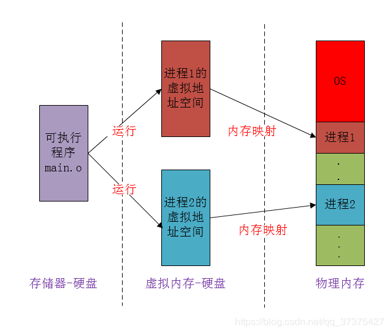
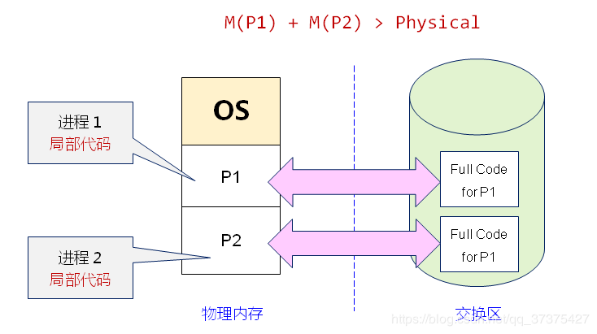
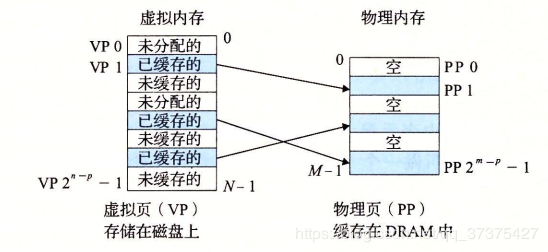
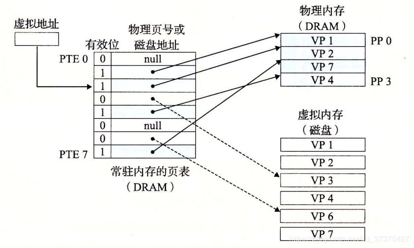

#### 1.1 什么是MMU

​MMU(Memory Management Unit)主要用来**管理虚拟存储器**、物理存储器的控制线路，同时也负责虚拟地址映射为物理地址，以及提供硬件机制的内存访问授权、多任务多进程操作系统。

#### 1.2 发展历史

> 注意：学习一个知识点
>
> 很重要的一步是了解其为什么而存在？
>
> 它的存在是为了解决什么问题？
>
> 最后，在学习的过程中带着这些问题去理解、去思考

​在许多年以前，还是使用DOS或一些古老的操作系统时，内存很小，同时，应用程序也很小，将程序存储在内存中基本能够满足需要。随着科技的发展，图形界面及一些其他更复杂的应用出现，内存已经无法存储这些应用程序了，通常的解决办法是将程序分割成很多个**覆盖块**，覆盖块0最先运行，运行结束之后，就调用另一个覆盖块，虽然这些操作由OS来完成，

​但是，需要程序员对程序进行分割，这非常不高效；因此，人们想出了一个**虚拟存储器（virtual memory）**的方法。

​虚拟存储器的基本思想是：**程序、数据、堆栈的总大小可以超过内存空间的大小，**

​操作系统将当前运行的部分保存在内存中，未使用的部分保存在磁盘中。

​比如一个**16MB的程序**和一个**内存只有4MB**的机器，操作系统通过选择可以决定哪部分4MB的程序内容保存在内存中，并在需要时，在内存与磁盘中交换程序代码，

这样16MB的代码就可以运行在4MB的机器中了

#### 1.2 相关概念

**地址范围、虚拟地址映射成物理地址**以及**分页机制**

- **地址范围**： 指处理器能够产生的地址集合，如一个32bit的处理器，其能产生的地址集合是**0x0000 0000 ~ 0xffff ffff**(4G)，这个地址范围也称为**虚拟地址空间**，其中对应的地址为**虚拟地址**。

- **虚拟地址与物理地址**： 与虚拟地址空间和虚拟地址相对应的是物理地址空间和物理地址；物理地址空间只是虚拟地址空间的一个**子集**。如一台内存为256MB的32bit主机，其虚拟地址空间是0 ~ 0xffffffff(4GB)，

- **物理地址空间**范围是0 ~ 0x0fff ffff(256M)

  
### 简单说说物理空间和虚拟空间

#### 1.3分页机制

- 如果处理器没有MMU，或者有MMU但没有启用，CPU执行单元发出的内存地址将直接传到芯片引脚上，被内存芯片（以下称为物理内存，以便与虚拟内存区分）接收，这称为物理地址（**Physical Address**，以下简称**PA**），如下图3-1-1所示；

如果处理器启用了MMU，CPU执行单元发出的内存地址将被MMU截获，从CPU到MMU的地址称为虚拟，而MMU将这个地址翻译成另一个地址发到CPU芯片的外部地址引脚上，也就是将VA映射成PA，，如下图3-1-2。

linux使用MMU的机器都采用**分页机制**。虚拟地址空间以**页**为单位进行划分，而相应的物理地址空间也被划分，其使用的单位称为**页帧**，页帧和页必须保持相同，因为**内存与外部存储器之间的传输是以页为单位进行传输的**。

例如，MMU可以通过一个映射项将VA的一页0xb70010000xb7001fff映射到PA的一页0x20000x2fff，如果CPU执行单元要访问虚拟地址0xb7001008，则实际访问到的物理地址是0x2008。

虚拟内存的哪个页面映射到物理内存的哪个页帧是通过**页表（Page Table）**来描述的，页表保存在**物理内存中**，**MMU会查找页表来确定一个VA应该映射到什么PA。**

#### 1.4页表的概念

##### 1.4.1  CPU在执行指令与数据时，获得的是虚拟内存的地址。

​但是CPU只能去物理内存寻址。此时，MMU就派上用场了。MMU负责，将虚拟地址，翻译成，真正运行时的物理地址。

MMU是如何将虚拟地址翻译成物理地址的，这个后面讲。现在先要了解一下交换区的概念。

> **交换区：** 实际上就是一块磁盘空间（硬盘空间）。虚拟内存与物理内存映射的时候，是将虚拟内存的代码放到交换区中，以后在CPU想要执行相关的指令或者数据时，如果内存中没有，先去交换区将需要的指令与数据映射到物理内存，然后CPU再执行

​虚拟内存与交换取的这种概念，实现了大内存需求量的（多个）进程，能够（同时）运行在较小的物理内存中。如下图所示：

> **上图中，说的是进程的局部代码在物理内存中运行。是因为程序具有局部性原则，所以在某一段很小的时间段内，只有很少一部分代码会被CPU执行。** 

​到这里，我们应该大致明白了虚拟内存的作用与简单机制。还剩下MMU如何翻译虚拟地址为物理地址的，这放到最后讲解。现在先总结一下虚拟内存机制：

> 虚拟内存需要重新映射到物理内存
> 虚拟地址映射到物理地址中的实际地址
> 每次只有进程的少部分代码会在物理内存中运行
> 大部分代码依然位于磁盘中（存储器硬盘）

##### 1.4.2、 页式内存管理

上一节笼统的介绍了虚拟内存的概念。接下来学习内存管理中的一种方式：页式内存管理。
页式内存管理中我们需要了解：

> - 页的概念
> - 页表的概念
> - 缺页的概念与页命中的概念
> - 分配页面
> - 程序的局部性原则
>

##### 1.4.2      页的概念

我们知道了**交换区**。我们知道交换区里面存放的是大部分的可执行代码与数据。而物理内存中，执行的是少部分的可执行代码与数据。

那么此时就需要从交换区获取程序的代码，将它拿到物理内存执行。**那么一次拿多少代码过来呢？这是一个问题！**

​为了CPU的高效执行以及方便的内存管理，每次需要拿一个**页的代码**。这个页，指的是一段连续的存储空间（常见的是4Kb），也叫作块。

​假设页的大小为P。在虚拟内存中，叫做**虚拟页**（VP）。从虚拟内存拿了一个页的代码要放到物理内存，那么自然物理内存也得有一个刚好一般大小的页才能存放虚拟页的代码。物理内存中的页叫做物理页（PP）

在任何时刻，虚拟页都是以下三种状态中的一种：

> -  未分配的：VM系统还未分配的页（或者未创建）。未分配的页还没有任何数据与代码与他们相关联，因此也就不占用任何磁盘。
> - 缓存的： 当前已缓存在物理内存中的已分配页
> - 未缓存的：未缓存在物理内存中的已分配页

​下图展示了一个8个虚拟页的小虚拟内存。其中：虚拟页0和3还没有被分配，因此在磁盘上还不存在。虚拟页1、4、 6被缓存在物理内存中。虚拟页2、 5、 7已经被分配，但是还没有缓存到物理内存中去执行。

##### 1.4.3 页表的概念

​虚拟内存中的一些虚拟页是缓存在物理内存中被执行的。理所应当，应该有一种机制，来判断虚拟页，是否被缓存在了物理内存中的某个物理页上。如果不命中（需要一个页的代码，但是这个页未缓存在物理内存中），系统还必须知道这个虚拟页存放在磁盘上的哪个位置，从而在物理内存中选择一个空闲页或者替换一个牺牲页，并将需要的虚拟页从磁盘复制到物理内存中。

​这些功能，是由软硬件结合完成的。 包括操作系统软件，MMU中的地址翻译硬件，和一个存放在物理内存中的页表的数据结构。

​上一节说将**虚拟页映射到物理页**，实际上就是MMU地址翻译硬件将一个虚拟地址翻译成物理地址时，都会去读取页表的内容。操作系统负责维护页表的内容，以及在磁盘与物理内存之间来回传送页。

**下图是一个页表的基本组织结构** 

如上图所示：

​页表实际上就是一个数组。这个数组存放的是一个称为页表条目（PTE）的结构。虚拟地址空间的每一个页在页表中，都有一个对应的页表条目（PTE）。虚拟页地址（首地址）翻译的时候就是查询的各个虚拟页在页表中的PTE，从而进行地址翻译的。

现在假设每一个PTE都有一个有效位和一个n位字段的地址。其中

> - 有效位：表示对应的虚拟页是否缓存在了物理内存中。**0表示未缓存。1表示已缓存**。
> - n位地址字段：如果未缓存（有效字段为0），n位地址字段不为空的话，这个n位地址字段就表示该虚拟页在磁盘上的起始的位置。如果这个n位字段为空，那么就说明该虚拟页未分配。如果已缓存（有效字段为1），n位地址字段肯定不为空，它表示该虚拟页在物理内存中的起始地址。

​综上分析，就得知，上图中：四个虚拟页VP1 , VP2, VP4 , VP7 是被缓存在物理内存中。 两个虚拟页VP0, VP5还未被分配。但是剩下的虚拟页VP3 ,VP6已经被分配了，但是还没有缓存到物理内存中去执行。

注意：任意的物理页，都可以缓存任意的虚拟页。（因为物理内存是全相联的）

##### 1.4.3  页命中

> **假设现在CPU想读取VP2页面中的某一个字节的内容。会发生什么呢？**

​当CPU得到一个地址vaddr想要访问它（这个addr就是上面想要访问的某一个字节的地址），

通过后面会学习的MMU地址翻译硬件，将虚拟地址addr作为索引定位到页表的PTE条目中的PTE2（这里假设是PTE2），

​从内存中去读到PTE2的有效位为1，说明该虚拟页面已经被缓存了，所以CPU使用该PTE2条目中的物理内存地址（这个物理内存地址是PP1中的起始地址）构造出vaddr的物理地址paddr（这个地址是PP1页面起始地址或后面的某一个地址）。

​然后CPU就会去paddr这个物理内存地址去取数据。这种情况，就是也命中。

实际上，上面的VP2的起始地址与paddr地址，很类似于内存的分段机制（X86以前就是分段机制），CPU访问内 

