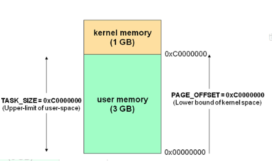

[TOC]
# 内核空间与用户空间

> 现代计算机都有两种以上的运行模式（普通模式、特权模式），
>
> linux系统只有两层：
>
> 内核空间
> - 高优先级模式（特权模式）
>
> 用户空间
> - 低优先级模式（普通模式）。

​linux系统在高优先级模式中运行系统**内核代码**以及与**硬件密切**相关的代码。**低优先级**运行**应用程序**与硬件无关部分。

​应用程序不能**直接操控硬件**或者调用内核函数，需借助一系列接口函数申请让系统调用相关代码在内核空间运行，获取代码运行权限。

 

## 好处

1. ​应用程序崩溃**不会造成内核崩溃**，拿windows举例来说，**QQ崩溃掉不会造成程序死机**。

2. ​每个应用程序或者进程都会有自己特定的地址、私有数据空间，**程序之间一般不会相互影响**		

例如QQ崩溃不会造成微信的崩溃。空间的隔离极大地提高了系统运行的稳定性。

## 计算机蓝屏带来的启示

​计算机蓝屏主要是因为计算机**硬件驱动不兼容**问题造成，**硬件驱动代码运行在内核空间**，与kernel运行在相同空间内，所以驱动程序发生问题容易造成系统的崩溃。将用户空间与内核空间隔离开，可减少系统崩溃的可能，提高系统的稳定性。毕竟现实情况中，应用程序崩溃的情况比蓝屏出现的概率要多的多得多。在linux中这种情况可以类比。

​window有上百个驱动，如蓝牙驱动，主板驱动，声卡驱动，麦克风驱动，显卡驱动，USB驱动等等！驱动过多容易造成蓝屏的出现。他们都运行在内核中。为什么会有这么多驱动。电脑中每一个配件都可以随意组合。形成一个完整的电脑

​在Android系统中，虽然也是基于Linux系统，但是这些驱动在Android厂商都已经消失了。全部集成化了、除了Binder驱动外，屏幕驱动，蓝牙驱动外几乎看不到其他驱动，这也是蓝屏比较少的原因

## 内核空间和用户空间区别

​每一个系统进程都拥有自己私有的地址空间和数据，用户空间造成的进程错误会被局部化，而不会影响到内核或者其他进程。（上面所说QQ和微信的例子）。

​当用户进程需要完成在特权模式下才能完成的某些工作时，通过linux向上提供的系统调用接口进入特权模式，然后执行调用所提供的有限功能
​应用程序正常情况下都是运行在普通模式下，这部分代码运行的空间称为用户空间，当代码通过系统调用计入到特权级别运行的时候，对应的代码执行空间称为内核空间。

> linux系统中每个进程占有4G空间（虚拟空间，并不一定真实占用）

**空间分布如下：**

1. 用户空间： 0~(3G-1) 普通的应用程序代码运行在此部分空间中
2. 内核空间： 3G~(4G-1) 内核代码段，其中驱动就是运行在此部分空间中

 

Linux 操作系统和驱动程序运行在内核空间，应用程序运行在用户空间。两者不能简单地使用指针传递数据，因为Linux使用的虚拟内存机制，用户空间的数据可能被换出，当内核空间使用用户空间指针时，对应的数据可能不在内存中。用户空间的内存映射采用段页式

进程寻址空间0~4G
进程在用户态只能访问0~3G，只有进入内核态才能访问3G~4G  
进程通过系统调用进入内核态
每个进程虚拟空间的3G~4G部分是相同的 

## 用户空间与内核空间交流

​用户空间应用程序往往需要调用硬件（QQ调用相机拍照）或者运行与系统核心相关的内容（360清理进程），免不了与内核打交道，他们之间调用关系又是怎样呢？

交流关系以open()文件打开函数为例
上层应用在用户空间执行到 open() API函数时，会触发系统软中断，系统调用函数 sys_open()系统调用函数，在内核空间执行open代码，这样用户空间的open函数内部代码就取得了在内核空间运行的权限，可以做一些比较牛比较核心的事情。
应用层API函数还有很多，大约有250个左右，涵盖范围包括文件操作、进程控制、网络操作等等。调用原理大致相同。

