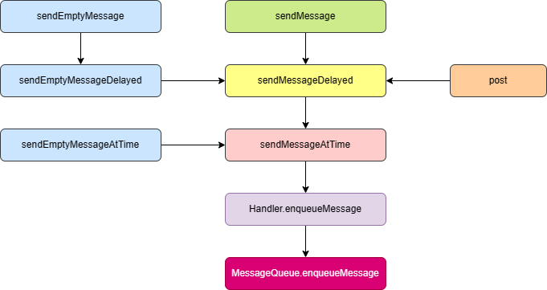
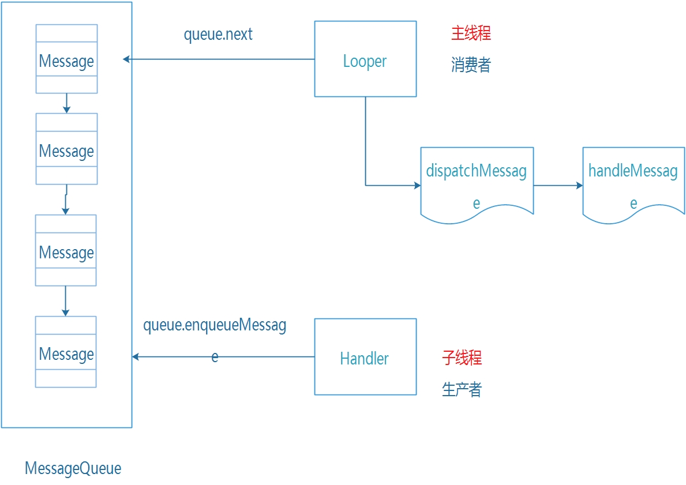
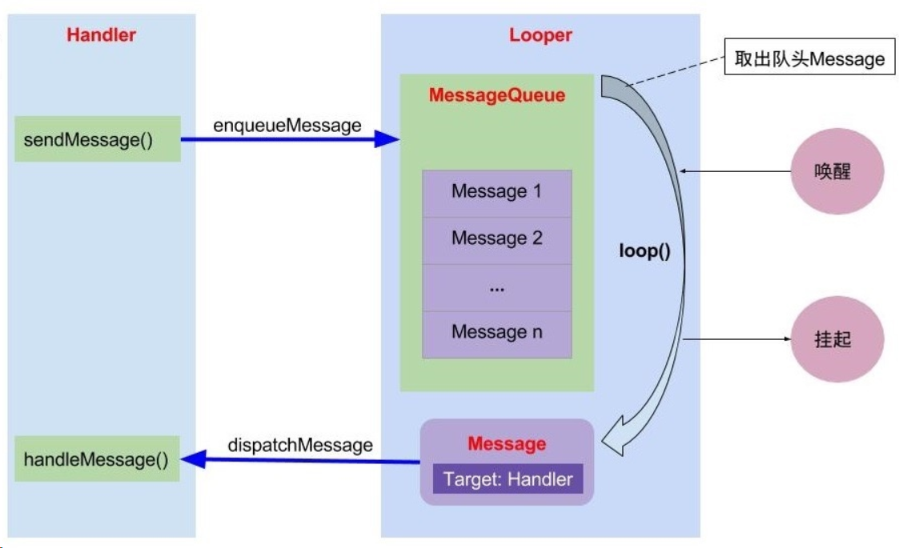
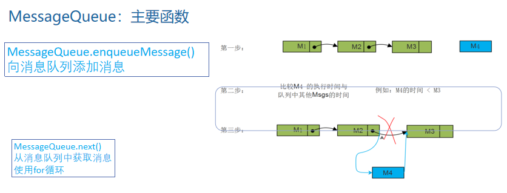
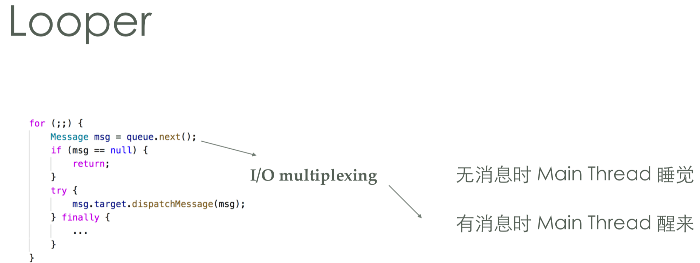
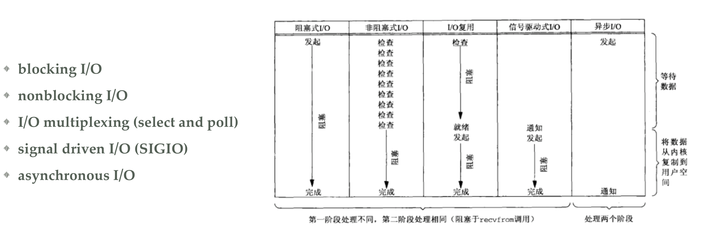
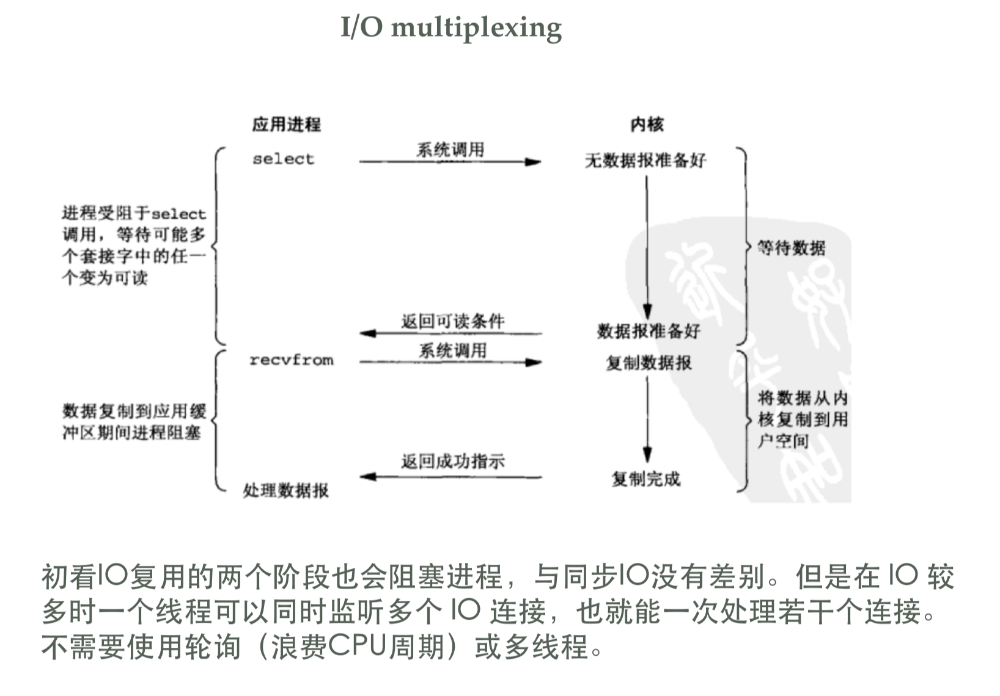
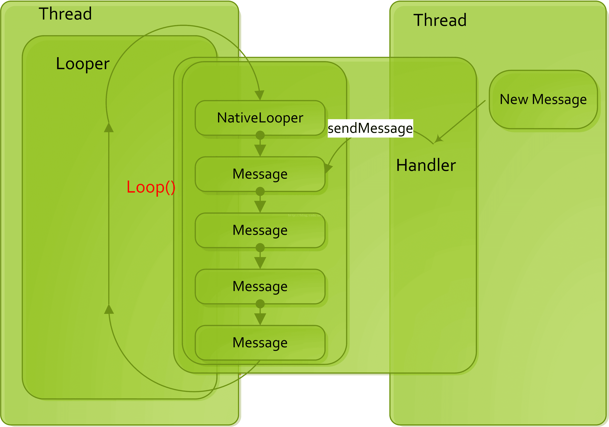
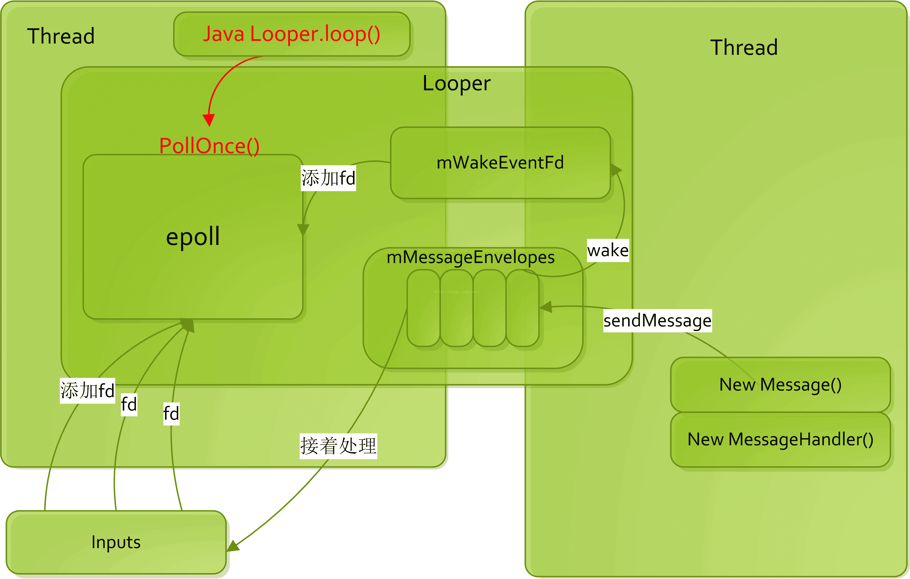

[TOC]

# Handler

Handler 作用是实现线程间通信。

为什么要有 Handler？
解决 线程切换 和 切换中的通信 问题。


| Handler 框架核心概念 | 传送装置 |
| :---: | :---: |
| Handler | 发送货物 和 处理货物 |
| Message | 货物 |
| MessageQueue | 传送带 |
| Looper | 电机 |
| Thread | 电源 |


Handler 框架设计模式是 生产者与消费者模式。

## 源码分析

### Handler 



Sdk/sources/android-29/android/os/Handler.java
AOSP/android10/frameworks/base/core/java/android/os/Handler.java
```Java
    public final Message obtainMessage()
    {
        return Message.obtain(this);
    }

    private boolean enqueueMessage(@NonNull MessageQueue queue, @NonNull Message msg,
            long uptimeMillis) {
        msg.target = this;                                      //可能造成内存泄漏
        msg.workSourceUid = ThreadLocalWorkSource.getUid();

        if (mAsynchronous) {
            msg.setAsynchronous(true);
        }
        return queue.enqueueMessage(msg, uptimeMillis);
    }
```

#### Handler内存泄漏问题及解决方案
1. 持有链：

Thread --> Looper --> MessageQueue --> Message --> Handler --> Activity

2. 长生命周期对象 Thread 持有 短生命周期对象 Activity 的引用。

如果Activity退出的时候，Thread还没结束，则Activity无法被回收，导致内存泄漏。

解决方案：
使用static关键字修饰，在onDestory的时候将消息清除。
Handler 使用弱引用。


### Looper





Sdk/sources/android-29/android/os/Looper.java
AOSP/android10/frameworks/base/core/java/android/os/Looper.java
```Java
    // sThreadLocal.get() will return null unless you've called prepare().
    
    static final ThreadLocal<Looper> sThreadLocal = new ThreadLocal<Looper>();

    public static void prepare() {
        prepare(true);
    }

    private static void prepare(boolean quitAllowed) {
        if (sThreadLocal.get() != null) {
            throw new RuntimeException("Only one Looper may be created per thread");
        }
        sThreadLocal.set(new Looper(quitAllowed));
    }

    public static void loop() {
        final Looper me = myLooper();
        if (me == null) {
            throw new RuntimeException("No Looper; Looper.prepare() wasn't called on this thread.");
        }
        final MessageQueue queue = me.mQueue;
        for (;;) {
            Message msg = queue.next(); // might block
            if (msg == null) {
                // No message indicates that the message queue is quitting.
                return;
            }
            ...
            msg.target.dispatchMessage(msg);
            ...
        }
    }

    public static @Nullable Looper myLooper() {
        return sThreadLocal.get();
    }

    private Looper(boolean quitAllowed) {
        mQueue = new MessageQueue(quitAllowed);
        mThread = Thread.currentThread();
    }

```

ThreadLocal 线程隔离工具类
Sdk/sources/android-29/java/lang/ThreadLocal.java
AOSP/android10/libcore/ojluni/src/main/java/java/lang
```Java
    public T get() {
        Thread t = Thread.currentThread();
        ThreadLocalMap map = getMap(t);
        if (map != null) {
            ThreadLocalMap.Entry e = map.getEntry(this);
            if (e != null) {
                @SuppressWarnings("unchecked")
                T result = (T)e.value;
                return result;
            }
        }
        return setInitialValue();
    }

    public void set(T value) {
        Thread t = Thread.currentThread();
        ThreadLocalMap map = getMap(t);
        if (map != null)
            map.set(this, value);
        else
            createMap(t, value);
    }
```


#### 一个Thread可以有几个Looper？几个Handler？
一个线程只能有一个Looper，可以有多个Handler。
在线程中我们需要调用Looper.perpare，他会创建一个Looper，每个线程都有一个LocalThreadMap，会将Looper保存在对应线程中的LocalThreadMap，key为ThreadLocal，value为Looper


#### 关于ThreadLocal，谈谈你的理解？
ThreadLocal类似于每个线程有一个单独的内存空间，不共享，ThreadLocal在set的时候会将数据存入对应线程的ThreadLocalMap中，key=ThreadLocal，value=值


### MessageQueue



Sdk/sources/android-29/android/os/MessageQueue.java
AOSP/android10/frameworks/base/core/java/android/os/MessageQueue.java
```Java
    Message mMessages;              //实际上是集合，不是单纯的对象

    private native static long nativeInit();
    private native static void nativeDestroy(long ptr);
    
    private native void nativePollOnce(long ptr, int timeoutMillis); /*non-static for callbacks*/
    private native static void nativeWake(long ptr);
    private native static boolean nativeIsPolling(long ptr);
    private native static void nativeSetFileDescriptorEvents(long ptr, int fd, int events);

    MessageQueue(boolean quitAllowed) {
        mQuitAllowed = quitAllowed;
        mPtr = nativeInit();
    }

    boolean enqueueMessage(Message msg, long when) {
        if (msg.target == null) {
            throw new IllegalArgumentException("Message must have a target.");
        }
        if (msg.isInUse()) {
            throw new IllegalStateException(msg + " This message is already in use.");
        }

        synchronized (this) {
            if (mQuitting) {
                IllegalStateException e = new IllegalStateException(
                        msg.target + " sending message to a Handler on a dead thread");
                Log.w(TAG, e.getMessage(), e);
                msg.recycle();
                return false;
            }

            msg.markInUse();
            msg.when = when;
            Message p = mMessages;
            boolean needWake;
            if (p == null || when == 0 || when < p.when) {
                // New head, wake up the event queue if blocked.
                msg.next = p;
                mMessages = msg;
                needWake = mBlocked;
            } else {
                // Inserted within the middle of the queue.  Usually we don't have to wake
                // up the event queue unless there is a barrier at the head of the queue
                // and the message is the earliest asynchronous message in the queue.
                needWake = mBlocked && p.target == null && msg.isAsynchronous();
                Message prev;
                for (;;) {
                    prev = p;
                    p = p.next;
                    if (p == null || when < p.when) {
                        break;
                    }
                    if (needWake && p.isAsynchronous()) {
                        needWake = false;
                    }
                }
                msg.next = p; // invariant: p == prev.next
                prev.next = msg;
            }

            // We can assume mPtr != 0 because mQuitting is false.
            if (needWake) {
                nativeWake(mPtr);       // 这里唤醒 nativePollOnce 的沉睡
            }
        }
        return true;
    }

    Message next() {
        //...
        int pendingIdleHandlerCount = -1; // -1 only during first iteration
        int nextPollTimeoutMillis = 0;
        for (;;) {
            if (nextPollTimeoutMillis != 0) {
                Binder.flushPendingCommands();
            }
            // nativePollOnce 这里陷入沉睡, 等待唤醒
            nativePollOnce(ptr, nextPollTimeoutMillis);
            synchronized (this) {
                // Try to retrieve the next message.  Return if found.
                final long now = SystemClock.uptimeMillis();
                Message prevMsg = null;
                Message msg = mMessages;
                if (msg != null && msg.target == null) {
                    // Stalled by a barrier.  Find the next asynchronous message in the queue.
                    do {
                        prevMsg = msg;
                        msg = msg.next;
                    } while (msg != null && !msg.isAsynchronous());
                }
                if (msg != null) {
                    if (now < msg.when) {
                        // Next message is not ready.  Set a timeout to wake up when it is ready.
                        nextPollTimeoutMillis = (int) Math.min(msg.when - now, Integer.MAX_VALUE);
                    } else {
                        // Got a message.
                        mBlocked = false;
                        if (prevMsg != null) {
                            prevMsg.next = msg.next;
                        } else {
                            mMessages = msg.next;
                        }
                        msg.next = null;
                        if (DEBUG) Log.v(TAG, "Returning message: " + msg);
                        msg.markInUse();
                        return msg;
                    }
                } else {
                    // No more messages.
                    nextPollTimeoutMillis = -1;
                }
                //...
            }
            //...
        }
    }
```

AOSP/android10/frameworks/base/core/jni/android_os_MessageQueue.cpp
```C++
void NativeMessageQueue::pollOnce(JNIEnv* env, jobject pollObj, int timeoutMillis) {
    mPollEnv = env;
    mPollObj = pollObj;
    mLooper->pollOnce(timeoutMillis);
    mPollObj = NULL;
    mPollEnv = NULL;

    if (mExceptionObj) {
        env->Throw(mExceptionObj);
        env->DeleteLocalRef(mExceptionObj);
        mExceptionObj = NULL;
    }
}

void NativeMessageQueue::wake() {
    mLooper->wake();
}

int NativeMessageQueue::handleEvent(int fd, int looperEvents, void* data) {
    int events = 0;
    if (looperEvents & Looper::EVENT_INPUT) {
        events |= CALLBACK_EVENT_INPUT;
    }
    if (looperEvents & Looper::EVENT_OUTPUT) {
        events |= CALLBACK_EVENT_OUTPUT;
    }
    if (looperEvents & (Looper::EVENT_ERROR | Looper::EVENT_HANGUP | Looper::EVENT_INVALID)) {
        events |= CALLBACK_EVENT_ERROR;
    }
    int oldWatchedEvents = reinterpret_cast<intptr_t>(data);
    int newWatchedEvents = mPollEnv->CallIntMethod(mPollObj,
            gMessageQueueClassInfo.dispatchEvents, fd, events);
    if (!newWatchedEvents) {
        return 0; // unregister the fd
    }
    if (newWatchedEvents != oldWatchedEvents) {
        setFileDescriptorEvents(fd, newWatchedEvents);
    }
    return 1;
}

static void android_os_MessageQueue_nativePollOnce(JNIEnv* env, jobject obj,
        jlong ptr, jint timeoutMillis) {
    NativeMessageQueue* nativeMessageQueue = reinterpret_cast<NativeMessageQueue*>(ptr);
    nativeMessageQueue->pollOnce(env, obj, timeoutMillis);
}

static void android_os_MessageQueue_nativeWake(JNIEnv* env, jclass clazz, jlong ptr) {
    NativeMessageQueue* nativeMessageQueue = reinterpret_cast<NativeMessageQueue*>(ptr);
    nativeMessageQueue->wake();
}


static const JNINativeMethod gMessageQueueMethods[] = {
    /* name, signature, funcPtr */
    { "nativeInit", "()J", (void*)android_os_MessageQueue_nativeInit },
    { "nativeDestroy", "(J)V", (void*)android_os_MessageQueue_nativeDestroy },
    { "nativePollOnce", "(JI)V", (void*)android_os_MessageQueue_nativePollOnce },
    { "nativeWake", "(J)V", (void*)android_os_MessageQueue_nativeWake },
    { "nativeIsPolling", "(J)Z", (void*)android_os_MessageQueue_nativeIsPolling },
    { "nativeSetFileDescriptorEvents", "(JII)V",
            (void*)android_os_MessageQueue_nativeSetFileDescriptorEvents },
};

int register_android_os_MessageQueue(JNIEnv* env) {
    int res = RegisterMethodsOrDie(env, "android/os/MessageQueue", gMessageQueueMethods,
                                   NELEM(gMessageQueueMethods));

    jclass clazz = FindClassOrDie(env, "android/os/MessageQueue");
    gMessageQueueClassInfo.mPtr = GetFieldIDOrDie(env, clazz, "mPtr", "J");
    gMessageQueueClassInfo.dispatchEvents = GetMethodIDOrDie(env, clazz,
            "dispatchEvents", "(II)I");

    return res;
}
```

AOSP/android10/system/core/libutils/Looper.cpp
```C++
int Looper::pollOnce(int timeoutMillis, int* outFd, int* outEvents, void** outData) {
    int result = 0;
    for (;;) {
        while (mResponseIndex < mResponses.size()) {
            const Response& response = mResponses.itemAt(mResponseIndex++);
            int ident = response.request.ident;
            if (ident >= 0) {
                int fd = response.request.fd;
                int events = response.events;
                void* data = response.request.data;
                if (outFd != NULL) *outFd = fd;
                if (outEvents != NULL) *outEvents = events;
                if (outData != NULL) *outData = data;
                return ident;
            }
        }

        if (result != 0) {
            if (outFd != NULL) *outFd = 0;
            if (outEvents != NULL) *outEvents = 0;
            if (outData != NULL) *outData = NULL;
            return result;
        }

        result = pollInner(timeoutMillis);
    }
}
int Looper::pollInner(int timeoutMillis) {
    // Adjust the timeout based on when the next message is due.
    if (timeoutMillis != 0 && mNextMessageUptime != LLONG_MAX) {
        nsecs_t now = systemTime(SYSTEM_TIME_MONOTONIC);
        int messageTimeoutMillis = toMillisecondTimeoutDelay(now, mNextMessageUptime);
        if (messageTimeoutMillis >= 0
                && (timeoutMillis < 0 || messageTimeoutMillis < timeoutMillis)) {
            timeoutMillis = messageTimeoutMillis;
        }
    }

    // Poll.
    int result = POLL_WAKE;
    mResponses.clear();
    mResponseIndex = 0;

    // We are about to idle.
    mPolling = true;

    struct epoll_event eventItems[EPOLL_MAX_EVENTS];
    // 这里重点
    int eventCount = epoll_wait(mEpollFd, eventItems, EPOLL_MAX_EVENTS, timeoutMillis);

    // No longer idling.
    mPolling = false;

    // Acquire lock.
    mLock.lock();

    // Rebuild epoll set if needed.
    if (mEpollRebuildRequired) {
        mEpollRebuildRequired = false;
        rebuildEpollLocked();
        goto Done;
    }

    // Check for poll error.
    if (eventCount < 0) {
        if (errno == EINTR) {
            goto Done;
        }
        ALOGW("Poll failed with an unexpected error: %s", strerror(errno));
        result = POLL_ERROR;
        goto Done;
    }

    // Check for poll timeout.
    if (eventCount == 0) {
        result = POLL_TIMEOUT;
        goto Done;
    }

    // Handle all events.
    for (int i = 0; i < eventCount; i++) {
        int fd = eventItems[i].data.fd;
        uint32_t epollEvents = eventItems[i].events;
        if (fd == mWakeEventFd) {
            if (epollEvents & EPOLLIN) {
                awoken();
            } else {
                ALOGW("Ignoring unexpected epoll events 0x%x on wake event fd.", epollEvents);
            }
        } else {
            ssize_t requestIndex = mRequests.indexOfKey(fd);
            if (requestIndex >= 0) {
                int events = 0;
                if (epollEvents & EPOLLIN) events |= EVENT_INPUT;
                if (epollEvents & EPOLLOUT) events |= EVENT_OUTPUT;
                if (epollEvents & EPOLLERR) events |= EVENT_ERROR;
                if (epollEvents & EPOLLHUP) events |= EVENT_HANGUP;
                pushResponse(events, mRequests.valueAt(requestIndex));
            } else {
                ALOGW("Ignoring unexpected epoll events 0x%x on fd %d that is "
                        "no longer registered.", epollEvents, fd);
            }
        }
    }
Done: ;

    // Invoke pending message callbacks.
    mNextMessageUptime = LLONG_MAX;
    while (mMessageEnvelopes.size() != 0) {
        nsecs_t now = systemTime(SYSTEM_TIME_MONOTONIC);
        const MessageEnvelope& messageEnvelope = mMessageEnvelopes.itemAt(0);
        if (messageEnvelope.uptime <= now) {
            // Remove the envelope from the list.
            // We keep a strong reference to the handler until the call to handleMessage
            // finishes.  Then we drop it so that the handler can be deleted *before*
            // we reacquire our lock.
            { // obtain handler
                sp<MessageHandler> handler = messageEnvelope.handler;
                Message message = messageEnvelope.message;
                mMessageEnvelopes.removeAt(0);
                mSendingMessage = true;
                mLock.unlock();
                handler->handleMessage(message);
            } // release handler

            mLock.lock();
            mSendingMessage = false;
            result = POLL_CALLBACK;
        } else {
            // The last message left at the head of the queue determines the next wakeup time.
            mNextMessageUptime = messageEnvelope.uptime;
            break;
        }
    }

    // Release lock.
    mLock.unlock();

    // Invoke all response callbacks.
    for (size_t i = 0; i < mResponses.size(); i++) {
        Response& response = mResponses.editItemAt(i);
        if (response.request.ident == POLL_CALLBACK) {
            int fd = response.request.fd;
            int events = response.events;
            void* data = response.request.data;
            // Invoke the callback.  Note that the file descriptor may be closed by
            // the callback (and potentially even reused) before the function returns so
            // we need to be a little careful when removing the file descriptor afterwards.
            int callbackResult = response.request.callback->handleEvent(fd, events, data);
            if (callbackResult == 0) {
                removeFd(fd, response.request.seq);
            }

            // Clear the callback reference in the response structure promptly because we
            // will not clear the response vector itself until the next poll.
            response.request.callback.clear();
            result = POLL_CALLBACK;
        }
    }
    return result;
}
```

`nativePollOnce` 方法用于“等待”, 直到下一条消息可用为止. 如果在此调用期间花费的时间很长, 则您的主线程没有实际工作要做, 而是等待下一个事件处理.无需担心.

**说明:**

因为主线程负责绘制 UI 和处理各种事件, 所以主线程拥有一个处理所有这些事件的循环. 该循环由 `Looper` 管理, 其工作非常简单: 它处理 `MessageQueue` 中的所有 `Message`.
例如, 响应于输入事件, 将消息添加到队列, 帧渲染回调, 甚至您的 `Handler.post` 调用. 
有时主线程无事可做（即队列中没有消息), 例如在完成渲染单帧之后(线程刚绘制了一帧, 并准备好下一帧, 等待适当的时间). `MessageQueue` 类中的两个 Java 方法对我们很有趣: `Message next()`和 `boolean enqueueMessage(Message, long)`. 顾名思义, `Message next()` 从队列中获取并返回下一个消息. 
如果队列为空(无返回值), 则该方法将调用 `native void nativePollOnce(long, int)`, 该方法将一直阻塞直到添加新消息为止. 此时,您可能会问`nativePollOnce` 如何知道何时醒来. 这是一个很好的问题. 当将 `Message` 添加到队列时, 框架调用 `enqueueMessage` 方法, 该方法不仅将消息插入队列, 而且还会调用`native static void nativeWake(long)`. `nativePollOnce` 和 `nativeWake` 的核心魔术发生在 native 代码中. native `MessageQueue` 利用名为 `epoll` 的 Linux 系统调用, 该系统调用可以监视文件描述符中的 IO 事件. `nativePollOnce` 在某个文件描述符上调用 `epoll_wait`, 而 `nativeWake` 写入一个 IO 操作到描述符, `epoll_wait` 等待. 然后, 内核从等待状态中取出 `epoll` 等待线程, 并且该线程继续处理新消息. 
如果您熟悉 Java 的 `Object.wait()`和 `Object.notify()`方法,可以想象一下 `nativePollOnce` 大致等同于 `Object.wait()`, `nativeWake` 等同于 `Object.notify()`,但它们的实现完全不同: `nativePollOnce` 使用 `epoll`, 而 `Object.wait` 使用 `futex` Linux 调用.
值得注意的是, `nativePollOnce` 和 `Object.wait` 都不会浪费 CPU 周期, 因为当线程进入任一方法时, 出于线程调度的目的, 该线程将被禁用(引用Object类的javadoc). 
但是, 某些事件探查器可能会错误地将等待 `epoll` 等待(甚至是 Object.wait)的线程识别为正在运行并消耗 CPU 时间, 这是不正确的.
如果这些方法实际上浪费了 CPU 周期, 则所有空闲的应用程序都将使用 100％ 的 CPU, 从而加热并降低设备速度.

**结论:**

`nativePollOnce`. 它只是表明所有消息的处理已完成, 线程正在等待下一个消息.





https://cloud.tencent.com/developer/article/1684951




Linux 有多个 IO 模型:

- 阻塞 IO
- 非阻塞 IO
- IO 复用, 对应 `select` `poll` `epoll` 都属于基于 IO 复用模式的调用
- 信号驱动 IO
- 异步 IO




#### 管道概述

管道，其本质是也是文件，但又和普通的文件会有所不同：管道缓冲区大小一般为1页，即4K字节。管道分为读端和写端，读端负责从管道拿数据，当数据为空时则阻塞；写端向管道写数据，当管道缓存区满时则阻塞。

在Handler机制中，Looper.loop方法会不断循环处理Message，其中消息的获取是通过 Message msg = queue.next(); 方法获取下一条消息。该方法中会调用nativePollOnce()方法，这便是一个native方法，再通过JNI调用进入Native层，在Native层的代码中便采用了管道机制。


#### Handler为何使用管道?

我们可能会好奇，既然是同一个进程间的线程通信，为何需要管道呢？

我们知道线程之间内存共享，通过Handler通信，消息池的内容并不需要从一个线程拷贝到另一个线程，因为两线程可使用的内存时同一个区域，都有权直接访问，当然也存在线程私有区域ThreadLocal（这里不涉及）。即然不需要拷贝内存，那管道是何作用呢？

**Handler机制中管道作用**就是当一个线程A准备好Message，并放入消息池，这时需要通知另一个线程B去处理这个消息。线程A向管道的写端写入数据1（对于老的Android版本是写入字符`W`），管道有数据便会唤醒线程B去处理消息。管道主要工作是用于通知另一个线程的，这便是最核心的作用。

这里我们通过两张图来展示Handler在Java层和在Native层的逻辑：

Java层：



Native层：




#### Handler为何采用管道而非Binder？

handler不采用Binder，并非binder完成不了这个功能，而是太浪费CPU和内存资源了。因为Binder采用C/S架构，一般用于不同进程间的通信。

- 从内存角度：通信过程中Binder还涉及一次内存拷贝，handler机制中的Message根本不需要拷贝，本身就是在同一个内存。Handler需要的仅仅是告诉另一个线程数据有了。

- 从CPU角度，为了Binder通信底层驱动还需要维护一个binder线程池，每次通信涉及binder线程的创建和内存分配等比较浪费CPU资源。

从上面的角度分析可得，Binder用于进程间通信，而Handler消息机制用于同进程的线程间通信，Handler不宜采用Binder。


### Message

Sdk/sources/android-29/android/os/Message.java
AOSP/android10/frameworks/base/core/java/android/os/Message.java
```Java
    Handler target;

    public static final Object sPoolSync = new Object();
    private static Message sPool;                   //Message回收池单向链表头，必须是静态变量
    private static int sPoolSize = 0;               //Message回收池单向链表大小，必须是静态变量

    private static final int MAX_POOL_SIZE = 50;

    private static boolean gCheckRecycle = true;

    /**
     * Return a new Message instance from the global pool. Allows us to
     * avoid allocating new objects in many cases.
     */
    public static Message obtain() {
        synchronized (sPoolSync) {
            if (sPool != null) {
                Message m = sPool;
                sPool = m.next;
                m.next = null;
                m.flags = 0; // clear in-use flag
                sPoolSize--;
                return m;
            }
        }
        return new Message();
    }

    public static Message obtain(Message orig) {
        Message m = obtain();
        m.what = orig.what;
        m.arg1 = orig.arg1;
        m.arg2 = orig.arg2;
        m.obj = orig.obj;
        m.replyTo = orig.replyTo;
        m.sendingUid = orig.sendingUid;
        m.workSourceUid = orig.workSourceUid;
        if (orig.data != null) {
            m.data = new Bundle(orig.data);
        }
        m.target = orig.target;
        m.callback = orig.callback;

        return m;
    }

    public static Message obtain(Handler h) {
        Message m = obtain();
        m.target = h;

        return m;
    }

    /**
     * Return a Message instance to the global pool.
     * <p>
     * You MUST NOT touch the Message after calling this function because it has
     * effectively been freed.  It is an error to recycle a message that is currently
     * enqueued or that is in the process of being delivered to a Handler.
     * </p>
     */
    public void recycle() {
        if (isInUse()) {
            if (gCheckRecycle) {
                throw new IllegalStateException("This message cannot be recycled because it "
                        + "is still in use.");
            }
            return;
        }
        recycleUnchecked();
    }

    /**
     * Recycles a Message that may be in-use.
     * Used internally by the MessageQueue and Looper when disposing of queued Messages.
     */
    
    void recycleUnchecked() {
        // Mark the message as in use while it remains in the recycled object pool.
        // Clear out all other details.
        flags = FLAG_IN_USE;
        what = 0;
        arg1 = 0;
        arg2 = 0;
        obj = null;
        replyTo = null;
        sendingUid = UID_NONE;
        workSourceUid = UID_NONE;
        when = 0;
        target = null;
        callback = null;
        data = null;

        synchronized (sPoolSync) {
            if (sPoolSize < MAX_POOL_SIZE) {
                next = sPool;
                sPool = this;
                sPoolSize++;
            }
        }
    }
```


#### Message可以如何创建？哪种效果更好，为什么？
handler.obtainMessage() 或者 Message.obtain() 来从Message的回收池中取出表头的 Message。
这样会复用之前的 Message 的内存，不会频繁的创建对象，导致内存抖动。
短时间内大量创建对象并且销毁，会造成内存抖动。根本解决方式是复用。


#### 享元设计模式有用到吗？
享元设计模式就是重复利用内存空间，减少对象的创建，Message中使用到了享元设计模式。
Message回收池，内部维护了一个单向链表，并且最大长度是50，当消息处理完之后会将消息内的属性设置为空，并且插入到链表的头部，使用obtain创建的Message会从头部获取空的Message。
一个线程对应一个Message回收池。
android.view.ViewGroup 的 内部类 TouchTarget 也用到了类似的机制。


Android 是事件为驱动的操作系统。
Android 系统对应多APP，一个服务端对应多个客户端，C/S架构，通信方式Socket。
Java Socket --> C Socket --> select


## Handler 面试题

### 用一句话概括Handler，并简述其原理。

Handler是Android系统的根本，在Android应用被启动的时候，会分配一个单独的虚拟机，虚拟机会执行 ActivityThread 中的main方法，在main方法中对主线程Looper进行了初始化，也就是几乎所有代码都执行在Handler内部。Handler也可以作为主线程和子线程通讯的桥梁。
Handler通过 sendMessage 发送消息，将消息放入 MessageQueue 中，在 MessageQueue 中通过时间的维度来进行排序，Looper通过调用loop方法不断的从 MessageQueue 中获取消息，执行Handler的 dispatchMessage ，最后调用 handleMessage方法。


### 可以在子线程直接new一个Handler吗？那该怎么做？
可以在子线程中创建Handler，我们需要调用Looper.perpare和Looper.loop方法。
或者通过获取主线程的looper来创建Handler。


### 主线程中Looper的轮询死循环为何没有阻塞主线程？
Looper轮询是死循环，但是当没有消息的时候他会block阻塞，ANR是当我们处理点击事件的时候5s内没有响应，我们在处理点击事件的时候也是用的Handler，所以一定会有消息执行，并且ANR也会发送Handler消息，所以不会阻塞主线程。
反过来说，如果不阻塞，ActivityThread 中的 main() 函数执行结束，App生命周期就结束了。


### 使用Hanlder的postDealy()后消息队列会发生什么变化？
Handler发送消息到消息队列，消息队列是一个时间优先级队列，内部是一个单向链表。
发动postDelay之后会将该消息进行时间排序存放到消息队列中。


### 点击页面上的按钮后更新TextView的内容，谈谈你的理解？（阿里面试题）
点击按钮的时候会发送消息到Handler，但是为了保证优先执行，会加一个标记异步，同时会发送一个target为null的消息，这样在使用消息队列的next获取消息的时候，如果发现消息的target为null，那么会遍历消息队列将有异步标记的消息获取出来优先执行，执行完之后会将target为null的消息移除。(同步屏障)


### 生产者-消费者设计模式懂不？
举个例子，面包店厨师不断在制作面包，客人来了之后就购买面包，这就是一个典型的生产者消费者设计模式。但是需要注意的是如果消费者消费能力大于生产者，或者生产者生产能力大于消费者，需要一个限制，在java里有一个blockingQueue。当目前容器内没有东西的时候，消费者来消费的时候会被阻塞，当容器满了的时候也会被阻塞。Handler.sendMessage相当于一个生产者,MessageQueue相当于容器，Looper相当于消费者。


### Handler是如何完成子线程和主线程通信的？
在主线程中创建Handler，在子线程中发送消息，放入到MessageQueue中,通过Looper.loop取出消息进行执行handleMessage，由于looper我们是在主线程初始化的，在初始化looper的时候会创建消息队列，所以消息是在主线程被执行的。


### Handler异步消息处理（HandlerThread）
内部使用了Handler+Thread，并且处理了getLooper的并发问题。如果获取Looper的时候发现Looper还没创建，则wait，等待looper创建了之后在notify


### 子线程中维护的Looper，消息队列无消息的时候处理方案是什么？有什么用？
子线程中创建了Looper，当没有消息的时候子线程将会被block，无法被回收，所以我们需要手动调用quit方法将消息删除并且唤醒looper，然后next方法返回null退出loop


### 既然可以存在多个Handler往MessageQueue中添加数据(发消息是各个handler可能处于不同线程)，那他内部是如何确保线程安全的？
在添加数据和执行next的时候都加了this锁，这样可以保证添加的位置是正确的，获取的也会是最前面的。


### 关于 IntentService，谈谈你的理解
HandlerThread + Service实现，可以实现Service在子线程中执行耗时操作，并且执行完耗时操作时候会将自己stop。


### Glide 是如何维护生命周期的？
一般想问的应该都是这里

```Java
@NonNull
private RequestManagerFragment getRequestManagerFragment(
    @NonNull final android.app.FragmentManager fm,
    @Nullable android.app.Fragment parentHint,
    boolean isParentVisible) {
    
    RequestManagerFragment current = (RequestManagerFragment)
    fm.findFragmentByTag(FRAGMENT_TAG);
    if (current == null) {
        current = pendingRequestManagerFragments.get(fm);
        if (current == null) {
            current = new RequestManagerFragment();
            current.setParentFragmentHint(parentHint);
            if (isParentVisible) {
                current.getGlideLifecycle().onStart();
            }
            pendingRequestManagerFragments.put(fm, current);
            fm.beginTransaction().add(current, FRAGMENT_TAG).commitAllowingStateLoss();
            handler.obtainMessage(ID_REMOVE_FRAGMENT_MANAGER, fm).sendToTarget();
        }
    }
    return current;
}
```

1. 为什么会判断两次null，再多次调用with的时候，commitAllowingStateLoss会被执行两次，所以我们需要使用一个map集合来判断，如果map中已经有了证明已经添加过了
2. handler.obtainMessage(ID_REMOVE_FRAGMENT_MANAGER, fm).sendToTarget();我们需要将map里面的记录删除。


