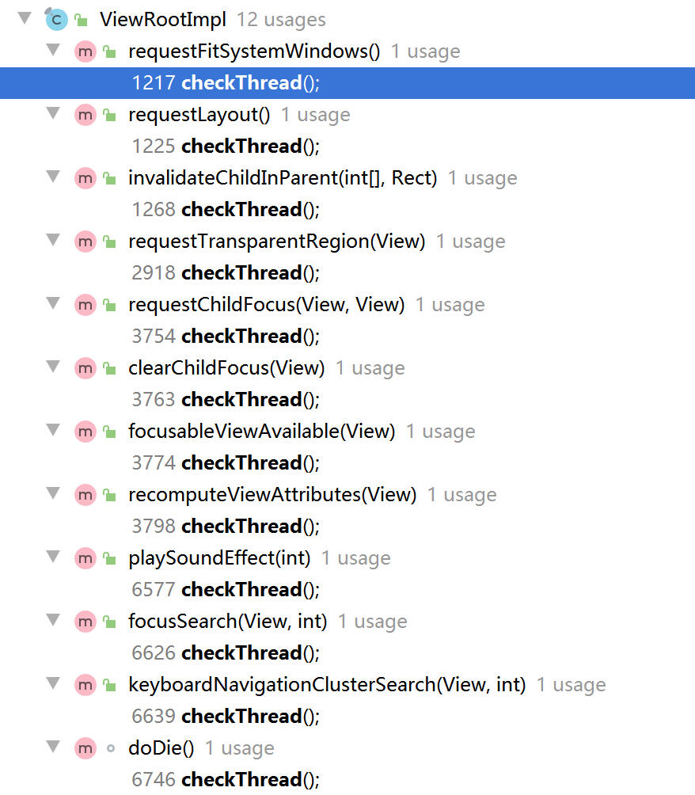

## 为什么系统不建议在子线程访问UI？（为什么不能在子线程更新UI？）
在某些情况下，在子线程中是可以更新UI的。但是在 ViewRootImpl 中对UI操作进行了 checkThread ，但是我们在 OnCreate 和 onResume 中可以使用子线程更新UI，由于我们在 ActivityThread 中的 performResumeActivity 方法中通过addView创建了 ViewRootImpl ，这个行为是在 onResume 之后调用的，所以在 OnCreate 和 onResume 可以进行更新UI。
但是我们不能在子线程中更新UI，因为如果添加了耗时操作之后，一旦 ViewRootImpl 被创建将会抛出异常。一旦在子线程中更新UI，容易产生并发问题。


### 1. UI线程的工作机制
主线程的工作机制可以概况为 **生产者 - 消费者 - 队列** 模型。


### 2. 为什么UI线程不设计成线程安全的
总所周知，如果设计成线程安全的，那性能肯定是大打折扣的，而UI更新的要求有如下特性：

- UI是具有可变性的，甚至是高频可变。
- UI对响应时间很敏感，这就要求UI操作必须要高效。
- UI组件必须批量绘制来保证效率。

所以为了保证渲染性能，UI线程不能设计成线程安全的。Android设计了Handler机制来更新UI是避免多个子线程更新UI导致的UI错乱的问题，也避免了通过加锁机制设计成线程安全的，因为那样会导致性能下降的很厉害。


### 3. 子线程能创建Handler吗？
能。但是需要先调用Looper.prepare()方法，否则会抛出运行时异常[Can't create handler inside thread that has not call Looper.prepared()]。


### 4. 子线程的Looper和主线程的Looper有什么区别
子线程的Looper可以退出的，主线程的Looper是不能退出的。


### 5. 非UI线程一定不能更新UI吗？
答：不一定。

说明：我们知道在Android提供的SurfaceView、GLSurfaceView里面是都能在非UI线程更新UI的。

并且在一些特定的场景下，子线程更新View也是能更新成功的。

例如，下面的代码在子线程中更新界面是可以成功的：


```Java
import android.app.Activity;
import android.os.Bundle;
import android.widget.Button;
 
public class TestActivity extends Activity {

    Button btn = null;

    public void onCreate(Bundle savedInstanceState) {
       super.onCreate(savedInstanceState);
       setContentView(R.layout.main);
       btn = (Button) findViewById(R.id.Button01);
       new TestThread(btn).start();
    }
 

    class TestThread extends Thread {
       Button btn = null;
       public TestThread(Button btn) {
           this.btn = btn;
       }

       @Override
       public void run() {
           btn.setText("TestThread.run");
       }
    }
}
```

当我们深入分析其原理的时候，就可以知道，能否更新成功的关键点在于是否会触发checkThead()导致更新失败，抛出异常：

```Java
void checkThread() {
    if (mThread != Thread.currentThread()) {
        throw new CalledFromWrongThreadException("Only the original thread that created a view hierarchy can touch its views.");
    }
}
```

而在ViewRootImpl中，会有这些方法调用到checkThread()方法：



经过分析，最终可以得到，在子线程中给TextView setText 不会抛出异常的两个场景：

1. TextView 还没来得及加入到ViewTree中

2. TextView已经被加入了ViewTree，但是被设置了固定宽高，且开启了硬件加速

子线程操作View 确实不一定导致Crash，那是因为刚好满足一定的条件并没有触发checkThread机制，但这并不代表我们在开发过程中可以这么写，其实我们还是应该遵循google的建议，更新UI始终在UI线程里去做。


# Android子线程真的不能更新UI么

Android单线程模型是这样描述的：

```
Android UI操作并不是线程安全的，并且这些操作必须在UI线程执行
```

如果在其它线程访问UI线程，Android提供了以下的方式：

```
Activity.runOnUiThread(Runnable)
View.post(Runnable)
View.postDelayed(Runnable, long)
Handler
```

为什么呢？在子线程中就不能操作UI么？

当一个程序第一次启动的时候，Android会同时启动一个对应的主线程，这个主线程就是UI线程，也就是ActivityThread。UI线程主要负责处理与UI相关的事件，如用户的按键点击、用户触摸屏幕以及屏幕绘图等。系统不会为每个组件单独创建一个线程，在同一个进程里的UI组件都会在UI线程里实例化，系统对每一个组件的调用都从UI线程分发出去。所以，响应系统回调的方法永远都是在UI线程里运行，如响应用户动作的onKeyDown()的回调。

那为什么选择一个主线程干这些活呢？换个说法，Android为什么使用单线程模型，它有什么好处？

先让我们看下单线程化的事件队列模型是怎么定义的：

```
采用一个专门的线程从队列中抽取事件，并把他们转发给应用程序定义的事件处理器
```

这看起来就是Android的消息队列、Looper和Handler嘛。类似知识请参考：[深入理解Message, MessageQueue, Handler和Looper](http://www.cnblogs.com/lao-liang/p/5073257.html)

其实现代GUI框架就是使用了类似这样的模型：模型创建一个专门的线程，事件派发线程来处理GUI事件。单线程化也不单单存在Android中，Qt、XWindows等都是单线程化。当然，也有人试图用多线程的GUI，最终由于竞争条件和死锁导致的稳定性问题等，又回到单线程化的事件队列模型老路上来。单线程化的GUI框架通过限制来达到线程安全：所有GUI中的对象，包括可视组件和数据模型，都只能被事件线程访问。

这就解释了Android为什么使用单线程模型。

那Android的UI操作并不是线程安全的又是怎么回事？

Android实现View更新有两组方法，分别是invalidate和postInvalidate。前者在UI线程中使用，后者在非UI线程中使用。换句话说，Android的UI操作不是线程安全可以表述为invalidate在子线程中调用会导致线程不安全。作一个假设，现在我用invalidate在子线程中刷新界面，同时UI线程也在用invalidate刷新界面，这样会不会导致界面的刷新不能同步？既然刷新不同步，那么invalidate就不能在子线程中使用。这就是invalidate不能在子线程中使用的原因。

postInvalidate可以在子线程中使用，它是怎么做到的？

看看源码是怎么实现的：


```
public void postInvalidate() {
    postInvalidateDelayed(0);
}

public void postInvalidateDelayed(long delayMilliseconds) {
    // We try only with the AttachInfo because there's no point in invalidating
    // if we are not attached to our window
    if (mAttachInfo != null) {
        Message msg = Message.obtain();
        msg.what = AttachInfo.INVALIDATE_MSG;
        msg.obj = this;
        mAttachInfo.mHandler.sendMessageDelayed(msg, delayMilliseconds);
    }
}
```

说到底还是通过Handler的sendMessageDelayed啊，还是逃不过消息队列，最终还是交给UI线程处理。所以View的更新只能由UI线程处理。

如果我非要在子线程中更新UI，那会出现什么情况呢？

```
android.view.ViewRoot$CalledFromWrongThreadException: Only the original thread that created a view hierarchy can touch its views.
```

抛了一个CalledFromWrongThreadException异常。

相信很多人遇到这个异常后，就会通过前面的四种方式中的其中一种解决：

```
Activity.runOnUiThread(Runnable)
View.post(Runnable)
View.postDelayed(Runnable, long)
Handler
```

说到底还没触发到根本，为什么会出现这个异常呢？这个异常在哪里抛出来的呢？

```
void checkThread() {
    if (mThread != Thread.currentThread()) {
        throw new CalledFromWrongThreadException(
                "Only the original thread that created a view hierarchy can touch its views.");
    }
}
```

该代码出自 framework/base/core/java/android/view/ViewRootImpl.java

再看下ViewRootImpl的构造函数，mThread就是在这初始化的：


```
public ViewRootImpl(Context context, Display display) {
    mContext = context;
    mWindowSession = WindowManagerGlobal.getWindowSession();
    mDisplay = display;
    mBasePackageName = context.getBasePackageName();

    mDisplayAdjustments = display.getDisplayAdjustments();

    mThread = Thread.currentThread();
    ......
}
```

再研究一下这个CalledFromWrongThreadException异常的堆栈，会发现最后到了invalidateChild和invalidateChildInParent方法中：


```
@Override
public void invalidateChild(View child, Rect dirty) {
    invalidateChildInParent(null, dirty);
}

@Override
public ViewParent invalidateChildInParent(int[] location, Rect dirty) {
    checkThread();
    ......
}
```

最终通过checkThread形成了这个异常。说到底，非UI线程是可以刷新UI的呀，前提是它要拥有自己的ViewRoot。如果想直接创建ViewRoot实例，你会发现找不到这个类。那怎么做呢？通过WindowManager。


```
class NonUiThread extends Thread{
      @Override
      public void run() {
         Looper.prepare();
         TextView tx = new TextView(MainActivity.this);
         tx.setText("non-UiThread update textview");
 
         WindowManager windowManager = MainActivity.this.getWindowManager();
         WindowManager.LayoutParams params = new WindowManager.LayoutParams(
             200, 200, 200, 200, WindowManager.LayoutParams.FIRST_SUB_WINDOW,
                 WindowManager.LayoutParams.TYPE_TOAST,PixelFormat.OPAQUE);
         windowManager.addView(tx, params); 
         Looper.loop();
     }
 }
```


就是通过windowManager.addView创建了ViewRoot，WindowManagerImpl.java中的addView方法：

```
@Override
public void addView(@NonNull View view, @NonNull ViewGroup.LayoutParams params) {
    applyDefaultToken(params);
    mGlobal.addView(view, params, mDisplay, mParentWindow);
}
private final WindowManagerGlobal mGlobal = WindowManagerGlobal.getInstance();
```

mGlobal是一个WindowManagerGlobal实例，代码在 
frameworks/base/core/java/android/view/WindowManagerGlobal.java中，具体实现如下：


```
public void addView(View view, ViewGroup.LayoutParams params,
            Display display, Window parentWindow) {
        if (view == null) {
            throw new IllegalArgumentException("view must not be null");
        }
        if (display == null) {
            throw new IllegalArgumentException("display must not be null");
        }
        if (!(params instanceof WindowManager.LayoutParams)) {
            throw new IllegalArgumentException("Params must be WindowManager.LayoutParams");
        }

        final WindowManager.LayoutParams wparams = (WindowManager.LayoutParams) params;
        if (parentWindow != null) {
            parentWindow.adjustLayoutParamsForSubWindow(wparams);
        } else {
            // If there's no parent, then hardware acceleration for this view is
            // set from the application's hardware acceleration setting.
            final Context context = view.getContext();
            if (context != null
                    && (context.getApplicationInfo().flags
                            & ApplicationInfo.FLAG_HARDWARE_ACCELERATED) != 0) {
                wparams.flags |= WindowManager.LayoutParams.FLAG_HARDWARE_ACCELERATED;
            }
        }

        ViewRootImpl root;
        View panelParentView = null;

        synchronized (mLock) {
            // Start watching for system property changes.
            if (mSystemPropertyUpdater == null) {
                mSystemPropertyUpdater = new Runnable() {
                    @Override public void run() {
                        synchronized (mLock) {
                            for (int i = mRoots.size() - 1; i >= 0; --i) {
                                mRoots.get(i).loadSystemProperties();
                            }
                        }
                    }
                };
                SystemProperties.addChangeCallback(mSystemPropertyUpdater);
            }

            int index = findViewLocked(view, false);
            if (index >= 0) {
                if (mDyingViews.contains(view)) {
                    // Don't wait for MSG_DIE to make it's way through root's queue.
                    mRoots.get(index).doDie();
                } else {
                    throw new IllegalStateException("View " + view
                            + " has already been added to the window manager.");
                }
                // The previous removeView() had not completed executing. Now it has.
            }

            // If this is a panel window, then find the window it is being
            // attached to for future reference.
            if (wparams.type >= WindowManager.LayoutParams.FIRST_SUB_WINDOW &&
                    wparams.type <= WindowManager.LayoutParams.LAST_SUB_WINDOW) {
                final int count = mViews.size();
                for (int i = 0; i < count; i++) {
                    if (mRoots.get(i).mWindow.asBinder() == wparams.token) {
                        panelParentView = mViews.get(i);
                    }
                }
            }

            root = new ViewRootImpl(view.getContext(), display);

            view.setLayoutParams(wparams);

            mViews.add(view);
            mRoots.add(root);
            mParams.add(wparams);
        }

        // do this last because it fires off messages to start doing things
        try {
            root.setView(view, wparams, panelParentView);
        } catch (RuntimeException e) {
            // BadTokenException or InvalidDisplayException, clean up.
            synchronized (mLock) {
                final int index = findViewLocked(view, false);
                if (index >= 0) {
                    removeViewLocked(index, true);
                }
            }
            throw e;
        }
    }
```


所以，非UI线程能更新UI，只要它有自己的 ViewRoot 。

延伸一下：Android Activity 本身是在什么时候创建 ViewRoot 的呢？

既然是单线程模型，就要先找到这个UI线程实现类 ActivityThread ，看里面哪里 addView 了。没错，是在 onResume 里面，对应ActivityThread就是 handleResumeActivity 这个方法：


```
final void handleResumeActivity(IBinder token,
            boolean clearHide, boolean isForward, boolean reallyResume) {
        // If we are getting ready to gc after going to the background, well
        // we are back active so skip it.
        unscheduleGcIdler();
        mSomeActivitiesChanged = true;

        // TODO Push resumeArgs into the activity for consideration
        ActivityClientRecord r = performResumeActivity(token, clearHide);
        ......
        if (r.window == null && !a.mFinished && willBeVisible) {
            r.window = r.activity.getWindow();
            View decor = r.window.getDecorView();
            decor.setVisibility(View.INVISIBLE);
            ViewManager wm = a.getWindowManager();
            WindowManager.LayoutParams l = r.window.getAttributes();
            a.mDecor = decor;
            l.type = WindowManager.LayoutParams.TYPE_BASE_APPLICATION;
            l.softInputMode |= forwardBit;
            if (a.mVisibleFromClient) {
                a.mWindowAdded = true;
                wm.addView(decor, l);
            }

        // If the window has already been added, but during resume
        // we started another activity, then don't yet make the
        // window visible.
        } else if (!willBeVisible) {
            if (localLOGV) Slog.v(
                TAG, "Launch " + r + " mStartedActivity set");
            r.hideForNow = true;
        }
    ......
}
```


所以，如果在onCreate中通过子线程直接更新UI，并不会抛CalledFromWrongThreadException异常。但是一般情况下，我们不会在onCreate中做这样的事情。

这就是Android为我们设计的单线程模型，核心就是一句话：Android UI操作并不是线程安全的，并且这些操作必须在UI线程执行。但这一句话背后，却隐藏着我们平时看不见的代码实现，只有搞懂这些，我们才能知其然知其所以然。


