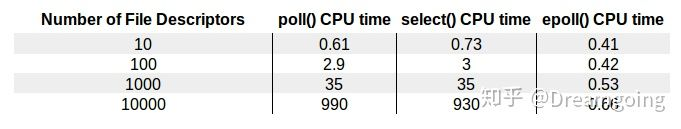
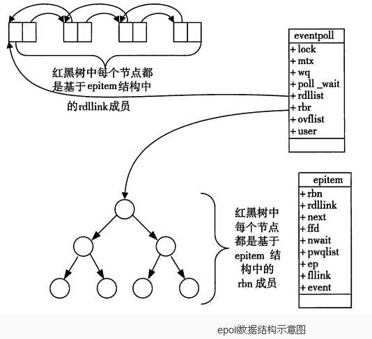
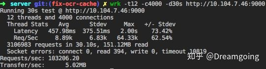

[TOC]

# epoll

Epoll是linux2.6内核的一个新的系统调用，Epoll在设计之初，就是为了替代select，Epoll线性复杂度的模型，epoll的时间复杂度为O(1), 也就意味着，Epoll在高并发场景，随着文件描述符的增长，有良好的可扩展性。

- `select` 和 `poll` 监听文件描述符list，进行一个线性的查找 O(n)
- `epoll`: 使用了内核文件级别的回调机制O(1)

下图展示了文件描述符的量级和CPU耗时：



在linux 没有实现epoll事件驱动机制之前，我们一般选择用select或者poll等IO多路复用的方法来实现并发服务程序。在linux新的内核中，有了一种替换它的机制，就是epoll。

## Socket中 select()和poll() IO多路复用模型

**select的缺点：
mmap内存     **

1.单个进程能够监视的文件描述符的数量存在最大限制，通常是1024，当然可以更改数量，但由于select采用轮询的方式扫描文件描述符，文件描述符数量越多，性能越差；(在linux内核头文件中，有这样的定义：#define __FD_SETSIZE 1024)

2.内核 / 用户空间内存拷贝问题，select需要复制大量的句柄数据结构，产生巨大的开销；

3.select返回的是含有整个句柄的数组，应用程序需要遍历整个数组才能发现哪些句柄发生了事件；
4.select的触发方式是水平触发，应用程序如果没有完成对一个已经就绪的文件描述符进行IO操作，那么之后每次select调用还是会将这些文件描述符通知进程。

相比select模型，poll使用链表保存文件描述符，因此没有了监视文件数量的限制，但其他三个缺点依然存在。

假设我们的服务器需要支持100万的并发连接，则在__FD_SETSIZE 为1024的情况下，则我们至少需要开辟1k个进程才能实现100万的并发连接。除了进程间上下文切换的时间消耗外，从内核/用户空间大量的无脑内存拷贝、数组轮询等，是系统难以承受的。因此，基于select模型的服务器程序，要达到10万级别的并发访问，是一个很难完成的任务。

## epoll IO多路复用模型实现机制

由于epoll的实现机制与select/poll机制完全不同，上面所说的 select的缺点在epoll上不复存在。

设想一下如下场景：有100万个客户端同时与一个服务器进程保持着TCP连接。而每一时刻，通常只有几百上千个TCP连接是活跃的(事实上大部分场景都是这种情况)。如何实现这样的高并发？

在select/poll时代，服务器进程每次都把这100万个连接告诉操作系统(从用户态复制句柄数据结构到内核态)，让操作系统内核去查询这些套接字上是否有事件发生，轮询完后，再将句柄数据复制到用户态，让服务器应用程序轮询处理已发生的网络事件，这一过程资源消耗较大，因此，select/poll一般只能处理几千的并发连接。

epoll的设计和实现与select完全不同。
epoll通过在Linux内核中申请一个简易的文件系统(文件系统一般用什么数据结构实现？B+树(HashMap是红黑树，查询快))。
把原先的select/poll调用分成了3个部分：

1）调用epoll_create()建立一个epoll对象(在epoll文件系统中为这个句柄对象分配资源)

2）调用epoll_ctl向epoll对象中添加这100万个连接的套接字

3）调用epoll_wait收集发生的事件的连接

如此一来，要实现上面说是的场景，只需要在进程启动时建立一个epoll对象，然后在需要的时候向这个epoll对象中添加或者删除连接。同时，epoll_wait的效率也非常高，因为调用epoll_wait时，并没有一股脑的向操作系统复制这100万个连接的句柄数据，内核也不需要去遍历全部的连接。

## epoll实现机制

当某一进程调用epoll_create方法时，Linux内核会创建一个eventpoll结构体，这个结构体中有两个成员与epoll的使用方式密切相关。eventpoll结构体如下所示：

```
struct eventpoll{
    ....
    /*红黑树的根节点，这颗树中存储着所有添加到epoll中的需要监控的事件*/
    struct rb_root rbr;
    /*双链表中则存放着将要通过epoll_wait返回给用户的满足条件的事件*/
    struct list_head rdlist;
    ....
};
```

每一个epoll对象都有一个独立的eventpoll结构体，用于存放通过epoll_ctl方法向epoll对象中添加进来的事件。这些事件都会挂载在红黑树中，如此，重复添加的事件就可以通过红黑树而高效的识别出来(红黑树的插入时间效率是lgn，其中n为树的高度)。

而所有**添加到epoll中的事件都会与设备(网卡)驱动程序建立回调关系，也就是说，当相应的事件发生时会调用这个回调方法**。这个回调方法在内核中叫ep_poll_callback,它会将发生的事件添加到rdlist双链表中。

在epoll中，对于每一个事件，都会建立一个epitem结构体，如下所示：

```
struct epitem{
    struct rb_node rbn;//红黑树节点
    struct list_head rdllink;//双向链表节点
    struct epoll_filefd ffd; //事件句柄信息
    struct eventpoll *ep; //指向其所属的eventpoll对象
    struct epoll_event event; //期待发生的事件类型
}
```

当调用epoll_wait检查是否有事件发生时，只需要检查eventpoll对象中的rdlist双链表中是否有epitem元素即可。如果rdlist不为空，则把发生的事件复制到用户态，同时将事件数量返回给用户。



通过红黑树和双链表数据结构，并结合回调机制，造就了epoll的高效。

## epoll的接口

**1.epoll_create**

创建epoll句柄
函数声明：int epoll_create(int size)

参数：size用来告诉内核这个监听的数目一共有多大。
返回值：返回创建了的epoll句柄。
当创建好epoll句柄后，它就是会占用一个fd值，在linux下如果查看/proc/进程id/fd/，是能够看到这个fd的，所以在使用完epoll后，必须调用close()关闭，否则可能导致fd被耗尽。

/proc/sys/fs/epoll/max_user_watches
表示用户能注册到 epoll 实例中的最大文件描述符的数量限制。

**2.epoll_ctl**

将被监听的描述符添加到epoll句柄或从epool句柄中删除或者对监听事件进行修改。
函数申明：int epoll_ctl(int epfd, int op, int fd, struct epoll_event*event);

参数：
epfd： epoll_create()的返回值
op：表示要进行的操作，其值分别为：
EPOLL_CTL_ADD： 注册新的fd到epfd中；
EPOLL_CTL_MOD： 修改已经注册的fd的监听事件；
EPOLL_CTL_DEL： 从epfd中删除一个fd；
fd：需要操作/监听的文件句柄
event：是告诉内核需要监听什么事件，struct epoll_event如下：

```
typedef union epoll_data { 
    void *ptr; 
    int fd; 
    __uint32_t u32; 
    __uint64_t u64; 
    } epoll_data_t; 

    struct epoll_event { 
    __uint32_t events; /* Epoll events */ 
    epoll_data_t data; /* User data variable */ 
}; 
```

边沿触发vs水平触发
epoll 事件有两种模型，边沿触发：edge-triggered (ET)， 水平触发：level-triggered (LT)。
水平触发(level-triggered)：
socket接收缓冲区不为空 有数据可读 读事件一直触发
socket发送缓冲区不满 可以继续写入数据 写事件一直触发

边沿触发(edge-triggered)：
socket的接收缓冲区状态变化时触发读事件，即空的接收缓冲区刚接收到数据时触发读事件
socket的发送缓冲区状态变化时触发写事件，即满的缓冲区刚空出空间时触发读事件
边沿触发仅触发一次，水平触发会一直触发。


events可以是以下几个宏的集合：

EPOLLIN：触发该事件，表示对应的文件描述符上有可读数据。(包括对端SOCKET正常关闭)；
EPOLLOUT：触发该事件，表示对应的文件描述符上可以写数据；
EPOLLPRI：表示对应的文件描述符有紧急的数据可读（这里应该表示有带外数据到来）；
EPOLLERR：表示对应的文件描述符发生错误；
EPOLLHUP： 表示对应的文件描述符被挂断；
EPOLLET：将EPOLL设为边缘触发(EdgeTriggered)模式，这是相对于水平触发(Level Triggered)来说的。
EPOLLONESHOT： 只监听一次事件，当监听完这次事件之后，如果还需要继续监听这个socket的话，需要再次把这个socket加入到EPOLL队列里。

libevent 采用水平触发， nginx 采用边沿触发。

示例：

```
struct epoll_event ev;
//设置与要处理的事件相关的文件描述符
ev.data.fd=listenfd;
//设置要处理的事件类型
ev.events=EPOLLIN|EPOLLET;
//注册epoll事件
epoll_ctl(epfd,EPOLL_CTL_ADD,listenfd,&ev);
```

**1.epoll_wait**

等待注册在epfd上的socket fd的事件的发生，如果发生则将发生的sokct fd和事件类型放入到events数组中。
函数原型：`int epoll_wait(int epfd, struct epoll_event * events, int maxevents, int timeout);`

参数：
epfd：由epoll_create 生成的epoll文件描述符
events：用于回传代处理事件的数组
maxevents：每次能处理的最大事件数
timeout：等待I/O事件发生的超时毫秒数，-1相当于阻塞，0相当于非阻塞。一般用-1即可

## epoll的工作模式

ET(EdgeTriggered):高速工作模式，只支持no_block(非阻塞模式)。在此模式下，当描述符从未就绪变为就绪时，内核通过epoll告知。然后它会假设用户知道文件描述符已经就绪，并且不会再为那个文件描述符发送更多的就绪通知，直到某些操作导致那个文件描述符不再为就绪状态了。(触发模式只在数据就绪时通知一次，若数据没有读完，下一次不会通知，直到有新的就绪数据)

LT(LevelTriggered):缺省工作方式，支持blocksocket和no_blocksocket。在LT模式下内核会告知一个文件描述符是否就绪了，然后可以对这个就绪的fd进行IO操作。如果不作任何操作，内核还是会继续通知！若数据没有读完，内核也会继续通知，直至设备数据为空为止！

## 示例说明：

1.我们已经把一个用来从管道中读取数据的文件句柄(RFD)添加到epoll描述符
\2. 这个时候从管道的另一端被写入了2KB的数据
\3. 调用epoll_wait(2)，并且它会返回RFD，说明它已经准备好读取操作
\4. 然后我们读取了1KB的数据
\5. 调用epoll_wait(2)……

```C
    #define MAX_EVENTS 10
    struct epoll_event ev, events[MAX_EVENTS];
    int listen_sock, conn_sock, nfds, epollfd;
    /* Code to set up listening socket, 'listen_sock',
    (socket(), bind(), listen()) omitted */
    // 创建epoll实例
    epollfd = epoll_create1(0);
    if (epollfd == -1) {
        perror("epoll_create1");
        exit(EXIT_FAILURE);
    }
    // 将监听的端口的socket对应的文件描述符添加到epoll事件列表中
    ev.events = EPOLLIN;
    ev.data.fd = listen_sock;
    if (epoll_ctl(epollfd, EPOLL_CTL_ADD, listen_sock, &ev) == -1) {
        perror("epoll_ctl: listen_sock");
        exit(EXIT_FAILURE);
    }
    for (;;) {
        // epoll_wait 阻塞线程，等待事件发生
        nfds = epoll_wait(epollfd, events, MAX_EVENTS, -1);
        if (nfds == -1) {
            perror("epoll_wait");
            exit(EXIT_FAILURE);
        }
        for (n = 0; n < nfds; ++n) {
            if (events[n].data.fd == listen_sock) {
                // 新建的连接
                conn_sock = accept(listen_sock,
                (struct sockaddr *) &addr, &addrlen);
                // accept 返回新建连接的文件描述符
                if (conn_sock == -1) {
                    perror("accept");
                    exit(EXIT_FAILURE);
                }
                setnonblocking(conn_sock);
                // setnotblocking 将该文件描述符置为非阻塞状态
                ev.events = EPOLLIN | EPOLLET;
                ev.data.fd = conn_sock;
                // 将该文件描述符添加到epoll事件监听的列表中，使用ET模式
                if (epoll_ctl(epollfd, EPOLL_CTL_ADD, conn_sock,
                    &ev) == -1) {
                    perror("epoll_ctl: conn_sock");
                    exit(EXIT_FAILURE);
                }
            }
        } else {
            // 使用已监听的文件描述符中的数据
            do_use_fd(events[n].data.fd);
        }
    }
```


**epoll的通俗解释**

epoll的通俗解释是一种当文件描述符的内核缓冲区非空的时候，发出可读信号进行通知，当写缓冲区不满的时候，发出可写信号通知的机制

**epoll的API详解**

epoll的核心是3个API，核心数据结构是：1个红黑树和1个链表


JDK在Linux已经默认使用epoll方式，但是JDK的epoll采用的是水平触发，而Netty重新实现了epoll机制，采用边缘触发方式，netty epoll transport 暴露了更多的nio没有的配置参数，如 TCP_CORK, SO_REUSEADDR等等；另外像Nginx也采用边缘触发。

#### **1.2 epoll与select、poll的对比**

**1.2.1. 用户态将文件描述符传入内核的方式**

**select：**创建3个文件描述符集并拷贝到内核中，分别监听读、写、异常动作。

这里受到单个进程可以打开的fd数量限制，默认是1024。


**poll：**将传入的struct pollfd结构体数组拷贝到内核中进行监听。

epoll：执行epoll_create会在内核的高速cache区中建立一颗红黑树以及就绪链表(该链表存储已经就绪的文件描述符)。

接着用户执行的epoll_ctl函数添加文件描述符会在红黑树上增加相应的结点。


##### 1.2.3 内核态检测文件描述符读写状态的方式**

**select：**采用轮询方式，遍历所有fd，最后返回一个描述符读写操作是否就绪的mask掩码，根据这个掩码给fd_set赋值。


**poll：**同样采用轮询方式，查询每个fd的状态，如果就绪则在等待队列中加入一项并继续遍历。


**epoll：**采用回调机制。在执行epoll_ctl的add操作时，不仅将文件描述符放到红黑树上，而且也注册了回调函数，

内核在检测到某文件描述符可读/可写时会调用回调函数，该回调函数将文件描述符放在就绪链表中。


##### **1.2.4 . 找到就绪的文件描述符并传递给用户态的方式**

select：将之前传入的fd_set拷贝传出到用户态并返回就绪的文件描述符总数。用户态并不知道是哪些文件描述符处于就绪态，需要遍历来判断。


poll：将之前传入的fd数组拷贝传出用户态并返回就绪的文件描述符总数。用户态并不知道是哪些文件描述符处于就绪态，需要遍历来判断。


epoll：epoll_wait只用观察就绪链表中有无数据即可，最后将链表的数据返回给数组并返回就绪的数量。内核将就绪的文件描述符放在传入的数组中，所以只用遍历依次处理即可。这里返回的文件描述符是通过mmap让内核和用户空间共享同一块内存实现传递的，减少了不必要的拷贝。


##### **1.2.5 重复监听的处理方式**

select：将新的监听文件描述符集合拷贝传入内核中，继续以上步骤。


poll：将新的struct pollfd结构体数组拷贝传入内核中，继续以上步骤。


epoll：无需重新构建红黑树，直接沿用已存在的即可。


##### 1.2.6 **epoll更高效的原因**

select和poll的动作基本一致，只是poll采用链表来进行文件描述符的存储，

而select采用fd标注位来存放，所以select会受到最大连接数的限制，而poll不会。


select、poll、epoll虽然都会返回就绪的文件描述符数量。**但是select和poll并不会明确指出是哪些文件描述符就绪，而epoll会。**


**造成的区别就是，系统调用返回后，调用select和poll的程序需要遍历监听的整个文件描述符找到是谁处于就绪，**


而epoll则直接处理即可。select、poll都需要将有关文件描述符的数据结构拷贝进内核，最后再拷贝出来。而epoll创建的有关文件描述符的数据结构本身就存于内核态中，


**系统调用返回时利用mmap()文件映射内存加速与内核空间的消息传递：即epoll使用mmap减少复制开销。**


select、poll采用轮询的方式来检查文件描述符是否处于就绪态，而epoll采用回调机制。造成的结果就是，随着fd的增加，select和poll的效率会线性降低，而epoll不会受到太大影响，除非活跃的socket很多。epoll的边缘触发模式效率高，系统不会充斥大量不关心的就绪文件描述符虽然epoll的性能最好，但是在连接数少并且连接都十分活跃的情况下，select和poll的性能可能比epoll好，毕竟epoll的通知机制需要很多函数回调。


## 性能测试
使用了wrk测试工具, 测试了epoll事件驱动的简单的http server。



## Epoll高效原理
Epoll在linux内核中源码主要为 eventpoll.c 和 eventpoll.h 主要位于 fs/eventpoll.c 和
include/linux/eventpool.h , 具体可以参考linux3.16
下述为部分关键数据结构摘要, 主要介绍
epitem 红黑树节点 和 eventpoll 关键入口数据结构，
维护着链表头节点 ready list head er和红黑树根节点 RB-Tree root

```C
if (events[n].data.fd == listen_sock) {
    // 新建的连接
    conn_sock = accept(listen_sock,
    (struct sockaddr *) &addr, &addrlen);
    // accept 返回新建连接的文件描述符
    if (conn_sock == -1) {
        perror("accept");
        exit(EXIT_FAILURE);
    }
    setnonblocking(conn_sock);
    // setnotblocking 将该文件描述符置为非阻塞状态
    ev.events = EPOLLIN | EPOLLET;
    ev.data.fd = conn_sock;
    // 将该文件描述符添加到epoll事件监听的列表中，使用ET模式
    if (epoll_ctl(epollfd, EPOLL_CTL_ADD, conn_sock,
        &ev) == -1) {
        perror("epoll_ctl: conn_sock");
        exit(EXIT_FAILURE);
    }
} else {
    // 使用已监听的文件描述符中的数据
    do_use_fd(events[n].data.fd);
}

/*
* Each file descriptor added to the eventpoll interface will
* have an entry of this type linked to the "rbr" RB tree.
* Avoid increasing the size of this struct, there can be many thousands
* of these on a server and we do not want this to take another cache line.
*/
struct epitem {
    union {
        /* RB tree node links this structure to the eventpoll RB tree */
        struct rb_node rbn;
        /* Used to free the struct epitem */
        struct rcu_head rcu;
    };
    /* List header used to link this structure to the eventpoll ready list */
    struct list_head rdllink;
    /*
    * Works together "struct eventpoll"->ovflist in keeping the
    * single linked chain of items.
    */
    struct epitem *next;
    /* The file descriptor information this item refers to */
    struct epoll_filefd ffd;
    /* Number of active wait queue attached to poll operations */
    int nwait;
    /* List containing poll wait queues */
    struct list_head pwqlist;
    /* The "container" of this item */
    struct eventpoll *ep;
    /* List header used to link this item to the "struct file" items list */
    struct list_head fllink;
    /* wakeup_source used when EPOLLWAKEUP is set */
    struct wakeup_source __rcu *ws;
    /* The structure that describe the interested events and the source fd */
    struct epoll_event event;
};
/*
* This structure is stored inside the "private_data" member of the file
* structure and represents the main data structure for the eventpoll
* interface.
*/
struct eventpoll {
    /* Protect the access to this structure */
    spinlock_t lock;
    /*
    * This mutex is used to ensure that files are not removed
    * while epoll is using them. This is held during the event
    * collection loop, the file cleanup path, the epoll file exit
    * code and the ctl operations.
    */
    struct mutex mtx;
    /* Wait queue used by sys_epoll_wait() */
    wait_queue_head_t wq;
    /* Wait queue used by file->poll() */
    wait_queue_head_t poll_wait;
    /* List of ready file descriptors */
    struct list_head rdllist;
    /* RB tree root used to store monitored fd structs */
    struct rb_root rbr;
    /*
    * This is a single linked list that chains all the "struct epitem" that
    * happened while transferring ready events to userspace w/out
    * holding ->lock.
    */
    struct epitem *ovflist;
    /* wakeup_source used when ep_scan_ready_list is running */
    struct wakeup_source *ws;
    /* The user that created the eventpoll descriptor */
    struct user_struct *user;
    struct file *file;
    /* used to optimize loop detection check */
    int visited;
    struct list_head visited_list_link;
};
```


epoll 使用 RB-Tree 红黑树去监听并维护所有文件描述符， RB-Tree 的根节点。调用epoll_create时，内核除了帮我们在epoll文件系统里建了个file结点，在内核cache里建了个 红黑树 用于存储以后epoll_ctl传来的socket外，还会再建立一个list链表，用于存储准备就绪的事件.
当epoll_wait调用时，仅仅观察这个list链表里有没有数据即可。有数据就返回，没有数据就sleep，等到timeout时间到后即使链表没数据也返回。
所以，epoll_wait非常高效。而且，通常情况下即使我们要监控百万计的句柄，大多一次也只返回很少量的准备就绪句柄而已，所以，epoll_wait仅需要从内核态copy少量的句柄到用户态而已.

那么，这个准备就绪list链表是怎么维护的呢？
当我们执行epoll_ctl时，除了把socket放到epoll文件系统里file对象对应的红黑树上之外，还会给内核中断处理程序注册一个回调函数，告诉内核，如果这个句柄的中断到了，就把它放到准备就绪list链表里。
所以，当一个socket上有数据到了，内核在把网卡上的数据copy到内核中后就来把socket插入到准备就绪链表里了。

epoll相比于select并不是在所有情况下都要高效，例如在如果有少于1024个文件描述符监听，且大多数socket都是出于活跃繁忙的状态，这种情况下，select要比epoll更为高效，因为epoll会有更多次的系统调用，用户态和内核态会有更加频繁的切换。

epoll高效的本质在于：
1. 减少了用户态和内核态的文件句柄拷贝
2. 减少了对可读可写文件句柄的遍历
3. mmap 加速了内核与用户空间的信息传递，epoll是通过内核与用户mmap同一块内存，避免了无谓的内存拷贝
4. IO性能不会随着监听的文件描述的数量增长而下降
5. 使用红黑树存储fd，以及对应的回调函数，其插入，查找，删除的性能不错，相比于hash，不必预先分配很多的空间


https://juejin.cn/post/6963589249463500831


