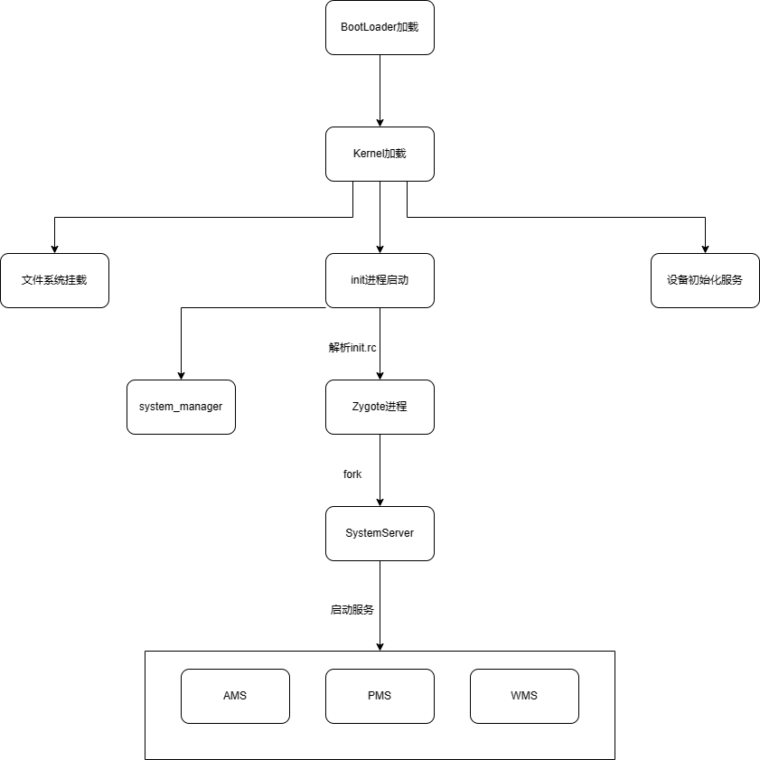

[TOC]

# 开机

## Linux启动
[Linux启动](../kernel/Linux启动.md)

## Init
[Init](Init.md)

## Zygote
[Zygote](Zygote.md)

## SystemServer
[SystemServer](SystemServer.md)

-----------------------------------------------------------------------
Zygote为什么需要用到Socket通信而不是Binder？

Zygote是通过fork生成进程的
因为fork只能拷贝当前线程，不支持多线程的fork，fork的原理是copy-on-write机制，当父子进程任一方修改内存数据时(这是on-write时机)，才发生缺页中断，从而分配新的物理内存(这是copy操作)。
zygote进程中已经启动了虚拟机、进行资源和类的预加载以及各种初始化操作，App进程用时拷贝即可。
Zygote fork出来的进程A只有一个线程，如果Zygote有多个线程，那么A会丢失其他线程。这时可能造成死锁。
Binder通信需要使用Binder线程池, binder维护了一个16个线程的线程池，fork()出的App进程的binder通讯没法用。

主要new一个ProcessState用于Binder通信时，需要mmap申请一片内存用以提供给内核进行数据交换使用.
而如果直接fork了的话，子进程在进行binder通信时，内核还是会继续使用父进程申请的地址写数据，而此时会触发子进程COW(Copy on Write)，从而导致地址空间已经重新映射，而子进程还尝试访问之前父进程mmap的地址，会导致SIGSEGV、SEGV MAPERR段错误

-----------------------------------------------------------------------

-----------------------------------------------------------------------
为何app启动要用zygote去孵化进程？为何不是其他？

因为 zygote 已经创建好了 vm 和预加载了相关的资源，进程直接从 zygote fork 就能直接使用了，不用重新走一遍流程

-----------------------------------------------------------------------

