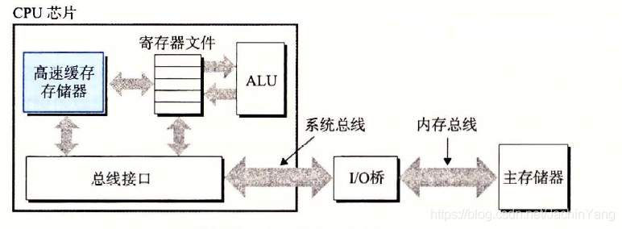
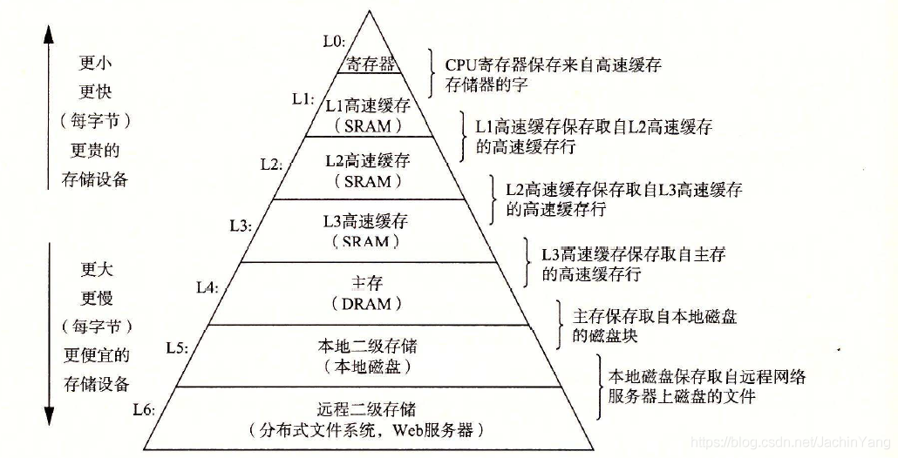
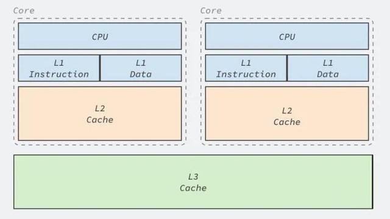
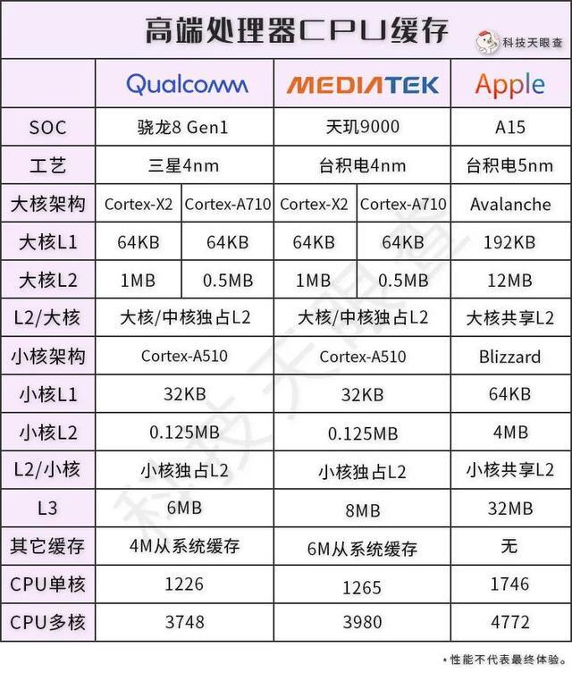

[TOC]

# 性能配置

## PC

### CPU

https://www.mydrivers.com/zhuanti/tianti/cpu/index.html

### cache 高速缓存

主要看三级缓存
https://www.zhihu.com/question/55854401

高速缓存是用一种叫做静态随机访问存储器(SRAM)的硬件技术实现的。
利用高速缓存的局部性原理，即程序具有访问局部区域里的数据和代码的趋势。通过让高速缓存里存放可能经常访问的数据，大部分的内存操作都能在快速的高速缓存中完成。

存储器层次结构的主要思想是上一层的存储器作为低一层存储器的高速缓存。因此，寄存器文件就是Ll 的高速缓存， Ll 是L2 的高速缓存， L2 是L3 的高速缓存， L3 是主存的高速缓存，而主存又是磁盘的高速缓存。在某些具有分布式文件系统的网络系统中，本地磁盘就是存储在其他系统中磁盘上的数据的高速缓存。

高端CPU当前分为一级(L1)、二级(L2)和三级(L3)缓存，缓存容量L1最小，L2次之，L3最大。分为三级结构是因为L1制造难度大，成本高，但L1缓存容量对系统提升比较有限，所以一般都很小。而CPU的读取顺序是：L1→L2→L3→内存，L2作为外部缓冲，而L3就是L2的缓冲。因为CPU缓存比内存读取速度快，所以缓存容量越大越好。

### 显卡

https://zhuanlan.zhihu.com/p/109042798

## 手机

https://zhuanlan.zhihu.com/p/361593876

### CPU

https://www.mydrivers.com/zhuanti/tianti/01/

### cache

可以看到高通和联发科虽然提升很大，但苹果A15在CPU缓存方面依然遥遥领先，几乎相当于骁龙8gen1的5倍，天玑9000的4倍，这也是使用几年的苹果手机任然能够流畅运行的原因。

