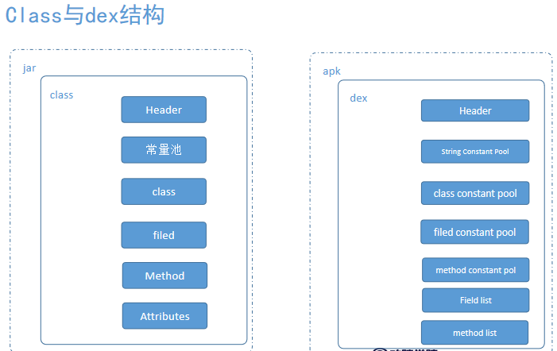
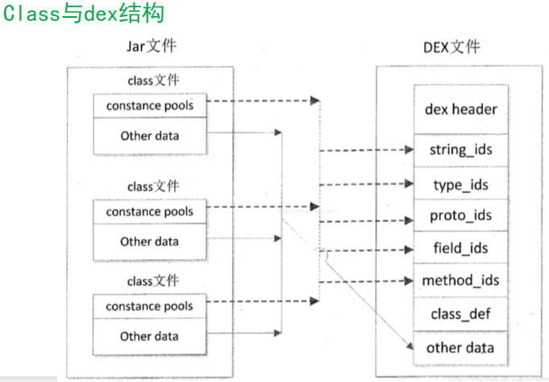
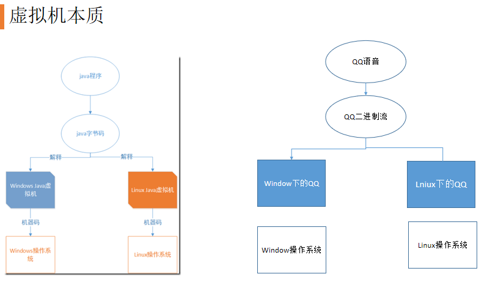
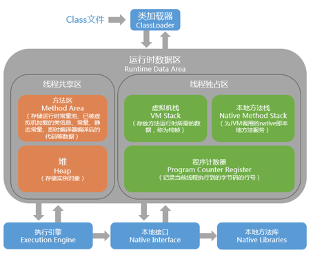
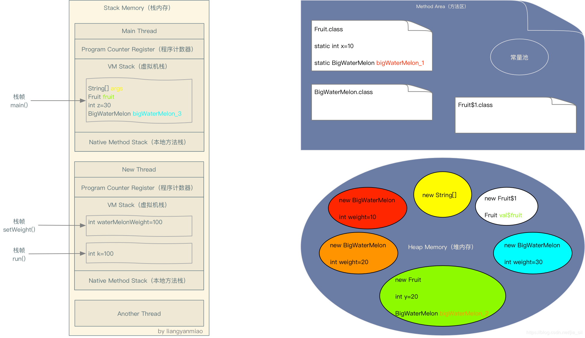
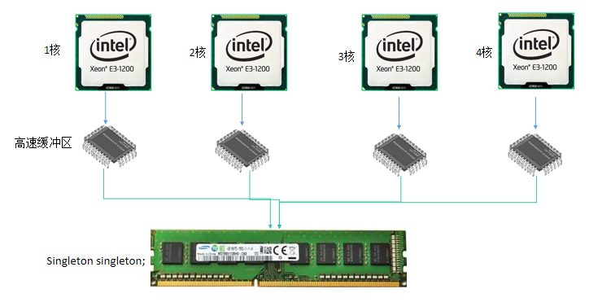
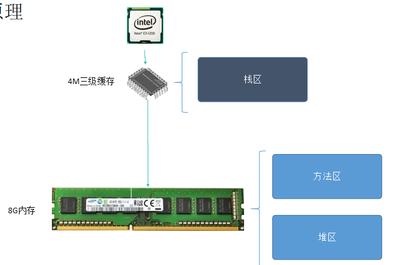
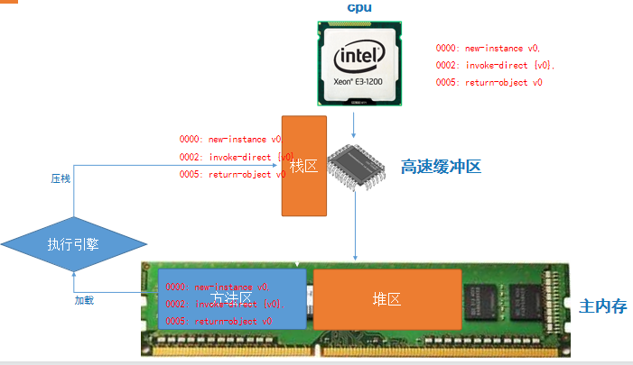

[TOC]

# JVM内存结构

https://www.cnblogs.com/mikechenshare/p/16562589.html

https://zhuanlan.zhihu.com/p/38348646

https://blog.csdn.net/c15158032319/article/details/117361782

https://zhuanlan.zhihu.com/p/29881777

android虚拟机为了提升性能，把class文件整理成dex文件，dex文件中包含各种表信息。

方法区
方法区存放了类的信息(class字节码的信息)，静态变量、处理逻辑的指令集 方法区的数据主内存

堆区
用来存储对象实例，被所有线程共享的一块内存区域，在App启动时创建,  堆区的数据放在主内存 

虚拟机栈区
存储方法的局部变量，每次开启一个线程都会创建一个虚拟机栈，线程私有，生命周期与线程相同 栈区的数据高速缓冲区 

执行引擎
将方法区中 对应方法的arm指令集 加载到栈区，而栈区存在于高速缓冲区中，cpu直接从高速缓冲区取arm指令，一条一条执行。执行引擎就像一个中介，方法对应的arm指令 相当于交易的物品

高速缓冲区
通常的说法主存其实就是内存，而高速缓冲区属于位于CPU与主内存之间的高速存储器。
它的容量比内存小但交换速度快。它的存取速度与CPU持平。
由于CPU执行速度非常快，而主内存执行速度相对慢很多，需要将数据提前加载到高速缓冲区中。
高速缓冲区价格非常昂贵，一般不超过12M ，例如i7中最先进的型号，三级缓存也不过12M。

## 为什么虚拟机要设计方法区，堆区呢?

Java这门语言最大的优势是不用程序员管理内存创建于回收，Oracle为了管理java对象运行机制(生命周期) ，设计了方法区与堆区。谁来管理，当然还是C++来。
方法区和堆区的设立只是为了好管理，在linux系统 这些区域本身都不存在。

如果我们不设立方法区和堆区，可以想象下下面两种场景:
1. 如果没有方法区，每次创建对象需要从磁盘加载字节码，然后new出来，性能是多么低下。
2. 如果没有堆区，每次创建都需要加载一个对象，并且携带对应的class，将会需要多少内存。

## 虚拟机给App的内存

Android虚拟机在linux中申请内存，可以理解为一次性malloc了一大块的内存,而内存中就有方法区和堆区。
开启一个App代表虚拟机malloc一次内存，比如50M，如果运行了10个App，那就是500M。虚拟机占Linux的内存有500M。

然后由虚拟机自己管理内部对象的分配。由于回收需要知道对象占多大空间, 
所以在分配对象时, 除了对象本身我们看得见的字段外, 还需要对象的描述信息, 这就是对象的中隐含的 klass。
只要在正在jdk源码中找到分配给对象的klass，就能证明klass是 Android 所有对象的源头。

在C语言中使用内存直接通过指针方式访问内存的某个数据，指针的作用就是指向了这段数据所在的buffer起始地方。

而对于java对象来说, 虽然经过了jvm的一层屏蔽, 把指针这个概念给隐去了, 但对象终归是要存在内存当中的。

我们知道java有各种各样的class, 在内存中分配对象时, class就是对应要分配的对象模板, 对象占多大空间, 每个字段在此空间内的偏移值, 等等信息, 都由class的定义提供。

对于GC来说, 必须知道对象占多大空间, 才好在回收时把相应的内存释放, 不然就没办法准确的管理了。

person这个引用  有static修饰与没有时，它放在堆栈的位置有没有什么区别

