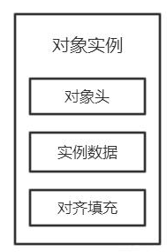
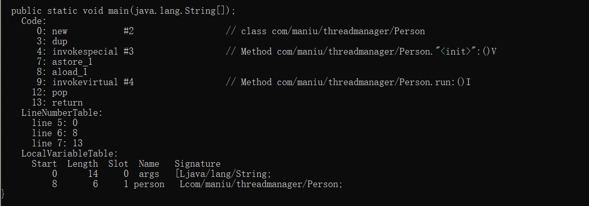
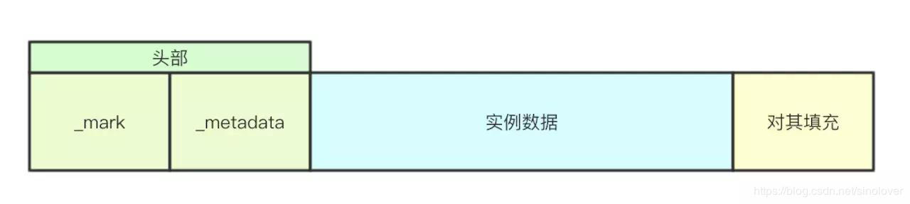
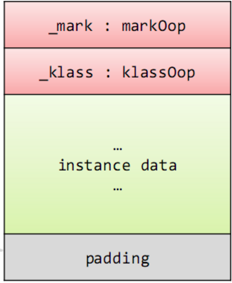
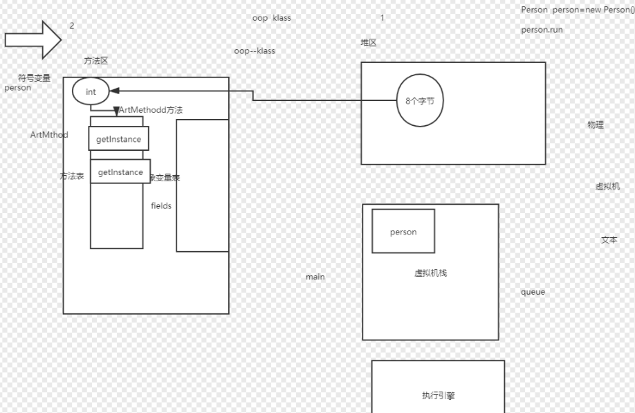
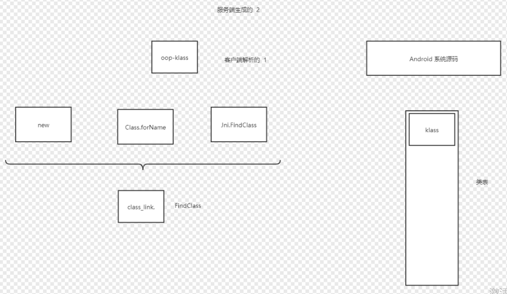
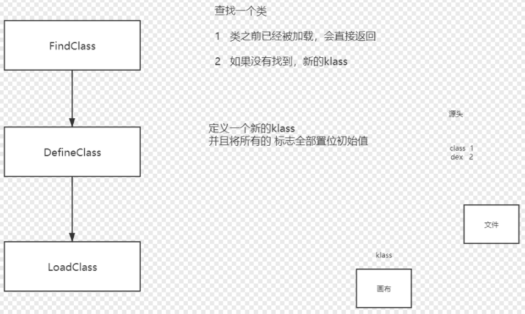
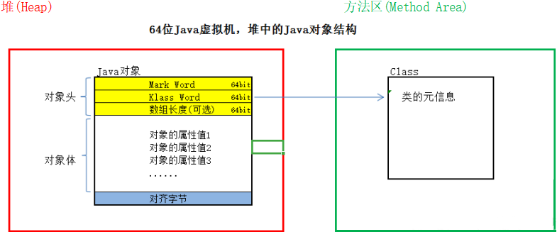
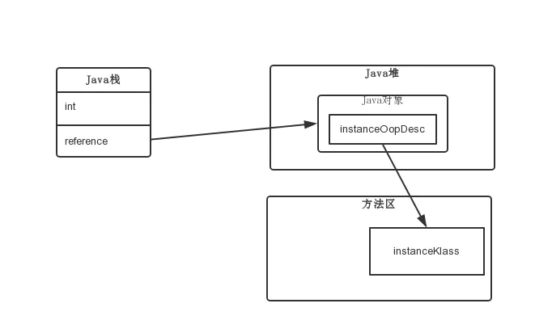

[TOC]

# Java对象

在JVM中，对象是分成**三部分**存在的：

> 对象头 
> 实例数据 
> 对其填充



> 实例数据和对其填充与synchronized无关，。


## Java对象在对内存分布

​实例数据存放类的属性数据信息，包括父类的属性信息，如果是数组的实例部分还包括数组的长度，这部分内存按4字节对齐；对其填充不是必须部分，由于虚拟机要求对象起始地址必须是8字节的整数倍，

**对齐填充**仅仅是为了使字节对齐。

​对象头是我们需要关注的重点，它是synchronized实现锁的基础，因为synchronized申请锁、上锁、释放锁都与对象头有关。

​对象头主要结构是由**Mark Word** 和 **Class Metadata Address** 组成，其中Mark Word存储对象的hashCode、锁信息或分代年龄或GC标志等信息，Class Metadata Address是类型指针指向对象的类元数据，JVM通过该指针确定该对象是哪个类的实例。


## Java对象模型: OOP-Klass模型

在JVM中，并没有直接将Java对象映射成C++对象，而是采用了 oop-klass 模型，主要是不希望每个对象中都包含有一份Class类型。
简单地说，一个Java类在JVM中被拆分为了两个部分：数据和描述信息，分别对应 OOP 和 Klass。

OOP(Ordinary Object Point) 表示对象的实例信息。

Klass，是Java类的在C++中的表示，用来描述Java类的信息。例如描述对象有多大，函数地址，对象大小，静态区域大小。


## Java对象构建过程

Java中new一个对象，在JVM中是转换成了new指令。

    Person person=new Person();




## Java对象原理

### JDK源码

Java的对象结构声明在/src/share/vm/oops

Oop 是java对象的意思

真正的java对象在JVM虚拟机中的一个体现

```C++
hotspot/src/share/vm/oops/oop.hpp

class oopDesc {

private:
    volatile markOop _mark;
    union _metadata {
    Klass*      _klass;
    narrowKlass _compressed_klass;
    } _metadata;

}
```

oopDesc则是Java对象头的结构. 除了预想中的Klass(之所以叫kclass是因为class是C++关键字)指针外, 还由一个_mark字段, 是因为除了对象的class信息以外, 还有一些对象信息需要保留, 比如GC年龄, 锁状态等.






1._mark:占用8个字节 用于存储对象自身的运行时数据， 如哈希码（HashCode）、GC分代年龄、锁状态标志等

2.class对象指针：占用8个字节 如果开启指针压缩的话则占用4个字节 即对象指定的是那个实例对象


klass在JDK源码类似于服务端生成

```C++
hotspot/src/share/vm/interpreter/interpreterRuntime.cpp

IRT_ENTRY(void, InterpreterRuntime::_new(JavaThread* thread, ConstantPool* pool, int index))
    //从缓存表中查找该klass是不是已经被加载了
    Klass* k_oop = pool->klass_at(index, CHECK);

    instanceKlassHandle klass (THREAD, k_oop);

    // 校验：接口/抽象类/Class不能实例化
    // Make sure we are not instantiating an abstract klass
    klass->check_valid_for_instantiation(true, CHECK);

    // 初始化klass
    // Make sure klass is initialized
    klass->initialize(CHECK);

    // 分配实例,并且将klass注入到object中
    oop obj = klass->allocate_instance(CHECK);
    thread->set_vm_result(obj);
IRT_END


hotspot/src/share/vm/oops/klass.hpp
class Klass : public Metadata {
    // initializes the klass
    virtual void initialize(TRAPS);
}


hotspot/src/share/vm/oops/instanceKlass.hpp

class InstanceKlass: public Klass {
    void initialize(TRAPS);
}


hotspot/src/share/vm/oops/instanceKlass.cpp

void InstanceKlass::initialize(TRAPS)
{
    if (this->should_be_initialized()) {
        HandleMark hm(THREAD);
        instanceKlassHandle this_oop(THREAD, this);
        initialize_impl(this_oop, CHECK);
        // Note: at this point the class may be initialized
        //       OR it may be in the state of being initialized
        //       in case of recursive initialization!
    } else {
        assert(is_initialized(), "sanity check");
    }
}

void InstanceKlass::initialize_impl(instanceKlassHandle this_oop, TRAPS)
{
    // Make sure klass is linked (verified) before initialization
    // A class could already be verified, since it has been reflected upon.
    this_oop->link_class(CHECK);

    // Step 1
    // Step 2
    // Step 3
    // Step 4
    // Step 5
    // Step 6
    // Step 7
    // Step 8
    // Step 9
    // Step 10 and 11
}
```


### AOSP源码



类只会被加载一次，先从类表中查找




klass在Android虚拟机类似于客户端解析

```C++
AOSP/android10/art/runtime/class_linker.cc

ObjPtr<mirror::Class> ClassLinker::FindClass(Thread* self,
                                             const char* descriptor,
                                             Handle<mirror::ClassLoader> class_loader)

{
    // Find the class in the loaded classes table.
    ObjPtr<mirror::Class> klass = LookupClass(self, descriptor, hash, class_loader.Get());
    if (klass != nullptr) {
        return EnsureResolved(self, descriptor, klass);
    }
    // Class is not yet loaded.
    if (descriptor[0] != '[' && class_loader == nullptr) {
        // Non-array class and the boot class loader, search the boot class path.
        ClassPathEntry pair = FindInClassPath(descriptor, hash, boot_class_path_);
        if (pair.second != nullptr) {
            return DefineClass(self,
                                descriptor,
                                hash,
                                ScopedNullHandle<mirror::ClassLoader>(),
                                *pair.first,
                                *pair.second);
        }
    }
}

ObjPtr<mirror::Class> ClassLinker::DefineClass(Thread* self,
                                               const char* descriptor,
                                               size_t hash,
                                               Handle<mirror::ClassLoader> class_loader,
                                               const DexFile& dex_file,
                                               const dex::ClassDef& dex_class_def)
{
    // Load the class from the dex file.
    if (UNLIKELY(!init_done_)) {
        // finish up init of hand crafted class_roots_
        if (strcmp(descriptor, "Ljava/lang/Object;") == 0) {
            klass.Assign(GetClassRoot<mirror::Object>(this));
        } else if (strcmp(descriptor, "Ljava/lang/Class;") == 0) {
            klass.Assign(GetClassRoot<mirror::Class>(this));
        } else if (strcmp(descriptor, "Ljava/lang/String;") == 0) {
            klass.Assign(GetClassRoot<mirror::String>(this));
        } else if (strcmp(descriptor, "Ljava/lang/ref/Reference;") == 0) {
            klass.Assign(GetClassRoot<mirror::Reference>(this));
        } else if (strcmp(descriptor, "Ljava/lang/DexCache;") == 0) {
            klass.Assign(GetClassRoot<mirror::DexCache>(this));
        } else if (strcmp(descriptor, "Ldalvik/system/ClassExt;") == 0) {
            klass.Assign(GetClassRoot<mirror::ClassExt>(this));
        }
    }

    //dex文件是被 DexCache(DexFile) 加载，微信热修复 DexFile
    klass->SetDexCache(dex_cache);
    SetupClass(*new_dex_file, *new_class_def, klass, class_loader.Get());

    klass->SetClinitThreadId(self->GetTid());

    LoadClass(self, *new_dex_file, *new_class_def, klass);

    //类完整被加载的步骤是10步，加载完成后klass信息中 status = 10
    mirror::Class::SetStatus(klass, ClassStatus::kErrorUnresolved, self);

}

void ClassLinker::SetupClass(const DexFile& dex_file,
                             const dex::ClassDef& dex_class_def,
                             Handle<mirror::Class> klass,
                             ObjPtr<mirror::ClassLoader> class_loader)
{
    klass->SetClass(GetClassRoot<mirror::Class>(this));
    uint32_t access_flags = dex_class_def.GetJavaAccessFlags();
    CHECK_EQ(access_flags & ~kAccJavaFlagsMask, 0U);
    klass->SetAccessFlagsDuringLinking(access_flags);
    klass->SetClassLoader(class_loader);
    DCHECK_EQ(klass->GetPrimitiveType(), Primitive::kPrimNot);
    mirror::Class::SetStatus(klass, ClassStatus::kIdx, nullptr);

    klass->SetDexClassDefIndex(dex_file.GetIndexForClassDef(dex_class_def));
    klass->SetDexTypeIndex(dex_class_def.class_idx_);
}

void ClassLinker::LoadClass(Thread* self,
                            const DexFile& dex_file,
                            const dex::ClassDef& dex_class_def,
                            Handle<mirror::Class> klass)
{
    // Load static fields.
    // We allow duplicate definitions of the same field in a class_data_item
    // but ignore the repeated indexes here, b/21868015.
    LinearAlloc* const allocator = GetAllocatorForClassLoader(klass->GetClassLoader());
    LengthPrefixedArray<ArtField>* sfields = AllocArtFieldArray(self,
                                                                allocator,
                                                                accessor.NumStaticFields());
    LengthPrefixedArray<ArtField>* ifields = AllocArtFieldArray(self,
                                                                allocator,
                                                                accessor.NumInstanceFields());

    // Methods
    klass->SetMethodsPtr(
        AllocArtMethodArray(self, allocator, accessor.NumMethods()),
        accessor.NumDirectMethods(),
        accessor.NumVirtualMethods());
    
    LoadField(field, klass, &sfields->At(num_sfields));
    ArtMethod* art_method = klass->GetDirectMethodUnchecked(class_def_method_index,
        image_pointer_size_);
    LoadMethod(dex_file, method, klass, art_method);

    // Set the field arrays.
    klass->SetSFieldsPtr(sfields);
    DCHECK_EQ(klass->NumStaticFields(), num_sfields);
    klass->SetIFieldsPtr(ifields);
    DCHECK_EQ(klass->NumInstanceFields(), num_ifields);
}
```

LoadClass 把 /data/app/com.xxx/oat/*.dex 文件中各种表信息加载到 klass 中




反射比较耗时的原因
根据字符串查找方法表（至少遍历2次），再把找到的 ArtMethod 放到执行引擎中加载。
method.invoke() 最终也是把 ArtMethod 结构体对应的指令集放到执行引擎中加载。
同一个Android版本中，一个方法无论多少行代码，对应的 ArtMethond 结构体大小都是一样的。
不同Android版本， ArtMethond 结构体大小也不一样。

AOSP/android10/art/runtime/art_method.cc
AOSP/android10/art/runtime/art_method.h


## Java对象指向的klass






比如100个对象
堆内存          100*8
方法区内存      180                                 //224?


https://developer.aliyun.com/article/766740

https://blog.csdn.net/azhida/article/details/106175005


## `shadow$_klass_`

```
shadow$_klass_ = class com.example.mytest.Person
    classSize = 224                                 //多加一个方法 +8
    objectSize = 8
```


