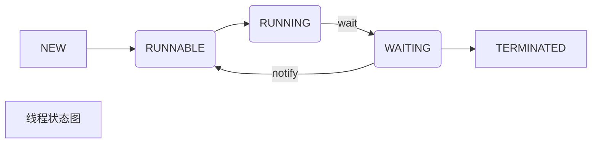

[TOC]

# Thread
线程能更好的解决并发，充分发挥多核的优越性。

## 优点
1、从资源上来讲：线程是一种非常"节俭"的多任务操作方式。在linux系统下，启动一个新的进程必须分配给它 独立的地址空间，建立众多的数据表来维护它的代码段、堆栈段和数据段，这是一种"昂贵"的多任务工作方式。

2、从切换效率上来讲：运行于一个进程中的多个线程，它们之间使用相同的地址空间，而且线程间彼此切换所 需时间也远远小于进程间切换所需要的时间。据统计，一个进程的开销大约是一个线程开销的30倍左右。

3、从通信机制上来讲：线程间方便的通信机制。对不同进程来说，它们具有独立的数据空间，要进行数据的 传递只能通过进程间通信的方式进行，这种方式不仅费时，而且很不方便。线程则不然，由于同一进城下的线 程之间贡献数据空间，所以一个线程的数据可以直接为其他线程所用，这不仅快捷，而且方便。


## 线程状态

| 线程状态 | |
| :---: | :---: |
| NEW | 线程刚刚创建，尚未启动 |
| RUNNABLE | 线程正在运行 |
| RUNNING | 线程正在运行 |
| BLOCKED | 线程堵塞状态，等待同步块的锁的释放，如果获得锁，就会自动进入运行状态 |
| WAITING | 线程处于等待状态，需要被其他线程唤醒（notify,notifyAll)。线程在调用了join之后，也会进入等待状态，直到被join的线程执行结束才会唤醒 |
| TIMED_WAITTING | 有限时间的等待，一般出现在调用sleep(time),join(time),sleep(time)后 |
| TERMINATED | 线程运行结束 |





## thread启动流程

thread.start方法是一个同步方法，首先会检查状态，如果状态不为0(NEW),抛异常，所以如果多次调用同一个线程的start方法时，只有一次能够成功，其他情况下都会抛异常。
然后将该线程对象加入到threadGroup中，threadGroup用一个数组来记录了这个组有哪些线程,紧接着调用本地方法start0。
如果调用中有异常，会从threadGroup中移除该thread对象。
接下来看下start0，其实现在jvm中，对应JVM_StartThread方法。


### AOSP
```C
/android10/libcore/ojluni/src/main/java/java/lang/Thread.java

// private native static void start0();
private native static void nativeCreate(Thread t, long stackSize, boolean daemon);

/android10/libcore/ojluni/src/main/native/Thread.c

//jvm.cpp
static JNINativeMethod methods[] = {
    {"start0",           "(JZ)V",        (void *)&JVM_StartThread},
    {"setPriority0",     "(I)V",       (void *)&JVM_SetThreadPriority},
    {"yield",            "()V",        (void *)&JVM_Yield},
    {"sleep",            "(Ljava/lang/Object;J)V",       (void *)&JVM_Sleep},
    {"currentThread",    "()" THD,     (void *)&JVM_CurrentThread},
    {"interrupt0",       "()V",        (void *)&JVM_Interrupt},
    {"isInterrupted",    "(Z)Z",       (void *)&JVM_IsInterrupted},
    {"holdsLock",        "(" OBJ ")Z", (void *)&JVM_HoldsLock},
    {"setNativeName",    "(" STR ")V", (void *)&JVM_SetNativeThreadName},
};

/android10/libcore/ojluni/src/main/native/jvm.h

/*
 * java.lang.Thread
 */
JNIEXPORT void JNICALL
JVM_StartThread(JNIEnv *env, jobject thread, jlong stack_size, jboolean daemon);

```

### jvm源码

```C++
hotspot/src/share/vm/prims/jvm.cpp

JVM_ENTRY(void, JVM_StartThread(JNIEnv* env, jobject jthread))

    size_t sz = size > 0 ? (size_t) size : 0;
    native_thread = new JavaThread(&thread_entry, sz);

JVM_END

hotspot/src/share/vm/runtime/thread.cpp

JavaThread::JavaThread(ThreadFunction entry_point, size_t stack_sz) :
  Thread()
{

    os::create_thread(this, thr_type, stack_sz);

}

hotspot/src/os/linux/vm/os_linux.cpp

const int os::Linux::_vm_default_page_size = (8 * K);

bool os::create_thread(Thread* thread, ThreadType thr_type, size_t stack_size)
{

    stack_size = os::Linux::default_stack_size(thr_type);
    stack_size = JavaThread::stack_size_at_create();
    stack_size = MAX2(stack_size, os::Linux::min_stack_allowed);
    pthread_attr_setstacksize(&attr, stack_size);

    pthread_t tid;
    int ret = pthread_create(&tid, &attr, (void* (*)(void*)) java_start, thread);

}

```

因为Android是基于Linux内核的，所以Android线程的本质是linux线程，jvm进行管理。
虚拟机栈区默认size=8K


