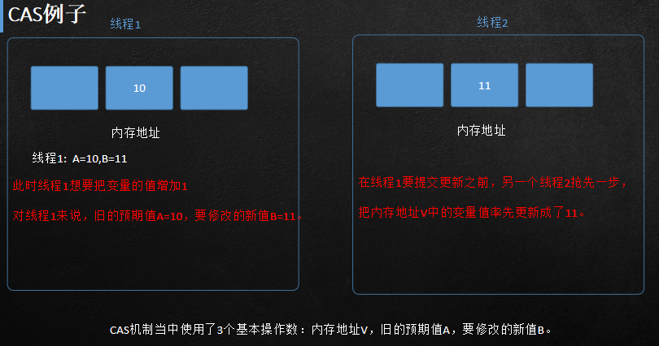
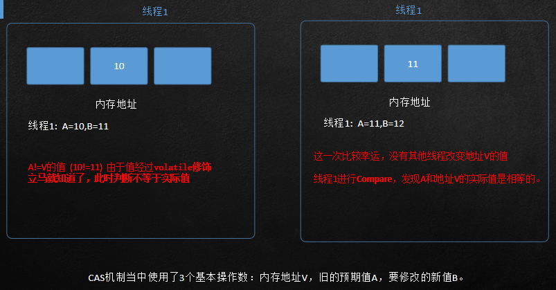

[TOC]

# 并发

## 并发三大利器

1. synchronized关键字
原理:应用monitor机制

2. Atomic包
原理:应用 Volatile 关键字和 CAS 理论实现并发
AtomicInteger
AtomicBoolean
AtomicLong

3. Locks包
原理:应用 CAS 理论实现并发

## synchronized缺点

1. 无法判断锁状态，不知当前线程是否锁住 还是没有锁住
2. 不可中断，如果线程迟迟拿不到一把锁，这把锁被其他线程占用，会出现改线程一直等待（线程防呆）
3. synchronized非公平锁，任何新线程过来 与原先排队等待的线程 都有同样的机会获得锁
4. 关键字实现获取锁与释放锁，中间不可控
5. 当锁产生竞争时，两个和三个线程争取一把锁，没有获得到，此时改为系统主动分配，此时会造成用户空间切换到内核空间。

## Volatile 作用

1. 防止重排序
2. 实现可见性
3. 保证原子性

Volatile 只能保证 读取值 和 赋值 这两种操作的原子性。

Volatile 修饰的变量i，后面做了i++操作，i++不是原子操作。

i++分为三步：
1. 读取i的值
2. 对i加1
3. 将i的值写回内存

第二步不是原子操作。

## Volatile 原理
1. 修改volatile变量时会强制将修改后的值立即写入主内存。
2. 修改volatile变量后会导致其他线程工作内存中对应的变量值失效。因此，再读取该变量值的时候就需要重新从读取主内存中的值。
当线程2进行修改时，会导致线程1的工作内存中缓存变量stop的缓存行无效
（反映到硬件层的话，就是CPU的L1或者L2缓存中对应的缓存行无效）；
由于线程1的工作内存中缓存变量stop的缓存行无效，所以线程1再次读取变量stop的值时会去主存读取。

## CAS

CAS是Compare And Swap的缩写。

CAS机制当中使用了3个基本操作数：
内存地址V
旧的预期值A
要修改的新值B

更新一个变量的时候，只有当变量的预期值A和内存地址V当中的实际值相同时，才会将内存地址V对应的值修改为B。

CAS机制当中使用了3个基本操作数：内存地址V，旧的预期值A，要修改的新值B。

### ABA问题

如果10被另外两个线程修改了，1个+1 一个-1会发生什么呢？

https://developer.aliyun.com/article/951976

## CountDownlatch和CyclicBarrier

## Synchronized 和 Lock 的区别

并发编程中，锁是经常需要使用的。在开发中我们常用的锁有两种Synchronized和Lock。

### 线程安全问题
线程安全是在多线程编程中，​有可能会出现同时访问同一个 共享、可变资源 的情况，始终都不会导 致数据破坏以及其他不该出现的结果。这种资源可以是一个变量、一个对象、一个文件等。

> 共享：多个线程可以同时访问该共享变量。
> 可变：数据在生命周期中可以被改变。

### 锁的概念

#### JAVA 内置锁

**1 隐性锁**：每个JAVA对象可以用作实现同步的内置锁，线程在访问同步代码块时必须先获取该内置锁，在退出和中断的时候需要释放内置锁。

Java内置锁通过**synchronized**关键字使用，使用其修饰方法或者代码块，就能保证方法或者代码块以同步方式执行。

> **有对象锁和类锁（static方法和class上枷锁）区分，两者不冲突可以并行存在。**

**2 显性锁**：显式锁(ReentrantLock)正式为了解决这些灵活需求而生，ReentrantLock的字面意思是可重入锁，可重入的意思是线程可以同时多次请求同一把锁，而不会自己导致自己死锁。

#### 乐观锁（ 显性锁）与悲观锁(隐性锁)

​独占锁是一种悲观锁，而 synchronized 就是一种独占锁，synchronized 会导致其它所有未持有锁的线程阻塞，而等待持有锁的线程释放锁。 

​所谓乐观锁就是，每次不加锁而是假设没有冲突而去完成某项操作，如果因为冲突失败就重试，直到成功为止。而乐观锁用到的机制就是CAS。

### 锁的分类

1. **可重入锁：**
Synchronized和ReentrantLook都是可重入锁，锁的可重入性标明了锁是针对线程分配方式而不是针对方法。例如调用Synchronized方法A中可以调用Synchronized方法B，而不需要重新申请锁。

2. **读写锁：**
按照数据库事务隔离特性的类比读写锁，在访问统一个资源（一个文件）的时候，使用读锁来保证多线程可以同步读取资源。ReadWriteLock是一个读写锁，通过readLock()获取读锁，通过writeLock()获取写锁。

3. **可中断锁：**
可中断是指锁是可以被中断的，Synchronized内置锁是不可中断锁，ReentrantLock可以通过lockInterruptibly方法中断显性锁。例如线程B在等待等待线程A释放锁，但是线程B由于等待时间太久，可以主动中断等待锁。

4. **公平锁：**
公平锁是指尽量以线程的等待时间先后顺序获取锁，等待时间最久的线程优先获取锁。synchronized隐性锁是非公平锁，它无法保证等待的线程获取锁的顺序，ReentrantLook可以自己控制是否公平锁。

#### 两种锁的底层实现

Synchronized：底层使用指令码方式来控制锁的，映射成字节码指令就是增加来两个指令

> monitorenter
>
> monitorexit

​当线程执行遇到monitorenter指令时会尝试获取内置锁，如果获取锁则锁计数器+1，如果没有获取锁则阻塞；当遇到monitorexit指令时锁计数器-1，如果计数器为0则释放锁。

Lock：底层是CAS乐观锁，依赖AbstractQueuedSynchronizer类，把所有的请求线程构成一个CLH队列。而对该队列的操作均通过Lock-Free（CAS）操作。

#### Synchronized和Lock比较

- Synchronized是关键字，内置语言实现，Lock是接口。
- Synchronized在线程发生异常时会自动释放锁，因此不会发生异常死锁。Lock异常时不会自动释放锁，所以需要在finally中实现释放锁。
- Lock是可以中断锁，Synchronized是非中断锁，必须等待线程执行完成释放锁。
- Lock可以使用读锁提高多线程读效率。

