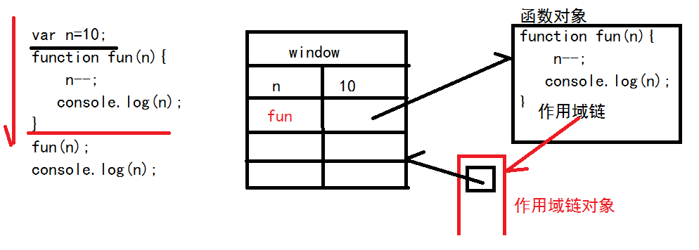
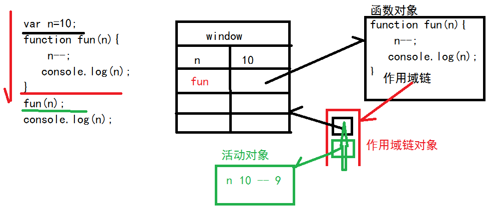
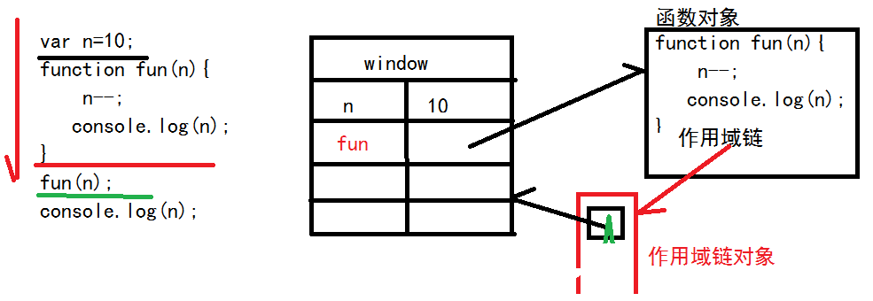

[TOC]

#Function对象

***

##重载

+ 程序中同时定义多个相同函数名，不同参数列表的函数。
+ 在调用时，根据传入的参数不同，动态选择匹配函数执行。
+ 不同的参数，不同的操作，但是操作名称相同时，使用重载。

js的语法，不支持重载。可以使用arguments对象实现重载
arguments是所有函数内部都有的一个**类数组对象**，专门接受并保存调用函数时传入函数的实际参数的类数组对象
1. 有下标  arguments[i] 获得下标i位置的实际参数（参数值）
2. 有length属性   arguments.length 参数值的个数

```javascript
    function calc1(){
        return arguments[0]+arguments[1];
    }
    console.log(calc1(3));   //3+undefined(NaN) = NaN

    function calc(){
        if(arguments.length==1){
            return arguments[0]*arguments[0];
        }else{
            return arguments[0]+arguments[1];
        }

    }
    console.log(calc(3));
    console.log(calc(2,3));
```

>NaN
9
5

***

##函数在内存中的3个阶段

###定义时
创建2个对象：函数对象和作用域链对象
1. 函数对象：封装了本次函数的定义，但不读取函数内部的内容
2. 作用域链对象：专门保存函数**可用的变量**的所在位置的对象



###调用时
创建一个对象：活动对象，并将活动对象的**引用**，压入到作用域链对象中
1. 活动对象：临时封装本次调用函数时使用的**局部变量**



###调用后
作用域链对象中的活动对象的引用出栈，活动对象以及其内部的局部变量一同释放



***

##创建函数的3种方式
1. 声明方式声明函数
>function 函数名(){}
+ **只有声明方式会被提前**
2. 函数直接量方式声明函数
>var 函数名=function(){}
3. 函数对象声明方式
>var 函数名=new Function("参数1","参数2",....,"函数体");

***

##匿名函数
定义时，没有变量引用的函数

使用匿名函数的2种情况：
1. 匿名函数的自调 ：定义完毕立即执行，执行完毕后立即释放
>(function(参数列表){
return 值;
})(参数值列表);

2. 回调函数：将函数作为一个对象传递给其他函数使用时
>arr.sort(function(a,b){return a-b})

+ 优点：节省内存空间
+ 缺点：不能重复利用

```javascript
    var n=10;
    (function(n){
        n--;
        console.log(n);
    })(n);
    //    ()、[]、`开头的代码，上一句的代码必须要有;结尾
    [4,2,3].sort();
    console.log(n);
```

**声明方式声明函数的自调：定义完毕也可以立即执行，执行完毕后立即释放**
```javascript
    var a=9;
    (function fun(a){
        a--;
        console.log(a);
        //函数内部可以递归调用
        //fun(5);
    })(a);
    fun(5);
```

>Uncaught ReferenceError: fun is not defined at xxx.html:xxx

***

##闭包


***

