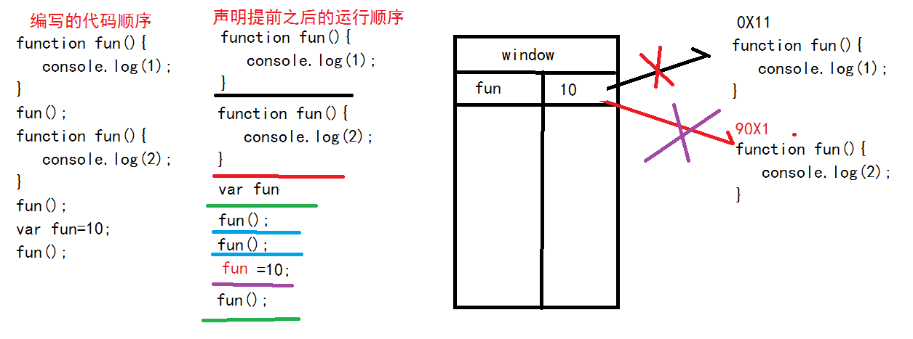
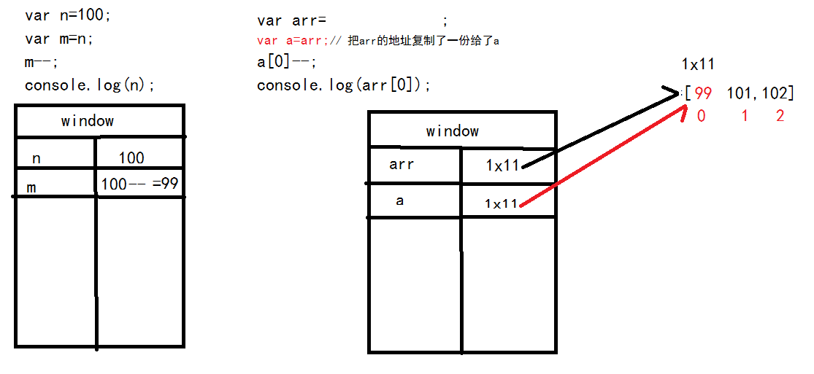

[TOC]

#函数
***

##函数定义
* 封装一项专门任务的步骤清单代码段
* 在程序中提供一个方法，或功能  

语法：
function 任务名([参数变量列表]){
    任务的步骤清单代码段;
    [return 返回值;]
}  

函数名(任务名)：指向函数定义的一个变量
函数：封装函数定义的应用类型的对象！

函数声明时：不执行！也不读取函数内部的内容！
如何调用函数：任意位置！ 函数名([参数值列表]);
函数调用时：才开始读取函数内部的代码，开始执行！

参数变量：函数内部的局部变量数据，有了参数变量以后，可以使函数的功能更加完善！
return：返回值，如果函数需要一个明确的结果，以便于下次使用，那么函数需要定义return返回值
***

##声明函数的3种方式
###声明方式声明函数
``` javascript
function fun(){}
```

###直接量方式声明函数
```javascript
var fun=function(){}
//ES6写法
var fun=()=>{}
```

###函数对象声明方式
``` javascript
var fun=new Function();
```

***

##变量的作用域
一个变量的可用范围
###全局变量
***全局作用域window***
###局部变量
***局部作用域：在函数调用的时候才创建的一个作用域。***
1. 参数变量（形参）
2. 在函数内部定义var的变量（实参）
+ **仅在函数调用时，才动态创建。**
+ **调用的时候，如果局部有，就不用全局的。**
+ **调用后，局部变量随局部作用域一同销毁。**
***

##声明提前
程序正式开始执行之前，将var声明的变量和function声明的函数，提前到**当前作用域的顶部**，集中声明，赋值留在本地。
**函数的声明要比变量声明更置顶。**

``` javascript
    function fun(){
        console.log("fun1");
    }
    fun();
    function fun(){
        console.log("fun2");
    }
    fun();
    var fun=10;
    fun();
```

>fun2
fun2
Uncaught TypeError: fun is not a function at xxx.html:xxx  

声明提前后：
``` javascript
    function fun(){
        console.log("fun1");
    }
    function fun(){
        console.log("fun2");
    }
    var fun;
    fun();
    fun();
    fun=10;
    fun();
```


***

##值传递（变量赋值）
对比原始数据类型和引用类型的对象
``` javascript
        var n=100;
        var m=n;// 把n的值复制了一份给了m
        m--;
        console.log(n);//100


        var arr=[100,101,102];
        var a=arr;// 把arr的地址复制了一份给了a
        a[0]--;
        console.log(arr[0]);//99
```



***
