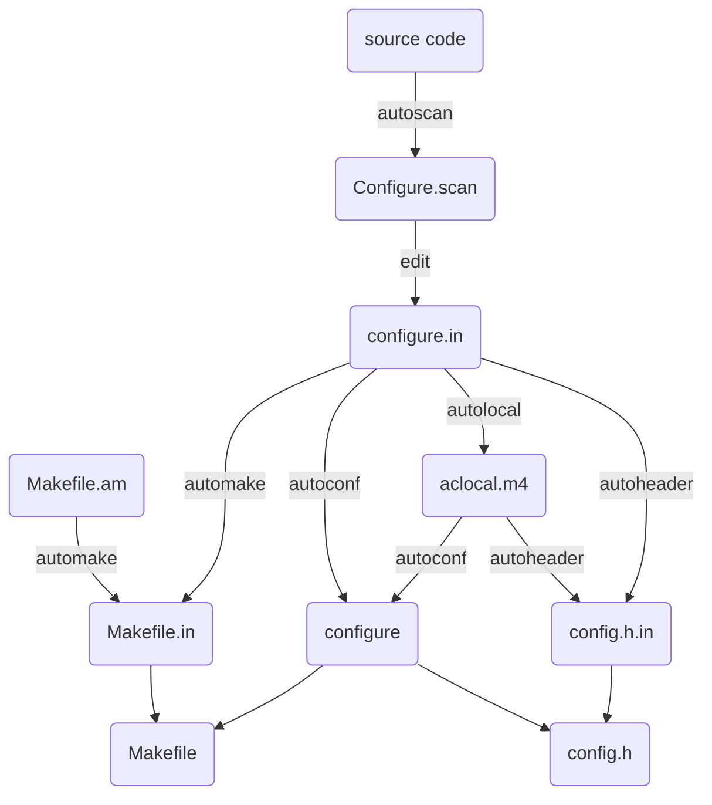

[TOC]

# make
make是用来编译的，它从Makefile中读取指令，然后编译。

这一步就是编译，大多数的源代码包都经过这一步进行编译（当然有些perl或python编写的软件需要调用perl或python来进行编译）。
如果 在 make 过程中出现 error ，就要记下错误代码（注意不仅仅是最后一行），然后可以向开发者提交 bugreport（一般在 INSTALL 里有提交地址）。
或者系统少了一些依赖库等，这些需要自己仔细研究错误代码。

make 的作用是开始进行源代码编译，以及一些功能的提供，这些功能由他的 Makefile 设置文件提供相关的功能。
比如 make install 一般表示进行安装，make uninstall 是卸载，不加参数就是默认的进行源代码编译。
make 是 Linux 开发套件里面自动化编译的一个控制程序，他通过借助 Makefile 里面编写的编译规范进行自动化的调用 gcc 、ld 以及运行某些需要的程序进行编译的程序。
一般情况下，他所使用的 Makefile 控制代码，由 configure 这个设置脚本根据给定的参数和系统环境生成。

make install是用来安装的，它也从Makefile中读取指令，安装到指定的位置。
这条命令来进行安装（当然有些软件需要先运行 make check 或 make test来进行一些测试），这一步一般需要你有 root 权限（因为要向系统写入文件）。

扩展资料
当我们在使用make命令时，常常会在make后面加上其他单词，比如check，install，installcheck…这些单词都是make的参数，我们称之为“目标（targets）”。

最常见的几个目标：
make all：编译程序、库、文档等（等同于make）

make install：安装已经编译好的程序。复制文件树中到文件到指定的位置

make unistall：卸载已经安装的程序。

make clean：删除由make命令产生的文件

make distclean：删除由./configure产生的文件

make check：测试刚刚编译的软件（某些程序可能不支持）

make installcheck：检查安装的库和程序（某些程序可能不支持）

make dist：重新打包成packname-version.tar.gz。

一般操作流程：
用于linux源码安装软件，一般下载源码包得到文件：xxxx.tgz
1、解包软件
tar zxf xxxx.tgz
2、配置
cd xxxx
./configure
3、编译
make
4、安装
make install
5、卸载
make uninstall

如果在编译安装动态库时，需要执行命令：
`make install`
默认安装路径可能是usr/lib下，我们想去指定安装目录：
`sudo make install DESTDIR=绝对路径`

在Makefile中获取编译时间及版本信息，然后在软件中调用此宏定义，便于debug时查看软件编译时间。

Linux:
# 编译时间
`COMPILE_TIME = $(shell date +"%Y-%M-%d %H:%M:%S")`
`CFLAGS += "\"$(COMPILE_TIME)\""`

# SVN版本号
`SVN_REVIVION = $(shell svnversion -n)`
`CFLAGS += "\"$(SVN_REVIVION)\""`

# GIT版本号
`GIT_REVISION = $(shell git show -s --pretty=format:%h)`
`CFLAGS += "\"$(GIT_REVISION)\""`

Windows：
# 编译时间
`COMPILE_TIME = $(shell echo %date:~0,4%%date:~5,2%%date:~8,2%%time:~0,2%%time:~3,2%%time:~6,2%)`
`CFLAGS += "\"$(COMPILE_TIME)\""`

如何获取日期呢?
格式： `%date%`
结果： 2012-07-31

如何获取时间呢?
格式： `%time%`
结果： 10:21:21.68

这是获取的系统标准格式的日期和时间，但是有时候我们需要使用规定的格式，怎么办呢?

格式： `%date:~x,y%以及%time:~x,y%`
说明： x是开始位置，y是取得字符数

比如说我要获取完整的日期和时间，
格式： `%date:~0,4%%date:~5,2%%date:~8,2%%time:~0,2%%time:~3,2%%time:~6,2%`
结果： 20120731111039

https://blog.51cto.com/u_13682052/5732516

