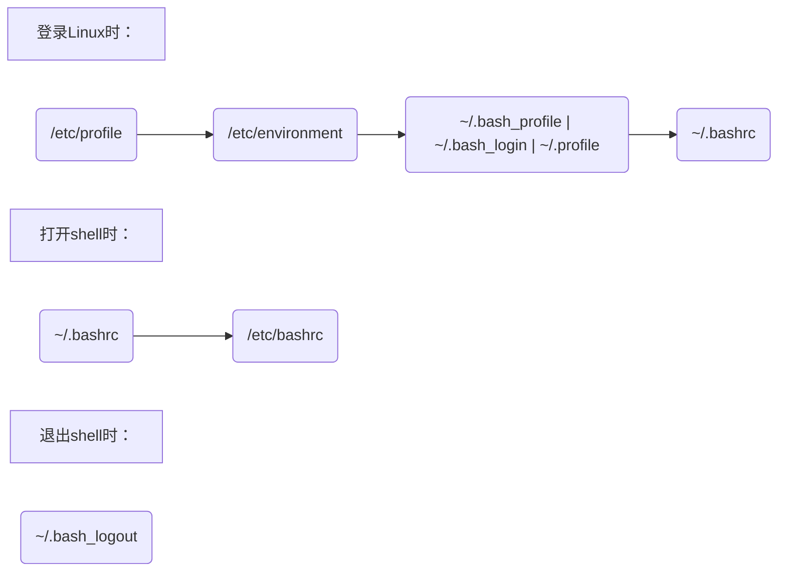

[TOC]

# 变量

## 背景
在linux系统下，如果你下载并安装了应用程序，很有可能在键入它的名称时出现“command not found”的提示内容。如果每次都到安装目标文件夹内，找到可执行文件来进行操作就太繁琐了。

这涉及到环境变量PATH的设置问题，而PATH的设置也是在linux下定制环境变量的一个组成部分。

## 变量简介
Linux是一个多用户的操作系统。每个用户登录系统后，都会有一个专用的运行环境。
通常每个用户默认的环境都是相同的，这个默认环境实际上就是一组环境变量的定义。
用户可以对自己的运行环境进行定制，其方法就是修改相应的系统环境变量。


## 变量种类

按变量的生存周期可分为永久变量和临时变量。
永久变量：需要修改配置文件，变量永久生效
临时变量：使用export命令行声明即可，变量在关闭shell时失效

按变量的作用域可分为全局变量和局部变量


## 设置环境变量

环境变量是和Shell紧密相关的，用户登录系统后就启动了一个Shell。

对于Linux来说一般是bash，但也可以重新设定或切换到其它的Shell（使用chsh命令）。

根据发行版本的情况，bash有两个基本的系统级配置文件：
/etc/bashrc和/etc/profile。


这些配置文件包含两组不同的变量：
shell变量和环境变量。

前者只是在特定的shell中固定（如bash），后者在不同shell中固定。
很明显，shell变量是局部的，而环境变量是全局的。
环境变量是通过Shell命令来设置的，设置好的环境变量又可以被所有当前用户所运行的程序所使用。
对于bash这个Shell程序来说，可以通过变量名来访问相应的环境变量，通过export来设置环境变量。

注：Linux的环境变量名称一般使用大写字母


### /etc/profile

在文件/etc/profile文件中增加变量，该变量将会对Linux下所有用户有效，并且是“永久的”。

    vi /etc/profile
    export CLASSPATH=./JAVA_HOME/lib;$JAVA_HOME/jre/lib
    $ source /etc/profile

注：修改文件后要想马上生效还要运行`source /etc/profile`不然只能在下次重进此用户时生效


### .bash_profile

在用户目录下的.bash_profile文件中增加变量，改变量仅会对当前用户有效，并且是“永久的”。

    $ vi /home/wk/.bash.profile
    export CLASSPATH=./JAVA_HOME/lib;$JAVA_HOME/jre/lib
    $ source /home/wk/.bash_profile

注：修改文件后要想马上生效还要运行`source /home/wk/.bash_profile`不然只能在下次重进此用户时生效
 

### export

在shell的命令行下直接使用[export变量名=变量值]定义变量，该变量只在当前的shell（BASH）或其子shell（BASH）下是有效的，shell关闭了，变量也就失效了，再打开新shell时就没有这个变量，需要使用的话还需要重新定义。

    $ export MYNAME=”my name is kevin”
    $ echo $ MYNAME
    my name is Kevin


## 显示环境变量

### echo

    $ echo $HOME
    /home/wk


### env

使用env命令显示所有的环境变量


### set
使用set命令显示所有本地定义的Shell变量

    $ set
    BASH=/bin/bash
    BASH_ENV=/root/.bashrc
    ……
　　


## 修改环境变量

    $ MYNAME=”change name to jack”
    $ echo $MYNAME
    change name to jack
　　

### 通过修改环境变量定义文件

需要注意的是，一般情况下，仅修改普通用户环境变量配置文件，避免修改根用户的环境定义文件，因为那样可能会造成潜在的危险。

例如：编辑你的PATH声明，其格式为：

    $ cd ~
    $ ls -a
    $ vi .bash_profile
    PATH=$PATH:<PATH 1>:<PATH 2>:<PATH 3>:------:<PATH N>
    $ source .bash_profile


你可以自己加上指定的路径，中间用冒号隔开。

环境变量更改后，在用户下次登陆时生效。如果想立刻生效，需要执行`source .bash_profile`
　　

需要注意的是，最好不要把当前路径`”./”`放到PATH里，这样可能会受到意想不到的攻击。

完成后，可以通过`echo $PATH`查看当前的搜索路径。这样定制后，就可以避免频繁的启动位于shell搜索的路径之外的程序了。


## 删除环境变量

### unset
使用unset命令来清除环境变量

    $ export TEMP_KEVIN=”kevin”
    $ env | grep TEMP_KEVIN
    TEMP_KEVIN=kevin
    $ unset TEMP_KEVIN
    $ env | grep TEMP_KEVIN


## 只读变量
使用readonly命令设置只读变量

注：如果使用了readonly命令的话，变量就不可以被修改或清除了。

    $ export TEMP_KEVIN ="kevin"
    $ readonly TEMP_KEVIN
    $ env | grep TEMP_KEVIN
    TEMP_KEVIN=kevin
    $ unset TEMP_KEVIN
    -bash: unset: TEMP_KEVIN: cannot unset: readonly variable
    $ TEMP_KEVIN ="tom"
    -bash: TEMP_KEVIN: readonly variable
　　

## 系统环境变量

HOME


PWD


PATH


LIBRARY_PATH
用于在程序编译期间查找动态链接库时指定查找共享库的路径

    export LIBRARY_PATH=LIBDIR1:LIBDIR2:$LIBRARY_PATH

LD_LIBRARY_PATH
用于在程序加载运行期间查找动态链接库时指定除了系统默认路径之外的其他路径。
注意：LD_LIBRARY_PATH中指定的路径会在系统默认路径之前进行查找。

    export LD_LIBRARY_PATH=LIBDIR1:LIBDIR2:$LD_LIBRARY_PATH


LD_DEBUG
LD_DEBUG 是 glibc 中的 loader 为了方便自身调试而设置的一个环境变量。通过设置这个环境变量，可以方便的看到 loader 的加载过程。
    
    LD_DEBUG=help ./main
    LD_DEBUG=libs ./main
    LD_DEBUG=libs,symbols ./main
    LD_DEBUG=all LD_DEBUG_OUTPUT=log ./main 


## 通过代码把所有的变量打印出来
```C
#include <stdio.h>

extern char** environ;

int main()
{
    int nIndex = 0;

    for(nIndex = 0; environ[nIndex] != NULL; nIndex++)
    {
        printf("%s\n",environ[nIndex]);
    }
}
```


## Linux系统配置文件

### 执行顺序

在刚登录Linux时，首先启动 /etc/profile 文件，

然后再启动用户目录下的 ~/.bash_profile、 ~/.bash_login或 ~/.profile文件中的其中一个，用户主目录下文件的执行的顺序为：

~/.bash_profile -> ~/.bash_login -> ~/.profile

　　

如果 ~/.bash_profile文件存在的话，一般还会执行 ~/.bashrc文件。
因为在 ~/.bash_profile文件中一般会有下面的代码：

    if [ -f ~/.bashrc ] ; then
    . ./bashrc
    fi

~/.bashrc中，一般还会有以下代码：

    if [ -f /etc/bashrc ] ; then
    . /etc/bashrc
    fi


所以，~/.bashrc会调用 /etc/bashrc文件。
最后，在退出shell时，还会执行 ~/.bash_logout文件。





### 作用域

`/etc/profile`
此文件为系统的每个用户设置环境信息,当用户第一次登录时,该文件被执行. 并从/etc/profile.d目录的配置文件中搜集shell的设置。
 
`~/.bash_profile`
每个用户都可使用该文件输入专用于自己使用的shell信息,当用户登录时,该文件仅仅执行一次。默认情况下,设置一些环境变量,执行用户的.bashrc文件。
 
`~/.bashrc`
该文件包含专用于你的bash shell的bash信息,当登录时以及每次打开新的shell时,该该文件被读取。

`/etc/bashrc`
为每一个运行bash shell的用户执行此文件.当bash shell被打开时,该文件被读取（即每次新开一个终端，都会执行bashrc）。
 
`~/.bash_logout`
当每次退出系统(退出bash shell)时,执行该文件. 另外,/etc/profile中设定的变量(全局)的可以作用于任何用户,而~/.bashrc等中设定的变量(局部)只能继承 /etc/profile中的变量,他们是"父子"关系。
 
`~/.bash_profile`是交互式、login 方式进入 bash 运行的，
`~/.bashrc`是交互式 non-login 方式进入 bash 运行的。
通常二者设置大致相同，所以通常前者会调用后者。
 


`/etc/profile`
当一个用户登录 Linux 系统或使用 su 命令切换到另一个用户时，设置用户环境第一个读取的文件就是 /etc/profile ，此文件为系统全局变量配置文件，且仅仅在第一次登录系统时才会全局运行 /etc/profile 。

注意上面描述的几个关键：

设置用户环境第一个读取的脚本文件 可以推理出在它之后读取的文件设置环境变量将会会覆盖 /etc/profile 文件中配置的环境变量；

仅仅在第一次登录系统时才会全局运行 /etc/profile 可以解释一个场景：
我们在使用 Ubuntu 等桌面 Linux 系统时，用快捷键 ctrl+alt+t 打开的 shell 终端里，修改环境变量后使用 source /etc/profile 这个命令执行生效，新的环境变量只能在当前的终端里面有效，打开新的 shell 终端时，刚才有效的环境变量在新的终端是不生效的；

所以全局生效 /etc/profile 环境变量的正确方式是注销重登录或者直接重启系统

以添加 JDK 的环境变量为例子，在文件最后添加：

    $ vim /etc/profile

    export JAVA_HOME=/opt/jdk1.8.0_191
    export PATH=$JAVA_HOME/bin:$PATH

    export PATH=$PATH:/mnt/d/Android/Sdk/platform-tools/
    alias adb='/mnt/d/Android/Sdk/platform-tools/adb.exe'
    alias fastboot='/mnt/d/Android/Sdk/platform-tools/fastboot.exe'
    alias sds="sudo service docker start"


`/etc/environment`
在 /etc/profile 文件之后，登录系统时读取环境信息使用的第二个文件就是 /etc/environment 文件，理论上在这个文件中也可以设置环境变量，环境变量达到的效果也和 /etc/profile 文件的环境变量效果一样，全局永久的环境变量；

但是，最好别通过这个文件添加或修改环境变量，因为 /etc/profile 文件是面对系统用户的，填写错了大不了最多导致系统里的所有用户无法使用，但是 /etc/environment 文件是面对系统的，系统通过 /etc/environment 文件中的 PATH 去找对应的东西，以 Ubuntu 为例子，如果不小心更改 /etc/environment 文件中把 PATH 影响到，就无法进入桌面界面了，也无法使用一些命令了；

所以，/etc/environment 文件太重要了，仅仅想要设置一个全局的环境变量，完全没有必要用这个文件。


