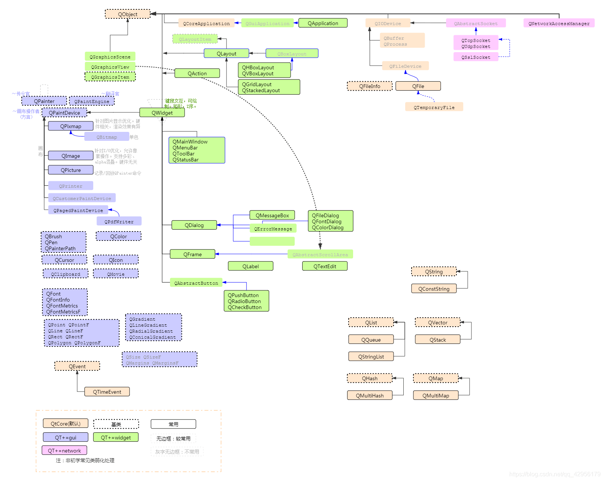

[TOC]

# Qt
Qt是一个跨平台的C++开发库，主要用来开发图形用户界面（Graphical User Interface，GUI）程序，当然也可以开发不带界面的命令行（Command User Interface，CUI）程序。


## 下载方式

### 离线安装
如果要下载Qt 5.15及以前版本，可以去Qt官网专门的资源下载网站下载:

[Qt 5.15及以前版本在线安装器下载地址](http://download.qt.io/official_releases/online_installers/)

[所有Qt版本下载地址](http://download.qt.io/archive/qt/)

[所有Qt Creator下载地址](http://download.qt.io/archive/qtcreator/)

[所有Qt VS开发插件下载地址](http://download.qt.io/archive/vsaddin/)

[Qt相关下载大全](http://download.qt.io/)


目录结构说明：

|目录 |	说明|
| :---: | :---: |
|archive |	各种 Qt 开发工具安装包，新旧都有（可以下载 Qt 开发环境和源代码）。|
|community_releases	| 社区定制的 Qt 库，Tizen 版 Qt 以及 Qt 附加源码包。|
|development_releases  |	开发版，有新的和旧的不稳定版本，在 Qt 开发过程中的非正式版本。|
|learning |	有学习 Qt 的文档教程和示范视频。
|ministro |	迷你版，目前是针对 Android 的版本。
|official_releases |	正式发布版，是与开发版相对的稳定版 Qt 库和开发工具（可以下载Qt开发环境和源代码）。|
|online | Qt 在线安装源。|
|snapshots | 预览版，最新的开发测试中的 Qt 库和开发工具。|
|new_archive | 包含了Qt开发工具安装包。|
|linguist_releases | 界面翻译工具，主要是为了实现多语言功能。|


archive 和 official_releases 两个目录都有最新的 Qt 开发环境安装包，我们以 archive 目录里的内容为例来说明。点击进入 archive 目录，会看到四个子目录：

对子目录的说明:

|目录 |	说明|
| :---: | :---: |
|vsaddin	| 这是 Qt 针对 Visual Studio 集成的插件。建议在Qt中做界面开发，调试放到在Visual Studio中。因为Visual Studio断点、监视等调试功能较为方便。|
|qtcreator	| 这是 Qt 官方的集成开发工具，但是 qtcreator 本身是个空壳，它没有编译套件和 Qt 开发库。除了老版本的 Qt 4 需要手动下载 qtcreator、编译套件、Qt 开发库进行搭配之外，一般用不到。现在不需要下载它，因为 Qt 5 有专门的大安装包，里面包含开发需要的东西，并且能自动配置好。|
|qt	| 这是 Qt 开发环境的下载目录，我们刚说的 Qt 5 的大安装包就在这里面。|
|online_installers | 在线安装器，国内用户不建议使用，在线安装是龟速，还经常断线。我们教程采用的全部是离线的大安装包。|


LTS, 一个长期技术支持版本（Long Term Support），在未来几年里都将有更新支持


#### 国内镜像网站
这里给大家推荐几个国内著名的 Qt 镜像网站，主要是各个高校的：
[中国科学技术大学](http://mirrors.ustc.edu.cn/qtproject/)
[清华大学](https://mirrors.tuna.tsinghua.edu.cn/qt/)
[北京理工大学](http://mirror.bit.edu.cn/qtproject/)
[中国互联网络信息中心](https://mirrors.cnnic.cn/qt/)


### 在线安装
Qt5.15开始，无论是开源版还是商业版都不再提供离线安装包，采用了在线安装的方式。

1. [官网Qt模块和工具](https://www.qt.io/zh-cn/product/features)
2. 最新版Qt 6.3已正式发布。 `了解更多。`
3. `立即下载`
4. `选择开源版`
5. `Download the Qt Online Installer`
6. `Download`
7. `here`
8. 邮箱注册
9. `Custom installation`
9. 勾选要安装的Qt版本
建议选择低版本5.15.2，更好的兼容性且不收费
`MSVC 2015 64-bit`  Visual Studio 2015编译器组件(电脑需要安装对应版本的VS)
`MinGW 11.2.0 64-bit` GNU编译器组件
编译器组件二者选一
10. 同意最后一个LGPL协议

Qt Design Studio，它其实就是qt5时代的Qt Quick designer，qml风格的设计器，自qt6开始，qt决定分离它，目标是设计ui的人只需要安装Qt Design Studio，而不需要安装qt creator。
QT quick designer从新版本qt6开始该功能默认被禁用，现在打开是灰色的！可以打开`帮助`->`关于插件`->`QMLDesigner启用`。最终该功能会被下线，由Qt Design Studio承担此重任。


## VS安装Qt插件

### 在vs的扩展和更新模块中安装

`工具`->`扩展和更新`->`联机`->Qt Visual Studio Tools

### 下载插件后自己安装
1. 下载地址在前面介绍的archive/vsaddin目录

2. 选择哪个版本需要根据你的vs版来确定。比如vsaddin2.5.1中的插件可支持vs2015、vs2017、vs2019三个版本安装。 

3. 下载完成后点击安装，记得把vs退出来安装。安装完成后重新打开vs可以看到Qt VS Tools菜单，那就证明成功了。


## QT和KDE

Kool Desktop Environment (KDE)，KDE社区是世界上最大、最具影响力的自由软件社区之一，拥有众多的贡献者和用户。
之前提到 Qt 原本是商业授权软件，是怎么开源的呢？这就涉及 Qt 和 KDE 的纠葛了。 KDE 是 Linux 操作系统的桌面环境，与 GNOME 桌面是类似的，作为开源桌面它们竞争的情况更为多见。
KDE 是采用 GPL 许可证发布的开源软件，而最初 Qt 是商业授权的，存在商业侵权风险， GNOME 则是基于开源 GTK 库的，没有什么商业风险，这一度是 GNOME 优越于 KDE 的特性。
由于 Qt 的商业授权，KDE 社区一度混乱纠结，与此同时 GNOME 则如火如荼发展起来了。 KDE 毕竟算是亲儿子，被另一波人欺负，奇趣科技公司当然看不下去了， 最后是奇趣科技公司为了赢得开发者的支持，为 Qt 增加了 GPL 的开源授权， 对于开源社区而言，遵循 GPL 使用 Qt 就不需要付费，这为 KDE 解决了燃眉之急。
之后 KDE 桌面和 GNOME 都发展壮大起来，都做得越来越好了。 


公司用Qt开发闭源商业桌面软件，在windows/mac/linux上，可以使用动态库链接方式，遵循LGPL协议，是不用付费的，也不用开源你的代码。

只需在你的商业软件的about什么小角落，说明你使用了Qt，遵循LGPLV3协议即可.你公司就可以开发闭源的商业软件。


那商业付费什么意思呢？ 就是指的你使用静态库链接的方式，是要付费的。

首先，嵌入式linux开发，如果你自己手动编译Qt 动态库，链接动态库。并说明你遵循LGPL, 也是可以开发闭源商业软件的。

移动端，iOS/Android开发。虽然iOS/Android。目前都支持动态链接方式。 但很明显，Qt公司就是想让你付费。

最明显的就是iOS的库，Qt公司只提供了静态链接方式。如果你要开发iOS，你得自己去编译动态链接库，Qt公司也没告诉你如何编译动态库.


Qt 的特点：

优势 :

Qt5 深度结合OpenGL/ES ，非常适合做数字图像处理，生产力软件，设计软件,工具软件。跨平台图像处理能力非常强悍。

Qt6 提供跨平台的(Metal/Vulkan/D3D11)抽象层 QRhi, 对下一个10年从事音视频，数字图像处理的软件，非常大的利好。

QML提供更简单的基于3D渲染引擎高效的写跨平台GUI的方式。但使用QML，不建议使用JS。

(对于从事音视频，数字图像处理开发的程序员欢迎关注，后面我们会花大量的时间来深度研究QRhi的实现, 写一个专栏。Qt的核心渲染层QRhi是他们从头写的，不是基于MoltenVK).

劣势：

跨平台不是特别完善，有时候还需要结合native开发，比如手机端。


补充，我们这一代程序员，对GPL/LGPL理解过太历史，简单粗暴理解为动态库可以商用，静态库不允许。但最新的LGPLV3， 意思是嵌入式设备，包括手机开发，使用LGPLV3 Qt5.4以后的版本，

无论动态库，静态库都是不允许的。如何允许你使用呢？ 掏钱。Qt最新整了个中小企业计划，一年499刀左右。


## Qt常用类




## 信号和槽

### 定义
在 Qt 中，用户和控件的每次交互过程称为一个事件，每个事件都会发出一个信号。
Qt 中的所有控件都具有接收信号的能力，一个控件还可以接收多个不同的信号。
对于接收到的每个信号，控件都会做出相应的响应动作。
在 Qt 中，对信号做出的响应动作就称为槽。

信号和槽机制底层是通过函数间的相互调用实现的。
每个信号都可以用函数来表示，称为信号函数；每个槽也可以用函数表示，称为槽函数。

信号函数和槽函数通常位于某个类中，和普通的成员函数相比，
它们的特别之处在于：
- 信号函数用  `signals` 关键字修饰，
- 槽函数用 `public slots`、`protected slots` 或者 `private slots` 修饰。

`signals` 和 `slots` 是 Qt 在 C++ 的基础上扩展的关键字，专门用来指明信号函数和槽函数；
信号函数只需要声明，不需要定义（实现），而槽函数需要定义（实现）。

Qt Creator 提供了很强大的 Qt GUI 开发手册，很容易就能查到某个控件类中包含哪些信号函数和槽函数。举个例子，查看 `QPushButton` 类中信号函数和槽函数的过程是：
1. 在程序中引入` <QPushButton>` 头文件，双击选中 `QPushButton` 并按 `Fn+F1` 快捷键，就会弹出 `QPushButton` 类的使用手册，
2. 对于 `QPushButton` 类按钮，除了可以使用自己类提供的槽函数，还可以使用从父类  `QAbstractButton` 继承过来的信号函数和槽函数。


注意，并非所有的控件之间都能通过信号和槽关联起来，信号和槽机制只适用于满足以下条件的控件：
1. 控件类必须直接或者间接继承自 `QObject` 类。Qt 提供的控件类都满足这一条件。
2. 控件类中必须包含 `private` 属性的 `Q_OBJECT` 宏。


将某个信号函数和某个槽函数关联起来，需要借助 `QObject` 类提供的 `connect()` 静态成员函数。

### connect()函数实现信号和槽
connect() 是 QObject 类中的一个静态成员函数，专门用来关联指定的信号函数和槽函数。

一个 connect() 函数只能关联一个信号函数和一个槽函数，程序中可以包含多个 connect() 函数，能实现以下几种效果：
+ 关联多个信号函数和多个槽函数；
+ 一个信号函数可以关联多个槽函数，当信号发出时，与之关联的槽函数会一个接一个地执行，但它们执行的顺序是随机的，无法人为指定哪个先执行、哪个后执行；
+ 多个信号函数可以关联同一个槽函数，无论哪个信号发出，槽函数都会执行。

此外，connect() 函数的 method 参数还可以指定一个信号函数，也就是说，信号之间也可以相互关联，这样当信号发出时，会随之发出另一个信号。


## Qt程序打包

### windeployqt
windeployqt 是 Qt 提供的 Windows 平台打包工具，它能找到可执行文件需要的所有动态链接库，并将它们拷贝到当前文件夹中。

1. 打包 Qt 程序，通常选用以 release 模式生成的可执行文件。和 debug 模式相比，release 模式生成的可执行文件体积更小，运行效率更快。
2. 在`开始`菜单中找到 Qt 命令行程序并打开
3. 先执行`cd D:\StuInfoSys\release`进入可执行文件所在目录下，然后再执行 `windeployqt StuInfoSys.exe`


## build error

-----------------------------------------------------------------------
在使用QT编写串口软件时，会用到serialport模块:
QT += serialport

>QT Unknown module(s) in QT: serialport

- Windows

利用在线安装时使用的工具:
1. 打开Qt安装目录下`MaintenanceTool.exe`工具
2. 选择`添加或移除组件`
3. `Qt 6.4.0` -> `Additional Libraries` -> `Qt Serial Port`

- Linux

安装QT是这样安装的:
>sudo apt-get install build-essential
sudo apt-get install cmake qt5-default qtcreator

解决方法:
>sudo apt-get install libqt5serialport5
sudo apt-get install libqt5serialport5-dev

其他模块例如serialbus和Charts等同理
`Qt 5.15.2` -> `Qt Charts`

-----------------------------------------------------------------------
>qobjectdefs.h(586):error C2134:"QMetaObject::SuperData::operator const QMetaObject *" : 调用不会生成常数表达式

可能原因:Qt 5.15.2 和 VS2015 兼容性问题，下载VS2022解决。

-----------------------------------------------------------------------

>fatal error C1083: 无法打开包括文件:"opencv2/opencv.hpp"

可能原因:路径没有配置正确，QtCreator的要求较高，不仅要求路径中没有中文，同时还要求路径中不能有空格

链接外部库方法：
1. 打开.pro文件，右键选择`添加库...`
2. 选择`外部库`
3. 设置`库文件`和`包含路径`

>由于找不到opencv_world3416.dll，无法继续执行代码。重新安装程序可能会解决此问题。

可能原因:没有将opencv的.dll文件目录添加环境变量，导致QtCreator找不到.dll文件。

-----------------------------------------------------------------------
>warning: C4819: 该文件包含不能在当前代码页(936)中表示的字符。请将该文件保存为 Unicode 格式以防止数据丢失
error: C2001: 常量中有换行符
error: C2146: 语法错误: 缺少“)”(在标识符“label”的前面)
error: C2146: 语法错误: 缺少“;”(在标识符“label”的前面)

QT上用MSVC去编译部分含有中文的字符串时会出现编译错误error: C2001: 常量中有换行符，但用MinGW就不会。

方法1:
pro文件加入编译选项：
>QMAKE_CXXFLAGS += /source-charset:utf-8
QMAKE_CXXFLAGS += /execution-charset:utf-8

方法2:
中文后加个空格或者其他符号

方法3:
1. `编辑`->`选项`->`文本编辑器`->`行为`->`UTF-8 BOM`设置成`如果编码是UTF-8则添加`
2. 在.cpp文件或对应的头文件(或在`Qt/5.15.2/msvc2015_64/include/QtCore/qglobal.h`)加上

```
#if _MSC_VER >= 1600
#pragma execution_character_set("utf-8")
#endif
```


编译报错解决，运行还是显示乱码
在使用中文的.cpp文件右键选择最下面的`Add UTF-8 BOM on Save`

-----------------------------------------------------------------------

-----------------------------------------------------------------------
调用ioctl()，驱动没有解析到_IOWR

数据结构size问题，Qt默认编译32位，需改为64位，因为驱动程序是按64位编写。

-----------------------------------------------------------------------


## QMake转CMake

https://blog.csdn.net/nchu_zhangyiqing/article/details/122078675

http://events.jianshu.io/p/48ebbe6f0eca

https://www.zhangshilong.cn/work/18473.html


