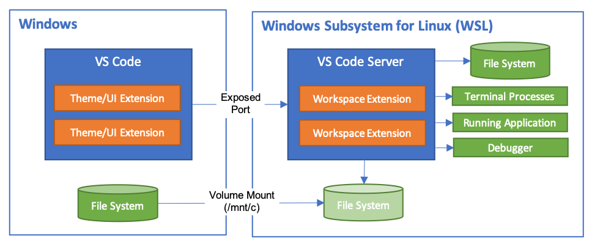

[TOC]

# VSCode

[VSCode官网](https://code.visualstudio.com/)


## 快捷键
文件-首选项-键盘快捷方式
例如：
                                                Ctrl+P                  按文件名搜索
Add Selection To Next Find Match                Ctrl+D                  选中
Cut                                             Ctrl+X                  剪切
Find                                            Ctrl+F                  查找
Replace                                         Ctrl+H                  替换
Go Back                                         Alt+LeftArrow           返回
Go Forward                                      Alt+RightArrow          前进
Move Line Down                                  Alt+DownArrow           下移本行
Move Line Up                                    Alt+UpArrow             上移本行
Notebook:Copy Cell Down                         Shift+Alt+DownArrow     复制本行到上一行
Notebook:Copy Cell Up                           Shift+Alt+UpArrow       复制本行到下一行
Transform to Uppercase                          Shift+Alt+U             大写
Transform to Lowercase                          Shift+Alt+L             小写

https://zhuanlan.zhihu.com/p/369369584

https://www.cnblogs.com/ljhdo/p/13373208.html


## 项目配置文件
项目配置文件位于.vscode文件夹下：
tasks.json (compiler build settings) ，负责编译
launch.json (debugger settings)，负责调试
c_cpp_properties.json (compiler path and IntelliSense settings)，负责更改路径等设置


## 编译
安装扩展:
C/C++
C/C++ Extension Pack
CMake
CMake Tools

在.vscode下创建tasks.json文件，它的作用是告诉 VS Code 如何构建（编译）程序，将调用 g++编译器从源代码创建一个可执行文件。 
在上方的主菜单中，选择 Terminal>Configure Default Build Task ，将出现一个下拉菜单，显示 C++ 编译器的各种预定义编译任务。
选择 C/C++: g++ build active file。
当然也可以手动创建。

执行tasks.json中定义的编译任务。快捷键ctrl+shift+B或者从菜单中选择运行：Terminal>Run Build Task。

## 调试

从主菜单中，选择 Run > Add Configuration...，选择C++ (GDB/LLDB)。 之后将看到展示各种预定义调试配置的下拉列表,选择 g++ build and debug active file。将自动生成launch.json文件。

开始一个调试回话。按 F5 或从主菜单中选择 Run > Start Debugging。

gdb工具栏从左到右依次代表：
继续 / 暂停 F5
跳过 F10
跳入 F11
跳出 Shift+F11
重启 Ctrl+Shift+F5
停止 Shift+F5

F9 设置或取消断点
要在程序执行时跟踪变量的值，可以对变量设置监视（watch）。在 Watch 窗口中，单击加号，然后在文本框中键入循环变量的名称 word。
断点处暂停执行时，将鼠标指针悬停在变量上可快速查看该变量的值。


### WSL + VSCode 调试
安装扩展:
WSL
Remote Development
Remote SSH

在WSL 2启动VScode
通过Powershell登录WSL 2的Ubuntu环境，cd到你的目标程序目录，输入code .，就可以直接启动VScode，打开的目录也是目标程序所在目录
第一次启动时，会在WSL环境上安装VScode Server服务




断点不起作用需要
`set(CMAKE_BUILD_TYPE debug)`


## C/C++配置
如果你想更多地控制 C/C++ 扩展，你可以创建一个 c_cpp_properties.json 文件，它允许你更改设置，例如编译器的路径、包含路径、C++ 标准（默认为 C++17），等等。 
您可以通过从命令面板 (Ctrl+Shift+P) 运行命令 C/C++: Edit Configurations (UI) 来查看 C/C++ 配置 UI。（这时.vscode下会自动生成c_cpp_properties.json 文件）


## 远程服务器
利用VScode连接远程服务器进行代码调试及可视化界面
https://blog.csdn.net/qq_31347869/article/details/121672295

https://blog.csdn.net/EZ1333_F/article/details/125577723


## 快速生成注释说明

### snippets
缺点
不能自动生成变量名
每种语言都需要单独设置

1. 点击左下角管理图标，选择`用户代码片段`(`Configure User Snippets`)

2. 在上方选择框中输入开发语言种类，如果没有会自动在以下vscode配置目录中新增.json文件
`C:\Users\A0001499\AppData\Roaming\Code\User\snippets\c.json`
例如
`js`，选择打开`javascript.json`配置
`c`，选择打开`c.json`配置

3. 把{ }里面的代码全部注释掉，加入一下内容
```json
	"Print to copyrights": {
        "prefix": "copyrights",
        "body": [
            "/*",
			"*",
            "* @Description: $0",
            "* @Author: wangkai",
            "* @Date: $CURRENT_YEAR-$CURRENT_MONTH-$CURRENT_DATE",
            "* @LastEditTime: $CURRENT_YEAR-$CURRENT_MONTH-$CURRENT_DATE",
            "* @LastEditors: Please set LastEditors",
			"*",
			"* Copyright (c) $CURRENT_YEAR GCore, All rights reserved.",
			"*",
            "*/"
        ],
        "description": "a copyrights mode"
    },

	"Print to notes": {
        "prefix": "notes",
        "body": [
            "/**",
            " * @description: $1",
            " * @param {$2} $3 $4",
            " * @return {$5} $6",
            " */"
        ],
        "description": "a notes mode"
    }
```

4.使用方法，在需要增加注释的地方，输入`copyrights`或者`notes`，然后回车

### koroFileHeader插件
缺点
有点慢

1. 安装koroFileHeader插件

2. 图案注释
ctrl + shift + p，输入codesign，选择图案
或者ctrl + win + j

3. 文件头部注释
ctrl + win + i

4. 函数注释
ctrl + win + t

5. 插件设置
ctrl + p，输入settings.json，加入一下内容

```json
    // 头部注释
    "fileheader.customMade": {
        // 头部注释默认字段
        "Author": "WangKai",
        "Date": "Do not edit", // 设置后默认设置文件生成时间
        "LastEditors": "WangKai", // 设置后，保存文件更改默认更新最后编辑人
        "LastEditTime": "Do not edit", // 设置后，保存文件更改默认更新最后编辑时间
        "Description": "",
        "FilePath": "Do not edit", // 设置后，默认生成文件相对于项目的路径
        "custom_string_obkoro1": "Copyright (c) ${now_year} GCore, All rights reserved."
    },
    // 函数注释
    "fileheader.cursorMode": {
        // 默认字段
        "description":"",
        "param":"",
        "return":"",
        "example":""
    },
    // 插件配置项
    "fileheader.configObj": {
        "autoAdd": false, // 检测文件没有头部注释，自动添加文件头部注释
        "autoAddLine": 100, // 文件超过多少行数 不再自动添加头部注释
        "autoAlready": true, // 只添加插件支持的语言以及用户通过`language`选项自定义的注释
        "supportAutoLanguage": [], // 设置之后，在数组内的文件才支持自动添加
        // 自动添加头部注释黑名单
        "prohibitAutoAdd": [
            "json"
        ],
        "prohibitItemAutoAdd": [ "项目的全称禁止项目自动添加头部注释, 使用快捷键自行添加" ],
        "folderBlacklist": [ "node_modules" ], // 文件夹或文件名禁止自动添加头部注释
        "wideSame": false, // 头部注释等宽设置
        "wideNum": 13,  // 头部注释字段长度 默认为13
        "functionWideNum": 0, // 函数注释等宽设置 设为0 即为关闭
        // 头部注释第几行插入
        "headInsertLine": {
            "php": 2 // php文件 插入到第二行
        },
        "beforeAnnotation": {}, // 头部注释之前插入内容
        "afterAnnotation": {}, // 头部注释之后插入内容
        "specialOptions": {}, // 特殊字段自定义
        "switch": {
            "newlineAddAnnotation": true // 默认遇到换行符(\r\n \n \r)添加注释符号
        },
        "moveCursor": true, // 自动移动光标到Description所在行
        "dateFormat": "YYYY-MM-DD HH:mm:ss",
        "atSymbol": ["@", "@"], // 更改所有文件的自定义注释中的@符号
        "atSymbolObj": {}, //  更改单独语言/文件的@
        "colon": [": ", ": "], // 更改所有文件的注释冒号
        "colonObj": {}, //  更改单独语言/文件的冒号
        "filePathColon": "路径分隔符替换", // 默认值： mac: / window是: \
        "showErrorMessage": false, // 是否显示插件错误通知 用于debugger
        "writeLog": false, // 错误日志生成
        "CheckFileChange": false, // 单个文件保存时进行diff检查
        "createHeader": true, // 新建文件自动添加头部注释
        "useWorker": false, // 是否使用工作区设置
        "designAddHead": true, // 添加注释图案时添加头部注释
        "headDesignName": "grassHorse", // 图案注释使用哪个图案 
        "headDesign": false, // 是否使用图案注释替换头部注释
        // 自定义配置是否在函数内生成注释 不同文件类型和语言类型
        "cursorModeInternalAll": {}, // 默认为false 在函数外生成函数注释
        "openFunctionParamsCheck": true, // 开启关闭自动提取添加函数参数
        "functionParamsShape": ["{", "}"], // 函数参数外形自定义
        "functionBlankSpaceAll": {}, // 函数注释空格缩进 默认为空对象 默认值为0 不缩进
        "functionTypeSymbol": "*", // 参数没有类型时的默认值
        "typeParamOrder": "type param", // 参数类型 和 参数的位置自定义
        // 自定义语言注释，自定义取消 head、end 部分
        // 不设置自定义配置language无效 默认都有head、end
        "customHasHeadEnd": {}, // "cancel head and function" | "cancel head" | "cancel function" 
        "throttleTime": 60000, // 对同一个文件 需要过1分钟再次修改文件并保存才会更新注释
            // 自定义语言注释符号，覆盖插件的注释格式
        "language": {
            // js后缀文件
            "js": {
                "head": "/$$",
                "middle": " $ @",
                "end": " $/",
                // 函数自定义注释符号：如果有此配置 会默认使用
                "functionSymbol": {
                    "head": "/******* ", // 统一增加几个*号
                    "middle": " * @",
                    "end": " */"
                }
            },
            // 一次匹配多种文件后缀文件 不用重复设置
            "h/hpp/cpp": {
                "head": "/*** ", // 统一增加几个*号
                "middle": " * @",
                "end": " */"
            },
            // 针对有特殊要求的文件如：test.blade.php
            "blade.php":{
                "head": "<!--",
                "middle": " * @",
                "end": "-->",
            }
        },
      // 默认注释  没有匹配到注释符号的时候使用。
      "annotationStr": { 
          "head": "/*",
          "middle": " * @",
          "end": " */",
          "use": false
        },
    }
```


