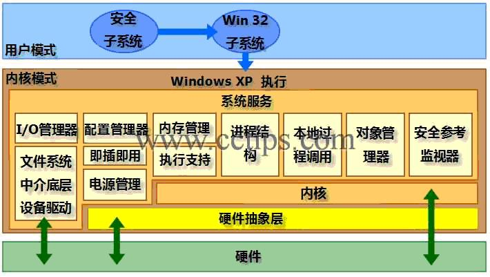

[TOC]

# Windows启动过程

随着技术的发展，我们能够见到的计算机硬件种类越来越多。以计算机上最重要的组件CPU来说，目前就有很多选择。当然，这里的选择并不是说AMD或者Intel这种产品品牌，而是指其内部的体系结构。目前常见的CPU体系结构主要基于复杂指令集（Complex Instruction Set Computing，CISC）或者精简指令集（Reduced Instruction Set Computing，RISC），我们常用的Intel的Pentium、Celeron系列以及AMD的Athlon、Sempron系列都是基于复杂指令集的，而这些基于复杂指令集的CPU还有32位和64位的寄存器数据带宽区别。关于这些指令集以及寄存器数据带宽之间的区别等内容比较繁杂，而且不是本文的重点，感兴趣的朋友可以自己在网上搜索相关内容。因为CPU种类的不同，在不同CPU的系统中运行的Windows的启动过程也有一些小的不同。本文将会以目前来说最普遍的，在x86架构的系统上安装的32位Windows XP Professional为例向您介绍。
 
基本上，操作系统的引导过程是从计算机通电自检完成之后开始进行的，而这一过程又可以细分为预引导、引导、载入内核、初始化内核，以及登录这五个阶段。
 
在继续阅读之前，首先请注意图1，这是Windows XP的操作系统结构，其中包括了一些在后台工作的组件以及经常和我们打交道的程序。在了解Windows XP的启动过程之前，对系统结构有一个初步概念是很重要的。
 
 

## 预引导阶段
当我们打开计算机电源后，预引导过程就开始运行了。在这个过程中，计算机硬件首先要完成通电自检（Power-On Self Test，POST），这一步主要会对计算机中安装的处理器、内存等硬件进行检测，如果一切正常，则会继续下面的过程。
 
如果您的计算机BIOS（固化在计算机主板上芯片中的一些程序）是支持即插即用的（基本上，现阶段能够买到的计算机和硬件都是支持这一标准的），而且所有硬件设备都已经被自动识别和配置，接下来计算机将会定位引导设备（例如第一块硬盘，设备的引导顺序可以在计算机的BIOS设置中修改），然后从引导设备中读取并运行主引导记录（Master Boot Record，MBR）。至此，预引导阶段成功完成。

## 引导阶段
引导阶段又可以分为：初始化引导载入程序、操作系统选择、硬件检测、硬件配置文件选择这四个步骤。在这一过程中需要使用的文件包括：Ntldr、Boot.ini、Ntdetect.com、Ntoskrnl.exe、Ntbootdd.sys、Bootsect.dos（非必须）。
初始化引导载入程序
在这一阶段，首先出场的是ntldr，该程序会将处理器由实模式（Real Mode）切换为32位平坦内存模式（32-bit Flat Memory Mode）。不使用实模式的主要原因是，在实模式下，内存中的前640 KB是为MS-DOS保留的，而剩余内存则会被当作扩展内存使用，这样Windows XP将无法使用全部的物理内存。而32位平坦内存模式下就好多了，Windows XP自身将能使用计算机上安装的所有内存（其实最多也只能用2 GB，这是32位操作系统的设计缺陷。关于大内存的问题因为和本文的内容关系不大，因此这里不表，日后有机会再单独撰文介绍）。
 
接下来ntldr会寻找系统自带的一个微型的文件系统驱动。大家都知道，DOS和Windows 9x操作系统是无法读写NTFS文件系统的分区的，那么Windows XP的安装程序为什么可以读写NTFS分区？其实这就是微型文件系统驱动的功劳了。只有在载入了这个驱动之后，ntldr才能找到您硬盘上被格式化为NTFS或者FAT/FAT32文件系统的分区。如果这个驱动损坏了，就算您的硬盘上已经有分区，ntldr也认不出来的。
 
读取了文件系统驱动，并成功找到硬盘上的分区后，引导载入程序的初始化过程就已经完成了，随后我们将会进行到下一步。

### 操作系统选择
这一步并非必须的，只有在您计算机中安装了多个Windows操作系统的时候才会出现。不过无论您的计算机中安装了几个Windows，计算机启动的过程中，这一步都会按照设计运行一遍，只有在确实安装了多个系统的时候，系统才会显示一个列表，让您选择想要引导的系统。但如果您只有一个系统，那么引导程序在判断完之后会直接进入到下一阶段。
 
如果您已经安装了多个Windows操作系统（泛指Windows 2000/XP/2003这类较新的系统，不包括Windows 9x系统），那么所有的记录都会被保存在系统盘根目录下一个名为boot.ini的文件中。ntldr程序在完成了初始化工作之后就会从硬盘上读取boot.ini文件，并根据其中的内容判断计算机上安装了几个Windows，它们分别安装在第几块硬盘的第几个分区上。如果只安装了一个，那么就直接跳过这一步。但如果安装了多个，那么ntldr就会根据文件中的记录显示一个操作系统选择列表，并默认持续30秒。只要您做出选择，ntldr就会自动开始装载被选择的系统。如果您没有选择，那么30秒后，ntldr会开始载入默认的操作系统。至此操作系统选择这一步已经成功完成。
 
小知识：系统盘（System Volume）和引导盘（Boot Volume）有什么区别？
这是两个很容易被人搞混的概念，因为根据微软对这两个名词的定义，很容易令人产生误解。根据微软的定义，系统盘是指保存了用于引导Windows的文件（根据前面的介绍，我们已经清楚，这些文件是指ntldr、boot.ini等）的硬盘分区/卷；而引导盘是指保存了Windows系统文件的硬盘分区/卷。如果只有一个操作系统的话，我们通常会将其安装在第一个物理硬盘的第一个主分区（通常被识别为C盘）上，那么系统盘和引导盘属于同一个分区。但是，如果您将您的Windows安装到了其他分区中，例如D盘中，那么系统盘仍然是您的C盘（因为尽管Windows被安装到了其他盘，但是引导系统所用的文件还是会保存在C盘的根目录下），但您的引导盘将会变成是D盘。很奇怪的规定，保存了引导系统所需文件的分区被叫做“系统盘”，反而保存了操作系统文件的分区被叫做“引导盘”，正好颠倒了。不过微软就是这样规定的。

### 硬件检测
这一过程中主要需要用到Ntdetect.com和Ntldr。当我们在前面的操作系统选择阶段选择了想要载入的Windows系统之后，Ntdetect.com首先要将当前计算机中安装的所有硬件信息收集起来，并列成一个表，接着将该表交给Ntldr（这个表的信息稍后会被用来创建注册表中有关硬件的键）。这里需要被收集信息的硬件类型包括：总线/适配器类型、显卡、通讯端口、串口、浮点运算器（CPU）、可移动存储器、键盘、指示装置（鼠标）。至此，硬件检测操作已经成功完成。

### 配置文件选择
这一步也不是必须的。只有在计算机（常用于笔记本电脑）中创建了多个硬件配置文件的时候才需要处理这一步。
 
小知识：什么是硬件配置文件？为什么要用它？
这个功能比较适合笔记本电脑用户。如果您有一台笔记本电脑，主要在办公室和家里使用，在办公室的时候您可能会使用网卡将其接入公司的局域网，公司使用了DHCP服务器为客户端指派IP地址；但是回到家之后，没有了DHCP服务器，启动系统的时候系统将会用很长时间寻找那个不存在的DHCP服务器，这将延长系统的启动时间。在这种情况下就可以分别在办公室和家里使用不同的硬件配置文件了，我们可以通过硬件配置文件决定在某个配置文件中使用哪些硬件，不使用哪些硬件。例如前面列举的例子，我们可以为笔记本电脑在家里和办公室分别创建独立的配置文件，而家庭用的配置文件中会将网卡禁用。这样，回家后使用家用的配置文件，系统启动的时候会直接禁用网卡，也就避免了寻找不存在的DHCP服务器延长系统启动时间。
 
如果Ntldr检测到系统中创建了多个硬件配置文件，那么它就会在这时候将所有可用的配置文件列表显示出来，供用户选择。这里其实和操作系统的选择类似，不管系统中有没有创建多个配置文件，Ntldr都会进行这一步操作，不过只有在确实检测到多个硬件配置文件的时候才会显示文件列表。

## 载入内核阶段
在这一阶段，Ntldr会载入Windows XP的内核文件：Ntoskrnl.exe，但这里仅仅是载入，内核此时还不会被初始化。随后被载入的是硬件抽象层（hal.dll）。
 
硬件抽象层其实是内存中运行的一个程序，这个程序在Windows XP内核和物理硬件之间起到了桥梁的作用。正常情况下，操作系统和应用程序无法直接与物理硬件打交道，只有Windows内核和少量内核模式的系统服务可以直接与硬件交互。而其他大部分系统服务以及应用程序，如果想要和硬件交互，就必须透过硬件抽象层进行。
 
小知识：为什么要使用硬件抽象层
硬件抽象层的使用主要有两个原因：1，忽略无效甚至错误的硬件调用。如果没有硬件抽象层，那么硬件上发生的所有调用甚至错误都将会反馈给操作系统，这可能会导致系统不稳定。而硬件抽象层就像工作在物理硬件和操作系统内核之间的一个过滤器，可以将认为会对操作系统产生危害的调用和错误全部过滤掉，这样直接提高了系统的稳定性；2，多平台之间的转换翻译。这个原因可以列举一个形象的例子，假设每个物理硬件都使用不同的语言，而每个操作系统组件或者应用程序则使用了同样的语言，那么不同物理硬件和系统之间的交流将会是混乱而且很没有效率的。如果有了硬件抽象层，等于给软硬件之间安排了一位翻译，这位翻译懂所有硬件的语言，并会将硬件说的话用系统或者软件能够理解的语言原意转达给操作系统和软件。通过这个机制，操作系统对硬件的支持可以得到极大的提高。
 
硬件抽象层被载入后，接下来要被内核载入的是HKEY_LOCAL_MACHINE/System注册表键。Ntldr会根据载入的Select键的内容判断接下来需要载入哪个Control Set注册表键，而这些键会决定随后系统将载入哪些设备驱动或者启动哪些服务。这些注册表键的内容被载入后，系统将进入初始化内核阶段，这时候ntldr会将系统的控制权交给操作系统内核。
 

## 初始化内核阶段
当进入到这一阶段的时候，计算机屏幕上就会显示Windows XP的标志了，同时还会显示一条滚动的进度条，这个进度条可能会滚动若干圈。从这一步开始我们才能从屏幕上队系统的启动有一个直观的印象。在这一阶段中主要会完成这四项任务：创建Hardware注册表键、对Control Set注册表键进行复制、载入和初始化设备驱动，以及启动服务。

### 创建Hardware注册表键
首先要在注册表中创建Hardware键，Windows内核会使用在前面的硬件检测阶段收集到的硬件信息来创建HKEY_LOCAL_MACHINE/Hardware键，也就是说，注册表中该键的内容并不是固定的，而是会根据当前系统中的硬件配置情况动态更新。

### 对Control Set注册表键进行复制
如果Hardware注册表键创建成功，那么系统内核将会对Control Set键的内容创建一个备份。这个备份将会被用在系统的高级启动菜单中的“最后一次正确配置”选项。例如，如果我们安装了一个新的显卡驱动，重启动系统之后Hardware注册表键还没有创建成功系统就已经崩溃了，这时候如果选择“最后一次正确配置”选项，系统将会自动使用上一次的Control Set注册表键的备份内容重新生成Hardware键，这样就可以撤销掉之前因为安装了新的显卡驱动对系统设置的更改。

### 载入和初始化设备驱动
在这一阶段里，操作系统内核首先会初始化之前在载入内核阶段载入的底层设备驱动，然后内核会在注册表的HKEY_LOCAL_MACHINE/System/CurrentControlSet/Services键下查找所有Start键值为“1”的设备驱动。这些设备驱动将会在载入之后立刻进行初始化，如果在这一过程中发生了任何错误，系统内核将会自动根据设备驱动的“ErrorControl”键的数值进行处理。“ErrorControl”键的键值共有四种，分别具有如下含义：
 
0，忽略，继续引导，不显示错误信息。
1，正常，继续引导，显示错误信息。
2，恢复，停止引导，使用“最后一次正确配置”选项重启动系统。如果依然出错则会忽略该错误。
3，严重，停止引导，使用“最后一次正确配置”选项重启动系统。如果依然出错则会停止引导，并显示一条错误信息。

### 启动服务
系统内核成功载入，并且成功初始化所有底层设备驱动后，会话管理器会开始启动高层子系统和服务，然后启动Win32子系统。Win32子系统的作用是控制所有输入/输出设备以及访问显示设备。当所有这些操作都完成后，Windows的图形界面就可以显示出来了，同时我们也将可以使用键盘以及其他I/O设备。
 
接下来会话管理器会启动Winlogon进程，至此，初始化内核阶段已经成功完成，这时候用户就可以开始登录了。

## 登录阶段
在这一阶段，由会话管理器启动的winlogon.exe进程将会启动本地安全性授权（Local Security Authority，lsass.exe）子系统。到这一步之后，屏幕上将会显示Windows XP的欢迎界面或者登录界面，这时候您已经可以顺利进行登录了。不过与此同时，系统的启动还没有彻底完成，后台可能仍然在加载一些非关键的设备驱动。

随后系统会再次扫描HKEY_LOCAL_MACHINE/System/CurrentControlSet/Services注册表键（还记得第一次扫描这里是在启动进行到那一步的时候吗？），并寻找所有Start键的数值是“2”或者更大数字的服务。这些服务就是非关键服务，系统直到用户成功登录之后才开始加载这些服务。
 
小知识：为什么Windows XP的启动速度要比Windows 2000快
目前所有Windows操作系统中，可能Windows 2000的启动速度是最慢的，这并不是因为计算机硬件的性能不够，而是因为Windows 2000的设计“先天不足”。为了弥补这一不足，微软在开发Windows XP的时候想出了一个新方法，那就是，所有不重要的设备驱动和服务都将在用户登录系统之后才加载和运行。也就是说，在系统启动过程中，加载和运行的程序全部都是运行系统所必需的，这样才能用最短的时间显示出登录界面，供用户登录。而用户登录后系同才开始加载非关键组件。可以说，Windows XP启动速度的加快实际上是一种“投机取巧”的作法，不过这种作法确实相当有效。然而这种设计也带来了一些问题，例如有些朋友反映，为什么自己的系统已经成功登录了，可是非要过好几分钟之后桌面上才会显示出任务栏以及桌面图标等内容。其实这就是因为在等待的这几分钟里，系统正在忙于处理那些不重要的服务和组件。如果需要处理的内容太多，或者计算机的硬件配置不够强大，就有可能产生这种现象。
 
小知识：如何控制非关键服务的启动顺序
您已经知道了，非关键服务是在用户成功登录之后才加载的，那么我们能否人为控制这些服务加载的顺序？这其实是很简单的。服务的启动顺序也是靠各自Start注册表键的数值以及每个服务之间的依存关系决定的，假设服务A的运行必须依靠服务B，那么在服务B正常启动之前，服务A都无法成功启动。假设服务C的Start键数值是3，而服务D的Start键数值是6，那么服务C将会优先于服务D启动（数值越小优先级越高）。
 
到这里，Windows XP的启动过程就算全部完成了

